# loop-orchestrator

Closes the development loop into automation on top of a self-hosted sandbox platform.

You label a pull request `loop:run` — or file a GitHub issue and label it `loop:ready` — and the
service takes it from there: it plans the work, runs Claude Code in a fresh disposable sandbox,
reviews the diff, writes and runs Playwright end-to-end tests, pauses for your approval with a live
preview link, publishes the code back to the pull-request branch, and merges it. Everything is
reported into a Telegram thread you can drive with buttons.

The human keeps the two ends of the loop: **the intent** (an issue) and **the acceptance** (a
button). Nothing in between requires a keyboard.

```mermaid
flowchart LR
    I["issue<br/>loop:ready"] --> P["planning run<br/>planner ⇄ advisor"]
    P --> PR["PR with spec + plan<br/>loop:run"]
    PR --> E["execute<br/>Claude Code in a sandbox"]
    E --> R["review<br/>separate model, fix loop"]
    R --> T["e2e<br/>Playwright + video"]
    T --> S["publish to a temp branch"]
    S --> A["pause: preview link<br/>+ Telegram buttons"]
    A --> M["fast-forward the PR branch<br/>→ merge"]
```



## Why it exists

Coding agents are good at doing the work and bad at the loop around it: someone still has to prepare
the task, give the agent a machine, check what came out, run it, and land it. This service is that
someone. It is deliberately small — one FastAPI process, SQLite, an in-process asyncio worker, no
Celery, no Redis — because the interesting part is not the infrastructure but the set of constraints
it is built around.

Those constraints are documented rather than hidden. A sandbox cannot push to git, so publication is
two-phase. An app's branch cannot be changed after creation, so every run gets a fresh sandbox. The
platform's app config never reaches the agent, so project secrets travel as a file. The idle reaper
stops a sandbox after 35 minutes of API silence, so every poll tick sends a keepalive. Each of those
cost a failed run to discover — see [`docs/wiki/concepts/sandboxd-platform.md`](docs/wiki/concepts/sandboxd-platform.md).

## Requirements

- A [sandboxd](https://github.com/tastyeffectco/sandboxd) instance (self-hosted; the sandboxes and
  this service share a host and a docker network).
- A Claude subscription connected to sandboxd over OAuth, or an API key.
- A GitHub fine-grained PAT with contents/pull-requests/issues/webhooks on the target repositories.
- A Telegram bot and a chat id for reports and control.
- A small VPS. Two cores and 8 GB run two concurrent runs — that number is empirical, see
  [`docs/wiki/ops/vps.md`](docs/wiki/ops/vps.md).

Installation, step by step: [`docs/deploy.md`](docs/deploy.md).

## Two ways in

**Pull-request driven.** A PR carries a spec and a plan; the `loop:run` label starts a run that
executes the plan.

**Backlog driven.** Issues labelled `loop:ready` are mirrored into a queue. A planning run writes the
spec and the plan itself (planner ⇄ implementation advisor), opens the PR and labels it `loop:run`,
which starts the execution run. Lanes (`loop:lane:<name>`) control what may run in parallel; native
GitHub `blocked_by` dependencies — including across repositories — control the order.

## Configuring a target repository

Drop a `.loop.yml` at the repository root:

```yaml
specs_dir: docs/specs        # where the planner writes specs and plans
base_branch: main            # optional; default = the repository's default branch
setup: uv sync --frozen      # optional; how to install dependencies
test: pytest -q              # optional; the command the agent must keep green
run: pnpm dev                # optional; how to start the app (needed for previews and e2e)
required_env: [GH_TOKEN]     # names only — values live on the orchestrator host
timeout_minutes: 180
approval: always             # always | never — pause before publishing
review:
  enabled: true
  max_fix_iterations: 2
e2e:
  enabled: true
  max_fix_iterations: 2
  env:
    PLAYWRIGHT_REUSE_SERVER: "1"
planning:
  enabled: true              # false = the loop never plans for this repo; write plans yourself
  model: claude-opus-5       # optional; default = the orchestrator's LOOP_PLANNER_MODEL
  advisor:
    enabled: true            # false = publish the first plan, with no review round
    model: claude-fable-5    # optional; default = LOOP_ADVISOR_MODEL
    max_iterations: 3        # how many times the planner may be sent back to rewrite
```

`required_env` names secrets; their values are read from a per-repository file on the orchestrator
host and delivered into the sandbox as `.loop/secrets.env`, never through the prompt.

Every section is optional and every default keeps the previous behaviour, so an existing `.loop.yml`
needs no edit. `planning.enabled` is the one switch read from the repository's **default** branch —
the decision is taken before the issue branch exists — and a missing or unparseable config leaves
planning on rather than silently stalling a backlog.

## Run states

```
queued → preparing → executing → reviewing → e2e_testing → staging
       → awaiting_approval → publishing → reporting → done | failed | cancelled
```

`reviewing` and `e2e_testing` are skipped by configuration; `awaiting_approval` is skipped with
`approval: never`. Transitions are validated and recorded, and the recording is what draws the live
progress card in Telegram. A planning run takes the shorter `preparing → planning → publishing`
route.

## Control from Telegram

Every run gets its own forum topic with a progress card that edits itself in place. At the approval
pause you get a summary, the e2e videos and a preview URL, plus buttons: **Approve**, **Discard**,
**Cancel**, **Restart**, **Merge**, **Merge & Deploy**. Replying to the approval message with text
sends the run back for a revision in the same sandbox.

Merging is gated: a red CI check refuses the merge and names the failing checks, a branch behind its
base is updated first, and a conflicting branch is resolved by a background agent in a fresh sandbox.

## Documentation

- [`docs/deploy.md`](docs/deploy.md) — installation and the first smoke test.
- [`docs/superpowers/specs/`](docs/superpowers/specs/) — the design specs, one per phase, with the
  locked decisions and the open questions of each.
- [`docs/superpowers/plans/`](docs/superpowers/plans/) — the implementation plans that were actually
  executed, task by task.
- [`docs/wiki/`](docs/wiki/) — the project's living memory: how the platform really behaves, what
  broke in production and why, the decisions taken during implementation. Start at
  [`docs/wiki/index.md`](docs/wiki/index.md).

## Development

```bash
python -m venv .venv && .venv/bin/pip install -e ".[dev]"   # Windows: .venv/Scripts/pip
python -m pytest tests -v
```

The tests are self-contained: HTTP is mocked with respx, the webhook is driven through an ASGI
transport, and no sandbox, GitHub account or Telegram bot is required.

## Contributing

Contributions are welcome — read [`CONTRIBUTING.md`](CONTRIBUTING.md) first. It covers the workflow
(a design before a diff), the rules a pull request is checked against, and the short list of things
that look wrong and are not: each one is a workaround for a verified platform constraint that has
already been re-discovered more than once.

## Status and honest limitations

The service is in daily use against real repositories, but it is built for one operator:

- **Single tenant.** One SQLite file, one Telegram chat, one admin list. There is no multi-user model.
- **`deploy.yml` is author-specific.** It ships this service to one VPS over SSH and expects
  `DEPLOY_*` secrets; without them it fails. `ci.yml` is self-contained and runs the tests.
- **The sandbox image is built by hand** on the host (~4.5 GB, shared with sandboxd); the deploy
  pipeline does not rebuild it.
- **The hooks under `.claude/hooks/` are PowerShell** — they run the wiki reminders on Windows and
  need porting elsewhere.
- **It depends on a platform that moves.** Everything asserted about sandboxd carries a date and the
  way it was verified, because several of those facts contradicted the documentation.

## License

MIT — see [LICENSE](LICENSE).
