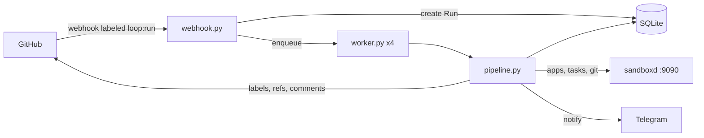

# Loop Orchestrator MVP — implementation plan

> **For agentic workers:** REQUIRED SUB-SKILL: Use superpowers:subagent-driven-development (recommended) or superpowers:executing-plans to implement this plan task-by-task. Steps use checkbox (`- [x]`) syntax for tracking.

**Goal:** The loop-orchestrator service: a GitHub webhook on the `loop:run` label → a fresh sandboxd sandbox → Claude Code executes the plan from the PR → the code is published to the PR branch → reports go to Telegram.

**Architecture:** A single Python service (FastAPI) with an in-process worker and SQLite. All heavy lifting is delegated to sandboxd over REST (`127.0.0.1:9090`): cloning the repository, running Claude Code, host-side git push. The orchestrator owns the run state machine (`queued → preparing → executing → publishing → reporting → done|failed`) and publishes code by fast-forwarding the PR branch through the GitHub API.

**Tech Stack:** Python 3.12, FastAPI, uvicorn, httpx, aiosqlite, pydantic-settings, PyYAML. Tests: pytest, pytest-asyncio, respx.

**Specification:** `docs/superpowers/specs/2026-07-31-loop-engineering-mvp-design.md` — every product decision lives there; this plan covers only "how we build it".

## Locked Decisions

- **`.loop.yml` format (schema v1)** — fields `specs_dir` (required), `setup`, `run`, `test`, `required_env`, `timeout_minutes`, `sandbox_preset`, `e2e` (ignored in the MVP, the parser does not choke on it). The config ships across repositories — do not change it.
- **Labels** — `loop:run`, `loop:running`, `loop:done`, `loop:failed`; the only webhook trigger is `pull_request.labeled` with `loop:run`.
- **Run states** — `queued|preparing|executing|publishing|reporting|done|failed`; strings in SQLite, history in `run_events`.
- **Publication** — a temporary branch `loop/run-<run_id>` via `POST /v1/apps/{id}/git/push`, then a fast-forward of the PR branch with `PATCH /repos/{repo}/git/refs/heads/<branch>` and `force: false`; the temporary branch is deleted only after a successful FF.
- **App per Run** — named `loop-<repo>-pr<N>-r<run_id>`; apps from earlier Runs of this PR are deleted on preparing, the successful Run's app after done.
- **Project secrets** — `secrets/<owner>__<repo>.env` files (0600) on the VPS; uploaded into the new app via `POST /v1/apps/{id}/config` (`sensitive: true`, `access_policy: "both"`).
- **Agent** — `"agent": "claude-code"` in sandboxd tasks; task statuses: `running|succeeded|failed|cancelled`; `agent_message` is the agent's final summary.
- **Settings env prefix** — `LOOP_` (e.g. `LOOP_GITHUB_TOKEN`); it cannot change after the first deploy.

## Global Constraints

- Python ≥ 3.12; no external brokers (Redis/Celery) — asyncio in-process only.
- Concurrent Runs: 4 (default, `LOOP_MAX_CONCURRENT_RUNS`); Run timeout: 180 minutes (default, overridable from `.loop.yml`); a sandboxd task's `timeout_s` ≤ 86400.
- Every Run outcome ends with a Telegram message; infrastructure HTTP errors are retried 3 times with exponential backoff.
- Code, comments, Telegram messages and PR comments are all English.
- Every HTTP client accepts an optional `httpx.AsyncClient` for tests (respx/ASGITransport).

## Architecture Diagram



File layout (all new — the repository holds only `docs/` so far):

```
pyproject.toml
src/loop_orchestrator/
    __init__.py
    config.py          # Settings (pydantic-settings, LOOP_ prefix)
    models.py          # Run dataclass + state constants
    db.py              # aiosqlite: runs, run_events
    state_machine.py   # TRANSITIONS + transition()
    loopconfig.py      # .loop.yml parsing + spec/plan pair lookup
    secrets.py         # per-repo env files
    webhook.py         # POST /webhooks/github (HMAC, filter, Run creation)
    pipeline.py        # prepare/execute/publish/report steps + process()
    worker.py          # queue, 4 consumers, recovery on startup
    main.py            # create_app() (factory), /healthz, lifespan
    clients/
        __init__.py
        retry.py       # with_retries()
        github.py      # GitHubClient
        sandboxd.py    # SandboxdClient
        telegram.py    # TelegramNotifier
tests/                 # mirrors the modules
scripts/connect_repo.py
Dockerfile, docker-compose.yml, .env.example
docs/deploy.md
```

---

### Task 1: Project scaffolding, Settings, /healthz

**Files:**
- Create: `pyproject.toml`
- Create: `src/loop_orchestrator/__init__.py` (empty)
- Create: `src/loop_orchestrator/config.py`
- Create: `src/loop_orchestrator/main.py`
- Create: `tests/__init__.py` (empty — makes `tests` a package so imports like `from tests.conftest import ...` work)
- Test: `tests/test_config.py`, `tests/test_healthz.py`

**Interfaces:**
- Reuses: nothing — this is the first code in the repository.
- Produces: `Settings` (all fields below), `create_app(settings: Settings | None = None) -> FastAPI`. Later tasks extend `main.py` without changing the `create_app` signature.

- [x] **Step 1: pyproject.toml**

```toml
[project]
name = "loop-orchestrator"
version = "0.1.0"
description = "Automated dev-loop orchestrator on top of sandboxd"
requires-python = ">=3.12"
dependencies = [
    "fastapi>=0.115",
    "uvicorn[standard]>=0.30",
    "httpx>=0.27",
    "aiosqlite>=0.20",
    "pydantic-settings>=2.4",
    "PyYAML>=6.0",
]

[project.optional-dependencies]
dev = ["pytest>=8", "pytest-asyncio>=0.24", "respx>=0.21"]

[build-system]
requires = ["setuptools>=68"]
build-backend = "setuptools.build_meta"

[tool.setuptools.packages.find]
where = ["src"]

[tool.pytest.ini_options]
asyncio_mode = "auto"
testpaths = ["tests"]
```

- [x] **Step 2: Set up the environment**

Run: `python -m venv .venv && .venv/Scripts/pip install -e ".[dev]"` (Linux/sandbox: `.venv/bin/pip`)
Expected: installation succeeds.

- [x] **Step 3: Write failing tests**

`tests/test_config.py`:

```python
from loop_orchestrator.config import Settings


def _settings(**overrides) -> Settings:
    base = dict(
        github_token="ghp_x",
        github_webhook_secret="whs",
        telegram_bot_token="123:abc",
        telegram_chat_id=42,
        sandboxd_api_key="sbk",
        git_credential_id="cred1",
    )
    base.update(overrides)
    return Settings(_env_file=None, **base)


def test_defaults():
    s = _settings()
    assert s.sandboxd_url == "http://127.0.0.1:9090"
    assert s.max_concurrent_runs == 4
    assert s.default_timeout_minutes == 180
    assert s.poll_interval_seconds == 20
    assert s.rate_limit_retry_minutes == 60
    assert s.db_path == "data/loop.db"
    assert s.secrets_dir == "secrets"


def test_env_prefix(monkeypatch):
    monkeypatch.setenv("LOOP_GITHUB_TOKEN", "from-env")
    for k, v in {
        "LOOP_GITHUB_WEBHOOK_SECRET": "s", "LOOP_TELEGRAM_BOT_TOKEN": "t",
        "LOOP_TELEGRAM_CHAT_ID": "1", "LOOP_SANDBOXD_API_KEY": "k",
        "LOOP_GIT_CREDENTIAL_ID": "c",
    }.items():
        monkeypatch.setenv(k, v)
    assert Settings(_env_file=None).github_token == "from-env"
```

`tests/test_healthz.py`:

```python
import httpx
from loop_orchestrator.main import create_app

from tests.test_config import _settings


async def test_healthz():
    app = create_app(_settings())
    transport = httpx.ASGITransport(app=app)
    async with httpx.AsyncClient(transport=transport, base_url="http://t") as c:
        r = await c.get("/healthz")
    assert r.status_code == 200
    assert r.json() == {"ok": True}
```

- [x] **Step 4: Confirm the tests fail**

Run: `python -m pytest tests -v`
Expected: FAIL — `ModuleNotFoundError: loop_orchestrator.config`

- [x] **Step 5: Implementation**

`src/loop_orchestrator/config.py`:

```python
from pydantic_settings import BaseSettings, SettingsConfigDict


class Settings(BaseSettings):
    model_config = SettingsConfigDict(env_prefix="LOOP_", env_file=".env", extra="ignore")

    github_token: str
    github_webhook_secret: str
    telegram_bot_token: str
    telegram_chat_id: int
    sandboxd_url: str = "http://127.0.0.1:9090"
    sandboxd_api_key: str
    git_credential_id: str
    db_path: str = "data/loop.db"
    secrets_dir: str = "secrets"
    max_concurrent_runs: int = 4
    default_timeout_minutes: int = 180
    poll_interval_seconds: int = 20
    rate_limit_retry_minutes: int = 60
```

`src/loop_orchestrator/main.py` (bare minimum; lifespan wiring lands in Task 13):

```python
from fastapi import FastAPI

from .config import Settings


def create_app(settings: Settings | None = None) -> FastAPI:
    app = FastAPI(title="loop-orchestrator")
    app.state.settings = settings or Settings()

    @app.get("/healthz")
    async def healthz() -> dict:
        return {"ok": True}

    return app
```

- [x] **Step 6: Tests green**

Run: `python -m pytest tests -v`
Expected: 3 passed

- [x] **Step 7: Commit**

```bash
git add pyproject.toml src tests
git commit -m "feat: project scaffolding, Settings, /healthz"
```

---

### Task 2: Run model and the SQLite layer

**Files:**
- Create: `src/loop_orchestrator/models.py`
- Create: `src/loop_orchestrator/db.py`
- Test: `tests/test_db.py`

**Interfaces:**
- Reuses: `Settings.db_path` (Task 1).
- Produces:
  - `models.py`: constants `QUEUED, PREPARING, EXECUTING, PUBLISHING, REPORTING, DONE, FAILED` (strings equal to the lowercased name), `ACTIVE_STATES: set[str]` (the first five), `@dataclass Run` with fields `id: int, repo: str, pr_number: int, head_branch: str, state: str, app_id: str|None, sandbox_id: str|None, task_id: str|None, spec_path: str|None, plan_path: str|None, prompt: str|None, timeout_minutes: int = 180, error: str|None, summary: str|None`.
  - `db.py`: `connect(path) -> aiosqlite.Connection`, `create_run(db, repo, pr_number, head_branch) -> Run`, `get_run(db, run_id) -> Run|None`, `active_run_for_pr(db, repo, pr_number) -> Run|None`, `save_run(db, run) -> None`, `runs_in_states(db, states: set[str]) -> list[Run]`, `previous_app_ids(db, repo, pr_number, before_run_id) -> list[str]`, `add_event(db, run_id, from_state, to_state, detail="") -> None`.

- [x] **Step 1: Write failing tests**

`tests/test_db.py`:

```python
from loop_orchestrator import db as dbmod
from loop_orchestrator.models import ACTIVE_STATES, DONE, EXECUTING, QUEUED


async def make_db(tmp_path):
    return await dbmod.connect(str(tmp_path / "t.db"))


async def test_create_and_get(tmp_path):
    db = await make_db(tmp_path)
    run = await dbmod.create_run(db, "o/r", 5, "feat/x")
    assert run.id == 1 and run.state == QUEUED and run.repo == "o/r"
    got = await dbmod.get_run(db, run.id)
    assert got == run
    assert await dbmod.get_run(db, 999) is None


async def test_active_run_for_pr(tmp_path):
    db = await make_db(tmp_path)
    run = await dbmod.create_run(db, "o/r", 5, "b")
    assert (await dbmod.active_run_for_pr(db, "o/r", 5)).id == run.id
    run.state = DONE
    await dbmod.save_run(db, run)
    assert await dbmod.active_run_for_pr(db, "o/r", 5) is None


async def test_save_roundtrip_and_states(tmp_path):
    db = await make_db(tmp_path)
    run = await dbmod.create_run(db, "o/r", 5, "b")
    run.state, run.app_id, run.summary = EXECUTING, "app1", "did things"
    await dbmod.save_run(db, run)
    assert (await dbmod.get_run(db, run.id)).app_id == "app1"
    assert [r.id for r in await dbmod.runs_in_states(db, ACTIVE_STATES)] == [run.id]


async def test_previous_app_ids(tmp_path):
    db = await make_db(tmp_path)
    r1 = await dbmod.create_run(db, "o/r", 5, "b")
    r1.app_id = "a1"
    await dbmod.save_run(db, r1)
    r2 = await dbmod.create_run(db, "o/r", 5, "b")
    assert await dbmod.previous_app_ids(db, "o/r", 5, r2.id) == ["a1"]
    assert await dbmod.previous_app_ids(db, "o/r", 5, r1.id) == []
```

- [x] **Step 2: Confirm the tests fail**

Run: `python -m pytest tests/test_db.py -v`
Expected: FAIL — `ModuleNotFoundError: loop_orchestrator.models`

- [x] **Step 3: Implementation**

`src/loop_orchestrator/models.py`:

```python
from dataclasses import dataclass

QUEUED = "queued"
PREPARING = "preparing"
EXECUTING = "executing"
PUBLISHING = "publishing"
REPORTING = "reporting"
DONE = "done"
FAILED = "failed"

ACTIVE_STATES = {QUEUED, PREPARING, EXECUTING, PUBLISHING, REPORTING}


@dataclass
class Run:
    id: int
    repo: str
    pr_number: int
    head_branch: str
    state: str
    app_id: str | None = None
    sandbox_id: str | None = None
    task_id: str | None = None
    spec_path: str | None = None
    plan_path: str | None = None
    prompt: str | None = None
    timeout_minutes: int = 180
    error: str | None = None
    summary: str | None = None
```

`src/loop_orchestrator/db.py`:

```python
from pathlib import Path

import aiosqlite

from .models import ACTIVE_STATES, QUEUED, Run

SCHEMA = """
CREATE TABLE IF NOT EXISTS runs (
  id INTEGER PRIMARY KEY AUTOINCREMENT,
  repo TEXT NOT NULL,
  pr_number INTEGER NOT NULL,
  head_branch TEXT NOT NULL,
  state TEXT NOT NULL,
  app_id TEXT, sandbox_id TEXT, task_id TEXT,
  spec_path TEXT, plan_path TEXT, prompt TEXT,
  timeout_minutes INTEGER NOT NULL DEFAULT 180,
  error TEXT, summary TEXT,
  created_at TEXT NOT NULL DEFAULT (datetime('now')),
  updated_at TEXT NOT NULL DEFAULT (datetime('now'))
);
CREATE TABLE IF NOT EXISTS run_events (
  id INTEGER PRIMARY KEY AUTOINCREMENT,
  run_id INTEGER NOT NULL REFERENCES runs(id),
  from_state TEXT,
  to_state TEXT NOT NULL,
  detail TEXT NOT NULL DEFAULT '',
  created_at TEXT NOT NULL DEFAULT (datetime('now'))
);
"""

_RUN_FIELDS = (
    "id", "repo", "pr_number", "head_branch", "state", "app_id", "sandbox_id",
    "task_id", "spec_path", "plan_path", "prompt", "timeout_minutes", "error", "summary",
)


async def connect(path: str) -> aiosqlite.Connection:
    Path(path).parent.mkdir(parents=True, exist_ok=True)
    db = await aiosqlite.connect(path)
    db.row_factory = aiosqlite.Row
    await db.executescript(SCHEMA)
    await db.commit()
    return db


def _to_run(row: aiosqlite.Row) -> Run:
    return Run(**{f: row[f] for f in _RUN_FIELDS})


async def create_run(db: aiosqlite.Connection, repo: str, pr_number: int, head_branch: str) -> Run:
    cur = await db.execute(
        "INSERT INTO runs (repo, pr_number, head_branch, state) VALUES (?, ?, ?, ?)",
        (repo, pr_number, head_branch, QUEUED),
    )
    await db.commit()
    run = await get_run(db, cur.lastrowid)
    await add_event(db, run.id, None, QUEUED)
    return run


async def get_run(db: aiosqlite.Connection, run_id: int) -> Run | None:
    async with db.execute("SELECT * FROM runs WHERE id = ?", (run_id,)) as cur:
        row = await cur.fetchone()
    return _to_run(row) if row else None


async def active_run_for_pr(db: aiosqlite.Connection, repo: str, pr_number: int) -> Run | None:
    marks = ",".join("?" * len(ACTIVE_STATES))
    async with db.execute(
        f"SELECT * FROM runs WHERE repo = ? AND pr_number = ? AND state IN ({marks}) LIMIT 1",
        (repo, pr_number, *ACTIVE_STATES),
    ) as cur:
        row = await cur.fetchone()
    return _to_run(row) if row else None


async def save_run(db: aiosqlite.Connection, run: Run) -> None:
    await db.execute(
        """UPDATE runs SET state=?, app_id=?, sandbox_id=?, task_id=?, spec_path=?,
           plan_path=?, prompt=?, timeout_minutes=?, error=?, summary=?,
           updated_at=datetime('now') WHERE id=?""",
        (run.state, run.app_id, run.sandbox_id, run.task_id, run.spec_path,
         run.plan_path, run.prompt, run.timeout_minutes, run.error, run.summary, run.id),
    )
    await db.commit()


async def runs_in_states(db: aiosqlite.Connection, states: set[str]) -> list[Run]:
    marks = ",".join("?" * len(states))
    async with db.execute(f"SELECT * FROM runs WHERE state IN ({marks}) ORDER BY id", (*states,)) as cur:
        rows = await cur.fetchall()
    return [_to_run(r) for r in rows]


async def previous_app_ids(db: aiosqlite.Connection, repo: str, pr_number: int, before_run_id: int) -> list[str]:
    async with db.execute(
        "SELECT DISTINCT app_id FROM runs WHERE repo=? AND pr_number=? AND id<? AND app_id IS NOT NULL",
        (repo, pr_number, before_run_id),
    ) as cur:
        rows = await cur.fetchall()
    return [r["app_id"] for r in rows]


async def add_event(db: aiosqlite.Connection, run_id: int, from_state: str | None,
                    to_state: str, detail: str = "") -> None:
    await db.execute(
        "INSERT INTO run_events (run_id, from_state, to_state, detail) VALUES (?, ?, ?, ?)",
        (run_id, from_state, to_state, detail),
    )
    await db.commit()
```

- [x] **Step 4: Tests green**

Run: `python -m pytest tests/test_db.py -v`
Expected: 4 passed

- [x] **Step 5: Commit**

```bash
git add src/loop_orchestrator/models.py src/loop_orchestrator/db.py tests/test_db.py
git commit -m "feat: Run model and SQLite layer (runs + run_events)"
```

---

### Task 3: State machine

**Files:**
- Create: `src/loop_orchestrator/state_machine.py`
- Test: `tests/test_state_machine.py`

**Interfaces:**
- Reuses: the `models.py` constants, `db.save_run`, `db.add_event` (Task 2).
- Produces: `TRANSITIONS: dict[str, set[str]]`, `class InvalidTransition(Exception)`, `async def transition(db, run: Run, to_state: str, detail: str = "") -> None` — validates the transition, writes `run.state`, persists the Run and the event.

- [x] **Step 1: Write failing tests**

`tests/test_state_machine.py`:

```python
import pytest

from loop_orchestrator import db as dbmod
from loop_orchestrator.models import DONE, EXECUTING, FAILED, PREPARING, QUEUED
from loop_orchestrator.state_machine import InvalidTransition, transition


async def test_happy_path_and_event(tmp_path):
    db = await dbmod.connect(str(tmp_path / "t.db"))
    run = await dbmod.create_run(db, "o/r", 1, "b")
    await transition(db, run, PREPARING, detail="start")
    assert run.state == PREPARING
    assert (await dbmod.get_run(db, run.id)).state == PREPARING
    async with db.execute(
        "SELECT from_state, to_state, detail FROM run_events WHERE run_id=? ORDER BY id", (run.id,)
    ) as cur:
        events = [tuple(r) for r in await cur.fetchall()]
    assert events == [(None, QUEUED, ""), (QUEUED, PREPARING, "start")]


async def test_invalid_transition(tmp_path):
    db = await dbmod.connect(str(tmp_path / "t.db"))
    run = await dbmod.create_run(db, "o/r", 1, "b")
    with pytest.raises(InvalidTransition):
        await transition(db, run, DONE)
    assert run.state == QUEUED


async def test_any_active_to_failed(tmp_path):
    db = await dbmod.connect(str(tmp_path / "t.db"))
    run = await dbmod.create_run(db, "o/r", 1, "b")
    await transition(db, run, PREPARING)
    await transition(db, run, EXECUTING)
    await transition(db, run, FAILED, detail="boom")
    assert run.state == FAILED
```

- [x] **Step 2: Confirm the tests fail**

Run: `python -m pytest tests/test_state_machine.py -v`
Expected: FAIL — `ModuleNotFoundError: loop_orchestrator.state_machine`

- [x] **Step 3: Implementation**

`src/loop_orchestrator/state_machine.py`:

```python
import aiosqlite

from . import db as dbmod
from .models import DONE, EXECUTING, FAILED, PREPARING, PUBLISHING, QUEUED, REPORTING, Run

TRANSITIONS: dict[str, set[str]] = {
    QUEUED: {PREPARING, FAILED},
    PREPARING: {EXECUTING, FAILED},
    EXECUTING: {PUBLISHING, FAILED},
    PUBLISHING: {REPORTING, FAILED},
    REPORTING: {DONE, FAILED},
}


class InvalidTransition(Exception):
    pass


async def transition(db: aiosqlite.Connection, run: Run, to_state: str, detail: str = "") -> None:
    if to_state not in TRANSITIONS.get(run.state, set()):
        raise InvalidTransition(f"{run.state} -> {to_state}")
    from_state = run.state
    run.state = to_state
    await dbmod.save_run(db, run)
    await dbmod.add_event(db, run.id, from_state, to_state, detail)
```

- [x] **Step 4: Tests green**

Run: `python -m pytest tests/test_state_machine.py -v`
Expected: 3 passed

- [x] **Step 5: Commit**

```bash
git add src/loop_orchestrator/state_machine.py tests/test_state_machine.py
git commit -m "feat: run state machine with persisted transitions"
```

---

### Task 4: .loop.yml parsing and project secrets

**Files:**
- Create: `src/loop_orchestrator/loopconfig.py`
- Create: `src/loop_orchestrator/secrets.py`
- Test: `tests/test_loopconfig.py`, `tests/test_secrets.py`

**Interfaces:**
- Reuses: nothing from the project; PyYAML.
- Produces:
  - `loopconfig.py`: `class LoopConfigError(Exception)`, `@dataclass LoopConfig` (`specs_dir: str`, `setup: str|None`, `run: str|None`, `test: str|None`, `required_env: list[str]`, `timeout_minutes: int|None`, `sandbox_preset: str|None`), `parse_loop_config(text: str) -> LoopConfig`, `plans_dir(specs_dir: str) -> str`, `find_spec_plan_pair(files: list[str], cfg: LoopConfig) -> tuple[str, str]`.
  - `secrets.py`: `load_repo_secrets(secrets_dir: str, repo: str) -> dict[str, str]` — the file `<secrets_dir>/<owner>__<name>.env`; no file → `{}`.

- [x] **Step 1: Write failing tests**

`tests/test_loopconfig.py`:

```python
import pytest

from loop_orchestrator.loopconfig import (
    LoopConfigError, find_spec_plan_pair, parse_loop_config, plans_dir,
)

FULL = """
specs_dir: docs/superpowers/specs
setup: npm install
test: npm test
required_env: [DATABASE_URL, API_KEY]
timeout_minutes: 60
sandbox_preset: node
e2e:
  services: []
"""


def test_parse_full():
    cfg = parse_loop_config(FULL)
    assert cfg.specs_dir == "docs/superpowers/specs"
    assert cfg.required_env == ["DATABASE_URL", "API_KEY"]
    assert cfg.timeout_minutes == 60
    assert cfg.sandbox_preset == "node"
    assert cfg.run is None  # e2e is ignored, run is not set


def test_specs_dir_required():
    with pytest.raises(LoopConfigError):
        parse_loop_config("setup: npm install")
    with pytest.raises(LoopConfigError):
        parse_loop_config("- just\n- a list")


def test_bad_timeout_and_required_env():
    with pytest.raises(LoopConfigError):
        parse_loop_config("specs_dir: d\ntimeout_minutes: -5")
    with pytest.raises(LoopConfigError):
        parse_loop_config("specs_dir: d\nrequired_env: notalist")


def test_plans_dir():
    assert plans_dir("docs/superpowers/specs") == "docs/superpowers/plans"


def test_find_pair():
    cfg = parse_loop_config("specs_dir: docs/superpowers/specs")
    files = [
        "src/a.py",
        "docs/superpowers/specs/2026-07-31-x-design.md",
        "docs/superpowers/plans/2026-07-31-x.md",
    ]
    assert find_spec_plan_pair(files, cfg) == (files[1], files[2])


def test_find_pair_errors():
    cfg = parse_loop_config("specs_dir: docs/superpowers/specs")
    with pytest.raises(LoopConfigError):
        find_spec_plan_pair(["src/a.py"], cfg)
    with pytest.raises(LoopConfigError):
        find_spec_plan_pair(
            ["docs/superpowers/specs/a-design.md", "docs/superpowers/specs/b-design.md",
             "docs/superpowers/plans/a.md"],
            cfg,
        )
```

`tests/test_secrets.py`:

```python
from loop_orchestrator.secrets import load_repo_secrets


def test_load(tmp_path):
    f = tmp_path / "owner__repo.env"
    f.write_text("# comment\nDATABASE_URL=postgres://x\n\nAPI_KEY = secret \nBROKEN LINE\n")
    got = load_repo_secrets(str(tmp_path), "owner/repo")
    assert got == {"DATABASE_URL": "postgres://x", "API_KEY": "secret"}


def test_missing_file(tmp_path):
    assert load_repo_secrets(str(tmp_path), "no/such") == {}
```

- [x] **Step 2: Confirm the tests fail**

Run: `python -m pytest tests/test_loopconfig.py tests/test_secrets.py -v`
Expected: FAIL — the modules do not exist

- [x] **Step 3: Implementation**

`src/loop_orchestrator/loopconfig.py`:

```python
from dataclasses import dataclass, field
from pathlib import PurePosixPath

import yaml


class LoopConfigError(Exception):
    pass


@dataclass
class LoopConfig:
    specs_dir: str
    setup: str | None = None
    run: str | None = None
    test: str | None = None
    required_env: list[str] = field(default_factory=list)
    timeout_minutes: int | None = None
    sandbox_preset: str | None = None


def parse_loop_config(text: str) -> LoopConfig:
    try:
        data = yaml.safe_load(text)
    except yaml.YAMLError as e:
        raise LoopConfigError(f"invalid YAML: {e}") from e
    if not isinstance(data, dict):
        raise LoopConfigError("expected a YAML mapping")
    specs_dir = data.get("specs_dir")
    if not isinstance(specs_dir, str) or not specs_dir.strip():
        raise LoopConfigError("specs_dir is required")
    required_env = data.get("required_env", [])
    if not (isinstance(required_env, list) and all(isinstance(x, str) for x in required_env)):
        raise LoopConfigError("required_env must be a list of strings")
    timeout = data.get("timeout_minutes")
    if timeout is not None and (not isinstance(timeout, int) or timeout <= 0):
        raise LoopConfigError("timeout_minutes must be a positive integer")

    def opt_str(key: str) -> str | None:
        v = data.get(key)
        if v is not None and not isinstance(v, str):
            raise LoopConfigError(f"{key} must be a string")
        return v

    return LoopConfig(
        specs_dir=specs_dir.strip().strip("/"),
        setup=opt_str("setup"),
        run=opt_str("run"),
        test=opt_str("test"),
        required_env=required_env,
        timeout_minutes=timeout,
        sandbox_preset=opt_str("sandbox_preset"),
    )


def plans_dir(specs_dir: str) -> str:
    return str(PurePosixPath(specs_dir).parent / "plans")


def find_spec_plan_pair(files: list[str], cfg: LoopConfig) -> tuple[str, str]:
    specs = [f for f in files if f.startswith(cfg.specs_dir + "/") and f.endswith("-design.md")]
    pdir = plans_dir(cfg.specs_dir)
    plans = [f for f in files if f.startswith(pdir + "/") and f.endswith(".md")]
    if len(specs) != 1:
        raise LoopConfigError(
            f"the PR diff must contain exactly one *-design.md spec in {cfg.specs_dir}/ (found {len(specs)})")
    if len(plans) != 1:
        raise LoopConfigError(
            f"the PR diff must contain exactly one *.md plan in {pdir}/ (found {len(plans)})")
    return specs[0], plans[0]
```

`src/loop_orchestrator/secrets.py`:

```python
from pathlib import Path


def load_repo_secrets(secrets_dir: str, repo: str) -> dict[str, str]:
    path = Path(secrets_dir) / (repo.replace("/", "__") + ".env")
    if not path.exists():
        return {}
    out: dict[str, str] = {}
    for line in path.read_text(encoding="utf-8").splitlines():
        line = line.strip()
        if not line or line.startswith("#") or "=" not in line:
            continue
        key, _, value = line.partition("=")
        out[key.strip()] = value.strip()
    return out
```

- [x] **Step 4: Tests green**

Run: `python -m pytest tests/test_loopconfig.py tests/test_secrets.py -v`
Expected: 8 passed

- [x] **Step 5: Commit**

```bash
git add src/loop_orchestrator/loopconfig.py src/loop_orchestrator/secrets.py tests/test_loopconfig.py tests/test_secrets.py
git commit -m "feat: .loop.yml parsing and per-repo secrets loader"
```

---

### Task 5: Retries and the Telegram notifier

**Files:**
- Create: `src/loop_orchestrator/clients/__init__.py` (empty)
- Create: `src/loop_orchestrator/clients/retry.py`
- Create: `src/loop_orchestrator/clients/telegram.py`
- Test: `tests/test_retry.py`, `tests/test_telegram.py`

**Interfaces:**
- Reuses: `models.Run` (Task 2) for the notification texts.
- Produces:
  - `retry.py`: `async def with_retries(fn, attempts: int = 3, base_delay: float = 2.0)` — retries `fn()` on `httpx.TransportError` and HTTP ≥ 500 (`httpx.HTTPStatusError`), backing off by `base_delay * 2**i`.
  - `telegram.py`: `class TelegramNotifier` with `__init__(token: str, chat_id: int, client: httpx.AsyncClient | None = None)`, `send(text: str)`, `notify_queued(run)`, `notify_started(run)`, `notify_done(run)`, `notify_failed(run)`.

- [x] **Step 1: Write failing tests**

`tests/test_retry.py`:

```python
import httpx
import pytest

from loop_orchestrator.clients.retry import with_retries


async def test_retries_transport_error_then_succeeds(monkeypatch):
    import asyncio
    monkeypatch.setattr(asyncio, "sleep", _instant_sleep(monkeypatch))
    calls = {"n": 0}

    async def fn():
        calls["n"] += 1
        if calls["n"] < 3:
            raise httpx.ConnectError("boom")
        return "ok"

    assert await with_retries(fn) == "ok"
    assert calls["n"] == 3


async def test_gives_up_after_attempts(monkeypatch):
    import asyncio
    monkeypatch.setattr(asyncio, "sleep", _instant_sleep(monkeypatch))

    async def fn():
        raise httpx.ConnectError("boom")

    with pytest.raises(httpx.ConnectError):
        await with_retries(fn)


async def test_no_retry_on_4xx():
    calls = {"n": 0}
    req = httpx.Request("GET", "http://t")

    async def fn():
        calls["n"] += 1
        raise httpx.HTTPStatusError("nope", request=req, response=httpx.Response(404, request=req))

    with pytest.raises(httpx.HTTPStatusError):
        await with_retries(fn)
    assert calls["n"] == 1


def _instant_sleep(monkeypatch):
    async def sleep(_):
        pass
    return sleep
```

`tests/test_telegram.py`:

```python
import httpx
import respx

from loop_orchestrator.clients.telegram import TelegramNotifier
from loop_orchestrator.models import Run


def make_run() -> Run:
    return Run(id=7, repo="o/r", pr_number=3, head_branch="b", state="queued",
               timeout_minutes=180, summary="summary <b>", error="error")


@respx.mock
async def test_send_and_notifications():
    route = respx.post("https://api.telegram.org/botTOK/sendMessage").mock(
        return_value=httpx.Response(200, json={"ok": True}))
    tg = TelegramNotifier("TOK", 42)
    run = make_run()
    await tg.notify_queued(run)
    await tg.notify_started(run)
    await tg.notify_done(run)
    await tg.notify_failed(run)
    assert route.call_count == 4
    first = route.calls[0].request
    import json
    payload = json.loads(first.content)
    assert payload["chat_id"] == 42
    assert "o/r" in payload["text"] and "#3" in payload["text"]
    done_payload = json.loads(route.calls[2].request.content)
    assert "&lt;b&gt;" in done_payload["text"]  # the agent summary is HTML-escaped
```

- [x] **Step 2: Confirm the tests fail**

Run: `python -m pytest tests/test_retry.py tests/test_telegram.py -v`
Expected: FAIL — the modules do not exist

- [x] **Step 3: Implementation**

`src/loop_orchestrator/clients/retry.py`:

```python
import asyncio
from collections.abc import Awaitable, Callable
from typing import TypeVar

import httpx

T = TypeVar("T")


async def with_retries(fn: Callable[[], Awaitable[T]], attempts: int = 3, base_delay: float = 2.0) -> T:
    for i in range(attempts):
        try:
            return await fn()
        except httpx.TransportError:
            if i == attempts - 1:
                raise
        except httpx.HTTPStatusError as e:
            if e.response.status_code < 500 or i == attempts - 1:
                raise
        await asyncio.sleep(base_delay * 2 ** i)
    raise AssertionError("unreachable")
```

`src/loop_orchestrator/clients/telegram.py`:

```python
import html

import httpx

from ..models import Run
from .retry import with_retries


class TelegramNotifier:
    def __init__(self, token: str, chat_id: int, client: httpx.AsyncClient | None = None):
        self.chat_id = chat_id
        self._http = client or httpx.AsyncClient(
            base_url=f"https://api.telegram.org/bot{token}", timeout=30)

    async def send(self, text: str) -> None:
        async def call() -> None:
            r = await self._http.post("/sendMessage", json={
                "chat_id": self.chat_id, "text": text[:4000],
                "parse_mode": "HTML", "disable_web_page_preview": True,
            })
            r.raise_for_status()
        await with_retries(call)

    def _link(self, run: Run) -> str:
        url = f"https://github.com/{run.repo}/pull/{run.pr_number}"
        return f'<a href="{url}">{run.repo}#{run.pr_number}</a>'

    async def notify_queued(self, run: Run) -> None:
        await self.send(f"📥 Run #{run.id} queued: {self._link(run)}")

    async def notify_started(self, run: Run) -> None:
        await self.send(
            f"🚀 Run #{run.id} started: {self._link(run)}\n"
            f"Time limit: {run.timeout_minutes} min")

    async def notify_done(self, run: Run) -> None:
        summary = html.escape(run.summary or "(no summary)")
        await self.send(f"✅ Run #{run.id} finished: {self._link(run)}\n\n{summary[:3400]}")

    async def notify_failed(self, run: Run) -> None:
        error = html.escape(run.error or "unknown error")
        await self.send(f"❌ Run #{run.id} failed: {self._link(run)}\n{error[:3400]}")
```

- [x] **Step 4: Tests green**

Run: `python -m pytest tests/test_retry.py tests/test_telegram.py -v`
Expected: 4 passed

- [x] **Step 5: Commit**

```bash
git add src/loop_orchestrator/clients tests/test_retry.py tests/test_telegram.py
git commit -m "feat: retry helper and Telegram notifier"
```

---

### Task 6: GitHub client

**Files:**
- Create: `src/loop_orchestrator/clients/github.py`
- Test: `tests/test_github_client.py`

**Interfaces:**
- Reuses: `clients/retry.with_retries` (Task 5).
- Produces: `class GitHubError(Exception)`, `class FastForwardError(GitHubError)`, `class GitHubClient` with the methods:
  - `__init__(token: str, client: httpx.AsyncClient | None = None)`
  - `get_file(repo, ref, path) -> str | None` (contents API, base64; 404 → None)
  - `list_pr_files(repo, pr_number) -> list[str]` (paginated by 100)
  - `ensure_labels(repo) -> None` (creates the 4 `loop:*` labels; a 422 "exists" is ignored)
  - `add_labels(repo, pr_number, labels: list[str]) -> None`
  - `remove_label(repo, pr_number, label) -> None` (404 is ignored)
  - `create_comment(repo, pr_number, body) -> None`
  - `branch_sha(repo, branch) -> str`
  - `fast_forward(repo, branch, sha) -> None` (`force: false`; 422 → `FastForwardError`)
  - `delete_branch(repo, branch) -> None` (404/422 are ignored)

- [x] **Step 1: Write failing tests**

`tests/test_github_client.py`:

```python
import base64

import httpx
import pytest
import respx

from loop_orchestrator.clients.github import FastForwardError, GitHubClient

GH = "https://api.github.com"


@respx.mock
async def test_get_file_found_and_missing():
    respx.get(f"{GH}/repos/o/r/contents/.loop.yml").mock(return_value=httpx.Response(
        200, json={"content": base64.b64encode("specs_dir: d".encode()).decode()}))
    respx.get(f"{GH}/repos/o/r/contents/nope.yml").mock(return_value=httpx.Response(404))
    gh = GitHubClient("tok")
    assert await gh.get_file("o/r", "br", ".loop.yml") == "specs_dir: d"
    assert await gh.get_file("o/r", "br", "nope.yml") is None


@respx.mock
async def test_list_pr_files_paginates():
    page1 = [{"filename": f"f{i}.py"} for i in range(100)]
    page2 = [{"filename": "last.py"}]
    route = respx.get(f"{GH}/repos/o/r/pulls/5/files").mock(
        side_effect=[httpx.Response(200, json=page1), httpx.Response(200, json=page2)])
    files = await GitHubClient("tok").list_pr_files("o/r", 5)
    assert len(files) == 101 and files[-1] == "last.py"
    assert route.call_count == 2


@respx.mock
async def test_labels_and_comment():
    respx.post(f"{GH}/repos/o/r/labels").mock(return_value=httpx.Response(422))
    add = respx.post(f"{GH}/repos/o/r/issues/5/labels").mock(return_value=httpx.Response(200, json=[]))
    rem = respx.delete(f"{GH}/repos/o/r/issues/5/labels/loop%3Arun").mock(return_value=httpx.Response(404))
    com = respx.post(f"{GH}/repos/o/r/issues/5/comments").mock(return_value=httpx.Response(201, json={}))
    gh = GitHubClient("tok")
    await gh.ensure_labels("o/r")          # 422 does not blow up
    await gh.add_labels("o/r", 5, ["loop:running"])
    await gh.remove_label("o/r", 5, "loop:run")   # 404 does not blow up
    await gh.create_comment("o/r", 5, "hi")
    assert add.called and rem.called and com.called


@respx.mock
async def test_refs():
    respx.get(f"{GH}/repos/o/r/git/ref/heads/loop/run-7").mock(
        return_value=httpx.Response(200, json={"object": {"sha": "abc123"}}))
    ff_ok = respx.patch(f"{GH}/repos/o/r/git/refs/heads/feat").mock(
        return_value=httpx.Response(200, json={}))
    respx.delete(f"{GH}/repos/o/r/git/refs/heads/loop/run-7").mock(return_value=httpx.Response(204))
    gh = GitHubClient("tok")
    assert await gh.branch_sha("o/r", "loop/run-7") == "abc123"
    await gh.fast_forward("o/r", "feat", "abc123")
    import json
    assert json.loads(ff_ok.calls[0].request.content) == {"sha": "abc123", "force": False}
    await gh.delete_branch("o/r", "loop/run-7")


@respx.mock
async def test_fast_forward_conflict():
    respx.patch(f"{GH}/repos/o/r/git/refs/heads/feat").mock(
        return_value=httpx.Response(422, json={"message": "Update is not a fast forward"}))
    with pytest.raises(FastForwardError):
        await GitHubClient("tok").fast_forward("o/r", "feat", "abc123")
```

- [x] **Step 2: Confirm the tests fail**

Run: `python -m pytest tests/test_github_client.py -v`
Expected: FAIL — the module does not exist

- [x] **Step 3: Implementation**

`src/loop_orchestrator/clients/github.py`:

```python
import base64
from urllib.parse import quote

import httpx

from .retry import with_retries

LOOP_LABELS = {
    "loop:run": "1d76db",
    "loop:running": "fbca04",
    "loop:done": "0e8a16",
    "loop:failed": "b60205",
}


class GitHubError(Exception):
    pass


class FastForwardError(GitHubError):
    pass


class GitHubClient:
    def __init__(self, token: str, client: httpx.AsyncClient | None = None):
        self._http = client or httpx.AsyncClient(
            base_url="https://api.github.com",
            headers={
                "Authorization": f"Bearer {token}",
                "Accept": "application/vnd.github+json",
                "X-GitHub-Api-Version": "2022-11-28",
            },
            timeout=30,
        )

    async def _req(self, method: str, url: str, **kw) -> httpx.Response:
        async def call() -> httpx.Response:
            r = await self._http.request(method, url, **kw)
            if r.status_code >= 500:
                r.raise_for_status()
            return r
        return await with_retries(call)

    async def get_file(self, repo: str, ref: str, path: str) -> str | None:
        r = await self._req("GET", f"/repos/{repo}/contents/{path}", params={"ref": ref})
        if r.status_code == 404:
            return None
        r.raise_for_status()
        return base64.b64decode(r.json()["content"]).decode()

    async def list_pr_files(self, repo: str, pr_number: int) -> list[str]:
        files: list[str] = []
        page = 1
        while True:
            r = await self._req("GET", f"/repos/{repo}/pulls/{pr_number}/files",
                                params={"per_page": 100, "page": page})
            r.raise_for_status()
            batch = r.json()
            files += [f["filename"] for f in batch]
            if len(batch) < 100:
                return files
            page += 1

    async def ensure_labels(self, repo: str) -> None:
        for name, color in LOOP_LABELS.items():
            r = await self._req("POST", f"/repos/{repo}/labels", json={"name": name, "color": color})
            if r.status_code not in (201, 422):  # 422 = already exists
                r.raise_for_status()

    async def add_labels(self, repo: str, pr_number: int, labels: list[str]) -> None:
        r = await self._req("POST", f"/repos/{repo}/issues/{pr_number}/labels", json={"labels": labels})
        r.raise_for_status()

    async def remove_label(self, repo: str, pr_number: int, label: str) -> None:
        r = await self._req("DELETE", f"/repos/{repo}/issues/{pr_number}/labels/{quote(label, safe='')}")
        if r.status_code not in (200, 404):
            r.raise_for_status()

    async def create_comment(self, repo: str, pr_number: int, body: str) -> None:
        r = await self._req("POST", f"/repos/{repo}/issues/{pr_number}/comments", json={"body": body})
        r.raise_for_status()

    async def branch_sha(self, repo: str, branch: str) -> str:
        r = await self._req("GET", f"/repos/{repo}/git/ref/heads/{branch}")
        r.raise_for_status()
        return r.json()["object"]["sha"]

    async def fast_forward(self, repo: str, branch: str, sha: str) -> None:
        r = await self._req("PATCH", f"/repos/{repo}/git/refs/heads/{branch}",
                            json={"sha": sha, "force": False})
        if r.status_code == 422:
            raise FastForwardError(r.text)
        r.raise_for_status()

    async def delete_branch(self, repo: str, branch: str) -> None:
        r = await self._req("DELETE", f"/repos/{repo}/git/refs/heads/{branch}")
        if r.status_code not in (204, 404, 422):
            r.raise_for_status()
```

- [x] **Step 4: Tests green**

Run: `python -m pytest tests/test_github_client.py -v`
Expected: 5 passed

- [x] **Step 5: Commit**

```bash
git add src/loop_orchestrator/clients/github.py tests/test_github_client.py
git commit -m "feat: GitHub client (contents, labels, comments, refs)"
```

---

### Task 7: sandboxd client

**Files:**
- Create: `src/loop_orchestrator/clients/sandboxd.py`
- Test: `tests/test_sandboxd_client.py`

**Interfaces:**
- Reuses: `clients/retry.with_retries` (Task 5). The sandboxd v1 contracts were verified against the sandboxd sources (`control-plane/internal/api/`).
- Produces: `class SandboxdError(Exception)` (attribute `reason: str`), `class SandboxdClient`:
  - `__init__(base_url: str, api_key: str, client: httpx.AsyncClient | None = None)` — header `Authorization: Bearer <api_key>`
  - `create_app(name, repo_url, branch, credential_id, preset: str | None = None) -> str` (app id)
  - `delete_app(app_id: str | None) -> None` (None/404 are ignored)
  - `set_app_secret(app_id, key, value) -> None` (`sensitive: true`, `access_policy: "both"`)
  - `create_sandbox(app_id) -> str` (sandbox id)
  - `submit_task(sandbox_id, prompt, timeout_s: int, continue_session: bool = False) -> str` (task id; `agent: "claude-code"`)
  - `get_task(sandbox_id, task_id) -> dict` (fields `status`, `agent_message`, `error_message`)
  - `cancel_task(sandbox_id, task_id) -> None` (errors are swallowed)
  - `git_commit(app_id, message) -> dict` (`{"committed": bool, "reason": str}`)
  - `git_push(app_id, branch) -> dict` (`{"pushed": bool, "reason": str, "branch": str}`)

- [x] **Step 1: Write failing tests**

`tests/test_sandboxd_client.py`:

```python
import json

import httpx
import respx

from loop_orchestrator.clients.sandboxd import SandboxdClient

SB = "http://sb:9090"


def make_client() -> SandboxdClient:
    return SandboxdClient(SB, "key1")


@respx.mock
async def test_create_app_sends_git_block():
    route = respx.post(f"{SB}/v1/apps").mock(
        return_value=httpx.Response(200, json={"id": "app1", "name": "n"}))
    app_id = await make_client().create_app(
        "loop-r-pr5-r7", "https://github.com/o/r.git", "feat/x", "cred1", preset="node")
    assert app_id == "app1"
    body = json.loads(route.calls[0].request.content)
    assert body["git"] == {"repo_url": "https://github.com/o/r.git",
                           "branch": "feat/x", "credential_id": "cred1"}
    assert body["runtime_preset"] == "node"
    assert route.calls[0].request.headers["authorization"] == "Bearer key1"


@respx.mock
async def test_delete_app_ignores_404_and_none():
    respx.delete(f"{SB}/v1/apps/gone").mock(return_value=httpx.Response(404))
    c = make_client()
    await c.delete_app("gone")
    await c.delete_app(None)  # no request, no error


@respx.mock
async def test_secret_sandbox_task_flow():
    sec = respx.post(f"{SB}/v1/apps/app1/config").mock(return_value=httpx.Response(200, json={}))
    respx.post(f"{SB}/v1/apps/app1/sandbox").mock(
        return_value=httpx.Response(200, json={"id": "sb1"}))
    task = respx.post(f"{SB}/v1/sandboxes/sb1/tasks").mock(
        return_value=httpx.Response(200, json={"id": "t1", "status": "running"}))
    respx.get(f"{SB}/v1/sandboxes/sb1/tasks/t1").mock(
        return_value=httpx.Response(200, json={"id": "t1", "status": "succeeded",
                                               "agent_message": "done"}))
    c = make_client()
    await c.set_app_secret("app1", "DB_URL", "postgres://x")
    assert json.loads(sec.calls[0].request.content) == {
        "key": "DB_URL", "value": "postgres://x", "sensitive": True, "access_policy": "both"}
    assert await c.create_sandbox("app1") == "sb1"
    tid = await c.submit_task("sb1", "do it", timeout_s=600)
    assert tid == "t1"
    body = json.loads(task.calls[0].request.content)
    assert body == {"prompt": "do it", "agent": "claude-code", "timeout_s": 600}
    got = await c.get_task("sb1", "t1")
    assert got["status"] == "succeeded"


@respx.mock
async def test_submit_task_continue():
    route = respx.post(f"{SB}/v1/sandboxes/sb1/tasks").mock(
        return_value=httpx.Response(200, json={"id": "t2"}))
    await make_client().submit_task("sb1", "continue", timeout_s=60, continue_session=True)
    assert json.loads(route.calls[0].request.content)["continue"] is True


@respx.mock
async def test_git_ops_and_cancel_swallow():
    respx.post(f"{SB}/v1/apps/app1/git/commit").mock(
        return_value=httpx.Response(200, json={"committed": False, "reason": "no_changes"}))
    respx.post(f"{SB}/v1/apps/app1/git/push").mock(
        return_value=httpx.Response(200, json={"pushed": True, "branch": "loop/run-7", "commits": 3}))
    respx.post(f"{SB}/v1/sandboxes/sb1/tasks/t1/cancel").mock(return_value=httpx.Response(500))
    c = make_client()
    assert (await c.git_commit("app1", "msg"))["reason"] == "no_changes"
    assert (await c.git_push("app1", "loop/run-7"))["pushed"] is True
    await c.cancel_task("sb1", "t1")  # 500 does not blow up
```

- [x] **Step 2: Confirm the tests fail**

Run: `python -m pytest tests/test_sandboxd_client.py -v`
Expected: FAIL — the module does not exist

- [x] **Step 3: Implementation**

`src/loop_orchestrator/clients/sandboxd.py`:

```python
import httpx

from .retry import with_retries


class SandboxdError(Exception):
    def __init__(self, message: str, reason: str = ""):
        super().__init__(message)
        self.reason = reason


class SandboxdClient:
    def __init__(self, base_url: str, api_key: str, client: httpx.AsyncClient | None = None):
        self._http = client or httpx.AsyncClient(
            base_url=base_url,
            headers={"Authorization": f"Bearer {api_key}"},
            timeout=120,
        )

    async def _req(self, method: str, url: str, **kw) -> httpx.Response:
        async def call() -> httpx.Response:
            r = await self._http.request(method, url, **kw)
            if r.status_code >= 500:
                r.raise_for_status()
            return r
        return await with_retries(call)

    async def create_app(self, name: str, repo_url: str, branch: str,
                         credential_id: str, preset: str | None = None) -> str:
        body: dict = {
            "name": name,
            "git": {"repo_url": repo_url, "branch": branch, "credential_id": credential_id},
        }
        if preset:
            body["runtime_preset"] = preset
        r = await self._req("POST", "/v1/apps", json=body)
        r.raise_for_status()
        return r.json()["id"]

    async def delete_app(self, app_id: str | None) -> None:
        if not app_id:
            return
        r = await self._req("DELETE", f"/v1/apps/{app_id}")
        if r.status_code not in (204, 404):
            r.raise_for_status()

    async def set_app_secret(self, app_id: str, key: str, value: str) -> None:
        r = await self._req("POST", f"/v1/apps/{app_id}/config", json={
            "key": key, "value": value, "sensitive": True, "access_policy": "both"})
        r.raise_for_status()

    async def create_sandbox(self, app_id: str) -> str:
        r = await self._req("POST", f"/v1/apps/{app_id}/sandbox", json={})
        r.raise_for_status()
        return r.json()["id"]

    async def submit_task(self, sandbox_id: str, prompt: str, timeout_s: int,
                          continue_session: bool = False) -> str:
        body: dict = {"prompt": prompt, "agent": "claude-code", "timeout_s": timeout_s}
        if continue_session:
            body["continue"] = True
        r = await self._req("POST", f"/v1/sandboxes/{sandbox_id}/tasks", json=body)
        r.raise_for_status()
        return r.json()["id"]

    async def get_task(self, sandbox_id: str, task_id: str) -> dict:
        r = await self._req("GET", f"/v1/sandboxes/{sandbox_id}/tasks/{task_id}")
        r.raise_for_status()
        return r.json()

    async def cancel_task(self, sandbox_id: str, task_id: str) -> None:
        try:
            await self._req("POST", f"/v1/sandboxes/{sandbox_id}/tasks/{task_id}/cancel")
        except httpx.HTTPError:
            pass

    async def git_commit(self, app_id: str, message: str) -> dict:
        r = await self._req("POST", f"/v1/apps/{app_id}/git/commit", json={"message": message})
        r.raise_for_status()
        return r.json()

    async def git_push(self, app_id: str, branch: str) -> dict:
        r = await self._req("POST", f"/v1/apps/{app_id}/git/push", json={"branch": branch})
        r.raise_for_status()
        return r.json()
```

- [x] **Step 4: Tests green**

Run: `python -m pytest tests/test_sandboxd_client.py -v`
Expected: 5 passed

- [x] **Step 5: Commit**

```bash
git add src/loop_orchestrator/clients/sandboxd.py tests/test_sandboxd_client.py
git commit -m "feat: sandboxd v1 API client"
```

---

### Task 8: GitHub webhook

**Files:**
- Create: `src/loop_orchestrator/webhook.py`
- Test: `tests/test_webhook.py`

**Interfaces:**
- Reuses: `db.active_run_for_pr`, `db.create_run` (Task 2); `TelegramNotifier.send` (Task 5).
- Consumes: `app.state.settings`, `app.state.db`, `app.state.worker` (an object with an `enqueue(run_id: int)` method), `app.state.tg` — wired up in Task 13.
- Produces: `router: APIRouter` with `POST /webhooks/github`; `verify_signature(secret: str, body: bytes, signature_header: str | None) -> bool`.

- [x] **Step 1: Write failing tests**

`tests/test_webhook.py`:

```python
import hashlib
import hmac
import json

import httpx
from fastapi import FastAPI

from loop_orchestrator import db as dbmod
from loop_orchestrator.models import QUEUED
from loop_orchestrator.webhook import router, verify_signature

SECRET = "whsec"


class FakeWorker:
    def __init__(self):
        self.enqueued: list[int] = []

    def enqueue(self, run_id: int) -> None:
        self.enqueued.append(run_id)


class FakeTG:
    def __init__(self):
        self.sent: list[str] = []

    async def send(self, text: str) -> None:
        self.sent.append(text)


class FakeSettings:
    github_webhook_secret = SECRET


async def make_app(tmp_path):
    app = FastAPI()
    app.include_router(router)
    app.state.settings = FakeSettings()
    app.state.db = await dbmod.connect(str(tmp_path / "t.db"))
    app.state.worker = FakeWorker()
    app.state.tg = FakeTG()
    return app


def sign(body: bytes) -> str:
    return "sha256=" + hmac.new(SECRET.encode(), body, hashlib.sha256).hexdigest()


def labeled_payload(label="loop:run", state="open") -> bytes:
    return json.dumps({
        "action": "labeled",
        "label": {"name": label},
        "pull_request": {"number": 5, "state": state, "head": {"ref": "feat/x"}},
        "repository": {"full_name": "o/r"},
    }).encode()


async def post(app, body: bytes, sig: str | None, event: str = "pull_request"):
    headers = {"X-GitHub-Event": event, "Content-Type": "application/json"}
    if sig is not None:
        headers["X-Hub-Signature-256"] = sig
    transport = httpx.ASGITransport(app=app)
    async with httpx.AsyncClient(transport=transport, base_url="http://t") as c:
        return await c.post("/webhooks/github", content=body, headers=headers)


def test_verify_signature():
    body = b"hello"
    assert verify_signature(SECRET, body, sign(body))
    assert not verify_signature(SECRET, body, "sha256=deadbeef")
    assert not verify_signature(SECRET, body, None)


async def test_creates_run_and_enqueues(tmp_path):
    app = await make_app(tmp_path)
    body = labeled_payload()
    r = await post(app, body, sign(body))
    assert r.status_code == 202
    run = await dbmod.get_run(app.state.db, 1)
    assert run.repo == "o/r" and run.pr_number == 5 and run.state == QUEUED
    assert run.head_branch == "feat/x"
    assert app.state.worker.enqueued == [1]


async def test_rejects_bad_signature(tmp_path):
    app = await make_app(tmp_path)
    r = await post(app, labeled_payload(), "sha256=deadbeef")
    assert r.status_code == 401
    assert app.state.worker.enqueued == []


async def test_ignores_other_events_and_labels(tmp_path):
    app = await make_app(tmp_path)
    body = labeled_payload()
    assert (await post(app, body, sign(body), event="push")).status_code == 204
    other = labeled_payload(label="bug")
    assert (await post(app, other, sign(other))).status_code == 204
    closed = labeled_payload(state="closed")
    assert (await post(app, closed, sign(closed))).status_code == 204
    assert app.state.worker.enqueued == []


async def test_duplicate_active_run_rejected(tmp_path):
    app = await make_app(tmp_path)
    body = labeled_payload()
    await post(app, body, sign(body))
    r = await post(app, body, sign(body))
    assert r.status_code == 202
    assert app.state.worker.enqueued == [1]  # the second one never got queued
    assert len(app.state.tg.sent) == 1 and "is already active" in app.state.tg.sent[0]
```

- [x] **Step 2: Confirm the tests fail**

Run: `python -m pytest tests/test_webhook.py -v`
Expected: FAIL — the module does not exist

- [x] **Step 3: Implementation**

`src/loop_orchestrator/webhook.py`:

```python
import hashlib
import hmac
import json

from fastapi import APIRouter, Request, Response

from . import db as dbmod

router = APIRouter()


def verify_signature(secret: str, body: bytes, signature_header: str | None) -> bool:
    if not signature_header or not signature_header.startswith("sha256="):
        return False
    expected = hmac.new(secret.encode(), body, hashlib.sha256).hexdigest()
    return hmac.compare_digest(signature_header.removeprefix("sha256="), expected)


@router.post("/webhooks/github")
async def github_webhook(request: Request) -> Response:
    settings = request.app.state.settings
    body = await request.body()
    if not verify_signature(settings.github_webhook_secret, body,
                            request.headers.get("X-Hub-Signature-256")):
        return Response(status_code=401)
    if request.headers.get("X-GitHub-Event") != "pull_request":
        return Response(status_code=204)
    payload = json.loads(body)
    if payload.get("action") != "labeled" or payload.get("label", {}).get("name") != "loop:run":
        return Response(status_code=204)
    pr = payload["pull_request"]
    if pr.get("state") != "open":
        return Response(status_code=204)

    repo = payload["repository"]["full_name"]
    number = pr["number"]
    db = request.app.state.db
    existing = await dbmod.active_run_for_pr(db, repo, number)
    if existing is not None:
        await request.app.state.tg.send(
            f"⚠️ {repo}#{number}: Run #{existing.id} is already active ({existing.state}) — "
            f"the new run was rejected. Wait for it to finish and apply the label again.")
        return Response(status_code=202)

    run = await dbmod.create_run(db, repo=repo, pr_number=number, head_branch=pr["head"]["ref"])
    request.app.state.worker.enqueue(run.id)
    return Response(status_code=202)
```

- [x] **Step 4: Tests green**

Run: `python -m pytest tests/test_webhook.py -v`
Expected: 5 passed

- [x] **Step 5: Commit**

```bash
git add src/loop_orchestrator/webhook.py tests/test_webhook.py
git commit -m "feat: GitHub webhook endpoint (HMAC, label filter, dedup)"
```

---

### Task 9: Pipeline — skeleton and prepare

**Files:**
- Create: `src/loop_orchestrator/pipeline.py`
- Create: `tests/conftest.py` (client fakes — used by tasks 9–13)
- Test: `tests/test_pipeline_prepare.py`

**Interfaces:**
- Reuses: `loopconfig` and `secrets` (Task 4), `db`/`models` (Task 2), `state_machine.transition` (Task 3), the clients (Tasks 5–7).
- Produces:
  - `class RunFailure(Exception)` with `__init__(stage: str, message: str)` and a `stage` attribute.
  - `def app_name(run: Run) -> str` → `loop-<repo-short>-pr<N>-r<id>` (repo-short = the repo name without the owner, ≤ 20 characters).
  - `def build_prompt(spec_path: str, plan_path: str, test_cmd: str | None) -> str`.
  - `class Pipeline` with `__init__(db, settings, gh, sb, tg)` and `async def _prepare(run) -> None` — fills in `run.spec_path/plan_path/prompt/timeout_minutes/app_id/sandbox_id` and uploads the secrets. The `process/_execute/_publish/...` methods arrive with tasks 10–12.

- [x] **Step 1: Client fakes in conftest**

`tests/conftest.py`:

```python
"""Shared client fakes for the pipeline/worker tests."""
import pytest

from loop_orchestrator import db as dbmod


class FakeGitHub:
    def __init__(self):
        self.files: dict[str, str] = {}
        self.pr_files: list[str] = []
        self.branch_shas: dict[str, str] = {}
        self.labels_added: list[list[str]] = []
        self.labels_removed: list[str] = []
        self.comments: list[str] = []
        self.ff_calls: list[tuple[str, str]] = []
        self.deleted_branches: list[str] = []
        self.ff_error: Exception | None = None

    async def get_file(self, repo, ref, path):
        return self.files.get(path)

    async def list_pr_files(self, repo, pr_number):
        return self.pr_files

    async def ensure_labels(self, repo):
        pass

    async def add_labels(self, repo, pr_number, labels):
        self.labels_added.append(labels)

    async def remove_label(self, repo, pr_number, label):
        self.labels_removed.append(label)

    async def create_comment(self, repo, pr_number, body):
        self.comments.append(body)

    async def branch_sha(self, repo, branch):
        return self.branch_shas[branch]

    async def fast_forward(self, repo, branch, sha):
        if self.ff_error:
            raise self.ff_error
        self.ff_calls.append((branch, sha))

    async def delete_branch(self, repo, branch):
        self.deleted_branches.append(branch)


class FakeSandboxd:
    def __init__(self):
        self.apps_created: list[dict] = []
        self.apps_deleted: list[str] = []
        self.secrets: list[tuple[str, str, str]] = []
        self.tasks_submitted: list[dict] = []
        self.task_results: list[dict] = []  # queue of get_task responses
        self.commit_resp = {"committed": True, "sha": "c1"}
        self.push_resp = {"pushed": True, "branch": "x", "commits": 1}
        self.cancelled: list[str] = []

    async def create_app(self, name, repo_url, branch, credential_id, preset=None):
        self.apps_created.append({"name": name, "repo_url": repo_url,
                                  "branch": branch, "preset": preset})
        return f"app-{len(self.apps_created)}"

    async def delete_app(self, app_id):
        if app_id:
            self.apps_deleted.append(app_id)

    async def set_app_secret(self, app_id, key, value):
        self.secrets.append((app_id, key, value))

    async def create_sandbox(self, app_id):
        return f"sb-{app_id}"

    async def submit_task(self, sandbox_id, prompt, timeout_s, continue_session=False):
        self.tasks_submitted.append({"sandbox_id": sandbox_id, "prompt": prompt,
                                     "timeout_s": timeout_s, "continue": continue_session})
        return f"task-{len(self.tasks_submitted)}"

    async def get_task(self, sandbox_id, task_id):
        return self.task_results.pop(0)

    async def cancel_task(self, sandbox_id, task_id):
        self.cancelled.append(task_id)

    async def git_commit(self, app_id, message):
        return self.commit_resp

    async def git_push(self, app_id, branch):
        return self.push_resp


class FakeTG:
    def __init__(self):
        self.sent: list[str] = []

    async def send(self, text):
        self.sent.append(text)

    async def notify_queued(self, run):
        self.sent.append(f"queued:{run.id}")

    async def notify_started(self, run):
        self.sent.append(f"started:{run.id}")

    async def notify_done(self, run):
        self.sent.append(f"done:{run.id}")

    async def notify_failed(self, run):
        self.sent.append(f"failed:{run.id}")


class FakeSettings:
    github_webhook_secret = "whs"
    secrets_dir = "unset"  # tests override it with tmp_path
    default_timeout_minutes = 180
    poll_interval_seconds = 0
    rate_limit_retry_minutes = 60
    max_concurrent_runs = 4
    git_credential_id = "cred1"


@pytest.fixture
async def db(tmp_path):
    return await dbmod.connect(str(tmp_path / "loop.db"))
```

- [x] **Step 2: Write failing prepare tests**

`tests/test_pipeline_prepare.py`:

```python
import pytest

from loop_orchestrator import db as dbmod
from loop_orchestrator.models import Run
from loop_orchestrator.pipeline import Pipeline, RunFailure, app_name, build_prompt

from tests.conftest import FakeGitHub, FakeSandboxd, FakeSettings, FakeTG

LOOP_YML = """
specs_dir: docs/superpowers/specs
test: npm test
required_env: [DB_URL]
timeout_minutes: 90
sandbox_preset: node
"""


def make_pipeline(db, tmp_path, gh=None, sb=None, tg=None):
    settings = FakeSettings()
    settings.secrets_dir = str(tmp_path / "secrets")
    return Pipeline(db=db, settings=settings, gh=gh or FakeGitHub(),
                    sb=sb or FakeSandboxd(), tg=tg or FakeTG())


async def make_run(db) -> Run:
    return await dbmod.create_run(db, "o/myrepo", 5, "feat/x")


def seed_ok(gh: FakeGitHub, tmp_path) -> None:
    gh.files[".loop.yml"] = LOOP_YML
    gh.pr_files = [
        "docs/superpowers/specs/2026-07-31-f-design.md",
        "docs/superpowers/plans/2026-07-31-f.md",
        "src/x.py",
    ]
    sdir = tmp_path / "secrets"
    sdir.mkdir(exist_ok=True)
    (sdir / "o__myrepo.env").write_text("DB_URL=postgres://x\nEXTRA=1\n")


def test_app_name_and_prompt():
    run = Run(id=7, repo="o/myrepo", pr_number=5, head_branch="b", state="queued")
    assert app_name(run) == "loop-myrepo-pr5-r7"
    p = build_prompt("s.md", "p.md", "npm test")
    assert "s.md" in p and "p.md" in p and "npm test" in p and "push" in p.lower()


async def test_prepare_happy_path(db, tmp_path):
    gh, sb = FakeGitHub(), FakeSandboxd()
    seed_ok(gh, tmp_path)
    pipe = make_pipeline(db, tmp_path, gh=gh, sb=sb)
    run = await make_run(db)
    await pipe._prepare(run)
    assert run.spec_path == "docs/superpowers/specs/2026-07-31-f-design.md"
    assert run.timeout_minutes == 90
    assert run.app_id == "app-1" and run.sandbox_id == "sb-app-1"
    assert sb.apps_created[0]["branch"] == "feat/x"
    assert sb.apps_created[0]["repo_url"] == "https://github.com/o/myrepo.git"
    assert sb.apps_created[0]["preset"] == "node"
    assert ("app-1", "DB_URL", "postgres://x") in sb.secrets
    assert ("app-1", "EXTRA", "1") in sb.secrets  # every secret in the file is uploaded
    saved = await dbmod.get_run(db, run.id)
    assert saved.app_id == "app-1" and saved.prompt


async def test_prepare_fails_without_loop_yml(db, tmp_path):
    pipe = make_pipeline(db, tmp_path)
    run = await make_run(db)
    with pytest.raises(RunFailure) as e:
        await pipe._prepare(run)
    assert ".loop.yml" in str(e.value)


async def test_prepare_fails_on_missing_secret(db, tmp_path):
    gh = FakeGitHub()
    seed_ok(gh, tmp_path)
    (tmp_path / "secrets" / "o__myrepo.env").write_text("OTHER=1\n")
    pipe = make_pipeline(db, tmp_path, gh=gh)
    run = await make_run(db)
    with pytest.raises(RunFailure) as e:
        await pipe._prepare(run)
    assert "DB_URL" in str(e.value)


async def test_prepare_deletes_previous_apps(db, tmp_path):
    gh, sb = FakeGitHub(), FakeSandboxd()
    seed_ok(gh, tmp_path)
    old = await make_run(db)
    old.app_id, old.state = "app-old", "failed"
    await dbmod.save_run(db, old)
    pipe = make_pipeline(db, tmp_path, gh=gh, sb=sb)
    run = await make_run(db)
    await pipe._prepare(run)
    assert "app-old" in sb.apps_deleted
```

- [x] **Step 3: Confirm the tests fail**

Run: `python -m pytest tests/test_pipeline_prepare.py -v`
Expected: FAIL — `loop_orchestrator.pipeline` does not exist

- [x] **Step 4: Implementation**

`src/loop_orchestrator/pipeline.py`:

```python
from . import db as dbmod
from .loopconfig import LoopConfigError, find_spec_plan_pair, parse_loop_config
from .models import PREPARING, Run
from .secrets import load_repo_secrets


class RunFailure(Exception):
    def __init__(self, stage: str, message: str):
        super().__init__(message)
        self.stage = stage


def app_name(run: Run) -> str:
    repo_short = run.repo.split("/")[-1][:20]
    return f"loop-{repo_short}-pr{run.pr_number}-r{run.id}"


def build_prompt(spec_path: str, plan_path: str, test_cmd: str | None) -> str:
    test_line = (
        f"Before finishing, run the tests with `{test_cmd}` — they must pass.\n"
        if test_cmd else ""
    )
    return (
        "You are executing a prepared feature plan in this repository.\n"
        f"Specification: {spec_path}\n"
        f"Plan: {plan_path}\n\n"
        "Read both files and complete every task of the plan in order "
        "(use the parallel-plan-execution skill if it is available). "
        "Tick off completed tasks right in the plan file. "
        "Run git commit after each completed task. "
        "You do not need to git push — an external system handles publication. "
        "Do not switch branches.\n"
        + test_line +
        "At the end, write a short summary: what was done, what was verified, what failed."
    )


class Pipeline:
    def __init__(self, db, settings, gh, sb, tg):
        self.db = db
        self.settings = settings
        self.gh = gh
        self.sb = sb
        self.tg = tg

    async def _prepare(self, run: Run) -> None:
        raw = await self.gh.get_file(run.repo, run.head_branch, ".loop.yml")
        if raw is None:
            raise RunFailure(PREPARING, "the repository has no .loop.yml")
        try:
            cfg = parse_loop_config(raw)
        except LoopConfigError as e:
            raise RunFailure(PREPARING, f".loop.yml is invalid: {e}") from e

        files = await self.gh.list_pr_files(run.repo, run.pr_number)
        try:
            run.spec_path, run.plan_path = find_spec_plan_pair(files, cfg)
        except LoopConfigError as e:
            raise RunFailure(PREPARING, str(e)) from e

        run.timeout_minutes = cfg.timeout_minutes or self.settings.default_timeout_minutes
        run.prompt = build_prompt(run.spec_path, run.plan_path, cfg.test)

        repo_secrets = load_repo_secrets(self.settings.secrets_dir, run.repo)
        missing = [k for k in cfg.required_env if k not in repo_secrets]
        if missing:
            raise RunFailure(PREPARING, "missing project secrets: " + ", ".join(missing))

        # Fresh clone per run: previous runs' apps for this PR are stale.
        for old_app in await dbmod.previous_app_ids(self.db, run.repo, run.pr_number, run.id):
            await self.sb.delete_app(old_app)

        run.app_id = await self.sb.create_app(
            name=app_name(run),
            repo_url=f"https://github.com/{run.repo}.git",
            branch=run.head_branch,
            credential_id=self.settings.git_credential_id,
            preset=cfg.sandbox_preset,
        )
        await dbmod.save_run(self.db, run)
        for key, value in repo_secrets.items():
            await self.sb.set_app_secret(run.app_id, key, value)
        run.sandbox_id = await self.sb.create_sandbox(run.app_id)
        await dbmod.save_run(self.db, run)
```

- [x] **Step 5: Tests green**

Run: `python -m pytest tests/test_pipeline_prepare.py -v`
Expected: 5 passed

- [x] **Step 6: Commit**

```bash
git add src/loop_orchestrator/pipeline.py tests/conftest.py tests/test_pipeline_prepare.py
git commit -m "feat: pipeline prepare step (config, secrets, fresh app+sandbox)"
```

---

### Task 10: Pipeline — execute (task polling, subscription limits)

**Files:**
- Modify: `src/loop_orchestrator/pipeline.py` (add the `_execute` method and the `RATE_LIMIT_MARKERS` constant)
- Test: `tests/test_pipeline_execute.py`

**Interfaces:**
- Reuses: `SandboxdClient.submit_task/get_task` (Task 7), `db.save_run` (Task 2), `Pipeline` (Task 9).
- Consumes: `run.sandbox_id`, `run.prompt`, `run.timeout_minutes` — filled in by `_prepare`; `run.task_id` may already be set (resume after a restart).
- Produces: `async def _execute(self, run: Run) -> None` — on success writes `run.summary` (from `agent_message`); on a `failed` caused by subscription limits, up to 3 retries spaced by `rate_limit_retry_minutes` with `continue_session=True`; otherwise `RunFailure(EXECUTING, ...)`. `RATE_LIMIT_MARKERS: tuple[str, ...]`.

- [x] **Step 1: Write failing tests**

`tests/test_pipeline_execute.py`:

```python
import pytest

from loop_orchestrator import db as dbmod
from loop_orchestrator.models import Run
from loop_orchestrator.pipeline import Pipeline, RunFailure

from tests.conftest import FakeGitHub, FakeSandboxd, FakeSettings, FakeTG


def make_pipe(db, sb):
    return Pipeline(db=db, settings=FakeSettings(), gh=FakeGitHub(), sb=sb, tg=FakeTG())


async def executing_run(db) -> Run:
    run = await dbmod.create_run(db, "o/r", 5, "b")
    run.sandbox_id, run.prompt, run.timeout_minutes = "sb1", "do it", 90
    await dbmod.save_run(db, run)
    return run


async def test_execute_success(db):
    sb = FakeSandboxd()
    sb.task_results = [
        {"status": "running"},
        {"status": "succeeded", "agent_message": "all done"},
    ]
    run = await executing_run(db)
    await make_pipe(db, sb)._execute(run)
    assert run.summary == "all done"
    assert run.task_id == "task-1"
    assert sb.tasks_submitted[0]["timeout_s"] == 90 * 60


async def test_execute_failure_raises(db):
    sb = FakeSandboxd()
    sb.task_results = [{"status": "failed", "error_message": "agent exploded"}]
    run = await executing_run(db)
    with pytest.raises(RunFailure) as e:
        await make_pipe(db, sb)._execute(run)
    assert "agent exploded" in str(e.value)


async def test_execute_resumes_existing_task(db):
    sb = FakeSandboxd()
    sb.task_results = [{"status": "succeeded", "agent_message": "ok"}]
    run = await executing_run(db)
    run.task_id = "task-preexisting"
    await make_pipe(db, sb)._execute(run)
    assert sb.tasks_submitted == []  # the task was not re-created


async def test_execute_rate_limit_retry(db, monkeypatch):
    import asyncio
    sleeps: list[float] = []

    async def fake_sleep(s):
        sleeps.append(s)

    monkeypatch.setattr(asyncio, "sleep", fake_sleep)
    sb = FakeSandboxd()
    sb.task_results = [
        {"status": "failed", "error_message": "Claude usage limit reached"},
        {"status": "succeeded", "agent_message": "finished the rest"},
    ]
    run = await executing_run(db)
    await make_pipe(db, sb)._execute(run)
    assert run.summary == "finished the rest"
    assert len(sb.tasks_submitted) == 2
    assert sb.tasks_submitted[1]["continue"] is True
    assert 60 * 60 in sleeps  # rate_limit_retry_minutes
```

- [x] **Step 2: Confirm the tests fail**

Run: `python -m pytest tests/test_pipeline_execute.py -v`
Expected: FAIL — `AttributeError: 'Pipeline' object has no attribute '_execute'`

- [x] **Step 3: Implementation**

Add to `src/loop_orchestrator/pipeline.py` (import `asyncio` and `EXECUTING` from models):

```python
RATE_LIMIT_MARKERS = ("rate limit", "usage limit", "limit reached")

MAX_TASK_TIMEOUT_S = 86400


class Pipeline:  # add the method to the existing class
    async def _execute(self, run: Run) -> None:
        timeout_s = min(run.timeout_minutes * 60, MAX_TASK_TIMEOUT_S)
        if not run.task_id:
            run.task_id = await self.sb.submit_task(run.sandbox_id, run.prompt, timeout_s=timeout_s)
            await dbmod.save_run(self.db, run)
        rate_limit_attempts = 0
        while True:
            task = await self.sb.get_task(run.sandbox_id, run.task_id)
            status = task.get("status")
            if status == "running":
                await asyncio.sleep(self.settings.poll_interval_seconds)
                continue
            if status == "succeeded":
                run.summary = task.get("agent_message") or "(no summary)"
                await dbmod.save_run(self.db, run)
                return
            blob = ((task.get("error_message") or "") + " " + (task.get("agent_message") or "")).lower()
            if (status == "failed" and rate_limit_attempts < 3
                    and any(m in blob for m in RATE_LIMIT_MARKERS)):
                rate_limit_attempts += 1
                await self.tg.send(
                    f"⏳ Run #{run.id}: hit the subscription limits, continuing in "
                    f"{self.settings.rate_limit_retry_minutes} min "
                    f"(attempt {rate_limit_attempts}/3).")
                await asyncio.sleep(self.settings.rate_limit_retry_minutes * 60)
                run.task_id = await self.sb.submit_task(
                    run.sandbox_id, "Continue executing the plan from where you stopped.",
                    timeout_s=timeout_s, continue_session=True)
                await dbmod.save_run(self.db, run)
                continue
            raise RunFailure(
                EXECUTING,
                f"the task finished with status {status}: "
                f"{task.get('error_message') or 'no details'}")
```

- [x] **Step 4: Tests green**

Run: `python -m pytest tests/test_pipeline_execute.py -v`
Expected: 4 passed

- [x] **Step 5: Commit**

```bash
git add src/loop_orchestrator/pipeline.py tests/test_pipeline_execute.py
git commit -m "feat: pipeline execute step with rate-limit retries"
```

---

### Task 11: Pipeline — publish (host-side push + fast-forward PR)

**Files:**
- Modify: `src/loop_orchestrator/pipeline.py` (add `_publish`, `_publish_partial`)
- Test: `tests/test_pipeline_publish.py`

**Interfaces:**
- Reuses: `SandboxdClient.git_commit/git_push` (Task 7), `GitHubClient.branch_sha/fast_forward/delete_branch`, `FastForwardError` (Task 6).
- Consumes: `run.app_id`, `run.head_branch`; the temporary branch is `loop/run-<run.id>`.
- Produces: `async def _publish(self, run: Run) -> None` (raises `RunFailure(PUBLISHING, ...)` on a refused push or a non-fast-forward; `no_local_commits` is not an error — it appends a warning to `run.summary`); `async def _publish_partial(self, run: Run) -> None` — the same, but every exception is swallowed (for failures during execute).

- [x] **Step 1: Write failing tests**

`tests/test_pipeline_publish.py`:

```python
import pytest

from loop_orchestrator import db as dbmod
from loop_orchestrator.clients.github import FastForwardError
from loop_orchestrator.models import Run
from loop_orchestrator.pipeline import Pipeline, RunFailure

from tests.conftest import FakeGitHub, FakeSandboxd, FakeSettings, FakeTG


def make_pipe(db, gh, sb):
    return Pipeline(db=db, settings=FakeSettings(), gh=gh, sb=sb, tg=FakeTG())


async def pub_run(db) -> Run:
    run = await dbmod.create_run(db, "o/r", 5, "feat/x")
    run.app_id = "app-1"
    await dbmod.save_run(db, run)
    return run


async def test_publish_happy_path(db):
    gh, sb = FakeGitHub(), FakeSandboxd()
    run = await pub_run(db)
    branch = f"loop/run-{run.id}"
    sb.push_resp = {"pushed": True, "branch": branch, "commits": 3}
    gh.branch_shas[branch] = "sha42"
    await make_pipe(db, gh, sb)._publish(run)
    assert gh.ff_calls == [("feat/x", "sha42")]
    assert gh.deleted_branches == [branch]


async def test_publish_no_commits_is_soft(db):
    gh, sb = FakeGitHub(), FakeSandboxd()
    sb.push_resp = {"pushed": False, "reason": "no_local_commits"}
    run = await pub_run(db)
    await make_pipe(db, gh, sb)._publish(run)
    assert "made no changes" in (run.summary or "")
    assert gh.ff_calls == []


async def test_publish_push_refused(db):
    gh, sb = FakeGitHub(), FakeSandboxd()
    sb.push_resp = {"pushed": False, "reason": "unsafe_repo_config"}
    run = await pub_run(db)
    with pytest.raises(RunFailure) as e:
        await make_pipe(db, gh, sb)._publish(run)
    assert "unsafe_repo_config" in str(e.value)


async def test_publish_non_fast_forward_keeps_branch(db):
    gh, sb = FakeGitHub(), FakeSandboxd()
    run = await pub_run(db)
    branch = f"loop/run-{run.id}"
    sb.push_resp = {"pushed": True, "branch": branch, "commits": 1}
    gh.branch_shas[branch] = "sha42"
    gh.ff_error = FastForwardError("not a fast forward")
    with pytest.raises(RunFailure) as e:
        await make_pipe(db, gh, sb)._publish(run)
    assert branch in str(e.value)          # a hint where to find the code
    assert gh.deleted_branches == []       # the branch was kept


async def test_publish_partial_swallows(db):
    gh, sb = FakeGitHub(), FakeSandboxd()
    sb.push_resp = {"pushed": False, "reason": "push_failed"}
    run = await pub_run(db)
    await make_pipe(db, gh, sb)._publish_partial(run)  # does not raise
```

- [x] **Step 2: Confirm the tests fail**

Run: `python -m pytest tests/test_pipeline_publish.py -v`
Expected: FAIL — no `_publish`

- [x] **Step 3: Implementation**

Add to `src/loop_orchestrator/pipeline.py` (import `PUBLISHING` from models and `FastForwardError` from clients.github):

```python
    async def _publish(self, run: Run) -> None:
        await self.sb.git_commit(run.app_id, message=f"loop: run #{run.id} leftovers")
        branch = f"loop/run-{run.id}"
        push = await self.sb.git_push(run.app_id, branch)
        if not push.get("pushed"):
            if push.get("reason") == "no_local_commits":
                run.summary = ((run.summary or "") +
                               "\n\n⚠️ The agent made no changes to the code — nothing to publish.").strip()
                await dbmod.save_run(self.db, run)
                return
            raise RunFailure(PUBLISHING, f"push refused by sandboxd: {push.get('reason')}")
        sha = await self.gh.branch_sha(run.repo, branch)
        try:
            await self.gh.fast_forward(run.repo, run.head_branch, sha)
        except FastForwardError as e:
            raise RunFailure(
                PUBLISHING,
                f"the PR branch moved ahead, a fast-forward is impossible; "
                f"the code is kept in branch {branch}") from e
        await self.gh.delete_branch(run.repo, branch)

    async def _publish_partial(self, run: Run) -> None:
        try:
            await self._publish(run)
        except Exception:  # noqa: BLE001 — best-effort rescue of partial progress
            pass
```

- [x] **Step 4: Tests green**

Run: `python -m pytest tests/test_pipeline_publish.py -v`
Expected: 5 passed

- [x] **Step 5: Commit**

```bash
git add src/loop_orchestrator/pipeline.py tests/test_pipeline_publish.py
git commit -m "feat: pipeline publish step (temp branch + PR fast-forward)"
```

---

### Task 12: Pipeline — report, fail and process()

**Files:**
- Modify: `src/loop_orchestrator/pipeline.py` (add `process`, `_swap_labels_start`, `_report_success`, `fail`)
- Test: `tests/test_pipeline_process.py`

**Interfaces:**
- Reuses: `state_machine.transition`, `InvalidTransition` (Task 3); everything from Tasks 9–11; `TelegramNotifier.notify_*` (Task 5).
- Produces:
  - `async def process(self, run: Run) -> None` — the whole lifecycle; entry is allowed from any active state (resume). The `_execute` timeout is `asyncio.wait_for(..., run.timeout_minutes * 60)`; on timeout — `cancel_task` + best-effort publish + fail. Success: `done`, the `loop:done` label, a comment, `notify_done`, `delete_app`.
  - `async def fail(self, run: Run, stage: str, message: str) -> None` — moves the Run to `failed`, labels/comment/Telegram best-effort (the worker also uses it for orphaned Runs).

- [x] **Step 1: Write failing tests**

`tests/test_pipeline_process.py`:

```python
from loop_orchestrator import db as dbmod
from loop_orchestrator.models import DONE, FAILED
from loop_orchestrator.pipeline import Pipeline

from tests.conftest import FakeGitHub, FakeSandboxd, FakeSettings, FakeTG
from tests.test_pipeline_prepare import seed_ok


def make_pipe(db, tmp_path, gh, sb, tg):
    settings = FakeSettings()
    settings.secrets_dir = str(tmp_path / "secrets")
    return Pipeline(db=db, settings=settings, gh=gh, sb=sb, tg=tg)


async def test_process_full_success(db, tmp_path):
    gh, sb, tg = FakeGitHub(), FakeSandboxd(), FakeTG()
    seed_ok(gh, tmp_path)
    run = await dbmod.create_run(db, "o/myrepo", 5, "feat/x")
    branch = f"loop/run-{run.id}"
    sb.task_results = [{"status": "succeeded", "agent_message": "ready"}]
    sb.push_resp = {"pushed": True, "branch": branch, "commits": 2}
    gh.branch_shas[branch] = "sha1"
    await make_pipe(db, tmp_path, gh, sb, tg).process(run)
    assert run.state == DONE
    assert (await dbmod.get_run(db, run.id)).state == DONE
    assert "loop:run" in gh.labels_removed and "loop:running" in gh.labels_removed
    assert ["loop:running"] in gh.labels_added and ["loop:done"] in gh.labels_added
    assert any("ready" in c for c in gh.comments)
    assert tg.sent == [f"queued:{run.id}", f"started:{run.id}", f"done:{run.id}"]
    assert sb.apps_deleted == ["app-1"]  # cleanup after done


async def test_process_prepare_failure_reports(db, tmp_path):
    gh, sb, tg = FakeGitHub(), FakeSandboxd(), FakeTG()  # no .loop.yml
    run = await dbmod.create_run(db, "o/myrepo", 5, "feat/x")
    pipe = make_pipe(db, tmp_path, gh, sb, tg)
    await pipe.process(run)
    assert run.state == FAILED
    assert ".loop.yml" in (run.error or "")
    assert ["loop:failed"] in gh.labels_added
    assert f"failed:{run.id}" in tg.sent
    assert sb.apps_deleted == []  # no app was created — nothing to delete


async def test_process_execute_failure_publishes_partial(db, tmp_path):
    gh, sb, tg = FakeGitHub(), FakeSandboxd(), FakeTG()
    seed_ok(gh, tmp_path)
    run = await dbmod.create_run(db, "o/myrepo", 5, "feat/x")
    branch = f"loop/run-{run.id}"
    sb.task_results = [{"status": "failed", "error_message": "boom"}]
    sb.push_resp = {"pushed": True, "branch": branch, "commits": 1}
    gh.branch_shas[branch] = "sha1"
    await make_pipe(db, tmp_path, gh, sb, tg).process(run)
    assert run.state == FAILED
    assert gh.ff_calls == [("feat/x", "sha1")]  # partial progress was published
    assert f"failed:{run.id}" in tg.sent


async def test_process_unexpected_exception_still_fails_run(db, tmp_path):
    gh, sb, tg = FakeGitHub(), FakeSandboxd(), FakeTG()
    seed_ok(gh, tmp_path)

    async def broken_create_app(*a, **kw):
        raise RuntimeError("network down")

    sb.create_app = broken_create_app
    run = await dbmod.create_run(db, "o/myrepo", 5, "feat/x")
    await make_pipe(db, tmp_path, gh, sb, tg).process(run)
    assert run.state == FAILED
    assert "network down" in (run.error or "")
    assert f"failed:{run.id}" in tg.sent
```

- [x] **Step 2: Confirm the tests fail**

Run: `python -m pytest tests/test_pipeline_process.py -v`
Expected: FAIL — no `process`

- [x] **Step 3: Implementation**

Add to `src/loop_orchestrator/pipeline.py` (import `transition`, `InvalidTransition` from state_machine; `DONE`, `FAILED`, `QUEUED`, `REPORTING` from models):

```python
    async def process(self, run: Run) -> None:
        try:
            if run.state == QUEUED:
                await self.tg.notify_queued(run)
                await self._swap_labels_start(run)
                await transition(self.db, run, PREPARING)
            if run.state == PREPARING:
                await self._prepare(run)
                await transition(self.db, run, EXECUTING)
                await self.tg.notify_started(run)
            if run.state == EXECUTING:
                try:
                    await asyncio.wait_for(self._execute(run), timeout=run.timeout_minutes * 60)
                except TimeoutError:
                    await self.sb.cancel_task(run.sandbox_id, run.task_id)
                    await self._publish_partial(run)
                    raise RunFailure(EXECUTING, f"timed out after {run.timeout_minutes} minutes") from None
                except RunFailure:
                    await self._publish_partial(run)
                    raise
                await transition(self.db, run, PUBLISHING)
            if run.state == PUBLISHING:
                await self._publish(run)
                await transition(self.db, run, REPORTING)
            if run.state == REPORTING:
                await self._report_success(run)
                await transition(self.db, run, DONE)
                await self.sb.delete_app(run.app_id)
        except RunFailure as f:
            await self.fail(run, f.stage, str(f))
        except Exception as e:  # noqa: BLE001 — every failure must end in a report
            await self.fail(run, run.state, f"internal error: {e!r}")

    async def _swap_labels_start(self, run: Run) -> None:
        await self.gh.ensure_labels(run.repo)
        await self.gh.remove_label(run.repo, run.pr_number, "loop:run")
        await self.gh.add_labels(run.repo, run.pr_number, ["loop:running"])

    async def _report_success(self, run: Run) -> None:
        await self.gh.remove_label(run.repo, run.pr_number, "loop:running")
        await self.gh.add_labels(run.repo, run.pr_number, ["loop:done"])
        await self.gh.create_comment(
            run.repo, run.pr_number,
            f"✅ Loop run #{run.id} finished.\n\n{run.summary or ''}")
        await self.tg.notify_done(run)

    async def fail(self, run: Run, stage: str, message: str) -> None:
        run.error = f"[{stage}] {message}"
        try:
            await transition(self.db, run, FAILED, detail=run.error)
        except InvalidTransition:
            run.state = FAILED
            await dbmod.save_run(self.db, run)
        for action in (
            lambda: self.gh.remove_label(run.repo, run.pr_number, "loop:running"),
            lambda: self.gh.add_labels(run.repo, run.pr_number, ["loop:failed"]),
            lambda: self.gh.create_comment(
                run.repo, run.pr_number, f"❌ Loop run #{run.id} failed: {run.error}"),
            lambda: self.tg.notify_failed(run),
        ):
            try:
                await action()
            except Exception:  # noqa: BLE001 — one broken step must not kill the whole report
                pass
```

- [x] **Step 4: Tests green**

Run: `python -m pytest tests/test_pipeline_process.py -v`
Expected: 4 passed. Also run the whole suite: `python -m pytest tests -v` — everything green.

- [x] **Step 5: Commit**

```bash
git add src/loop_orchestrator/pipeline.py tests/test_pipeline_process.py
git commit -m "feat: pipeline process/report/fail lifecycle"
```

---

### Task 13: Worker, recovery and main.py wiring

**Files:**
- Create: `src/loop_orchestrator/worker.py`
- Modify: `src/loop_orchestrator/main.py` (lifespan: db, clients, pipeline, worker, router)
- Test: `tests/test_worker.py`

**Interfaces:**
- Reuses: `db.runs_in_states/get_run` (Task 2), `Pipeline.process/fail` (Task 12), `webhook.router` (Task 8), `create_app` (Task 1), the real clients (Tasks 5–7).
- Produces: `class Worker` with `__init__(db, settings, pipeline)`, `enqueue(run_id: int)`, `start()`, `stop()`, `recover()`. `main.create_app` now mounts the router and the lifespan; the uvicorn target is `loop_orchestrator.main:create_app` with `--factory`.

- [x] **Step 1: Write failing tests**

`tests/test_worker.py`:

```python
import asyncio

from loop_orchestrator import db as dbmod
from loop_orchestrator.models import EXECUTING, FAILED, PREPARING, QUEUED
from loop_orchestrator.worker import Worker

from tests.conftest import FakeSettings


class RecordingPipeline:
    def __init__(self):
        self.processed: list[int] = []
        self.failed: list[tuple[int, str]] = []

    async def process(self, run):
        self.processed.append(run.id)
        run.state = "done"

    async def fail(self, run, stage, message):
        self.failed.append((run.id, stage))


async def test_worker_processes_enqueued(db):
    pipe = RecordingPipeline()
    w = Worker(db=db, settings=FakeSettings(), pipeline=pipe)
    run = await dbmod.create_run(db, "o/r", 1, "b")
    await w.start()
    w.enqueue(run.id)
    await asyncio.wait_for(w._queue.join(), timeout=2)
    await w.stop()
    assert pipe.processed == [run.id]


async def test_worker_skips_missing_and_inactive(db):
    pipe = RecordingPipeline()
    w = Worker(db=db, settings=FakeSettings(), pipeline=pipe)
    run = await dbmod.create_run(db, "o/r", 1, "b")
    run.state = "done"
    await dbmod.save_run(db, run)
    await w.start()
    w.enqueue(999)      # does not exist
    w.enqueue(run.id)   # not active
    await asyncio.wait_for(w._queue.join(), timeout=2)
    await w.stop()
    assert pipe.processed == []


async def test_recover(db):
    pipe = RecordingPipeline()
    w = Worker(db=db, settings=FakeSettings(), pipeline=pipe)
    q = await dbmod.create_run(db, "o/r", 1, "b")          # queued — re-enqueue
    e = await dbmod.create_run(db, "o/r", 2, "b")
    e.state = EXECUTING
    await dbmod.save_run(db, e)                             # executing — re-enqueue (resume)
    p = await dbmod.create_run(db, "o/r", 3, "b")
    p.state = PREPARING
    await dbmod.save_run(db, p)                             # preparing — orphaned, fail
    await w.recover()
    assert sorted(w._queue._queue) == [q.id, e.id]  # type: ignore[attr-defined]
    assert pipe.failed == [(p.id, PREPARING)]
```

- [x] **Step 2: Confirm the tests fail**

Run: `python -m pytest tests/test_worker.py -v`
Expected: FAIL — the module does not exist

- [x] **Step 3: Worker implementation**

`src/loop_orchestrator/worker.py`:

```python
import asyncio

from . import db as dbmod
from .models import ACTIVE_STATES, EXECUTING, PREPARING, PUBLISHING, QUEUED, REPORTING


class Worker:
    def __init__(self, db, settings, pipeline):
        self.db = db
        self.settings = settings
        self.pipeline = pipeline
        self._queue: asyncio.Queue[int] = asyncio.Queue()
        self._consumers: list[asyncio.Task] = []

    def enqueue(self, run_id: int) -> None:
        self._queue.put_nowait(run_id)

    async def start(self) -> None:
        for _ in range(self.settings.max_concurrent_runs):
            self._consumers.append(asyncio.create_task(self._consume()))

    async def stop(self) -> None:
        for t in self._consumers:
            t.cancel()
        await asyncio.gather(*self._consumers, return_exceptions=True)
        self._consumers.clear()

    async def _consume(self) -> None:
        while True:
            run_id = await self._queue.get()
            try:
                run = await dbmod.get_run(self.db, run_id)
                if run is not None and run.state in ACTIVE_STATES:
                    await self.pipeline.process(run)
            except Exception:  # noqa: BLE001 — the pipeline reports for itself; the worker keeps running
                pass
            finally:
                self._queue.task_done()

    async def recover(self) -> None:
        # queued: never started; executing: the task may still live in sandboxd — resume polling.
        for run in await dbmod.runs_in_states(self.db, {QUEUED, EXECUTING}):
            self.enqueue(run.id)
        # The other active steps are not idempotent — fail honestly, with a hint.
        for run in await dbmod.runs_in_states(self.db, {PREPARING, PUBLISHING, REPORTING}):
            await self.pipeline.fail(
                run, run.state,
                "the orchestrator restarted mid-step — the Run was stopped, "
                "restart it with the loop:run label")
```

- [x] **Step 4: main.py wiring**

Replace `src/loop_orchestrator/main.py` wholesale:

```python
from contextlib import asynccontextmanager

from fastapi import FastAPI

from . import db as dbmod
from .clients.github import GitHubClient
from .clients.sandboxd import SandboxdClient
from .clients.telegram import TelegramNotifier
from .config import Settings
from .pipeline import Pipeline
from .webhook import router
from .worker import Worker


def create_app(settings: Settings | None = None) -> FastAPI:
    resolved = settings or Settings()

    @asynccontextmanager
    async def lifespan(app: FastAPI):
        db = await dbmod.connect(resolved.db_path)
        gh = GitHubClient(resolved.github_token)
        sb = SandboxdClient(resolved.sandboxd_url, resolved.sandboxd_api_key)
        tg = TelegramNotifier(resolved.telegram_bot_token, resolved.telegram_chat_id)
        pipeline = Pipeline(db=db, settings=resolved, gh=gh, sb=sb, tg=tg)
        worker = Worker(db=db, settings=resolved, pipeline=pipeline)
        app.state.db, app.state.worker, app.state.tg = db, worker, tg
        await worker.start()
        await worker.recover()
        yield
        await worker.stop()
        await db.close()

    app = FastAPI(title="loop-orchestrator", lifespan=lifespan)
    app.state.settings = resolved
    app.include_router(router)

    @app.get("/healthz")
    async def healthz() -> dict:
        return {"ok": True}

    return app
```

- [x] **Step 5: The whole suite is green**

Run: `python -m pytest tests -v`
Expected: all passed (the `/healthz` test from Task 1 keeps working: ASGITransport does not run the lifespan, so no real clients are created).

- [x] **Step 6: Commit**

```bash
git add src/loop_orchestrator/worker.py src/loop_orchestrator/main.py tests/test_worker.py
git commit -m "feat: worker with recovery and app wiring"
```

---

### Task 14: Deployment — Docker, compose, repo onboarding script, docs

**Files:**
- Create: `Dockerfile`, `docker-compose.yml`, `.env.example`, `.gitignore`
- Create: `scripts/connect_repo.py`
- Create: `docs/deploy.md`

**Interfaces:**
- Reuses: the `create_app` factory (Task 13), `LOOP_LABELS` from `clients/github.py` (Task 6).
- Produces: the deployment artifacts; the manual smoke-test checklist is the MVP acceptance criterion.

- [x] **Step 1: Dockerfile and .gitignore**

`Dockerfile`:

```dockerfile
FROM python:3.12-slim
WORKDIR /app
COPY pyproject.toml ./
COPY src ./src
RUN pip install --no-cache-dir .
EXPOSE 8000
CMD ["uvicorn", "loop_orchestrator.main:create_app", "--factory", "--host", "0.0.0.0", "--port", "8000"]
```

`.gitignore`:

```
.venv/
__pycache__/
*.egg-info/
data/
secrets/
.env
```

- [x] **Step 2: docker-compose.yml and .env.example**

`docker-compose.yml` (⚠️ check the external network name and the traefik parameters against the sandboxd installation on the VPS — see docs/deploy.md, step 6):

```yaml
services:
  loop-orchestrator:
    build: .
    restart: unless-stopped
    env_file: .env
    volumes:
      - ./data:/app/data
      - ./secrets:/app/secrets:ro
    networks: [sandboxd]
    labels:
      - traefik.enable=true
      - traefik.http.routers.loop.rule=Host(`${LOOP_WEBHOOK_HOST}`) && PathPrefix(`/webhooks`)
      - traefik.http.routers.loop.entrypoints=websecure
      - traefik.http.routers.loop.tls.certresolver=letsencrypt
      - traefik.http.services.loop.loadbalancer.server.port=8000

networks:
  sandboxd:
    external: true
```

`.env.example`:

```
# GitHub: fine-grained PAT (contents:write, pull_requests:write, webhooks) on your repositories
LOOP_GITHUB_TOKEN=github_pat_xxx
# openssl rand -hex 32
LOOP_GITHUB_WEBHOOK_SECRET=change-me
# Bot from @BotFather; get the chat_id from @userinfobot
LOOP_TELEGRAM_BOT_TOKEN=123456:ABC
LOOP_TELEGRAM_CHAT_ID=123456789
# sandboxd API from inside the docker network (check the service name: docker compose ps in the sandboxd directory)
LOOP_SANDBOXD_URL=http://sandboxd:9090
# POST /v1/api-keys or the sandboxd console
LOOP_SANDBOXD_API_KEY=sbx_xxx
# id from POST /v1/git-credentials (see docs/deploy.md, step 4)
LOOP_GIT_CREDENTIAL_ID=cred_xxx
# Public webhook host (Traefik)
LOOP_WEBHOOK_HOST=loop.example.com
```

- [x] **Step 3: scripts/connect_repo.py**

```python
"""Connect a repository to loop: create the loop:* labels and the webhook.

Usage:
    python scripts/connect_repo.py owner/repo https://loop.example.com/webhooks/github

Reads LOOP_GITHUB_TOKEN and LOOP_GITHUB_WEBHOOK_SECRET from the environment or .env.
"""
import os
import sys

import httpx

LABELS = {
    "loop:run": "1d76db",
    "loop:running": "fbca04",
    "loop:done": "0e8a16",
    "loop:failed": "b60205",
}


def env(name: str) -> str:
    value = os.environ.get(name)
    if value:
        return value
    if os.path.exists(".env"):
        for line in open(".env", encoding="utf-8"):
            line = line.strip()
            if line.startswith(name + "="):
                return line.partition("=")[2].strip()
    sys.exit(f"missing {name}")


def main() -> None:
    if len(sys.argv) != 3:
        sys.exit(__doc__)
    repo, hook_url = sys.argv[1], sys.argv[2]
    token = env("LOOP_GITHUB_TOKEN")
    secret = env("LOOP_GITHUB_WEBHOOK_SECRET")
    client = httpx.Client(
        base_url="https://api.github.com",
        headers={"Authorization": f"Bearer {token}",
                 "Accept": "application/vnd.github+json"})
    for name, color in LABELS.items():
        r = client.post(f"/repos/{repo}/labels", json={"name": name, "color": color})
        print(f"label {name}: {'ok' if r.status_code == 201 else r.status_code}")
    r = client.post(f"/repos/{repo}/hooks", json={
        "config": {"url": hook_url, "secret": secret, "content_type": "json"},
        "events": ["pull_request"],
    })
    print(f"webhook: {r.status_code} {r.json() if r.status_code >= 400 else 'ok'}")


if __name__ == "__main__":
    main()
```

- [x] **Step 4: docs/deploy.md**

````markdown
# Deploying loop-orchestrator

## 1. sandboxd on the VPS

```bash
curl -fsSL https://raw.githubusercontent.com/tastyeffectco/sandboxd/main/install.sh | bash
```

Go through the console's one-time setup. Check: `curl http://127.0.0.1:9090/healthz`.

## 2. sandboxd API key

In the sandboxd console (or `POST /v1/api-keys` under a session) create a key → `LOOP_SANDBOXD_API_KEY`.

## 3. Connect the Claude subscription

In the sandboxd console: Settings → AI Agents → Claude Code → OAuth
(endpoints `/v1/agents/claude-code/oauth/start|finish`). Make sure a test task
in the console runs under claude-code.

## 4. Git credential (PAT for clone and push)

```bash
curl -sS -X POST http://127.0.0.1:9090/v1/git-credentials \
  -H "Authorization: Bearer $LOOP_SANDBOXD_API_KEY" \
  -H "Content-Type: application/json" \
  -d '{"name": "github-pat", "username": "x-access-token", "token": "<GITHUB_PAT>"}'
```

Take `id` from the response → `LOOP_GIT_CREDENTIAL_ID`. If the API returns a 400 with a list of
required fields, fix the body accordingly (the shape gets verified at this step).

## 5. The orchestrator

```bash
git clone <this repository> /opt/loop && cd /opt/loop
cp .env.example .env && $EDITOR .env
mkdir -p secrets && chmod 700 secrets
docker compose up -d --build
curl http://127.0.0.1:8000/healthz  # from inside the network — or via the traefik host
```

## 6. Network and Traefik

`docker network ls` — find the sandboxd network (e.g. `sandboxd_default`) and
fix `networks:` in docker-compose.yml. `docker ps` — the control-plane container
name → `LOOP_SANDBOXD_URL`. Check the entrypoint (`websecure`) and the
certresolver (`letsencrypt`) against the sandboxd traefik config
(`/opt/sandboxd/traefik/…`); DNS `LOOP_WEBHOOK_HOST` → the VPS IP.

## 7. Connecting a repository

```bash
# project secrets (if any are needed)
echo "DATABASE_URL=..." > secrets/owner__repo.env && chmod 600 secrets/owner__repo.env
python scripts/connect_repo.py owner/repo https://$LOOP_WEBHOOK_HOST/webhooks/github
```

The repository must contain a `.loop.yml` (see the spec, section "Repository conventions").

## Smoke test (MVP acceptance)

1. A test repository with a `.loop.yml`, a simple project and a
   spec+plan pair for a toy feature ("add a /ping endpoint").
2. Open a PR with that pair, apply the `loop:run` label.
3. Expected: the label flips to `loop:running`; Telegram receives
   "queued" and "started"; a few minutes later — the agent's commits
   on the PR branch, the `loop:done` label, a comment with the summary and
   "finished" in Telegram.
4. Negative run: a PR without a plan → an immediate `loop:failed` with the reason.
````

- [ ] **Step 5: Verify the image builds**

Run: `docker build -t loop-orchestrator .` (on a machine with Docker; locally on Windows this can wait for the VPS)
Expected: the image builds; `docker run --rm loop-orchestrator python -c "import loop_orchestrator.main"` exits without errors.

- [x] **Step 6: Commit**

```bash
git add Dockerfile docker-compose.yml .env.example .gitignore scripts/connect_repo.py docs/deploy.md
git commit -m "feat: deployment artifacts and repo onboarding script"
```

---

## Open Questions

1. **Response shape of `POST /v1/apps/{id}/sandbox` and `POST /v1/git-credentials`** — the sources confirm both exist; the exact JSON response fields are unverified. **Default:** assume both return an object with `id`; verify with curl during deploy steps 4–6 and fix `SandboxdClient.create_sandbox` / deploy.md on any mismatch (the change is confined to one method).
2. **How skills (parallel-plan-execution) reach the sandbox.** Options: bake them into a custom image (`SANDBOXD_IMAGE`) / commit the skills into the project repository itself (`.claude/skills/`). **Default:** for the smoke test, put the skills in `.claude/skills/` of the test repository (zero changes to sandboxd); the prompt is already worded so that without the skill the agent executes the plan sequentially.
3. **Rate-limit detection by error text** (`RATE_LIMIT_MARKERS`) — the markers were picked heuristically. **Default:** keep the three markers, extend them from the real logs of the first month.
4. **Cleaning up apps of failed Runs** — the app currently survives for debugging and is deleted only on the next Run of that PR. **Default:** accept as is for the MVP; a periodic reaper is phase 4.
