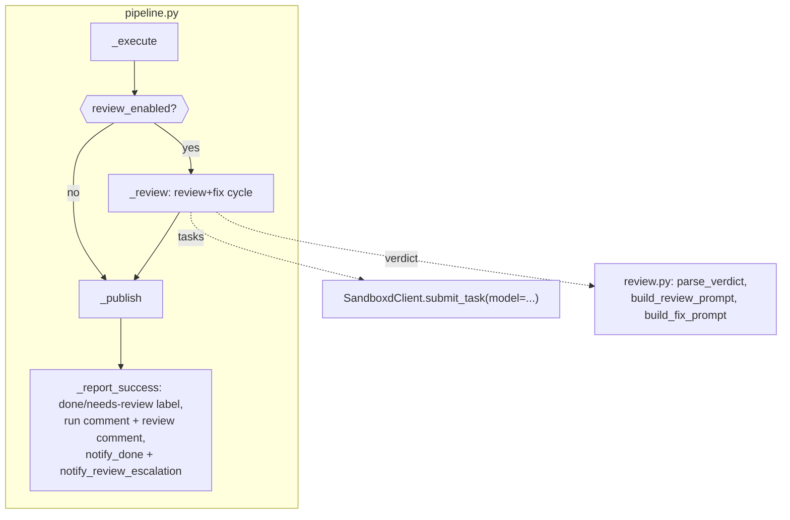

# Loop Reviewer (Phase 2) Implementation Plan

> **For agentic workers:** REQUIRED SUB-SKILL: Use `.claude/skills/parallel-plan-execution` (recommended, streams below) or superpowers:subagent-driven-development / superpowers:executing-plans to implement this plan task-by-task. Steps use checkbox (`- [ ]`) syntax for tracking.

**Goal:** Add automatic review to the loop: after `executing`, a review task on Fable 5 inspects the diff in the same sandbox, an auto-fix loop resolves the findings, and publishing gets cleaned-up code; along the way all system texts are migrated to English.

**Architecture:** A new `reviewing` state between `executing` and `publishing`; inside it a loop of "review task (model=claude-fable-5, fresh session) → JSON verdict from `agent_message_final` → fix task" with an iteration cap. Escalation and a failed review do not block publishing. Everything builds on the existing phase 1 pipeline/worker/state_machine.

**Tech Stack:** Python 3.11, FastAPI, aiosqlite, httpx, pydantic-settings; pytest (`asyncio_mode="auto"`), respx, fakes from `tests/conftest.py`.

**Spec:** `docs/superpowers/specs/2026-07-31-loop-reviewer-phase2-design.md` — the spec's Locked Decisions are binding.

## Locked Decisions

- **State `REVIEWING = "reviewing"`** between `EXECUTING` and `PUBLISHING`; transitions: `EXECUTING → {REVIEWING, PUBLISHING, FAILED}`, `REVIEWING → {PUBLISHING, FAILED}`.
- **Run/DB schema:** new columns `test_cmd TEXT`, `review_enabled INTEGER NOT NULL DEFAULT 1`, `review_max_iterations INTEGER NOT NULL DEFAULT 2`, `review_iteration INTEGER NOT NULL DEFAULT 0`, `review_status TEXT` (`clean|escalated|skipped|NULL`), `review_json TEXT`. Migration — `ALTER TABLE` driven by `PRAGMA table_info` (the VPS holds a live database).
- **Verdict (wire format):** JSON `{verdict: "clean"|"findings", summary: str, findings: [{severity, file, line?, title, detail?}]}` in the review task's final message (`agent_message_final`, fallback `agent_message`). With `verdict=clean` the findings are ignored.
- **`review_json` (report format in the DB):** `{"summary": str, "fixed": [finding...], "remaining": [finding...]}` — accumulated across all iterations.
- **`.loop.yml` v1:** optional block `review: {enabled: bool = true, max_fix_iterations: int >= 0}`; `max_fix_iterations: 0` is valid (review without fixes — findings escalate immediately).
- **Settings:** `reviewer_model="claude-fable-5"`, `review_timeout_minutes=30`, `review_max_fix_iterations=2` (env prefix `LOOP_`).
- **Label `loop:needs-review`** (color `e4e669`) is applied instead of `loop:done` on escalation; added to `LOOP_LABELS` → `ensure_labels`.
- **Time budget:** the `reviewing` phase gets a fresh `run.timeout_minutes` budget for the whole review+fix cycle (execute's elapsed time is not persisted — there is nothing to split a single budget with); one review task is capped at `review_timeout_minutes`, the fix task gets the rest of the budget. Rate-limit pauses do not consume the budget (the deadline shifts, as in `_execute`).
- **Language:** all system texts (prompts, PR comments, Telegram, label descriptions, error details) are English. Russian stays in specs/plans only.

## Global Constraints

- No new dependencies; settings only through `Settings` (prefix `LOOP_`).
- Clients accept an optional `httpx.AsyncClient`; transient errors go through `with_retries` (3 attempts).
- Code comments in English; async tests without decorators (`asyncio_mode="auto"`).
- Do not "improve" the sandboxd constraints from CLAUDE.md: push is host-side into a new branch, an app's branch is immutable, secrets are write-only.

## Architecture (overview of changes)



**Streams for parallel-plan-execution** (disjoint file sets):
- Stream A: Task 1 (models/state_machine/db + their tests)
- Stream B: Task 2 (loopconfig + test_loopconfig)
- Stream C: Task 3 (config + test_config)
- Stream D: Task 4 (clients/sandboxd, clients/github + their tests)
- Stream E: Task 5 (review.py + test_review.py — new files)
- Stream F (sequential, after A–E): Task 6 → Task 7 → Task 8 (pipeline.py, telegram.py, worker.py, webhook.py, conftest.py and their tests overlap)
- Task 9 — after all of them.

---

### Task 1: The reviewing state — model, state machine, DB migration

**Files:**
- Modify: `src/loop_orchestrator/models.py`
- Modify: `src/loop_orchestrator/state_machine.py:6-12`
- Modify: `src/loop_orchestrator/db.py`
- Test: `tests/test_state_machine.py`, `tests/test_db.py`

**Interfaces:**
- Reuses: the `Run` dataclass, `TRANSITIONS`, `transition()` (`src/loop_orchestrator/state_machine.py`), `SCHEMA`/`_RUN_FIELDS`/`save_run` (`src/loop_orchestrator/db.py`), the `db` fixture from `tests/conftest.py`.
- Produces: the constant `REVIEWING = "reviewing"` (models); fields `Run.test_cmd: str | None`, `Run.review_enabled: bool = True`, `Run.review_max_iterations: int = 2`, `Run.review_iteration: int = 0`, `Run.review_status: str | None`, `Run.review_json: str | None`; column migration on `db.connect()`.

- [x] **Step 1: Write failing tests**

Add to `tests/test_state_machine.py`:

```python
async def test_executing_to_reviewing_to_publishing(db):
    run = await dbmod.create_run(db, "o/r", 1, "b")
    run.state = EXECUTING
    await dbmod.save_run(db, run)
    await transition(db, run, REVIEWING)
    assert run.state == REVIEWING
    await transition(db, run, PUBLISHING)
    assert run.state == PUBLISHING


async def test_reviewing_to_failed(db):
    run = await dbmod.create_run(db, "o/r", 1, "b")
    run.state = REVIEWING
    await dbmod.save_run(db, run)
    await transition(db, run, FAILED, detail="boom")
    assert run.state == FAILED


async def test_reviewing_cannot_jump_to_done(db):
    run = await dbmod.create_run(db, "o/r", 1, "b")
    run.state = REVIEWING
    await dbmod.save_run(db, run)
    with pytest.raises(InvalidTransition):
        await transition(db, run, DONE)
```

Extend the file's imports with `REVIEWING` (from `loop_orchestrator.models`). If `pytest`/`InvalidTransition`/`DONE` are not imported in this file yet — add them.

Add to `tests/test_db.py`:

```python
async def test_review_fields_roundtrip(db):
    run = await dbmod.create_run(db, "o/r", 1, "b")
    run.test_cmd = "pytest -q"
    run.review_enabled = False
    run.review_max_iterations = 3
    run.review_iteration = 2
    run.review_status = "escalated"
    run.review_json = '{"summary": "s", "fixed": [], "remaining": []}'
    await dbmod.save_run(db, run)
    got = await dbmod.get_run(db, run.id)
    assert got.test_cmd == "pytest -q"
    assert not got.review_enabled
    assert got.review_max_iterations == 3
    assert got.review_iteration == 2
    assert got.review_status == "escalated"
    assert "remaining" in got.review_json


async def test_migration_adds_review_columns(tmp_path):
    # Simulate a phase 1 database that predates the review columns.
    legacy = await aiosqlite.connect(str(tmp_path / "legacy.db"))
    await legacy.executescript("""
        CREATE TABLE runs (
          id INTEGER PRIMARY KEY AUTOINCREMENT,
          repo TEXT NOT NULL, pr_number INTEGER NOT NULL, head_branch TEXT NOT NULL,
          state TEXT NOT NULL, app_id TEXT, sandbox_id TEXT, task_id TEXT,
          spec_path TEXT, plan_path TEXT, prompt TEXT,
          timeout_minutes INTEGER NOT NULL DEFAULT 180, error TEXT, summary TEXT,
          created_at TEXT NOT NULL DEFAULT (datetime('now')),
          updated_at TEXT NOT NULL DEFAULT (datetime('now'))
        );
        INSERT INTO runs (repo, pr_number, head_branch, state) VALUES ('o/r', 1, 'b', 'done');
    """)
    await legacy.commit()
    await legacy.close()

    conn = await dbmod.connect(str(tmp_path / "legacy.db"))
    run = await dbmod.get_run(conn, 1)
    assert run.review_enabled  # default 1
    assert run.review_iteration == 0
    assert run.review_status is None
    await conn.close()
```

Extend the imports of `tests/test_db.py` with `import aiosqlite`.

- [x] **Step 2: Run them — the tests fail**

Run: `python -m pytest tests/test_state_machine.py tests/test_db.py -v`
Expected: FAIL — `ImportError: cannot import name 'REVIEWING'` / `Run has no attribute 'test_cmd'`.

- [x] **Step 3: Implementation**

`src/loop_orchestrator/models.py` — add the constant and the fields (leave the existing ones alone):

```python
QUEUED = "queued"
PREPARING = "preparing"
EXECUTING = "executing"
REVIEWING = "reviewing"
PUBLISHING = "publishing"
REPORTING = "reporting"
DONE = "done"
FAILED = "failed"

ACTIVE_STATES = {QUEUED, PREPARING, EXECUTING, REVIEWING, PUBLISHING, REPORTING}


@dataclass
class Run:
    id: int
    repo: str
    pr_number: int
    head_branch: str
    state: str
    app_id: str | None = None
    sandbox_id: str | None = None
    task_id: str | None = None
    spec_path: str | None = None
    plan_path: str | None = None
    prompt: str | None = None
    timeout_minutes: int = 180
    error: str | None = None
    summary: str | None = None
    test_cmd: str | None = None
    review_enabled: bool = True
    review_max_iterations: int = 2
    review_iteration: int = 0
    review_status: str | None = None  # clean | escalated | skipped
    review_json: str | None = None
```

`src/loop_orchestrator/state_machine.py` — update `TRANSITIONS` (and the `REVIEWING` import):

```python
TRANSITIONS: dict[str, set[str]] = {
    QUEUED: {PREPARING, FAILED},
    PREPARING: {EXECUTING, FAILED},
    EXECUTING: {REVIEWING, PUBLISHING, FAILED},
    REVIEWING: {PUBLISHING, FAILED},
    PUBLISHING: {REPORTING, FAILED},
    REPORTING: {DONE, FAILED},
}
```

`src/loop_orchestrator/db.py`:

1. In `SCHEMA`, inside `CREATE TABLE IF NOT EXISTS runs`, add after the line `error TEXT, summary TEXT,`:

```sql
  test_cmd TEXT,
  review_enabled INTEGER NOT NULL DEFAULT 1,
  review_max_iterations INTEGER NOT NULL DEFAULT 2,
  review_iteration INTEGER NOT NULL DEFAULT 0,
  review_status TEXT,
  review_json TEXT,
```

2. Extend `_RUN_FIELDS`:

```python
_RUN_FIELDS = (
    "id", "repo", "pr_number", "head_branch", "state", "app_id", "sandbox_id",
    "task_id", "spec_path", "plan_path", "prompt", "timeout_minutes", "error", "summary",
    "test_cmd", "review_enabled", "review_max_iterations", "review_iteration",
    "review_status", "review_json",
)
```

3. Migration for existing databases — after `executescript(SCHEMA)` in `connect()`:

```python
_MIGRATIONS = (
    ("test_cmd", "TEXT"),
    ("review_enabled", "INTEGER NOT NULL DEFAULT 1"),
    ("review_max_iterations", "INTEGER NOT NULL DEFAULT 2"),
    ("review_iteration", "INTEGER NOT NULL DEFAULT 0"),
    ("review_status", "TEXT"),
    ("review_json", "TEXT"),
)


async def connect(path: str) -> aiosqlite.Connection:
    Path(path).parent.mkdir(parents=True, exist_ok=True)
    db = await aiosqlite.connect(path)
    db.row_factory = aiosqlite.Row
    await db.executescript(SCHEMA)
    async with db.execute("PRAGMA table_info(runs)") as cur:
        have = {row["name"] for row in await cur.fetchall()}
    for col, decl in _MIGRATIONS:
        if col not in have:
            await db.execute(f"ALTER TABLE runs ADD COLUMN {col} {decl}")
    await db.commit()
    return db
```

4. Update `save_run` (full new form):

```python
async def save_run(db: aiosqlite.Connection, run: Run) -> None:
    await db.execute(
        """UPDATE runs SET state=?, app_id=?, sandbox_id=?, task_id=?, spec_path=?,
           plan_path=?, prompt=?, timeout_minutes=?, error=?, summary=?,
           test_cmd=?, review_enabled=?, review_max_iterations=?, review_iteration=?,
           review_status=?, review_json=?,
           updated_at=datetime('now') WHERE id=?""",
        (run.state, run.app_id, run.sandbox_id, run.task_id, run.spec_path,
         run.plan_path, run.prompt, run.timeout_minutes, run.error, run.summary,
         run.test_cmd, run.review_enabled, run.review_max_iterations,
         run.review_iteration, run.review_status, run.review_json, run.id),
    )
    await db.commit()
```

- [x] **Step 4: Run them — the tests pass**

Run: `python -m pytest tests/test_state_machine.py tests/test_db.py -v`
Expected: PASS (all of them, including the old ones).

- [x] **Step 5: Commit**

```bash
git add src/loop_orchestrator/models.py src/loop_orchestrator/state_machine.py src/loop_orchestrator/db.py tests/test_state_machine.py tests/test_db.py
git commit -m "feat: reviewing state, review fields on Run, db migration"
```

---

### Task 2: The review block in .loop.yml (+ English loopconfig errors)

**Files:**
- Modify: `src/loop_orchestrator/loopconfig.py`
- Test: `tests/test_loopconfig.py`

**Interfaces:**
- Reuses: `LoopConfig`, `parse_loop_config`, `LoopConfigError`, `find_spec_plan_pair` (`src/loop_orchestrator/loopconfig.py`).
- Produces: fields `LoopConfig.review_enabled: bool = True`, `LoopConfig.review_max_fix_iterations: int | None = None`; English error texts in `find_spec_plan_pair`.

- [x] **Step 1: Write failing tests**

Add to `tests/test_loopconfig.py`:

```python
def test_review_defaults_without_block():
    cfg = parse_loop_config("specs_dir: docs/specs\n")
    assert cfg.review_enabled is True
    assert cfg.review_max_fix_iterations is None


def test_review_block_parsed():
    cfg = parse_loop_config(
        "specs_dir: docs/specs\nreview:\n  enabled: false\n  max_fix_iterations: 0\n")
    assert cfg.review_enabled is False
    assert cfg.review_max_fix_iterations == 0


def test_review_block_invalid_types():
    with pytest.raises(LoopConfigError):
        parse_loop_config("specs_dir: d\nreview: nope\n")
    with pytest.raises(LoopConfigError):
        parse_loop_config("specs_dir: d\nreview:\n  enabled: 5\n")
    with pytest.raises(LoopConfigError):
        parse_loop_config("specs_dir: d\nreview:\n  max_fix_iterations: -1\n")
```

- [x] **Step 2: Run them — they fail**

Run: `python -m pytest tests/test_loopconfig.py -v`
Expected: FAIL — `Run/LoopConfig has no attribute 'review_enabled'`.

- [x] **Step 3: Implementation**

Add the fields to `LoopConfig`:

```python
    review_enabled: bool = True
    review_max_fix_iterations: int | None = None
```

In `parse_loop_config`, before `return`, add the block parsing:

```python
    review = data.get("review") or {}
    if not isinstance(review, dict):
        raise LoopConfigError("review must be a mapping")
    review_enabled = review.get("enabled", True)
    if not isinstance(review_enabled, bool):
        raise LoopConfigError("review.enabled must be a boolean")
    max_fix = review.get("max_fix_iterations")
    if max_fix is not None and (not isinstance(max_fix, int)
                                or isinstance(max_fix, bool) or max_fix < 0):
        raise LoopConfigError("review.max_fix_iterations must be an integer >= 0")
```

and pass them to the constructor: `review_enabled=review_enabled, review_max_fix_iterations=max_fix`.

Replace the Russian error texts in `find_spec_plan_pair`:

```python
    if len(specs) != 1:
        raise LoopConfigError(
            f"the PR diff must contain exactly one *-design.md spec under {cfg.specs_dir}/ (found {len(specs)})")
    if len(plans) != 1:
        raise LoopConfigError(
            f"the PR diff must contain exactly one *.md plan under {pdir}/ (found {len(plans)})")
```

- [x] **Step 4: Run them — they pass**

Run: `python -m pytest tests/test_loopconfig.py -v`
Expected: PASS.

- [x] **Step 5: Commit**

```bash
git add src/loop_orchestrator/loopconfig.py tests/test_loopconfig.py
git commit -m "feat: review block in .loop.yml, english loopconfig errors"
```

---

### Task 3: Review settings in Settings

**Files:**
- Modify: `src/loop_orchestrator/config.py`
- Test: `tests/test_config.py`

**Interfaces:**
- Reuses: `Settings` (pydantic-settings, prefix `LOOP_`).
- Produces: `Settings.reviewer_model: str = "claude-fable-5"`, `Settings.review_timeout_minutes: int = 30`, `Settings.review_max_fix_iterations: int = 2`.

- [x] **Step 1: Write a failing test**

Add to `tests/test_config.py` (the environment with the required fields is already set up in this file — use the same trick as the existing tests there):

```python
def test_review_settings_defaults(monkeypatch, tmp_path):
    for k, v in {
        "LOOP_GITHUB_TOKEN": "t", "LOOP_GITHUB_WEBHOOK_SECRET": "s",
        "LOOP_TELEGRAM_BOT_TOKEN": "b", "LOOP_TELEGRAM_CHAT_ID": "1",
        "LOOP_SANDBOXD_API_KEY": "k", "LOOP_GIT_CREDENTIAL_ID": "c",
    }.items():
        monkeypatch.setenv(k, v)
    s = Settings(_env_file=None)
    assert s.reviewer_model == "claude-fable-5"
    assert s.review_timeout_minutes == 30
    assert s.review_max_fix_iterations == 2
```

- [x] **Step 2: Run it — it fails**

Run: `python -m pytest tests/test_config.py -v`
Expected: FAIL — `AttributeError: reviewer_model`.

- [x] **Step 3: Implementation**

In `Settings`, after `rate_limit_retry_minutes: int = 60`, add:

```python
    reviewer_model: str = "claude-fable-5"
    review_timeout_minutes: int = 30
    review_max_fix_iterations: int = 2
```

- [x] **Step 4: Run it — it passes**

Run: `python -m pytest tests/test_config.py -v`
Expected: PASS.

- [x] **Step 5: Commit**

```bash
git add src/loop_orchestrator/config.py tests/test_config.py
git commit -m "feat: reviewer settings (model, timeout, fix iterations)"
```

---

### Task 4: Clients — per-task model in sandboxd, the loop:needs-review label

**Files:**
- Modify: `src/loop_orchestrator/clients/sandboxd.py:62-69`
- Modify: `src/loop_orchestrator/clients/github.py:8-13`
- Test: `tests/test_sandboxd_client.py`, `tests/test_github_client.py`

**Interfaces:**
- Reuses: `SandboxdClient.submit_task` (respx tests in `tests/test_sandboxd_client.py`), `LOOP_LABELS`/`ensure_labels` (`clients/github.py`).
- Produces: `submit_task(sandbox_id, prompt, timeout_s, continue_session=False, model: str | None = None)` — `model` lands in the task's JSON body; `LOOP_LABELS["loop:needs-review"] == "e4e669"`.

- [x] **Step 1: Write failing tests**

Add to `tests/test_sandboxd_client.py` (following the existing respx tests in the file; take `make_client`/the base URL as in the neighbouring tests):

```python
@respx.mock
async def test_submit_task_with_model():
    captured = {}

    def cb(request):
        captured.update(json.loads(request.content))
        return httpx.Response(200, json={"id": "t1"})

    respx.post("http://sb/v1/sandboxes/sb1/tasks").mock(side_effect=cb)
    c = SandboxdClient("http://sb", "key")
    tid = await c.submit_task("sb1", "review this", timeout_s=60, model="claude-fable-5")
    assert tid == "t1"
    assert captured["model"] == "claude-fable-5"
    assert captured["agent"] == "claude-code"
    await c.aclose()


@respx.mock
async def test_submit_task_without_model_omits_field():
    captured = {}

    def cb(request):
        captured.update(json.loads(request.content))
        return httpx.Response(200, json={"id": "t2"})

    respx.post("http://sb/v1/sandboxes/sb1/tasks").mock(side_effect=cb)
    c = SandboxdClient("http://sb", "key")
    await c.submit_task("sb1", "do work", timeout_s=60)
    assert "model" not in captured
    await c.aclose()
```

(If the file lacks `import json` / `import httpx` / `import respx` — add them.)

Add to `tests/test_github_client.py`:

```python
def test_needs_review_label_registered():
    assert LOOP_LABELS["loop:needs-review"] == "e4e669"
```

(Import `LOOP_LABELS` from `loop_orchestrator.clients.github`; if the existing `ensure_labels` test lists the labels by name or counts them — update it for 5 labels.)

- [x] **Step 2: Run them — they fail**

Run: `python -m pytest tests/test_sandboxd_client.py tests/test_github_client.py -v`
Expected: FAIL — `submit_task() got an unexpected keyword argument 'model'` / `KeyError: 'loop:needs-review'`.

- [x] **Step 3: Implementation**

`clients/sandboxd.py` — the new form of `submit_task`:

```python
    async def submit_task(self, sandbox_id: str, prompt: str, timeout_s: int,
                          continue_session: bool = False, model: str | None = None) -> str:
        body: dict = {"prompt": prompt, "agent": "claude-code", "timeout_s": timeout_s}
        if continue_session:
            body["continue"] = True
        if model:
            body["model"] = model
        r = await self._req("POST", f"/v1/sandboxes/{sandbox_id}/tasks", json=body)
        r.raise_for_status()
        return r.json()["id"]
```

`clients/github.py` — extend the dict:

```python
LOOP_LABELS = {
    "loop:run": "1d76db",
    "loop:running": "fbca04",
    "loop:done": "0e8a16",
    "loop:failed": "b60205",
    "loop:needs-review": "e4e669",
}
```

- [x] **Step 4: Run them — they pass**

Run: `python -m pytest tests/test_sandboxd_client.py tests/test_github_client.py -v`
Expected: PASS.

- [x] **Step 5: Commit**

```bash
git add src/loop_orchestrator/clients/sandboxd.py src/loop_orchestrator/clients/github.py tests/test_sandboxd_client.py tests/test_github_client.py
git commit -m "feat: per-task model in sandboxd client, loop:needs-review label"
```

---

### Task 5: review.py — verdict parser, prompts, report

**Files:**
- Create: `src/loop_orchestrator/review.py`
- Test: `tests/test_review.py` (new)

**Interfaces:**
- Reuses: no code; the verdict format and the comment text come from the spec (Locked Decisions 5–6).
- Produces (used by Task 7–8):
  - `Finding(severity: str, file: str, title: str, detail: str = "", line: int | None = None)`
  - `Verdict(verdict: str, summary: str = "", findings: list[Finding] = [])`
  - `VerdictError(Exception)`
  - `parse_verdict(text: str) -> Verdict`
  - `newly_fixed(pending: list[Finding], current: list[Finding]) -> list[Finding]`
  - `report_dict(summary: str, fixed: list[Finding], remaining: list[Finding]) -> dict`
  - `build_review_prompt(spec_path: str, plan_path: str, head_branch: str) -> str`
  - `build_fix_prompt(verdict: Verdict, test_cmd: str | None) -> str`
  - `format_review_comment(status: str, iterations: int, report: dict) -> str`

- [x] **Step 1: Write failing tests**

Create `tests/test_review.py`:

```python
import pytest

from loop_orchestrator.review import (
    Finding,
    Verdict,
    VerdictError,
    build_fix_prompt,
    build_review_prompt,
    format_review_comment,
    newly_fixed,
    parse_verdict,
    report_dict,
)

CLEAN = '{"verdict": "clean", "summary": "looks good", "findings": []}'
FINDINGS = ('{"verdict": "findings", "summary": "issues found", "findings": ['
            '{"severity": "major", "file": "app/api.py", "line": 12, '
            '"title": "no timeout", "detail": "hangs on dead host"}]}')


def test_parse_clean():
    v = parse_verdict(CLEAN)
    assert v.verdict == "clean" and v.summary == "looks good" and v.findings == []


def test_parse_findings():
    v = parse_verdict(FINDINGS)
    assert v.verdict == "findings"
    f = v.findings[0]
    assert (f.severity, f.file, f.line, f.title) == ("major", "app/api.py", 12, "no timeout")


def test_parse_tolerates_fences_and_prose():
    text = "Here is my verdict:\n```json\n" + CLEAN + "\n```\nDone."
    assert parse_verdict(text).verdict == "clean"


def test_parse_clean_drops_findings():
    v = parse_verdict('{"verdict": "clean", "summary": "s", "findings": '
                      '[{"file": "a.py", "title": "left-over"}]}')
    assert v.findings == []


def test_parse_defaults_severity_and_detail():
    v = parse_verdict('{"verdict": "findings", "findings": [{"file": "a.py", "title": "t"}]}')
    f = v.findings[0]
    assert f.severity == "major" and f.detail == "" and f.line is None


def test_parse_rejects_garbage():
    for bad in ("", "no json here", '{"verdict": "maybe"}',
                '{"verdict": "findings", "findings": [{"title": "no file"}]}'):
        with pytest.raises(VerdictError):
            parse_verdict(bad)


def test_newly_fixed_by_file_and_title():
    a = Finding("major", "a.py", "bug A")
    b = Finding("minor", "b.py", "bug B")
    assert newly_fixed([a, b], [Finding("major", "b.py", "bug B")]) == [a]


def test_prompts_are_english_and_carry_context():
    rp = build_review_prompt("docs/s.md", "docs/p.md", "feat/x")
    assert "docs/s.md" in rp and "origin/feat/x..HEAD" in rp and '"verdict"' in rp
    fp = build_fix_prompt(parse_verdict(FINDINGS), "pytest -q")
    assert "no timeout" in fp and "pytest -q" in fp and "Do not git push" in fp
    fp2 = build_fix_prompt(parse_verdict(FINDINGS), None)
    assert "pytest -q" not in fp2


def test_format_review_comment():
    report = report_dict("summary line",
                         fixed=[Finding("major", "a.py", "bug A", line=3)],
                         remaining=[Finding("minor", "b.py", "bug B")])
    text = format_review_comment("escalated", 2, report)
    assert "loop-orchestrator — review (Fable 5)" in text
    assert "⚠️ findings remain" in text and "(2 fix iteration(s))" in text
    assert "Fixed in the fix cycle (1)" in text and "`a.py:3` — bug A" in text
    assert "Remaining (1)" in text and "`b.py` — bug B" in text
    clean = format_review_comment("clean", 0, report_dict("ok", [], []))
    assert "✅ clean" in clean
    skipped = format_review_comment("skipped", 0, report_dict("agent died", [], []))
    assert "⛔ review skipped" in skipped
```

- [x] **Step 2: Run them — they fail**

Run: `python -m pytest tests/test_review.py -v`
Expected: FAIL — `ModuleNotFoundError: loop_orchestrator.review`.

- [x] **Step 3: Implementation**

Create `src/loop_orchestrator/review.py`:

```python
"""Review verdict protocol: prompts, JSON verdict parsing, PR-comment report."""
import json
import re
from dataclasses import asdict, dataclass, field


class VerdictError(Exception):
    pass


@dataclass
class Finding:
    severity: str
    file: str
    title: str
    detail: str = ""
    line: int | None = None


@dataclass
class Verdict:
    verdict: str  # "clean" | "findings"
    summary: str = ""
    findings: list[Finding] = field(default_factory=list)


_JSON_RE = re.compile(r"\{.*\}", re.DOTALL)

VERDICT_SCHEMA = """{
  "verdict": "clean | findings",
  "summary": "1-2 sentence overall assessment",
  "findings": [
    {"severity": "critical | major | minor", "file": "path/to/file.py",
     "line": 120, "title": "short issue title", "detail": "what is wrong and how to fix it"}
  ]
}"""


def parse_verdict(text: str) -> Verdict:
    m = _JSON_RE.search(text or "")
    if not m:
        raise VerdictError("no JSON object in the reviewer message")
    try:
        data = json.loads(m.group(0))
    except json.JSONDecodeError as e:
        raise VerdictError(f"invalid verdict JSON: {e}") from e
    verdict = data.get("verdict")
    if verdict not in ("clean", "findings"):
        raise VerdictError(f"unknown verdict value: {verdict!r}")
    summary = data.get("summary") or ""
    findings: list[Finding] = []
    if verdict == "findings":
        for raw in data.get("findings") or []:
            if not isinstance(raw, dict) or not raw.get("file") or not raw.get("title"):
                raise VerdictError(f"finding without file/title: {raw!r}")
            line = raw.get("line")
            findings.append(Finding(
                severity=raw.get("severity") or "major",
                file=str(raw["file"]),
                title=str(raw["title"]),
                detail=str(raw.get("detail") or ""),
                line=int(line) if isinstance(line, int) else None,
            ))
    return Verdict(verdict=verdict, summary=str(summary), findings=findings)


def newly_fixed(pending: list[Finding], current: list[Finding]) -> list[Finding]:
    """Pending findings that no longer show up in the current verdict."""
    still = {(f.file, f.title) for f in current}
    return [f for f in pending if (f.file, f.title) not in still]


def report_dict(summary: str, fixed: list[Finding], remaining: list[Finding]) -> dict:
    return {"summary": summary,
            "fixed": [asdict(f) for f in fixed],
            "remaining": [asdict(f) for f in remaining]}


def build_review_prompt(spec_path: str, plan_path: str, head_branch: str) -> str:
    return (
        "You are an independent code reviewer for this repository.\n"
        f"Specification: {spec_path}\n"
        f"Plan: {plan_path}\n\n"
        "Read both documents first. Then review ONLY the work done on top of the "
        f"imported PR branch: inspect `git log origin/{head_branch}..HEAD` and "
        f"`git diff origin/{head_branch}..HEAD`, plus any uncommitted changes "
        "shown by `git status`.\n"
        "Check for: correctness bugs, security issues, deviations from the spec "
        "and plan, test quality and coverage, style problems. Report ALL findings "
        "regardless of severity.\n"
        "Do NOT modify, commit or push anything — you only review.\n\n"
        "Your FINAL message must be a single JSON object and nothing else, "
        "matching exactly this schema:\n"
        f"{VERDICT_SCHEMA}\n"
        'If the work is acceptable, return {"verdict": "clean", '
        '"summary": "<why it is clean>", "findings": []}.'
    )


def build_fix_prompt(verdict: Verdict, test_cmd: str | None) -> str:
    findings_json = json.dumps([asdict(f) for f in verdict.findings],
                               ensure_ascii=False, indent=2)
    test_line = (f"After fixing, run the tests with `{test_cmd}` — they must pass.\n"
                 if test_cmd else "")
    return (
        "An independent code review found issues in the work done in this repository.\n"
        "Fix ALL of the findings listed below.\n"
        "Make a git commit after the fixes. Do not git push. Do not switch branches.\n"
        + test_line +
        "Findings (JSON):\n" + findings_json + "\n"
        "Finish with a short summary of what you changed."
    )


_VERDICT_LINES = {"clean": "✅ clean",
                  "escalated": "⚠️ findings remain",
                  "skipped": "⛔ review skipped"}


def _fmt_finding(f: dict) -> str:
    loc = f["file"] + (f":{f['line']}" if f.get("line") else "")
    return f"- **[{f.get('severity', 'major')}]** `{loc}` — {f['title']}"


def format_review_comment(status: str, iterations: int, report: dict) -> str:
    lines = ["**🤖 loop-orchestrator — review (Fable 5)**", "",
             f"**Verdict: {_VERDICT_LINES[status]}** ({iterations} fix iteration(s))"]
    if report.get("summary"):
        lines += ["", report["summary"]]
    for key, title in (("fixed", "Fixed in the fix cycle"), ("remaining", "Remaining")):
        items = report.get(key) or []
        if items:
            lines += ["", f"**{title} ({len(items)}):**"]
            lines += [_fmt_finding(f) for f in items]
    return "\n".join(lines)
```

- [x] **Step 4: Run them — they pass**

Run: `python -m pytest tests/test_review.py -v`
Expected: PASS.

- [x] **Step 5: Commit**

```bash
git add src/loop_orchestrator/review.py tests/test_review.py
git commit -m "feat: review verdict protocol (parser, prompts, report formatter)"
```

---

### Task 6: Migrating phase 1 texts to English

**Files:**
- Modify: `src/loop_orchestrator/pipeline.py` (text literals only)
- Modify: `src/loop_orchestrator/clients/telegram.py`
- Modify: `src/loop_orchestrator/worker.py:46-49`
- Modify: `src/loop_orchestrator/webhook.py:60-61`
- Test: `tests/test_pipeline_prepare.py:47-49`, `tests/test_pipeline_publish.py:38`, `tests/test_pipeline_process.py:73`, `tests/test_webhook.py:111`

**Interfaces:**
- Reuses: all existing functions; only string literals change — do not touch the signatures.
- Produces: English texts that Task 7–8 rely on (in particular `"(no summary)"`, `"✅ Loop run #… finished."`).

- [x] **Step 1: Update the texts in `pipeline.py`**

Replacements (literals only, the logic does not change):

```python
# build_prompt — full new form:
def build_prompt(spec_path: str, plan_path: str, test_cmd: str | None,
                 setup_cmd: str | None = None) -> str:
    setup_line = (
        f"First install the project dependencies with `{setup_cmd}`.\n"
        if setup_cmd else ""
    )
    test_line = (
        f"Before finishing, run the tests with `{test_cmd}` — they must pass.\n"
        if test_cmd else ""
    )
    return (
        "You are executing a prepared feature plan in this repository.\n"
        f"Specification: {spec_path}\n"
        f"Plan: {plan_path}\n\n"
        + setup_line +
        "Read both files and complete every task of the plan in order "
        "(use the parallel-plan-execution skill if it is available). "
        "Tick off completed tasks directly in the plan file. "
        "Make a git commit after each completed task. "
        "Do not git push — publishing is handled by an external system. "
        "Do not switch branches.\n"
        + test_line +
        "Finish with a short summary: what was done, what was verified, what failed."
    )
```

The remaining literals in `pipeline.py`:

| Was (Russian original, glossed) | Now |
|---|---|
| `"the repository has no .loop.yml"` | `"no .loop.yml in the repository"` |
| `f".loop.yml is malformed: {e}"` | `f".loop.yml is invalid: {e}"` |
| `"project secrets missing: "` | `"missing project secrets: "` |
| `"(without a summary)"` | `"(no summary)"` |
| `f"⏳ Run #{run.id}: hit the subscription limits, resuming in {…} min (attempt {…}/3)."` | `f"⏳ Run #{run.id}: hit the subscription rate limit, resuming in {self.settings.rate_limit_retry_minutes} min (attempt {rate_limit_attempts}/3)."` |
| `"Continue plan execution from the point where you stopped."` | `"Continue executing the plan from where you stopped."` |
| `f"task finished with status {status}: {… or 'no details'}"` | `f"task finished with status {status}: {task.get('error_message') or 'no details'}"` |
| `"\n\n⚠️ The agent made no code changes — there is nothing to publish."` | `"\n\n⚠️ The agent made no code changes — nothing to publish."` |
| `f"push rejected by sandboxd: {…}"` | `f"push rejected by sandboxd: {push.get('reason')}"` |
| `f"the PR branch moved ahead, fast-forward is impossible; the code is saved in branch {branch}"` | `f"the PR branch moved ahead, fast-forward is impossible; the code is preserved in branch {branch}"` |
| `f"timeout of {run.timeout_minutes} minutes"` | `f"timed out after {run.timeout_minutes} minutes of agent work"` |
| `f"internal error: {e!r}"` | `f"internal error: {e!r}"` |
| `f"✅ Loop run #{run.id} completed.\n\n{…}"` | `f"✅ Loop run #{run.id} finished.\n\n{run.summary or ''}"` |
| `f"❌ Loop run #{run.id} crashed: {run.error}"` | `f"❌ Loop run #{run.id} failed: {run.error}"` |

- [x] **Step 2: Update `telegram.py`, `worker.py`, `webhook.py`**

`clients/telegram.py`:

```python
    async def notify_queued(self, run: Run) -> None:
        await self.send(f"📥 Run #{run.id} queued: {self._link(run)}")

    async def notify_started(self, run: Run) -> None:
        await self.send(
            f"🚀 Run #{run.id} started: {self._link(run)}\n"
            f"Time budget: {run.timeout_minutes} min")

    async def notify_done(self, run: Run) -> None:
        head = f"✅ Run #{run.id} finished: {self._link(run)}\n"
        summary = md_to_telegram_html((run.summary or "(no summary)")[:3200])
        text = f"{head}<blockquote expandable>{summary}</blockquote>"
        if len(text) > 4000:
            # Rich version would be cut mid-tag by Telegram's 4096 limit —
            # fall back to plain escaped text, which survives any truncation.
            text = f"{head}\n{html.escape(run.summary or '')[:3400]}"
        await self.send(text)

    async def notify_failed(self, run: Run) -> None:
        error = html.escape(run.error or "unknown error")
        await self.send(
            f"❌ Run #{run.id} failed: {self._link(run)}\n"
            f"<blockquote>{error[:3400]}</blockquote>")
```

`worker.py` (`recover`, the text for orphaned Runs):

```python
            await self.pipeline.fail(
                run, run.state,
                "the orchestrator restarted mid-step — the run was stopped; "
                "re-apply the loop:run label to retry")
```

`webhook.py` (the deduplication message):

```python
            f"⚠️ {repo}#{number}: Run #{existing.id} is already active ({existing.state}) — "
            f"the new run was rejected. Wait for it to finish and re-apply the label.")
```

- [x] **Step 3: Update the test assertions**

- `tests/test_pipeline_prepare.py:47`: the old Russian assert on "install dependencies" → `assert "install the project dependencies" not in p`
- `tests/test_pipeline_prepare.py:49`: the old Russian assert on "npm ci" plus "install dependencies" → `assert "npm ci" in p2 and "install the project dependencies" in p2`
- `tests/test_pipeline_publish.py:38`: the old Russian assert on "made no changes" → `assert "made no code changes" in (run.summary or "")`
- `tests/test_pipeline_process.py:73`: the old Russian assert on "timeout" → `assert "timed out" in (run.error or "")`
- `tests/test_webhook.py:111`: the old Russian assert on "already active" → `"already active" in app.state.tg.sent[0]`

- [x] **Step 4: Run the whole suite**

Run: `python -m pytest tests -v`
Expected: PASS (full run; no other test depends on Russian strings — check that `rg -n "\p{Cyrillic}" tests/` finds no assertions on product texts other than the updated ones).

- [x] **Step 5: Commit**

```bash
git add src/loop_orchestrator/pipeline.py src/loop_orchestrator/clients/telegram.py src/loop_orchestrator/worker.py src/loop_orchestrator/webhook.py tests/test_pipeline_prepare.py tests/test_pipeline_publish.py tests/test_pipeline_process.py tests/test_webhook.py
git commit -m "refactor: migrate all system texts to english"
```

---

### Task 7: The reviewing step in the pipeline + recovery + fakes

**Files:**
- Modify: `src/loop_orchestrator/pipeline.py`
- Modify: `src/loop_orchestrator/worker.py:40-49`
- Modify: `tests/conftest.py`
- Modify: `tests/test_pipeline_process.py:16-31` (test_process_full_success)
- Test: `tests/test_pipeline_review.py` (new), `tests/test_worker.py`

**Interfaces:**
- Reuses: `Pipeline._execute`/`process`/`_prepare` (`pipeline.py`), `RATE_LIMIT_MARKERS`, `MAX_TASK_TIMEOUT_S`, `transition` (Task 1: `REVIEWING`), `LoopConfig.review_*` (Task 2), `Settings.reviewer_model/review_timeout_minutes/review_max_fix_iterations` (Task 3), `submit_task(model=…)` (Task 4), `review.py` (Task 5), `seed_ok`/`make_pipeline` from `tests/test_pipeline_prepare.py`.
- Consumes: `parse_verdict`, `build_review_prompt`, `build_fix_prompt`, `newly_fixed`, `report_dict`, `Finding`, `VerdictError`.
- Produces: `Pipeline._review(run) -> None` (sets `run.review_status/review_json/review_iteration`), `Pipeline._run_sandbox_task(run, prompt, timeout_s, deadline, model=None) -> tuple[dict, float]`, the exceptions `ReviewTaskError`, `ReviewDeadline`; on recovery a `REVIEWING` Run is re-enqueued.

- [x] **Step 1: Update the fakes in `tests/conftest.py`**

`FakeSandboxd.submit_task` — accept and record `model`:

```python
    async def submit_task(self, sandbox_id, prompt, timeout_s, continue_session=False, model=None):
        self.tasks_submitted.append({"sandbox_id": sandbox_id, "prompt": prompt,
                                     "timeout_s": timeout_s, "continue": continue_session,
                                     "model": model})
        return f"task-{len(self.tasks_submitted)}"
```

`FakeTG` — add a method:

```python
    async def notify_review_escalation(self, run, remaining):
        self.sent.append(f"escalation:{run.id}:{remaining}")
```

`FakeSettings` — add the fields:

```python
    reviewer_model = "claude-fable-5"
    review_timeout_minutes = 30
    review_max_fix_iterations = 2
```

- [x] **Step 2: Write failing tests in `tests/test_pipeline_review.py`**

```python
"""Integration tests for the reviewing step (review + fix cycle)."""
import json

from loop_orchestrator import db as dbmod
from loop_orchestrator.models import DONE, REVIEWING

from tests.conftest import FakeGitHub, FakeSandboxd, FakeTG
from tests.test_pipeline_prepare import make_pipeline, seed_ok

CLEAN = {"status": "succeeded",
         "agent_message_final": '{"verdict": "clean", "summary": "ok", "findings": []}'}
FINDINGS = {"status": "succeeded",
            "agent_message_final": json.dumps({
                "verdict": "findings", "summary": "issues",
                "findings": [{"severity": "major", "file": "a.py",
                              "title": "bug A", "detail": "d"}]})}
EXEC_OK = {"status": "succeeded", "agent_message_final": "did the work"}
FIX_OK = {"status": "succeeded", "agent_message_final": "fixed"}


def seed_run_env(gh, sb, tmp_path, run_id):
    branch = f"loop/run-{run_id}"
    sb.push_resp = {"pushed": True, "branch": branch, "commits": 2}
    gh.branch_shas[branch] = "sha1"


async def start_run(db, gh, sb, tg, tmp_path):
    seed_ok(gh, tmp_path)
    run = await dbmod.create_run(db, "o/myrepo", 5, "feat/x")
    seed_run_env(gh, sb, tmp_path, run.id)
    pipe = make_pipeline(db, tmp_path, gh=gh, sb=sb, tg=tg)
    return pipe, run


async def test_clean_on_first_pass(db, tmp_path):
    gh, sb, tg = FakeGitHub(), FakeSandboxd(), FakeTG()
    pipe, run = await start_run(db, gh, sb, tg, tmp_path)
    sb.task_results = [EXEC_OK, CLEAN]
    await pipe.process(run)
    assert run.state == DONE
    assert run.review_status == "clean" and run.review_iteration == 0
    # Review task pinned to the reviewer model, fresh session.
    review_task = sb.tasks_submitted[1]
    assert review_task["model"] == "claude-fable-5"
    assert review_task["continue"] is False
    assert ["loop:done"] in gh.labels_added
    assert any("review (Fable 5)" in c and "✅ clean" in c for c in gh.comments)


async def test_findings_then_fix_then_clean(db, tmp_path):
    gh, sb, tg = FakeGitHub(), FakeSandboxd(), FakeTG()
    pipe, run = await start_run(db, gh, sb, tg, tmp_path)
    sb.task_results = [EXEC_OK, FINDINGS, FIX_OK, CLEAN]
    await pipe.process(run)
    assert run.state == DONE
    assert run.review_status == "clean" and run.review_iteration == 1
    fix_task = sb.tasks_submitted[2]
    assert fix_task["model"] is None  # fix runs on the agent's default model
    assert "bug A" in fix_task["prompt"] and "npm test" in fix_task["prompt"]
    report = json.loads(run.review_json)
    assert [f["title"] for f in report["fixed"]] == ["bug A"]
    assert report["remaining"] == []
    assert any("Fixed in the fix cycle (1)" in c for c in gh.comments)


async def test_iterations_exhausted_escalates(db, tmp_path):
    gh, sb, tg = FakeGitHub(), FakeSandboxd(), FakeTG()
    seed_ok(gh, tmp_path)
    # max_fix_iterations: 0 via .loop.yml → findings escalate immediately.
    gh.files[".loop.yml"] += "review:\n  max_fix_iterations: 0\n"
    run = await dbmod.create_run(db, "o/myrepo", 5, "feat/x")
    seed_run_env(gh, sb, tmp_path, run.id)
    pipe = make_pipeline(db, tmp_path, gh=gh, sb=sb, tg=tg)
    sb.task_results = [EXEC_OK, FINDINGS]
    await pipe.process(run)
    assert run.state == DONE  # code is still published
    assert run.review_status == "escalated"
    assert ["loop:needs-review"] in gh.labels_added
    assert ["loop:done"] not in gh.labels_added
    assert f"escalation:{run.id}:1" in tg.sent
    assert any("⚠️ findings remain" in c for c in gh.comments)


async def test_reviewer_fails_twice_review_skipped(db, tmp_path):
    gh, sb, tg = FakeGitHub(), FakeSandboxd(), FakeTG()
    pipe, run = await start_run(db, gh, sb, tg, tmp_path)
    sb.task_results = [EXEC_OK,
                       {"status": "failed", "error_message": "agent crashed"},
                       {"status": "failed", "error_message": "agent crashed again"}]
    await pipe.process(run)
    assert run.state == DONE
    assert run.review_status == "skipped"
    assert ["loop:done"] in gh.labels_added  # skipped review does not block delivery
    assert any("⛔ review skipped" in c for c in gh.comments)


async def test_invalid_verdict_retries_then_succeeds(db, tmp_path):
    gh, sb, tg = FakeGitHub(), FakeSandboxd(), FakeTG()
    pipe, run = await start_run(db, gh, sb, tg, tmp_path)
    sb.task_results = [EXEC_OK,
                       {"status": "succeeded", "agent_message_final": "not json at all"},
                       CLEAN]
    await pipe.process(run)
    assert run.state == DONE
    assert run.review_status == "clean"


async def test_review_disabled_skips_reviewing(db, tmp_path):
    gh, sb, tg = FakeGitHub(), FakeSandboxd(), FakeTG()
    seed_ok(gh, tmp_path)
    gh.files[".loop.yml"] += "review:\n  enabled: false\n"
    run = await dbmod.create_run(db, "o/myrepo", 5, "feat/x")
    seed_run_env(gh, sb, tmp_path, run.id)
    pipe = make_pipeline(db, tmp_path, gh=gh, sb=sb, tg=tg)
    sb.task_results = [EXEC_OK]
    await pipe.process(run)
    assert run.state == DONE
    assert run.review_status is None
    assert len(sb.tasks_submitted) == 1  # executor only, no review task
    async with db.execute(
            "SELECT to_state FROM run_events WHERE run_id = ?", (run.id,)) as cur:
        to_states = [r["to_state"] for r in await cur.fetchall()]
    assert REVIEWING not in to_states


async def test_rate_limit_inside_review_resumes(db, tmp_path):
    gh, sb, tg = FakeGitHub(), FakeSandboxd(), FakeTG()
    pipe, run = await start_run(db, gh, sb, tg, tmp_path)
    pipe.settings.rate_limit_retry_minutes = 0  # no real sleep in tests
    sb.task_results = [EXEC_OK,
                       {"status": "failed", "error_message": "usage limit reached"},
                       CLEAN]
    await pipe.process(run)
    assert run.state == DONE
    assert run.review_status == "clean"
    resumed = sb.tasks_submitted[2]
    assert resumed["continue"] is True and resumed["model"] == "claude-fable-5"
```

- [x] **Step 3: Update the recovery test in `tests/test_worker.py`**

Replace the existing `test_recover` (lines 48–60) wholesale — a Run in `reviewing` is added (add the `REVIEWING` import to the models imports on line 4):

```python
async def test_recover(db):
    pipe = RecordingPipeline()
    w = Worker(db=db, settings=FakeSettings(), pipeline=pipe)
    q = await dbmod.create_run(db, "o/r", 1, "b")          # queued — re-enqueue
    e = await dbmod.create_run(db, "o/r", 2, "b")
    e.state = EXECUTING
    await dbmod.save_run(db, e)                             # executing — re-enqueue (resume)
    r = await dbmod.create_run(db, "o/r", 3, "b")
    r.state = REVIEWING
    await dbmod.save_run(db, r)                             # reviewing — re-enqueue (restart review)
    p = await dbmod.create_run(db, "o/r", 4, "b")
    p.state = PREPARING
    await dbmod.save_run(db, p)                             # preparing — orphaned, fail
    await w.recover()
    assert sorted(w._queue._queue) == [q.id, e.id, r.id]  # type: ignore[attr-defined]
    assert pipe.failed == [(p.id, PREPARING)]
```

- [x] **Step 4: Run them — they fail**

Run: `python -m pytest tests/test_pipeline_review.py tests/test_worker.py -v`
Expected: FAIL — `Pipeline` has no `_review`, a Run in `EXECUTING` transitions straight to `PUBLISHING`, reviewing is not re-enqueued.

- [x] **Step 5: Implementation in `pipeline.py`**

Extend the imports:

```python
import json

from .models import (DONE, EXECUTING, FAILED, PREPARING, PUBLISHING, QUEUED,
                     REPORTING, REVIEWING, Run)
from .review import (Finding, VerdictError, build_fix_prompt, build_review_prompt,
                     format_review_comment, newly_fixed, parse_verdict, report_dict)
```

New exceptions (next to `ExecutionTimeout`):

```python
class ReviewTaskError(Exception):
    """The review or fix task failed for a non-rate-limit reason."""


class ReviewDeadline(Exception):
    """The run's review time budget ran out."""


CONTINUE_PROMPT = "Continue the previous task from where it stopped."
```

`_prepare` — add after the `run.prompt = build_prompt(...)` line:

```python
        run.test_cmd = cfg.test
        run.review_enabled = cfg.review_enabled
        run.review_max_iterations = (
            cfg.review_max_fix_iterations
            if cfg.review_max_fix_iterations is not None
            else self.settings.review_max_fix_iterations)
```

New `Pipeline` methods:

```python
    async def _run_sandbox_task(self, run: Run, prompt: str, timeout_s: int,
                                deadline: float, model: str | None = None) -> tuple[dict, float]:
        """Submit a task and poll it to completion within the given deadline.

        Subscription rate-limit pauses extend the deadline (waiting is not work).
        Returns (final task dict, possibly-extended deadline).
        """
        task_id = await self.sb.submit_task(run.sandbox_id, prompt,
                                            timeout_s=timeout_s, model=model)
        rate_limit_attempts = 0
        while True:
            if monotonic() >= deadline:
                await self.sb.cancel_task(run.sandbox_id, task_id)
                raise ReviewDeadline
            task = await self.sb.get_task(run.sandbox_id, task_id)
            status = task.get("status")
            if status == "running":
                await asyncio.sleep(self.settings.poll_interval_seconds)
                continue
            if status == "succeeded":
                return task, deadline
            blob = " ".join(filter(None, (
                task.get("error_message"), task.get("failure_reason"),
                task.get("agent_message_final"), task.get("agent_message"),
            ))).lower()
            if (status == "failed" and rate_limit_attempts < 3
                    and any(m in blob for m in RATE_LIMIT_MARKERS)):
                rate_limit_attempts += 1
                await self.tg.send(
                    f"⏳ Run #{run.id}: hit the subscription rate limit, resuming in "
                    f"{self.settings.rate_limit_retry_minutes} min "
                    f"(attempt {rate_limit_attempts}/3).")
                paused_at = monotonic()
                await asyncio.sleep(self.settings.rate_limit_retry_minutes * 60)
                deadline += monotonic() - paused_at
                task_id = await self.sb.submit_task(
                    run.sandbox_id, CONTINUE_PROMPT,
                    timeout_s=timeout_s, continue_session=True, model=model)
                continue
            raise ReviewTaskError(
                f"task finished with status {status}: "
                f"{task.get('error_message') or 'no details'}")

    async def _finish_review(self, run: Run, status: str, summary: str,
                             fixed: list[Finding], remaining: list[Finding]) -> None:
        run.review_status = status
        run.review_json = json.dumps(report_dict(summary, fixed, remaining),
                                     ensure_ascii=False)
        await dbmod.save_run(self.db, run)
        await dbmod.add_event(self.db, run.id, REVIEWING, REVIEWING,
                              f"review finished: {status}")

    async def _review(self, run: Run) -> None:
        # Reviewing gets a fresh run.timeout_minutes budget for the whole
        # review+fix cycle (execute's elapsed time is not persisted).
        deadline = monotonic() + run.timeout_minutes * 60
        review_timeout_s = min(self.settings.review_timeout_minutes * 60, MAX_TASK_TIMEOUT_S)
        fix_timeout_s = min(run.timeout_minutes * 60, MAX_TASK_TIMEOUT_S)
        fixed: list[Finding] = []
        pending: list[Finding] = []
        retried = False
        while True:
            try:
                task, deadline = await self._run_sandbox_task(
                    run, build_review_prompt(run.spec_path, run.plan_path, run.head_branch),
                    review_timeout_s, deadline, model=self.settings.reviewer_model)
                verdict = parse_verdict(task.get("agent_message_final")
                                        or task.get("agent_message") or "")
            except ReviewDeadline:
                await self._finish_review(run, "escalated",
                                          "review interrupted by run timeout",
                                          fixed, pending)
                return
            except (ReviewTaskError, VerdictError) as e:
                if retried:
                    await self._finish_review(run, "skipped",
                                              f"review skipped: {e}", fixed, pending)
                    return
                retried = True
                await dbmod.add_event(self.db, run.id, REVIEWING, REVIEWING,
                                      f"review attempt failed, retrying once: {e}")
                continue
            retried = False
            fixed += newly_fixed(pending, verdict.findings)
            pending = verdict.findings
            if verdict.verdict == "clean":
                await self._finish_review(run, "clean", verdict.summary, fixed, [])
                return
            if run.review_iteration >= run.review_max_iterations:
                await self._finish_review(run, "escalated", verdict.summary,
                                          fixed, pending)
                return
            run.review_iteration += 1
            await dbmod.save_run(self.db, run)
            await dbmod.add_event(self.db, run.id, REVIEWING, REVIEWING,
                                  f"fix iteration {run.review_iteration}: "
                                  f"{len(pending)} finding(s)")
            try:
                _, deadline = await self._run_sandbox_task(
                    run, build_fix_prompt(verdict, run.test_cmd),
                    fix_timeout_s, deadline)
            except ReviewDeadline:
                await self._finish_review(run, "escalated",
                                          "review interrupted by run timeout",
                                          fixed, pending)
                return
            except ReviewTaskError as e:
                await self._finish_review(run, "escalated",
                                          f"fix task failed: {e}", fixed, pending)
                return
```

`process()` — replace the tail of the `EXECUTING` block and insert a `REVIEWING` block:

```python
            if run.state == EXECUTING:
                try:
                    await self._execute(run)
                except ExecutionTimeout:
                    await self.sb.cancel_task(run.sandbox_id, run.task_id)
                    await self._publish_partial(run)
                    raise RunFailure(
                        EXECUTING,
                        f"timed out after {run.timeout_minutes} minutes of agent work",
                    ) from None
                except RunFailure:
                    await self._publish_partial(run)
                    raise
                await transition(self.db, run,
                                 REVIEWING if run.review_enabled else PUBLISHING)
            if run.state == REVIEWING:
                await self._review(run)
                await transition(self.db, run, PUBLISHING)
```

- [x] **Step 6: Recovery in `worker.py`**

In `recover()`, replace the first query:

```python
        # queued: not started yet; executing/reviewing: restartable —
        # _execute re-polls its task, _review starts a fresh review iteration.
        for run in await dbmod.runs_in_states(self.db, {QUEUED, EXECUTING, REVIEWING}):
            self.enqueue(run.id)
```

(Add the `REVIEWING` import to the models import line.)

- [x] **Step 7: Update `tests/test_pipeline_process.py::test_process_full_success`**

Review is on by default — the scenario now includes a review task:

```python
    sb.task_results = [
        {"status": "succeeded", "agent_message": "did the work"},
        {"status": "succeeded",
         "agent_message_final": '{"verdict": "clean", "summary": "ok", "findings": []}'},
    ]
```

plus the comment assertion: `assert any("did the work" in c for c in gh.comments)`. The remaining assertions do not change (`tg.sent` is the same — there is no escalation). The tests `test_process_execute_failure_publishes_partial` and `test_process_execute_timeout_cancels_and_publishes_partial` do not change: an execute failure/timeout goes through `_publish_partial` and `fail`, bypassing review.

- [x] **Step 8: Run the whole suite**

Run: `python -m pytest tests -v`
Expected: PASS (all of them, including test_pipeline_review, test_worker and the updated test_pipeline_process).

- [x] **Step 9: Commit**

```bash
git add src/loop_orchestrator/pipeline.py src/loop_orchestrator/worker.py tests/conftest.py tests/test_pipeline_review.py tests/test_pipeline_process.py tests/test_worker.py
git commit -m "feat: reviewing pipeline step with fix cycle and recovery"
```

---

### Task 8: Review reporting — comment, labels, Telegram

**Files:**
- Modify: `src/loop_orchestrator/pipeline.py:_report_success`
- Modify: `src/loop_orchestrator/clients/telegram.py`
- Test: `tests/test_telegram.py`, `tests/test_pipeline_review.py` (the assertions were already written in Task 7 — here they start passing in full)

**Interfaces:**
- Reuses: `_report_success`/`fail` (`pipeline.py`), `TelegramNotifier` (`clients/telegram.py`), `format_review_comment` (Task 5), `run.review_status/review_iteration/review_json` (Task 1).
- Produces: `TelegramNotifier.notify_review_escalation(run: Run, remaining: int) -> None`; the review line in `notify_done`; the `loop:done`/`loop:needs-review` label choice in `_report_success`.

Ordering note: Task 7 and Task 8 are one stream; if the Task 7 tests for comments/labels/escalation fail before Task 8, that is expected — the full run goes green after Task 8.

- [x] **Step 1: Write failing tests in `tests/test_telegram.py`**

`tests/test_telegram.py` already has the `make_run()` helper and the respx scaffolding — add:

```python
@respx.mock
async def test_notify_done_includes_review_line():
    route = respx.post("https://api.telegram.org/botTOK/sendMessage").mock(
        return_value=httpx.Response(200, json={"ok": True}))
    run = make_run()
    run.review_status = "clean"
    run.review_iteration = 1
    await TelegramNotifier("TOK", 42).notify_done(run)
    import json
    text = json.loads(route.calls[0].request.content)["text"]
    assert "Review: clean (1 fix iteration(s))" in text


@respx.mock
async def test_notify_review_escalation():
    route = respx.post("https://api.telegram.org/botTOK/sendMessage").mock(
        return_value=httpx.Response(200, json={"ok": True}))
    run = make_run()
    run.review_iteration = 2
    await TelegramNotifier("TOK", 42).notify_review_escalation(run, remaining=3)
    import json
    text = json.loads(route.calls[0].request.content)["text"]
    assert "not clean after 2 fix iteration(s)" in text
    assert "3 finding(s) remain" in text
```

- [x] **Step 2: Run them — they fail**

Run: `python -m pytest tests/test_telegram.py -v`
Expected: FAIL — `AttributeError: notify_review_escalation`.

- [x] **Step 3: Implementation in `telegram.py`**

`notify_done` — add the review line (full new form of the method):

```python
    async def notify_done(self, run: Run) -> None:
        review_line = ""
        if run.review_status == "clean":
            review_line = f"Review: clean ({run.review_iteration} fix iteration(s))\n"
        elif run.review_status == "escalated":
            review_line = "Review: findings remain — see the PR comment\n"
        elif run.review_status == "skipped":
            review_line = "Review: skipped (see the PR note)\n"
        head = f"✅ Run #{run.id} finished: {self._link(run)}\n{review_line}"
        summary = md_to_telegram_html((run.summary or "(no summary)")[:3200])
        text = f"{head}<blockquote expandable>{summary}</blockquote>"
        if len(text) > 4000:
            # Rich version would be cut mid-tag by Telegram's 4096 limit —
            # fall back to plain escaped text, which survives any truncation.
            text = f"{head}\n{html.escape(run.summary or '')[:3400]}"
        await self.send(text)
```

The new method:

```python
    async def notify_review_escalation(self, run: Run, remaining: int) -> None:
        await self.send(
            f"⚠️ Run #{run.id}: review is not clean after {run.review_iteration} "
            f"fix iteration(s), {remaining} finding(s) remain — "
            f"your attention is needed: {self._link(run)}")
```

- [x] **Step 4: Implementation of `_report_success` in `pipeline.py`**

Full new form:

```python
    async def _report_success(self, run: Run) -> None:
        escalated = run.review_status == "escalated"
        await self.gh.remove_label(run.repo, run.pr_number, "loop:running")
        await self.gh.add_labels(
            run.repo, run.pr_number,
            ["loop:needs-review" if escalated else "loop:done"])
        await self.gh.create_comment(
            run.repo, run.pr_number,
            f"✅ Loop run #{run.id} finished.\n\n{run.summary or ''}")
        if run.review_status:
            report = json.loads(run.review_json or "{}")
            await self.gh.create_comment(
                run.repo, run.pr_number,
                format_review_comment(run.review_status, run.review_iteration, report))
        await self.tg.notify_done(run)
        if escalated:
            remaining = len(json.loads(run.review_json or "{}").get("remaining", []))
            await self.tg.notify_review_escalation(run, remaining)
```

- [x] **Step 5: Run the whole suite**

Run: `python -m pytest tests -v`
Expected: PASS — including every scenario of `tests/test_pipeline_review.py` from Task 7 (labels, comments, escalation).

- [x] **Step 6: Commit**

```bash
git add src/loop_orchestrator/pipeline.py src/loop_orchestrator/clients/telegram.py tests/test_telegram.py
git commit -m "feat: review report in PR comment, labels and telegram escalation"
```

---

### Task 9: Documentation and the phase 2 smoke test

**Files:**
- Modify: `CLAUDE.md` (the line about Run states)
- Modify: `docs/deploy.md` (the smoke test section)

**Interfaces:**
- Reuses: the phase 1 smoke test procedure from `docs/deploy.md`, the `<org>/loop-smoke-test` repo.

- [x] **Step 1: Update `CLAUDE.md`**

Replace the line about the states with:

```
Run states: `queued → preparing → executing → reviewing → publishing → reporting → done|failed` (`reviewing` is skipped when `review.enabled: false` in `.loop.yml`); transitions are validated in `state_machine.py` and written to `run_events`. The review task runs in the same sandbox on the model from `LOOP_REVIEWER_MODEL` (default `claude-fable-5`), and the verdict is JSON in the final message; a failed review does not block publishing. Every Run outcome ends with a Telegram message.
```

- [x] **Step 2: Extend `docs/deploy.md` with the phase 2 smoke test**

Add a section (after the phase 1 smoke test):

```markdown
## Phase 2 smoke test (Reviewer)

1. In `<org>/loop-smoke-test`, prepare a PR with a spec+plan where the plan
   deliberately carries a bug (for example, the endpoint returns 200 without the
   validation the spec asks for). Apply the `loop:run` label.
2. Expectation: the loop goes through `reviewing`, the review finds the deviation from
   the spec, and a fix iteration corrects it; the PR gets the code after the fix,
   the `loop:done` label and two comments — the Run report and
   "🤖 loop-orchestrator — review (Fable 5)" with the ✅ clean verdict and a
   "Fixed in the fix cycle" list.
3. Repeat with `review: {max_fix_iterations: 0}` in the test repo's `.loop.yml`:
   the same PR must finish with the `loop:needs-review` label, a
   "⚠️ findings remain" comment and an escalation to Telegram.
4. Check `review: {enabled: false}` — the loop runs as in phase 1, with no review tasks.
```

- [x] **Step 3: Full run and commit**

Run: `python -m pytest tests -v`
Expected: PASS.

```bash
git add CLAUDE.md docs/deploy.md
git commit -m "docs: phase 2 reviewer in CLAUDE.md and deploy smoke test"
```

---

## Open Questions

1. **Reliability of "JSON only" in the reviewer's final message on large diffs.** Options: trust the prompt + one retry / add a file fallback. **Default: prompt + retry** — the parser already tolerates fences and prose around the JSON; failure statistics are visible in `run_events`, and we will add the file fallback once real failures show up.
2. **The rate-limit pause inside `_run_sandbox_task` uses `continue_session=True` with the reviewer model.** The objection: resuming the session after a limit may lose the "emit JSON only" context. Options: continue / a fresh review task. **Default: continue** — symmetric with `_execute`; if it behaves badly, switch to a fresh review run (that is a one-call change).
3. **`test_cmd` in the fix prompt is taken from the `.loop.yml` as of Run preparation.** If the PR changes `.loop.yml`, the fix may run a stale command. **Default: ignore** — `.loop.yml` rarely changes in PR diffs; if it hurts, re-read the config on entry into `reviewing`.
