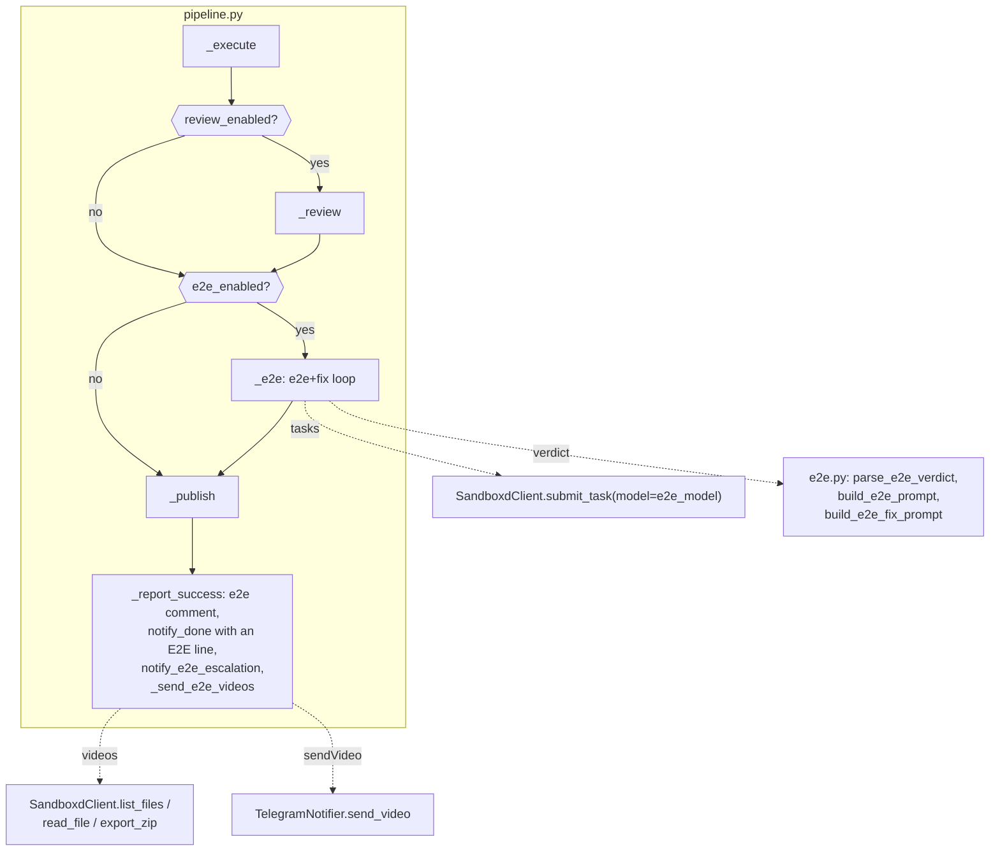

# Loop E2E (Phase 3) Implementation Plan

> **For agentic workers:** REQUIRED SUB-SKILL: Use `.claude/skills/parallel-plan-execution` (recommended, streams below) or superpowers:subagent-driven-development / superpowers:executing-plans to implement this plan task-by-task. Steps use checkbox (`- [ ]`) syntax for tracking.

**Goal:** Add an E2E check of the feature to the loop: after review, an E2E agent in the same sandbox writes Playwright scenarios from the spec via playwright-cli, runs them with video recording, a fix loop repairs failures, and the video of the main scenario (or of the failures) arrives in Telegram together with the verdict.

**Architecture:** A new `e2e_testing` state between `reviewing` and `publishing`; inside it a loop "E2E task → JSON verdict from `agent_message_final` → fix task" built on the phase-2 `_run_sandbox_task` machinery. Videos are pulled by the orchestrator through the sandboxd files/export API during `reporting` and sent to Telegram (`sendVideo`). Escalation and an E2E refusal do not block publication.

**Tech Stack:** Python 3.12, FastAPI, aiosqlite, httpx, pydantic-settings; pytest (`asyncio_mode="auto"`), respx, fakes from `tests/conftest.py`; stdlib `zipfile`/`io` for unpacking the export archive.

**Spec:** `docs/superpowers/specs/2026-08-01-loop-e2e-phase3-design.md` — the spec's Locked Decisions are binding.

## Locked Decisions

- **State `E2E_TESTING = "e2e_testing"`** between `REVIEWING` and `PUBLISHING`; transitions: `EXECUTING → {REVIEWING, E2E_TESTING, PUBLISHING, FAILED}`, `REVIEWING → {E2E_TESTING, PUBLISHING, FAILED}`, `E2E_TESTING → {PUBLISHING, FAILED}`.
- **Run/DB schema:** new columns `run_cmd TEXT`, `e2e_enabled INTEGER NOT NULL DEFAULT 0`, `e2e_max_iterations INTEGER NOT NULL DEFAULT 2`, `e2e_iteration INTEGER NOT NULL DEFAULT 0`, `e2e_status TEXT` (`passed|escalated|skipped|NULL`), `e2e_json TEXT`, `e2e_env_json TEXT`. Migration — `ALTER TABLE` driven by `PRAGMA table_info` (the VPS holds a live database).
- **Verdict (wire format):** JSON `{verdict: "passed"|"failed", summary: str, tests: [{title, status: "passed"|"failed", video: str|null}], main_video: str|null}` in the E2E task's `agent_message_final` (fallback `agent_message`).
- **`e2e_json` (report format in the DB):** `{"summary": str, "tests": [test...], "main_video": str|null}` — the loop's final verdict.
- **`.loop.yml` v1:** optional block `e2e: {enabled: bool = true, max_fix_iterations: int >= 0, env: map[str,str], services: <reserved>}`; block present → the step is on; `services` inside the block → immediate `failed` at `preparing` ("e2e.services is not supported yet"); e2e enabled with no `run` command and no `e2e.env` → `failed` at `preparing`.
- **Artifacts:** a `.loop/e2e/` directory in the workspace (`main.mp4`, `fail-<n>.*`); the E2E agent must add `.loop/` to `.gitignore` (otherwise the leftovers commit at `publishing` drags the videos into the PR); scenarios are committed to `e2e/` (or to the repo's existing Playwright structure).
- **Video delivery:** listing via `GET /v1/sandboxes/{id}/files?path=.loop/e2e`; a file ≤ 2 MiB — `files/content`; larger — a single `GET /v1/sandboxes/{id}/export` (zip); at most 3 videos, each ≤ 45 MB (constants `MAX_VIDEOS`, `MAX_VIDEO_BYTES` in `e2e.py`); mp4 — `sendVideo`, anything else — `sendDocument`; any video delivery error degrades to text and never fails the Run.
- **Settings:** `e2e_max_fix_iterations: int = 2`, `e2e_model: str = ""` (empty — the executor's default model); env prefix `LOOP_`.
- **Time budget:** `e2e_testing` gets a fresh `run.timeout_minutes` budget for the whole loop; individual tasks are capped at the same value; rate-limit pauses push the deadline out (the `_run_sandbox_task` mechanics).
- **Tooling:** playwright-cli (`@playwright/cli`); the skill, the CLI, chromium and ffmpeg are baked into a custom sandbox image (`SANDBOXD_IMAGE`, instance-wide) — a deploy step, Task 9.
- **Language:** prompts, PR comments, Telegram — English.

## Global Constraints

- No new dependencies (zip — stdlib `zipfile`); settings only through `Settings` (prefix `LOOP_`).
- Clients accept an optional `httpx.AsyncClient`; transient errors — `with_retries` (3 attempts).
- Code comments in English; async tests without decorators (`asyncio_mode="auto"`).
- Do not "improve" the sandboxd constraints from CLAUDE.md: push is host-side into a new branch, an app's branch is immutable, secrets are write-only, there is no exec API.

## Architecture (change overview)



**Streams for parallel-plan-execution** (disjoint file sets):
- Stream A: Task 1 (models/state_machine/db + their tests)
- Stream B: Task 2 (loopconfig + test_loopconfig)
- Stream C: Task 3 (config + test_config)
- Stream D: Task 4 (clients/sandboxd + test_sandboxd_client)
- Stream E: Task 5 (e2e.py + test_e2e.py — new files)
- Stream F (sequential, after A–E): Task 6 (telegram) → Task 7 (pipeline: prepare + e2e loop, conftest) → Task 8 (reporting + videos + worker)
- Task 9 — after all of them (deploy artifacts: sandbox image, docs).

---

### Task 1: The e2e_testing state — model, state machine, DB migration

**Files:**
- Modify: `src/loop_orchestrator/models.py`
- Modify: `src/loop_orchestrator/state_machine.py:16-23`
- Modify: `src/loop_orchestrator/db.py`
- Test: `tests/test_state_machine.py`, `tests/test_db.py`

**Interfaces:**
- Reuses: the `Run` dataclass and the state constants (`src/loop_orchestrator/models.py`), `TRANSITIONS`/`transition()` (`src/loop_orchestrator/state_machine.py`), `SCHEMA`/`_RUN_FIELDS`/`_MIGRATIONS`/`save_run` (`src/loop_orchestrator/db.py`), the `db` fixture from `tests/conftest.py`.
- Produces: the constant `E2E_TESTING = "e2e_testing"` (in `ACTIVE_STATES`); fields `Run.run_cmd: str | None = None`, `Run.e2e_enabled: bool = False`, `Run.e2e_max_iterations: int = 2`, `Run.e2e_iteration: int = 0`, `Run.e2e_status: str | None = None`, `Run.e2e_json: str | None = None`, `Run.e2e_env_json: str | None = None`; column migration on `db.connect()`.

- [x] **Step 1: Write failing tests**

Add to `tests/test_state_machine.py` (import `E2E_TESTING` from `loop_orchestrator.models`):

```python
async def test_executing_to_e2e_to_publishing(db):
    run = await dbmod.create_run(db, "o/r", 1, "b")
    run.state = EXECUTING
    await dbmod.save_run(db, run)
    await transition(db, run, E2E_TESTING)
    assert run.state == E2E_TESTING
    await transition(db, run, PUBLISHING)
    assert run.state == PUBLISHING


async def test_reviewing_to_e2e(db):
    run = await dbmod.create_run(db, "o/r", 1, "b")
    run.state = REVIEWING
    await dbmod.save_run(db, run)
    await transition(db, run, E2E_TESTING)
    assert run.state == E2E_TESTING


async def test_e2e_to_failed(db):
    run = await dbmod.create_run(db, "o/r", 1, "b")
    run.state = E2E_TESTING
    await dbmod.save_run(db, run)
    await transition(db, run, FAILED, detail="boom")
    assert run.state == FAILED


async def test_e2e_cannot_jump_to_done(db):
    run = await dbmod.create_run(db, "o/r", 1, "b")
    run.state = E2E_TESTING
    await dbmod.save_run(db, run)
    with pytest.raises(InvalidTransition):
        await transition(db, run, DONE)
```

Add to `tests/test_db.py`:

```python
async def test_e2e_fields_roundtrip(db):
    run = await dbmod.create_run(db, "o/r", 1, "b")
    run.run_cmd = "npm run dev"
    run.e2e_enabled = True
    run.e2e_max_iterations = 1
    run.e2e_iteration = 1
    run.e2e_status = "escalated"
    run.e2e_json = '{"summary": "s", "tests": [], "main_video": null}'
    run.e2e_env_json = '{"VITE_API_URL": "http://localhost:8000"}'
    await dbmod.save_run(db, run)
    got = await dbmod.get_run(db, run.id)
    assert got.run_cmd == "npm run dev"
    assert got.e2e_enabled
    assert got.e2e_max_iterations == 1
    assert got.e2e_iteration == 1
    assert got.e2e_status == "escalated"
    assert got.e2e_json == '{"summary": "s", "tests": [], "main_video": null}'
    assert got.e2e_env_json == '{"VITE_API_URL": "http://localhost:8000"}'


async def test_e2e_migration_on_old_db(tmp_path):
    # A phase-2 database (no e2e columns) must be upgraded by connect().
    import aiosqlite
    path = str(tmp_path / "old.db")
    conn = await aiosqlite.connect(path)
    await conn.execute(
        "CREATE TABLE runs (id INTEGER PRIMARY KEY AUTOINCREMENT, repo TEXT NOT NULL, "
        "pr_number INTEGER NOT NULL, head_branch TEXT NOT NULL, state TEXT NOT NULL, "
        "app_id TEXT, sandbox_id TEXT, task_id TEXT, spec_path TEXT, plan_path TEXT, "
        "prompt TEXT, timeout_minutes INTEGER NOT NULL DEFAULT 180, error TEXT, "
        "summary TEXT, test_cmd TEXT, review_enabled INTEGER NOT NULL DEFAULT 1, "
        "review_max_iterations INTEGER NOT NULL DEFAULT 2, "
        "review_iteration INTEGER NOT NULL DEFAULT 0, review_status TEXT, review_json TEXT, "
        "created_at TEXT NOT NULL DEFAULT (datetime('now')), "
        "updated_at TEXT NOT NULL DEFAULT (datetime('now')))")
    await conn.execute(
        "INSERT INTO runs (repo, pr_number, head_branch, state) VALUES ('o/r', 1, 'b', 'done')")
    await conn.commit()
    await conn.close()
    db2 = await dbmod.connect(path)
    got = await dbmod.get_run(db2, 1)
    assert got.e2e_enabled is False or got.e2e_enabled == 0
    assert got.e2e_status is None
    await db2.close()
```

- [x] **Step 2: Run the tests — confirm they fail**

Run: `python -m pytest tests/test_state_machine.py tests/test_db.py -v`
Expected: FAIL — `ImportError: cannot import name 'E2E_TESTING'` / `AttributeError: 'Run' object has no attribute 'run_cmd'`.

- [x] **Step 3: Implementation**

`src/loop_orchestrator/models.py` — add the constant, include it in `ACTIVE_STATES`, append the `Run` fields:

```python
E2E_TESTING = "e2e_testing"

ACTIVE_STATES = {QUEUED, PREPARING, EXECUTING, REVIEWING, E2E_TESTING, PUBLISHING, REPORTING}
```

At the end of the `Run` dataclass:

```python
    run_cmd: str | None = None
    e2e_enabled: bool = False
    e2e_max_iterations: int = 2
    e2e_iteration: int = 0
    e2e_status: str | None = None  # passed | escalated | skipped
    e2e_json: str | None = None
    e2e_env_json: str | None = None
```

`src/loop_orchestrator/state_machine.py` — import `E2E_TESTING`, update `TRANSITIONS`:

```python
TRANSITIONS: dict[str, set[str]] = {
    QUEUED: {PREPARING, FAILED},
    PREPARING: {EXECUTING, FAILED},
    EXECUTING: {REVIEWING, E2E_TESTING, PUBLISHING, FAILED},
    REVIEWING: {E2E_TESTING, PUBLISHING, FAILED},
    E2E_TESTING: {PUBLISHING, FAILED},
    PUBLISHING: {REPORTING, FAILED},
    REPORTING: {DONE, FAILED},
}
```

`src/loop_orchestrator/db.py` — in `SCHEMA` (inside `CREATE TABLE runs`, after `review_json TEXT,`):

```sql
  run_cmd TEXT,
  e2e_enabled INTEGER NOT NULL DEFAULT 0,
  e2e_max_iterations INTEGER NOT NULL DEFAULT 2,
  e2e_iteration INTEGER NOT NULL DEFAULT 0,
  e2e_status TEXT,
  e2e_json TEXT,
  e2e_env_json TEXT,
```

Add to `_RUN_FIELDS`: `"run_cmd", "e2e_enabled", "e2e_max_iterations", "e2e_iteration", "e2e_status", "e2e_json", "e2e_env_json"`.

Add to `_MIGRATIONS`:

```python
    ("run_cmd", "TEXT"),
    ("e2e_enabled", "INTEGER NOT NULL DEFAULT 0"),
    ("e2e_max_iterations", "INTEGER NOT NULL DEFAULT 2"),
    ("e2e_iteration", "INTEGER NOT NULL DEFAULT 0"),
    ("e2e_status", "TEXT"),
    ("e2e_json", "TEXT"),
    ("e2e_env_json", "TEXT"),
```

In `save_run` — extend the UPDATE (after `review_status=?, review_json=?,`):

```python
        """UPDATE runs SET state=?, app_id=?, sandbox_id=?, task_id=?, spec_path=?,
           plan_path=?, prompt=?, timeout_minutes=?, error=?, summary=?,
           test_cmd=?, review_enabled=?, review_max_iterations=?, review_iteration=?,
           review_status=?, review_json=?,
           run_cmd=?, e2e_enabled=?, e2e_max_iterations=?, e2e_iteration=?,
           e2e_status=?, e2e_json=?, e2e_env_json=?,
           updated_at=datetime('now') WHERE id=?""",
        (run.state, run.app_id, run.sandbox_id, run.task_id, run.spec_path,
         run.plan_path, run.prompt, run.timeout_minutes, run.error, run.summary,
         run.test_cmd, run.review_enabled, run.review_max_iterations,
         run.review_iteration, run.review_status, run.review_json,
         run.run_cmd, run.e2e_enabled, run.e2e_max_iterations, run.e2e_iteration,
         run.e2e_status, run.e2e_json, run.e2e_env_json, run.id),
```

- [x] **Step 4: Run the tests — green**

Run: `python -m pytest tests/test_state_machine.py tests/test_db.py -v`
Expected: PASS (all of them, the old ones included).

- [x] **Step 5: Commit**

```bash
git add src/loop_orchestrator/models.py src/loop_orchestrator/state_machine.py src/loop_orchestrator/db.py tests/test_state_machine.py tests/test_db.py
git commit -m "feat: e2e_testing state, Run e2e fields, db migration"
```

---

### Task 2: The e2e block in .loop.yml

**Files:**
- Modify: `src/loop_orchestrator/loopconfig.py`
- Test: `tests/test_loopconfig.py`

**Interfaces:**
- Reuses: `LoopConfig`, `parse_loop_config`, `LoopConfigError` (`src/loop_orchestrator/loopconfig.py`), the validation style of the `review` block (`loopconfig.py:47-56`).
- Produces: fields `LoopConfig.e2e_enabled: bool = False` (True only when the `e2e` block is present and `enabled != false`), `LoopConfig.e2e_max_fix_iterations: int | None = None`, `LoopConfig.e2e_env: dict[str, str]` (default `{}`), `LoopConfig.e2e_services: bool = False` (a flag that the reserved block is present).

- [x] **Step 1: Write failing tests**

Add to `tests/test_loopconfig.py`:

```python
def test_e2e_absent_disabled():
    cfg = parse_loop_config("specs_dir: docs/specs\n")
    assert cfg.e2e_enabled is False
    assert cfg.e2e_env == {}
    assert cfg.e2e_services is False


def test_e2e_block_enables():
    cfg = parse_loop_config(
        "specs_dir: docs/specs\nrun: npm run dev\n"
        "e2e:\n  env:\n    VITE_API_URL: http://localhost:8000\n")
    assert cfg.e2e_enabled is True
    assert cfg.e2e_env == {"VITE_API_URL": "http://localhost:8000"}
    assert cfg.e2e_max_fix_iterations is None


def test_e2e_explicit_disable():
    cfg = parse_loop_config("specs_dir: docs/specs\ne2e:\n  enabled: false\n")
    assert cfg.e2e_enabled is False


def test_e2e_max_fix_iterations():
    cfg = parse_loop_config("specs_dir: docs/specs\ne2e:\n  max_fix_iterations: 0\n")
    assert cfg.e2e_max_fix_iterations == 0


def test_e2e_bad_max_fix_iterations():
    with pytest.raises(LoopConfigError):
        parse_loop_config("specs_dir: docs/specs\ne2e:\n  max_fix_iterations: -1\n")


def test_e2e_bad_enabled():
    with pytest.raises(LoopConfigError):
        parse_loop_config("specs_dir: docs/specs\ne2e:\n  enabled: yes please\n")


def test_e2e_env_must_be_string_map():
    with pytest.raises(LoopConfigError):
        parse_loop_config("specs_dir: docs/specs\ne2e:\n  env:\n    PORT: 8000\n")


def test_e2e_services_flagged():
    cfg = parse_loop_config(
        "specs_dir: docs/specs\ne2e:\n  services:\n    - repo: o/backend\n")
    assert cfg.e2e_services is True


def test_e2e_not_a_mapping():
    with pytest.raises(LoopConfigError):
        parse_loop_config("specs_dir: docs/specs\ne2e: true\n")
```

- [x] **Step 2: Run them — they fail**

Run: `python -m pytest tests/test_loopconfig.py -v`
Expected: FAIL — `AttributeError: 'LoopConfig' object has no attribute 'e2e_enabled'`.

- [x] **Step 3: Implementation**

Add fields to `LoopConfig`:

```python
    e2e_enabled: bool = False
    e2e_max_fix_iterations: int | None = None
    e2e_env: dict[str, str] = field(default_factory=dict)
    e2e_services: bool = False
```

In `parse_loop_config`, after the `review` block validation:

```python
    e2e_raw = data.get("e2e")
    if e2e_raw is not None and not isinstance(e2e_raw, dict):
        raise LoopConfigError("e2e must be a mapping")
    e2e = e2e_raw or {}
    e2e_enabled = e2e.get("enabled", True)
    if not isinstance(e2e_enabled, bool):
        raise LoopConfigError("e2e.enabled must be a boolean")
    e2e_max = e2e.get("max_fix_iterations")
    if e2e_max is not None and (not isinstance(e2e_max, int)
                                or isinstance(e2e_max, bool) or e2e_max < 0):
        raise LoopConfigError("e2e.max_fix_iterations must be an integer >= 0")
    e2e_env = e2e.get("env") or {}
    if not (isinstance(e2e_env, dict)
            and all(isinstance(k, str) and isinstance(v, str) for k, v in e2e_env.items())):
        raise LoopConfigError("e2e.env must be a mapping of string to string")
```

Add to the `LoopConfig(...)` constructor in the `return`:

```python
        e2e_enabled=(e2e_raw is not None) and e2e_enabled,
        e2e_max_fix_iterations=e2e_max,
        e2e_env=e2e_env,
        e2e_services=e2e.get("services") is not None,
```

- [x] **Step 4: Run them — green**

Run: `python -m pytest tests/test_loopconfig.py -v`
Expected: PASS.

- [x] **Step 5: Commit**

```bash
git add src/loop_orchestrator/loopconfig.py tests/test_loopconfig.py
git commit -m "feat: parse e2e block of .loop.yml"
```

---

### Task 3: E2E settings

**Files:**
- Modify: `src/loop_orchestrator/config.py`
- Test: `tests/test_config.py`

**Interfaces:**
- Reuses: `Settings` (pydantic-settings, prefix `LOOP_`, `src/loop_orchestrator/config.py`).
- Produces: `Settings.e2e_max_fix_iterations: int = 2`, `Settings.e2e_model: str = ""`.

- [x] **Step 1: Write a failing test**

Add to `tests/test_config.py` (following the file's existing tests — the mandatory env fields are passed the same way):

```python
def test_e2e_settings_defaults(monkeypatch):
    for key, val in (("LOOP_GITHUB_TOKEN", "t"), ("LOOP_GITHUB_WEBHOOK_SECRET", "s"),
                     ("LOOP_TELEGRAM_BOT_TOKEN", "b"), ("LOOP_TELEGRAM_CHAT_ID", "1"),
                     ("LOOP_SANDBOXD_API_KEY", "k"), ("LOOP_GIT_CREDENTIAL_ID", "c")):
        monkeypatch.setenv(key, val)
    s = Settings(_env_file=None)
    assert s.e2e_max_fix_iterations == 2
    assert s.e2e_model == ""
```

- [x] **Step 2: Run it — it fails**

Run: `python -m pytest tests/test_config.py -v`
Expected: FAIL — `AttributeError: 'Settings' object has no attribute 'e2e_max_fix_iterations'`.

- [x] **Step 3: Implementation**

At the end of `Settings`:

```python
    e2e_max_fix_iterations: int = 2
    e2e_model: str = ""  # empty = the executor's default model
```

- [x] **Step 4: Run them — green**

Run: `python -m pytest tests/test_config.py -v`
Expected: PASS.

- [x] **Step 5: Commit**

```bash
git add src/loop_orchestrator/config.py tests/test_config.py
git commit -m "feat: e2e settings (max fix iterations, model)"
```

---

### Task 4: SandboxdClient — the files and export API

**Files:**
- Modify: `src/loop_orchestrator/clients/sandboxd.py`
- Test: `tests/test_sandboxd_client.py`

**Interfaces:**
- Reuses: `SandboxdClient._req` (the retry wrapper, `clients/sandboxd.py:25-31`), the respx pattern of the existing tests in `tests/test_sandboxd_client.py`.
- Produces: `SandboxdClient.list_files(sandbox_id: str, path: str = "", recursive: bool = False) -> list[dict]` (entries `{path, type, size}`; 404 → `[]`); `SandboxdClient.read_file(sandbox_id: str, path: str) -> bytes | None` (400/404 → `None`); `SandboxdClient.export_zip(sandbox_id: str) -> bytes`.

- [x] **Step 1: Write failing tests**

Add to `tests/test_sandboxd_client.py` (respx routes on the base URL, as in the file's existing tests):

```python
@respx.mock
async def test_list_files():
    respx.get("http://sb/v1/sandboxes/sb1/files").respond(200, json={
        "path": ".loop/e2e", "recursive": False,
        "entries": [{"path": ".loop/e2e/main.mp4", "type": "file", "size": 1024}]})
    c = SandboxdClient("http://sb", "key")
    entries = await c.list_files("sb1", ".loop/e2e")
    assert entries == [{"path": ".loop/e2e/main.mp4", "type": "file", "size": 1024}]
    await c.aclose()


@respx.mock
async def test_list_files_missing_dir_is_empty():
    respx.get("http://sb/v1/sandboxes/sb1/files").respond(404, json={"error": {}})
    c = SandboxdClient("http://sb", "key")
    assert await c.list_files("sb1", ".loop/e2e") == []
    await c.aclose()


@respx.mock
async def test_read_file_bytes():
    respx.get("http://sb/v1/sandboxes/sb1/files/content").respond(200, content=b"\x00video")
    c = SandboxdClient("http://sb", "key")
    assert await c.read_file("sb1", ".loop/e2e/main.mp4") == b"\x00video"
    await c.aclose()


@respx.mock
async def test_read_file_missing_or_too_big_is_none():
    respx.get("http://sb/v1/sandboxes/sb1/files/content").respond(400, json={"error": {}})
    c = SandboxdClient("http://sb", "key")
    assert await c.read_file("sb1", ".loop/e2e/huge.mp4") is None
    await c.aclose()


@respx.mock
async def test_export_zip():
    respx.get("http://sb/v1/sandboxes/sb1/export").respond(200, content=b"PK\x03\x04zipbytes")
    c = SandboxdClient("http://sb", "key")
    assert (await c.export_zip("sb1")).startswith(b"PK")
    await c.aclose()
```

- [x] **Step 2: Run them — they fail**

Run: `python -m pytest tests/test_sandboxd_client.py -v`
Expected: FAIL — `AttributeError: 'SandboxdClient' object has no attribute 'list_files'`.

- [x] **Step 3: Implementation**

At the end of `SandboxdClient`:

```python
    async def list_files(self, sandbox_id: str, path: str = "",
                         recursive: bool = False) -> list[dict]:
        params = {"path": path}
        if recursive:
            params["recursive"] = "true"
        r = await self._req("GET", f"/v1/sandboxes/{sandbox_id}/files", params=params)
        if r.status_code == 404:
            return []
        r.raise_for_status()
        return r.json().get("entries") or []

    async def read_file(self, sandbox_id: str, path: str) -> bytes | None:
        # files/content caps single reads at 2 MiB (sandboxd) — larger files
        # must go through export_zip.
        r = await self._req("GET", f"/v1/sandboxes/{sandbox_id}/files/content",
                            params={"path": path})
        if r.status_code in (400, 404):
            return None
        r.raise_for_status()
        return r.content

    async def export_zip(self, sandbox_id: str) -> bytes:
        r = await self._req("GET", f"/v1/sandboxes/{sandbox_id}/export")
        r.raise_for_status()
        return r.content
```

- [x] **Step 4: Run them — green**

Run: `python -m pytest tests/test_sandboxd_client.py -v`
Expected: PASS.

- [x] **Step 5: Commit**

```bash
git add src/loop_orchestrator/clients/sandboxd.py tests/test_sandboxd_client.py
git commit -m "feat: sandboxd files list/read and workspace export"
```

---

### Task 5: The e2e.py module — the E2E protocol

**Files:**
- Create: `src/loop_orchestrator/e2e.py`
- Test: `tests/test_e2e.py` (new file)

**Interfaces:**
- Reuses: the `review.py` pattern (JSON regex, verdict schema, prompt builders, PR comment format — `src/loop_orchestrator/review.py`); stdlib `zipfile`/`io`.
- Produces: `E2EVerdictError`; `E2ETest(title: str, status: str, video: str | None = None)`; `E2EVerdict(verdict: str, summary: str, tests: list[E2ETest], main_video: str | None)`; `parse_e2e_verdict(text: str) -> E2EVerdict`; `build_e2e_prompt(spec_path: str, run_cmd: str | None, e2e_env: dict[str, str]) -> str`; `build_e2e_fix_prompt(verdict: E2EVerdict, test_cmd: str | None) -> str`; `e2e_report_dict(summary: str, verdict: E2EVerdict | None) -> dict`; `select_video_paths(status: str, report: dict) -> list[str]`; `extract_from_zip(archive: bytes, paths: list[str]) -> dict[str, bytes]`; `format_e2e_comment(status: str, iterations: int, report: dict) -> str`; constants `E2E_DIR = ".loop/e2e"`, `MAX_VIDEOS = 3`, `MAX_VIDEO_BYTES = 45 * 1024 * 1024`.

- [x] **Step 1: Write failing tests**

Create `tests/test_e2e.py`:

```python
"""e2e.py protocol: verdict parsing, prompts, video selection, zip extraction."""
import io
import json
import zipfile

import pytest

from loop_orchestrator.e2e import (
    E2E_DIR,
    MAX_VIDEO_BYTES,
    MAX_VIDEOS,
    E2ETest,
    E2EVerdict,
    E2EVerdictError,
    build_e2e_fix_prompt,
    build_e2e_prompt,
    e2e_report_dict,
    extract_from_zip,
    format_e2e_comment,
    parse_e2e_verdict,
    select_video_paths,
)

PASSED_JSON = json.dumps({
    "verdict": "passed", "summary": "all good",
    "tests": [{"title": "signup flow", "status": "passed", "video": ".loop/e2e/main.mp4"}],
    "main_video": ".loop/e2e/main.mp4"})


def test_parse_passed_verdict():
    v = parse_e2e_verdict(f"some preamble\n{PASSED_JSON}")
    assert v.verdict == "passed"
    assert v.main_video == ".loop/e2e/main.mp4"
    assert v.tests[0].title == "signup flow"
    assert v.tests[0].status == "passed"


def test_parse_failed_verdict():
    v = parse_e2e_verdict(json.dumps({
        "verdict": "failed", "summary": "broken",
        "tests": [{"title": "login", "status": "failed", "video": ".loop/e2e/fail-1.mp4"},
                  {"title": "logout", "status": "passed", "video": None}],
        "main_video": None}))
    assert v.verdict == "failed"
    assert [t.status for t in v.tests] == ["failed", "passed"]


def test_parse_rejects_no_json():
    with pytest.raises(E2EVerdictError):
        parse_e2e_verdict("no json here")


def test_parse_rejects_bad_verdict_value():
    with pytest.raises(E2EVerdictError):
        parse_e2e_verdict('{"verdict": "maybe", "summary": "", "tests": []}')


def test_parse_rejects_test_without_title():
    with pytest.raises(E2EVerdictError):
        parse_e2e_verdict('{"verdict": "failed", "tests": [{"status": "failed"}]}')


def test_prompt_in_sandbox_mode():
    p = build_e2e_prompt("docs/specs/x-design.md", "npm run dev",
                         {"VITE_API_URL": "http://localhost:8000"})
    assert "docs/specs/x-design.md" in p
    assert "npm run dev" in p
    assert "VITE_API_URL=http://localhost:8000" in p
    assert ".loop/e2e" in p
    assert ".gitignore" in p
    assert "playwright-cli" in p
    assert "Do not git push" in p


def test_prompt_staging_mode():
    p = build_e2e_prompt("docs/specs/x-design.md", None, {"E2E_BASE_URL": "https://stage.app"})
    assert "already deployed" in p
    assert "E2E_BASE_URL=https://stage.app" in p


def test_fix_prompt_lists_only_failing():
    v = E2EVerdict(verdict="failed", summary="s", main_video=None, tests=[
        E2ETest(title="login", status="failed", video=None),
        E2ETest(title="logout", status="passed", video=None)])
    p = build_e2e_fix_prompt(v, "npm test")
    assert "login" in p
    assert "logout" not in p
    assert "npm test" in p
    assert "Do not weaken" in p


def test_report_dict_roundtrip():
    v = parse_e2e_verdict(PASSED_JSON)
    d = e2e_report_dict("all good", v)
    assert d["main_video"] == ".loop/e2e/main.mp4"
    assert d["tests"][0]["title"] == "signup flow"
    assert e2e_report_dict("nothing", None) == {"summary": "nothing", "tests": [],
                                                "main_video": None}


def test_select_videos_passed():
    report = {"summary": "s", "main_video": ".loop/e2e/main.mp4",
              "tests": [{"title": "t", "status": "passed", "video": ".loop/e2e/main.mp4"}]}
    assert select_video_paths("passed", report) == [".loop/e2e/main.mp4"]


def test_select_videos_escalated_caps_at_max():
    tests = [{"title": f"t{i}", "status": "failed", "video": f".loop/e2e/fail-{i}.mp4"}
             for i in range(5)]
    report = {"summary": "s", "main_video": None, "tests": tests}
    got = select_video_paths("escalated", report)
    assert len(got) == MAX_VIDEOS
    assert got[0] == ".loop/e2e/fail-0.mp4"


def test_select_videos_skipped_is_empty():
    assert select_video_paths("skipped", {"summary": "s", "tests": [],
                                          "main_video": None}) == []


def test_extract_from_zip():
    buf = io.BytesIO()
    with zipfile.ZipFile(buf, "w") as zf:
        zf.writestr(".loop/e2e/main.mp4", b"vid")
        zf.writestr("src/app.py", b"code")
    got = extract_from_zip(buf.getvalue(), [".loop/e2e/main.mp4", ".loop/e2e/gone.mp4"])
    assert got == {".loop/e2e/main.mp4": b"vid"}


def test_format_comment_has_table_and_verdict():
    report = {"summary": "looks solid",
              "tests": [{"title": "signup", "status": "passed", "video": None},
                        {"title": "login", "status": "failed", "video": None}],
              "main_video": None}
    c = format_e2e_comment("escalated", 2, report)
    assert "failures remain" in c
    assert "| signup |" in c
    assert "❌" in c and "✅" in c
    assert "2 fix iteration(s)" in c
```

- [x] **Step 2: Run them — they fail**

Run: `python -m pytest tests/test_e2e.py -v`
Expected: FAIL — `ModuleNotFoundError: No module named 'loop_orchestrator.e2e'`.

- [x] **Step 3: Implementation**

Create `src/loop_orchestrator/e2e.py`:

```python
"""E2E verdict protocol: prompts, JSON verdict parsing, video selection, PR comment."""
import io
import json
import re
import zipfile
from dataclasses import asdict, dataclass, field

E2E_DIR = ".loop/e2e"
MAX_VIDEOS = 3
MAX_VIDEO_BYTES = 45 * 1024 * 1024  # Telegram bot uploads are capped at 50 MB


class E2EVerdictError(Exception):
    pass


@dataclass
class E2ETest:
    title: str
    status: str  # "passed" | "failed"
    video: str | None = None


@dataclass
class E2EVerdict:
    verdict: str  # "passed" | "failed"
    summary: str = ""
    tests: list[E2ETest] = field(default_factory=list)
    main_video: str | None = None


_JSON_RE = re.compile(r"\{.*\}", re.DOTALL)

E2E_VERDICT_SCHEMA = """{
  "verdict": "passed | failed",
  "summary": "1-2 sentence overall assessment",
  "tests": [
    {"title": "scenario name", "status": "passed | failed",
     "video": ".loop/e2e/<file> or null"}
  ],
  "main_video": ".loop/e2e/main.mp4 or null"
}"""


def parse_e2e_verdict(text: str) -> E2EVerdict:
    m = _JSON_RE.search(text or "")
    if not m:
        raise E2EVerdictError("no JSON object in the e2e agent message")
    try:
        data = json.loads(m.group(0))
    except json.JSONDecodeError as e:
        raise E2EVerdictError(f"invalid e2e verdict JSON: {e}") from e
    verdict = data.get("verdict")
    if verdict not in ("passed", "failed"):
        raise E2EVerdictError(f"unknown e2e verdict value: {verdict!r}")
    tests: list[E2ETest] = []
    for raw in data.get("tests") or []:
        if not isinstance(raw, dict) or not raw.get("title"):
            raise E2EVerdictError(f"test entry without title: {raw!r}")
        status = raw.get("status")
        if status not in ("passed", "failed"):
            raise E2EVerdictError(f"unknown test status: {status!r}")
        video = raw.get("video")
        tests.append(E2ETest(title=str(raw["title"]), status=status,
                             video=str(video) if video else None))
    main_video = data.get("main_video")
    return E2EVerdict(verdict=verdict, summary=str(data.get("summary") or ""),
                      tests=tests, main_video=str(main_video) if main_video else None)


def build_e2e_prompt(spec_path: str, run_cmd: str | None, e2e_env: dict[str, str]) -> str:
    env_lines = "\n".join(f"  {k}={v}" for k, v in e2e_env.items()) or "  (none)"
    if run_cmd:
        env_block = (
            "Start the application yourself: export the environment variables "
            f"below, run `{run_cmd}` in the background, and wait until it is ready.\n"
            f"Environment variables:\n{env_lines}\n")
    else:
        env_block = (
            "The application under test is already deployed externally; use the "
            f"environment variables below to locate it.\nEnvironment variables:\n{env_lines}\n")
    return (
        "You are an end-to-end tester for this repository. Verify, as a real user "
        "would, that the feature described in the specification works in the "
        "running application.\n"
        f"Specification: {spec_path}\n\n"
        + env_block +
        "\nUse the playwright-cli skill for all browser work: explore the feature "
        "interactively first, then write Playwright test scenarios.\n\n"
        "Requirements:\n"
        "1. Write Playwright e2e tests covering the feature's main user scenario "
        "and its critical paths, guided by the specification. If the repository "
        "already has a Playwright setup, follow its structure; otherwise create "
        "`e2e/` with a `playwright.config.*`. Enable video recording; use headless "
        "chromium.\n"
        "2. Run the tests.\n"
        f"3. Copy the selected artifacts into `{E2E_DIR}/`:\n"
        f"   - `{E2E_DIR}/main.mp4` — a video of the main scenario working end-to-end "
        "(convert webm to mp4 with ffmpeg; keep it short, ~60-90s, 1280x720)\n"
        f"   - `{E2E_DIR}/fail-<n>.<ext>` — videos of failing tests (at most "
        f"{MAX_VIDEOS})\n"
        "4. Make sure `.gitignore` contains a `.loop/` entry (add one if missing).\n"
        "5. Commit the test scenarios and the .gitignore change. Do not commit "
        "`.loop/`. Do not git push. Do not switch branches.\n"
        "For an API-only feature without a UI, write Playwright request-based tests "
        'instead; then there are no videos and "main_video" must be null.\n\n'
        "Your FINAL message must be a single JSON object and nothing else, "
        "matching exactly this schema:\n"
        f"{E2E_VERDICT_SCHEMA}"
    )


def build_e2e_fix_prompt(verdict: E2EVerdict, test_cmd: str | None) -> str:
    failing = [asdict(t) for t in verdict.tests if t.status == "failed"]
    test_line = (f"After fixing, run the unit tests with `{test_cmd}` — they must pass.\n"
                 if test_cmd else "")
    return (
        "End-to-end tests found that the feature does not fully work as specified.\n"
        "Fix the application code so the scenarios below pass.\n"
        "Do not weaken or delete tests to make them pass; only change a test if it "
        "contradicts the specification.\n"
        "Make a git commit after the fixes. Do not git push. Do not switch branches.\n"
        + test_line +
        "Failing scenarios (JSON):\n"
        + json.dumps(failing, ensure_ascii=False, indent=2) + "\n"
        "Finish with a short summary of what you changed."
    )


def e2e_report_dict(summary: str, verdict: E2EVerdict | None) -> dict:
    if verdict is None:
        return {"summary": summary, "tests": [], "main_video": None}
    return {"summary": summary,
            "tests": [asdict(t) for t in verdict.tests],
            "main_video": verdict.main_video}


def select_video_paths(status: str, report: dict) -> list[str]:
    if status == "passed":
        return [report["main_video"]] if report.get("main_video") else []
    if status == "escalated":
        vids = [t["video"] for t in report.get("tests") or []
                if t.get("status") == "failed" and t.get("video")]
        return vids[:MAX_VIDEOS]
    return []


def extract_from_zip(archive: bytes, paths: list[str]) -> dict[str, bytes]:
    out: dict[str, bytes] = {}
    with zipfile.ZipFile(io.BytesIO(archive)) as zf:
        names = set(zf.namelist())
        for p in paths:
            if p in names:
                out[p] = zf.read(p)
    return out


_E2E_LINES = {"passed": "✅ passed",
              "escalated": "⚠️ failures remain",
              "skipped": "⛔ e2e skipped"}


def format_e2e_comment(status: str, iterations: int, report: dict) -> str:
    lines = ["**🤖 loop-orchestrator — e2e (playwright-cli)**", "",
             f"**Verdict: {_E2E_LINES[status]}** ({iterations} fix iteration(s))"]
    if report.get("summary"):
        lines += ["", report["summary"]]
    tests = report.get("tests") or []
    if tests:
        lines += ["", "| Scenario | Status |", "|---|---|"]
        lines += [f"| {t['title']} | "
                  f"{'✅' if t['status'] == 'passed' else '❌'} {t['status']} |"
                  for t in tests]
    return "\n".join(lines)
```

- [x] **Step 4: Run them — green**

Run: `python -m pytest tests/test_e2e.py -v`
Expected: PASS.

- [x] **Step 5: Commit**

```bash
git add src/loop_orchestrator/e2e.py tests/test_e2e.py
git commit -m "feat: e2e protocol module — verdict, prompts, video selection"
```

---

### Task 6: TelegramNotifier — send_video and E2E notifications

**Files:**
- Modify: `src/loop_orchestrator/clients/telegram.py`
- Test: `tests/test_telegram.py`

**Interfaces:**
- Reuses: `TelegramNotifier.send` / `send_rich_markdown` / the retry ladder (`clients/telegram.py`), the respx pattern of `tests/test_telegram.py`, the `notify_done` review line (`telegram.py:66-86`).
- Consumes: `Run.e2e_status`, `Run.e2e_iteration` (Task 1).
- Produces: `TelegramNotifier.send_video(video: bytes, filename: str, caption: str) -> None` (mp4 → `sendVideo`, anything else → `sendDocument`; failure after retries → a text fallback through `send`); `TelegramNotifier.notify_e2e_escalation(run: Run, failed: int) -> None`; the E2E line in `notify_done`.

- [x] **Step 1: Write failing tests**

Add to `tests/test_telegram.py` (base URL and notifier construction as in the file's existing tests):

```python
@respx.mock
async def test_send_video_mp4_uses_sendvideo():
    route = respx.post("https://api.telegram.org/bottok/sendVideo").respond(
        200, json={"ok": True})
    tg = TelegramNotifier("tok", 42)
    await tg.send_video(b"\x00vid", "main.mp4", "Run #1 e2e")
    assert route.called
    body = route.calls[0].request.content
    assert b"main.mp4" in body
    await tg.aclose()


@respx.mock
async def test_send_video_webm_uses_senddocument():
    route = respx.post("https://api.telegram.org/bottok/sendDocument").respond(
        200, json={"ok": True})
    tg = TelegramNotifier("tok", 42)
    await tg.send_video(b"\x00vid", "fail-1.webm", "Run #1 e2e failure")
    assert route.called
    await tg.aclose()


@respx.mock
async def test_send_video_falls_back_to_text():
    respx.post("https://api.telegram.org/bottok/sendVideo").respond(500)
    fallback = respx.post("https://api.telegram.org/bottok/sendMessage").respond(
        200, json={"ok": True})
    tg = TelegramNotifier("tok", 42)
    await tg.send_video(b"\x00vid", "main.mp4", "Run #1 e2e")
    assert fallback.called
    await tg.aclose()


@respx.mock
async def test_notify_done_mentions_e2e():
    route = respx.post("https://api.telegram.org/bottok/sendRichMessage").respond(
        200, json={"ok": True})
    tg = TelegramNotifier("tok", 42)
    run = Run(id=7, repo="o/r", pr_number=1, head_branch="b", state="reporting",
              summary="done", e2e_status="passed", e2e_iteration=1)
    await tg.notify_done(run)
    sent = route.calls[0].request.content.decode()
    assert "E2E: passed" in sent
    await tg.aclose()


@respx.mock
async def test_notify_e2e_escalation():
    route = respx.post("https://api.telegram.org/bottok/sendRichMessage").respond(
        200, json={"ok": True})
    tg = TelegramNotifier("tok", 42)
    run = Run(id=7, repo="o/r", pr_number=1, head_branch="b", state="reporting",
              e2e_status="escalated", e2e_iteration=2)
    await tg.notify_e2e_escalation(run, 3)
    sent = route.calls[0].request.content.decode()
    assert "3" in sent and "e2e" in sent.lower()
    await tg.aclose()
```

If `Run` is not imported in the file yet — add `from loop_orchestrator.models import Run`.

- [x] **Step 2: Run them — they fail**

Run: `python -m pytest tests/test_telegram.py -v`
Expected: FAIL — `AttributeError: 'TelegramNotifier' object has no attribute 'send_video'`.

- [x] **Step 3: Implementation**

Add to `TelegramNotifier`:

```python
    async def send_video(self, video: bytes, filename: str, caption: str) -> None:
        """Upload a video (mp4 plays inline; anything else goes as a document).
        Delivery failures degrade to a text message — never fail the run."""
        is_mp4 = filename.endswith(".mp4")
        method = "/sendVideo" if is_mp4 else "/sendDocument"
        part = "video" if is_mp4 else "document"
        mime = "video/mp4" if is_mp4 else "application/octet-stream"

        async def call() -> None:
            r = await self._http.post(
                method,
                data={"chat_id": str(self.chat_id), "caption": caption[:1000]},
                files={part: (filename, video, mime)})
            r.raise_for_status()
        try:
            await with_retries(call)
        except Exception:
            await self.send(f"{caption}\n⚠️ video upload failed")
```

In `notify_done`, after the `review_line` block, add the line and wire it into both text variants:

```python
        e2e_line = ""
        if run.e2e_status == "passed":
            e2e_line = f"E2E: passed ({run.e2e_iteration} fix iteration(s))\n"
        elif run.e2e_status == "escalated":
            e2e_line = "E2E: failures remain — see the PR comment\n"
        elif run.e2e_status == "skipped":
            e2e_line = "E2E: skipped (see the PR note)\n"
```

In the markdown variant: `f"...{review_line}{e2e_line}\n{summary_md}"`; in the HTML variant's `head` likewise: `head = f"✅ Run #{run.id} finished: {self._link(run)}\n{review_line}{e2e_line}"`.

A new method modelled on `notify_review_escalation`:

```python
    async def notify_e2e_escalation(self, run: Run, failed: int) -> None:
        body = (f"⚠️ Run #{run.id}: e2e is not green after {run.e2e_iteration} "
                f"fix iteration(s), {failed} failing scenario(s) — "
                f"your attention is needed: %s")
        await self.send_rich_markdown(
            body % self._md_link(run), fallback_html=body % self._link(run))
```

- [x] **Step 4: Run them — green**

Run: `python -m pytest tests/test_telegram.py -v`
Expected: PASS.

- [x] **Step 5: Commit**

```bash
git add src/loop_orchestrator/clients/telegram.py tests/test_telegram.py
git commit -m "feat: telegram video upload and e2e notifications"
```

---

### Task 7: Pipeline — validation at prepare and the _e2e loop

**Files:**
- Modify: `src/loop_orchestrator/pipeline.py`
- Modify: `tests/conftest.py`
- Test: `tests/test_pipeline_prepare.py`, `tests/test_pipeline_e2e.py` (new file)

**Interfaces:**
- Reuses: `_run_sandbox_task` / `ReviewTaskError` / `ReviewDeadline` / `MAX_TASK_TIMEOUT_S` (`pipeline.py`), the `_review`/`_finish_review` pattern (`pipeline.py:243-300`), the fakes `FakeGitHub`/`FakeSandboxd`/`FakeTG`/`FakeSettings` (`tests/conftest.py`).
- Consumes: Task 1 (`E2E_TESTING`, the Run fields), Task 2 (`LoopConfig.e2e_*`), Task 3 (`Settings.e2e_*`), Task 5 (`build_e2e_prompt`, `build_e2e_fix_prompt`, `parse_e2e_verdict`, `e2e_report_dict`, `E2EVerdictError`).
- Produces: `Pipeline._e2e(run: Run) -> None`; `Pipeline._finish_e2e(run: Run, status: str, summary: str, verdict: E2EVerdict | None) -> None`; e2e validation and Run field population in `_prepare`; branching in `process()` through `E2E_TESTING`.

- [x] **Step 1: Update the conftest fakes**

In `tests/conftest.py`:

`FakeSandboxd.__init__` — add:

```python
        self.files: list[dict] = []            # list_files entries
        self.file_contents: dict[str, bytes] = {}
        self.export_bytes: bytes = b""
```

`FakeSandboxd` methods:

```python
    async def list_files(self, sandbox_id, path="", recursive=False):
        return self.files

    async def read_file(self, sandbox_id, path):
        return self.file_contents.get(path)

    async def export_zip(self, sandbox_id):
        return self.export_bytes
```

`FakeTG.__init__` — add `self.videos: list[tuple[str, str]] = []` and `self.video_error: Exception | None = None`; methods:

```python
    async def send_video(self, video, filename, caption):
        if self.video_error:
            raise self.video_error
        self.videos.append((filename, caption))

    async def notify_e2e_escalation(self, run, failed):
        self.sent.append(f"e2e-escalation:{run.id}:{failed}")
```

`FakeSettings` — add:

```python
    e2e_max_fix_iterations = 2
    e2e_model = ""
```

- [x] **Step 2: Write failing prepare tests**

Add to `tests/test_pipeline_prepare.py` (Pipeline/Run construction and filling `gh.files`/`gh.pr_files` follow the file's existing tests; `.loop.yml` goes into `gh.files[".loop.yml"]`):

```python
E2E_YML = (
    "specs_dir: docs/specs\nrun: npm run dev\n"
    "e2e:\n  env:\n    VITE_API_URL: http://localhost:8000\n")

SERVICES_YML = (
    "specs_dir: docs/specs\nrun: npm run dev\n"
    "e2e:\n  services:\n    - repo: o/backend\n")

E2E_NO_TARGET_YML = "specs_dir: docs/specs\ne2e: {}\n"


async def test_prepare_fills_e2e_fields(db, tmp_path):
    gh, sb, tg = FakeGitHub(), FakeSandboxd(), FakeTG()
    settings = FakeSettings()
    settings.secrets_dir = str(tmp_path)
    gh.files[".loop.yml"] = E2E_YML
    gh.pr_files = ["docs/specs/2026-08-01-f-design.md", "docs/plans/2026-08-01-f.md"]
    p = Pipeline(db, settings, gh, sb, tg)
    run = await dbmod.create_run(db, "o/r", 1, "feat")
    await p._prepare(run)
    assert run.e2e_enabled is True
    assert run.run_cmd == "npm run dev"
    assert json.loads(run.e2e_env_json) == {"VITE_API_URL": "http://localhost:8000"}
    assert run.e2e_max_iterations == 2


async def test_prepare_rejects_services(db, tmp_path):
    gh, sb, tg = FakeGitHub(), FakeSandboxd(), FakeTG()
    settings = FakeSettings()
    settings.secrets_dir = str(tmp_path)
    gh.files[".loop.yml"] = SERVICES_YML
    gh.pr_files = ["docs/specs/2026-08-01-f-design.md", "docs/plans/2026-08-01-f.md"]
    p = Pipeline(db, settings, gh, sb, tg)
    run = await dbmod.create_run(db, "o/r", 1, "feat")
    with pytest.raises(RunFailure, match="e2e.services is not supported yet"):
        await p._prepare(run)


async def test_prepare_rejects_e2e_without_target(db, tmp_path):
    gh, sb, tg = FakeGitHub(), FakeSandboxd(), FakeTG()
    settings = FakeSettings()
    settings.secrets_dir = str(tmp_path)
    gh.files[".loop.yml"] = E2E_NO_TARGET_YML
    gh.pr_files = ["docs/specs/2026-08-01-f-design.md", "docs/plans/2026-08-01-f.md"]
    p = Pipeline(db, settings, gh, sb, tg)
    run = await dbmod.create_run(db, "o/r", 1, "feat")
    with pytest.raises(RunFailure, match="neither a run command nor e2e.env"):
        await p._prepare(run)


async def test_prepare_accepts_staging_mode(db, tmp_path):
    # No run command, but e2e.env points at an external stand — valid.
    gh, sb, tg = FakeGitHub(), FakeSandboxd(), FakeTG()
    settings = FakeSettings()
    settings.secrets_dir = str(tmp_path)
    gh.files[".loop.yml"] = (
        "specs_dir: docs/specs\n"
        "e2e:\n  env:\n    E2E_BASE_URL: https://stage.app\n")
    gh.pr_files = ["docs/specs/2026-08-01-f-design.md", "docs/plans/2026-08-01-f.md"]
    p = Pipeline(db, settings, gh, sb, tg)
    run = await dbmod.create_run(db, "o/r", 1, "feat")
    await p._prepare(run)
    assert run.e2e_enabled is True
    assert run.run_cmd is None
    assert json.loads(run.e2e_env_json) == {"E2E_BASE_URL": "https://stage.app"}


async def test_prepare_no_e2e_block_disables(db, tmp_path):
    gh, sb, tg = FakeGitHub(), FakeSandboxd(), FakeTG()
    settings = FakeSettings()
    settings.secrets_dir = str(tmp_path)
    gh.files[".loop.yml"] = "specs_dir: docs/specs\n"
    gh.pr_files = ["docs/specs/2026-08-01-f-design.md", "docs/plans/2026-08-01-f.md"]
    p = Pipeline(db, settings, gh, sb, tg)
    run = await dbmod.create_run(db, "o/r", 1, "feat")
    await p._prepare(run)
    assert run.e2e_enabled is False
```

Extend the file's imports as needed: `json`, `pytest`, `RunFailure`, the fakes.

- [x] **Step 3: Write failing tests for the _e2e loop**

Create `tests/test_pipeline_e2e.py`:

```python
"""The _e2e cycle: verdicts, fix iterations, escalation, skip, deadline."""
import json

from loop_orchestrator import db as dbmod
from loop_orchestrator.models import E2E_TESTING
from loop_orchestrator.pipeline import Pipeline

from .conftest import FakeGitHub, FakeSandboxd, FakeSettings, FakeTG

PASSED = json.dumps({"verdict": "passed", "summary": "works",
                     "tests": [{"title": "main", "status": "passed",
                                "video": ".loop/e2e/main.mp4"}],
                     "main_video": ".loop/e2e/main.mp4"})
FAILED_V = json.dumps({"verdict": "failed", "summary": "broken",
                       "tests": [{"title": "main", "status": "failed",
                                  "video": ".loop/e2e/fail-1.mp4"}],
                       "main_video": None})


def make_pipeline(db):
    gh, sb, tg = FakeGitHub(), FakeSandboxd(), FakeTG()
    return Pipeline(db, FakeSettings(), gh, sb, tg), gh, sb, tg


async def make_e2e_run(db, **overrides):
    run = await dbmod.create_run(db, "o/r", 1, "feat")
    run.state = E2E_TESTING
    run.sandbox_id = "sb-1"
    run.spec_path = "docs/specs/f-design.md"
    run.run_cmd = "npm run dev"
    run.e2e_enabled = True
    run.e2e_max_iterations = overrides.pop("e2e_max_iterations", 2)
    run.timeout_minutes = overrides.pop("timeout_minutes", 30)
    run.test_cmd = "npm test"
    for k, v in overrides.items():
        setattr(run, k, v)
    await dbmod.save_run(db, run)
    return run


async def test_e2e_passed_first_try(db):
    p, gh, sb, tg = make_pipeline(db)
    run = await make_e2e_run(db)
    sb.task_results = [{"status": "succeeded", "agent_message_final": PASSED}]
    await p._e2e(run)
    assert run.e2e_status == "passed"
    assert run.e2e_iteration == 0
    report = json.loads(run.e2e_json)
    assert report["main_video"] == ".loop/e2e/main.mp4"
    assert len(sb.tasks_submitted) == 1
    assert sb.tasks_submitted[0]["model"] is None  # e2e_model="" -> executor default


async def test_e2e_fix_cycle_then_passed(db):
    p, gh, sb, tg = make_pipeline(db)
    run = await make_e2e_run(db)
    sb.task_results = [
        {"status": "succeeded", "agent_message_final": FAILED_V},   # e2e run 1
        {"status": "succeeded", "agent_message_final": "fixed"},    # fix task
        {"status": "succeeded", "agent_message_final": PASSED},     # e2e run 2
    ]
    await p._e2e(run)
    assert run.e2e_status == "passed"
    assert run.e2e_iteration == 1
    assert len(sb.tasks_submitted) == 3
    assert "Do not weaken" in sb.tasks_submitted[1]["prompt"]


async def test_e2e_escalates_at_limit(db):
    p, gh, sb, tg = make_pipeline(db)
    run = await make_e2e_run(db, e2e_max_iterations=0)
    sb.task_results = [{"status": "succeeded", "agent_message_final": FAILED_V}]
    await p._e2e(run)
    assert run.e2e_status == "escalated"
    assert json.loads(run.e2e_json)["tests"][0]["status"] == "failed"


async def test_e2e_skipped_after_retry(db):
    p, gh, sb, tg = make_pipeline(db)
    run = await make_e2e_run(db)
    sb.task_results = [
        {"status": "failed", "error_message": "boom"},
        {"status": "failed", "error_message": "boom again"},
    ]
    await p._e2e(run)
    assert run.e2e_status == "skipped"
    assert "boom" in json.loads(run.e2e_json)["summary"]


async def test_e2e_unparsable_verdict_retries_then_skips(db):
    p, gh, sb, tg = make_pipeline(db)
    run = await make_e2e_run(db)
    sb.task_results = [
        {"status": "succeeded", "agent_message_final": "not json"},
        {"status": "succeeded", "agent_message_final": "still not json"},
    ]
    await p._e2e(run)
    assert run.e2e_status == "skipped"


async def test_e2e_deadline_escalates(db):
    p, gh, sb, tg = make_pipeline(db)
    run = await make_e2e_run(db, timeout_minutes=0)
    sb.task_results = [{"status": "running"}]
    await p._e2e(run)
    assert run.e2e_status == "escalated"
    assert "timeout" in json.loads(run.e2e_json)["summary"]
```

- [x] **Step 4: Run them — they fail**

Run: `python -m pytest tests/test_pipeline_prepare.py tests/test_pipeline_e2e.py -v`
Expected: FAIL — `Pipeline` has no `_e2e`; `_prepare` has no e2e validation.

- [x] **Step 5: Implementation in pipeline.py**

Extend the imports:

```python
from .e2e import (
    E2EVerdict,
    E2EVerdictError,
    build_e2e_fix_prompt,
    build_e2e_prompt,
    e2e_report_dict,
    parse_e2e_verdict,
)
from .models import E2E_TESTING  # add to the existing import from .models
```

In `_prepare`, after the `run.review_*` block (`pipeline.py:115-119`):

```python
        if cfg.e2e_services:
            raise RunFailure(PREPARING, "e2e.services is not supported yet")
        run.e2e_enabled = cfg.e2e_enabled
        if cfg.e2e_enabled and not cfg.run and not cfg.e2e_env:
            raise RunFailure(
                PREPARING,
                "e2e is enabled but there is neither a run command nor e2e.env")
        run.run_cmd = cfg.run
        run.e2e_env_json = json.dumps(cfg.e2e_env) if cfg.e2e_env else None
        run.e2e_max_iterations = (
            cfg.e2e_max_fix_iterations
            if cfg.e2e_max_fix_iterations is not None
            else self.settings.e2e_max_fix_iterations)
```

New methods (after `_review`):

```python
    async def _finish_e2e(self, run: Run, status: str, summary: str,
                          verdict: E2EVerdict | None) -> None:
        run.e2e_status = status
        run.e2e_json = json.dumps(e2e_report_dict(summary, verdict), ensure_ascii=False)
        await dbmod.save_run(self.db, run)
        await dbmod.add_event(self.db, run.id, E2E_TESTING, E2E_TESTING,
                              f"e2e finished: {status}")

    async def _e2e(self, run: Run) -> None:
        # Like _review: a fresh run.timeout_minutes budget covers the whole
        # e2e+fix cycle; rate-limit pauses extend the deadline.
        deadline = monotonic() + run.timeout_minutes * 60
        task_timeout_s = min(run.timeout_minutes * 60, MAX_TASK_TIMEOUT_S)
        env = json.loads(run.e2e_env_json) if run.e2e_env_json else {}
        prompt = build_e2e_prompt(run.spec_path, run.run_cmd, env)
        retried = False
        while True:
            try:
                task, deadline = await self._run_sandbox_task(
                    run, prompt, task_timeout_s, deadline,
                    model=self.settings.e2e_model or None)
                verdict = parse_e2e_verdict(task.get("agent_message_final")
                                            or task.get("agent_message") or "")
            except ReviewDeadline:
                await self._finish_e2e(run, "escalated",
                                       "e2e interrupted by run timeout", None)
                return
            except (ReviewTaskError, E2EVerdictError) as e:
                if retried:
                    await self._finish_e2e(run, "skipped", f"e2e skipped: {e}", None)
                    return
                retried = True
                await dbmod.add_event(self.db, run.id, E2E_TESTING, E2E_TESTING,
                                      f"e2e attempt failed, retrying once: {e}")
                continue
            retried = False
            if verdict.verdict == "passed":
                await self._finish_e2e(run, "passed", verdict.summary, verdict)
                return
            if run.e2e_iteration >= run.e2e_max_iterations:
                await self._finish_e2e(run, "escalated", verdict.summary, verdict)
                return
            run.e2e_iteration += 1
            await dbmod.save_run(self.db, run)
            failing = sum(1 for t in verdict.tests if t.status == "failed")
            await dbmod.add_event(self.db, run.id, E2E_TESTING, E2E_TESTING,
                                  f"e2e fix iteration {run.e2e_iteration}: "
                                  f"{failing} failing test(s)")
            try:
                _, deadline = await self._run_sandbox_task(
                    run, build_e2e_fix_prompt(verdict, run.test_cmd),
                    task_timeout_s, deadline)
            except ReviewDeadline:
                await self._finish_e2e(run, "escalated",
                                       "e2e interrupted by run timeout", verdict)
                return
            except ReviewTaskError as e:
                await self._finish_e2e(run, "escalated",
                                       f"fix task failed: {e}", verdict)
                return
```

In `process()` — branching through E2E (replace the existing transitions after EXECUTING and REVIEWING):

```python
            if run.state == EXECUTING:
                ...  # existing try/except block unchanged
                await transition(
                    self.db, run,
                    REVIEWING if run.review_enabled
                    else E2E_TESTING if run.e2e_enabled else PUBLISHING)
            if run.state == REVIEWING:
                await self._review(run)
                await transition(self.db, run,
                                 E2E_TESTING if run.e2e_enabled else PUBLISHING)
            if run.state == E2E_TESTING:
                await self._e2e(run)
                await transition(self.db, run, PUBLISHING)
```

- [x] **Step 6: Run them — green (the whole suite)**

Run: `python -m pytest tests -v`
Expected: PASS (including the old pipeline tests — the flow without an e2e block is unchanged).

- [x] **Step 7: Commit**

```bash
git add src/loop_orchestrator/pipeline.py tests/conftest.py tests/test_pipeline_prepare.py tests/test_pipeline_e2e.py
git commit -m "feat: e2e_testing pipeline step with fix cycle"
```

---

### Task 8: Reporting — videos to Telegram, PR comment, recovery

**Files:**
- Modify: `src/loop_orchestrator/pipeline.py` (`_report_success`, the new `_send_e2e_videos`)
- Modify: `src/loop_orchestrator/worker.py:48-58`
- Test: `tests/test_pipeline_process.py`, `tests/test_worker.py`

**Interfaces:**
- Reuses: `_report_success` (`pipeline.py:375-392`), `Worker.recover` (`worker.py:48-58`), the Task 7 fakes (`FakeSandboxd.files/file_contents/export_bytes`, `FakeTG.videos/video_error`).
- Consumes: Task 4 (`list_files`/`read_file`/`export_zip`), Task 5 (`select_video_paths`, `extract_from_zip`, `format_e2e_comment`, `E2E_DIR`, `MAX_VIDEO_BYTES`), Task 6 (`send_video`, `notify_e2e_escalation`).
- Produces: `Pipeline._send_e2e_videos(run: Run) -> None`; the e2e section in `_report_success` (comment, the `loop:needs-review` label when `e2e_status == "escalated"`, the escalation notification); `E2E_TESTING` among the states `recover()` restores.

- [x] **Step 1: Write failing reporting tests**

Add to `tests/test_pipeline_process.py` (the Run/Pipeline builder helpers follow the file's existing tests; the Run is driven to `REPORTING` by hand):

```python
def _zip_with(path: str, data: bytes) -> bytes:
    import io
    import zipfile
    buf = io.BytesIO()
    with zipfile.ZipFile(buf, "w") as zf:
        zf.writestr(path, data)
    return buf.getvalue()


async def test_report_sends_main_video_small(db):
    p, gh, sb, tg = make_pipeline(db)          # the file's existing helper
    run = await make_run_in(db, REPORTING)     # the file's existing helper
    run.e2e_status = "passed"
    run.e2e_iteration = 0
    run.e2e_json = json.dumps({"summary": "works", "main_video": ".loop/e2e/main.mp4",
                               "tests": [{"title": "main", "status": "passed",
                                          "video": ".loop/e2e/main.mp4"}]})
    sb.files = [{"path": ".loop/e2e/main.mp4", "type": "file", "size": 100}]
    sb.file_contents[".loop/e2e/main.mp4"] = b"vid"
    await p._report_success(run)
    assert tg.videos == [("main.mp4", f"🎬 Run #{run.id} e2e: main.mp4")]
    assert any("e2e" in c.lower() for c in gh.comments)


async def test_report_large_video_via_export(db):
    p, gh, sb, tg = make_pipeline(db)
    run = await make_run_in(db, REPORTING)
    run.e2e_status = "passed"
    run.e2e_json = json.dumps({"summary": "works", "main_video": ".loop/e2e/main.mp4",
                               "tests": []})
    sb.files = [{"path": ".loop/e2e/main.mp4", "type": "file", "size": 5 * 1024 * 1024}]
    sb.export_bytes = _zip_with(".loop/e2e/main.mp4", b"bigvid")
    await p._report_success(run)
    assert tg.videos and tg.videos[0][0] == "main.mp4"


async def test_report_oversized_video_skipped(db):
    p, gh, sb, tg = make_pipeline(db)
    run = await make_run_in(db, REPORTING)
    run.e2e_status = "passed"
    run.e2e_json = json.dumps({"summary": "works", "main_video": ".loop/e2e/main.mp4",
                               "tests": []})
    sb.files = [{"path": ".loop/e2e/main.mp4", "type": "file", "size": 100 * 1024 * 1024}]
    await p._report_success(run)
    assert tg.videos == []


async def test_report_e2e_escalation_labels_and_notifies(db):
    p, gh, sb, tg = make_pipeline(db)
    run = await make_run_in(db, REPORTING)
    run.e2e_status = "escalated"
    run.e2e_iteration = 2
    run.e2e_json = json.dumps({"summary": "broken", "main_video": None,
                               "tests": [{"title": "main", "status": "failed",
                                          "video": ".loop/e2e/fail-1.mp4"}]})
    sb.files = [{"path": ".loop/e2e/fail-1.mp4", "type": "file", "size": 10}]
    sb.file_contents[".loop/e2e/fail-1.mp4"] = b"failvid"
    await p._report_success(run)
    assert ["loop:needs-review"] in gh.labels_added
    assert f"e2e-escalation:{run.id}:1" in tg.sent
    assert tg.videos and tg.videos[0][0] == "fail-1.mp4"


async def test_report_video_failure_degrades_to_text(db):
    p, gh, sb, tg = make_pipeline(db)
    run = await make_run_in(db, REPORTING)
    run.e2e_status = "passed"
    run.e2e_json = json.dumps({"summary": "works", "main_video": ".loop/e2e/main.mp4",
                               "tests": []})
    sb.files = [{"path": ".loop/e2e/main.mp4", "type": "file", "size": 100}]
    sb.file_contents[".loop/e2e/main.mp4"] = b"vid"
    tg.video_error = RuntimeError("tg down")
    await p._report_success(run)  # must not raise
    assert any("video" in m for m in tg.sent)
```

If the file has no `make_pipeline`/`make_run_in` helpers — write them following this file's existing tests (a Pipeline built from the fakes; a Run in the required `state`, persisted through `dbmod.save_run`).

Add to `tests/test_worker.py`:

```python
async def test_recover_requeues_e2e_testing(db):
    run = await dbmod.create_run(db, "o/r", 1, "b")
    run.state = E2E_TESTING
    await dbmod.save_run(db, run)
    # recover() only needs the pipeline for non-restartable states;
    # a lone e2e_testing run never touches it.
    w = Worker(db, FakeSettings(), pipeline=None)
    await w.recover()
    assert w._queue.get_nowait() == run.id
```

Extend the file's imports as needed: `E2E_TESTING` from `loop_orchestrator.models`, `Worker` from `loop_orchestrator.worker`, `FakeSettings` from conftest. If the file's existing recover tests check the queue a different way — use that way.

- [x] **Step 2: Run them — they fail**

Run: `python -m pytest tests/test_pipeline_process.py tests/test_worker.py -v`
Expected: FAIL — no e2e comment/videos; recover fails a Run stuck in `e2e_testing`.

- [x] **Step 3: Implementation**

`src/loop_orchestrator/pipeline.py` — extend the imports:

```python
from pathlib import PurePosixPath

from .e2e import (
    E2E_DIR,
    MAX_VIDEO_BYTES,
    extract_from_zip,
    format_e2e_comment,
    select_video_paths,
)
```

`_report_success` — replace with:

```python
    async def _report_success(self, run: Run) -> None:
        escalated = (run.review_status == "escalated"
                     or run.e2e_status == "escalated")
        await self.gh.remove_label(run.repo, run.pr_number, "loop:running")
        await self.gh.add_labels(
            run.repo, run.pr_number,
            ["loop:needs-review" if escalated else "loop:done"])
        await self.gh.create_comment(
            run.repo, run.pr_number,
            f"✅ Loop run #{run.id} finished.\n\n{run.summary or ''}")
        if run.review_status:
            report = json.loads(run.review_json or "{}")
            await self.gh.create_comment(
                run.repo, run.pr_number,
                format_review_comment(run.review_status, run.review_iteration, report))
        if run.e2e_status:
            e2e_report = json.loads(run.e2e_json or "{}")
            await self.gh.create_comment(
                run.repo, run.pr_number,
                format_e2e_comment(run.e2e_status, run.e2e_iteration, e2e_report))
        await self.tg.notify_done(run)
        if run.review_status == "escalated":
            remaining = len(json.loads(run.review_json or "{}").get("remaining", []))
            await self.tg.notify_review_escalation(run, remaining)
        if run.e2e_status == "escalated":
            failing = sum(1 for t in json.loads(run.e2e_json or "{}").get("tests", [])
                          if t.get("status") == "failed")
            await self.tg.notify_e2e_escalation(run, failing)
        await self._send_e2e_videos(run)
```

(The existing `if escalated: notify_review_escalation` logic is tightened: the review escalation is sent only when `review_status == "escalated"` — behaviour for a review-only run is unchanged.)

The new method:

```python
    async def _send_e2e_videos(self, run: Run) -> None:
        if run.e2e_status not in ("passed", "escalated"):
            return
        report = json.loads(run.e2e_json or "{}")
        paths = select_video_paths(run.e2e_status, report)
        if not paths:
            return
        try:
            entries = await self.sb.list_files(run.sandbox_id, E2E_DIR)
            sizes = {e["path"]: e.get("size", 0) for e in entries
                     if e.get("type") == "file"}
            wanted = [p for p in paths
                      if p in sizes and sizes[p] <= MAX_VIDEO_BYTES]
            videos: dict[str, bytes] = {}
            small = [p for p in wanted if sizes[p] <= 2 * 1024 * 1024]
            large = [p for p in wanted if sizes[p] > 2 * 1024 * 1024]
            for p in small:
                data = await self.sb.read_file(run.sandbox_id, p)
                if data:
                    videos[p] = data
            if large:
                videos.update(extract_from_zip(
                    await self.sb.export_zip(run.sandbox_id), large))
            for p in wanted:
                if p in videos:
                    name = PurePosixPath(p).name
                    await self.tg.send_video(
                        videos[p], name, f"🎬 Run #{run.id} e2e: {name}")
        except Exception:  # noqa: BLE001 — video delivery must never fail the run
            await self.tg.send(f"⚠️ Run #{run.id}: e2e video could not be delivered.")
```

`src/loop_orchestrator/worker.py` — import `E2E_TESTING` and add it to the restorable states:

```python
        for run in await dbmod.runs_in_states(
                self.db, {QUEUED, EXECUTING, REVIEWING, E2E_TESTING}):
            self.enqueue(run.id)
```

(extend the method's comment: `e2e_testing` is restartable — `_e2e` starts a fresh iteration.)

- [x] **Step 4: Run the whole suite**

Run: `python -m pytest tests -v`
Expected: PASS.

- [x] **Step 5: Commit**

```bash
git add src/loop_orchestrator/pipeline.py src/loop_orchestrator/worker.py tests/test_pipeline_process.py tests/test_worker.py
git commit -m "feat: e2e report section, telegram video delivery, e2e recovery"
```

---

### Task 9: Deploy artifacts — the sandbox image and the documentation

**Files:**
- Create: `deploy/sandbox-image/Dockerfile`
- Modify: `docs/deploy.md`
- Modify: `CLAUDE.md`

**Interfaces:**
- Reuses: the VPS instructions in `docs/deploy.md` (sandboxd in `~/.sandboxd/src`, compose in `~/loop`), the spec's Locked Decision "the tooling is baked into the image".
- Produces: a Dockerfile for the custom image (`ARG BASE_IMAGE`), a documented procedure for building it and switching it on through `SANDBOXD_IMAGE`.

This is a deploy task with no unit tests: the artifact is a Dockerfile plus documentation; verification is building the image on the VPS and a smoke test (outside CI).

- [x] **Step 1: Dockerfile**

Create `deploy/sandbox-image/Dockerfile`:

```dockerfile
# Custom sandboxd sandbox image for loop-orchestrator phase 3 (E2E).
# Extends the stock sandboxd image with the playwright-cli toolchain so
# every run starts with browsers ready and the skill visible to Claude Code.
#
# Build on the VPS (find the current image with: docker inspect --format
# '{{.Config.Image}}' $(docker ps -q --filter name=s-) or check SANDBOXD_IMAGE
# in the sandboxd config):
#   docker build --build-arg BASE_IMAGE=<current sandbox image> \
#     -t loop-sandbox:latest deploy/sandbox-image
# Then set SANDBOXD_IMAGE=loop-sandbox:latest for sandboxd and restart it.
ARG BASE_IMAGE
FROM ${BASE_IMAGE}

USER root
RUN apt-get update \
 && apt-get install -y --no-install-recommends ffmpeg \
 && rm -rf /var/lib/apt/lists/* \
 && npm install -g @playwright/cli@latest

# Browsers + system deps for headless chromium, shared by every sandbox user.
ENV PLAYWRIGHT_BROWSERS_PATH=/opt/pw-browsers
RUN npx playwright install --with-deps chromium

# The playwright-cli skill must be discoverable by Claude Code at session
# start. The sandbox user's home is /home/sandbox in the stock image —
# verify with `docker run --rm <image> sh -c 'echo $HOME; id'` and adjust.
RUN mkdir -p /home/sandbox/.claude/skills/playwright-cli
ADD https://raw.githubusercontent.com/microsoft/playwright-cli/main/skills/playwright-cli/SKILL.md \
    /home/sandbox/.claude/skills/playwright-cli/SKILL.md
RUN chown -R sandbox:sandbox /home/sandbox/.claude /opt/pw-browsers
```

- [x] **Step 2: docs/deploy.md**

Add a section to `docs/deploy.md` (at the end of the file):

```markdown
## Phase 3: custom sandbox image (E2E)

E2E runs need playwright-cli, chromium and ffmpeg inside the sandbox. They are
baked into a custom image built FROM the stock sandboxd sandbox image
(sandboxd applies one image instance-wide via SANDBOXD_IMAGE; per-app images
are rejected by the API).

On the VPS:

1. Find the current sandbox image name:
   `docker inspect --format '{{.Config.Image}}' $(docker ps -q --filter name=s- | head -1)`
   (or check the sandboxd config in `~/.sandboxd`).
2. Copy `deploy/sandbox-image/Dockerfile` to the VPS and build:
   `docker build --build-arg BASE_IMAGE=<stock image> -t loop-sandbox:latest .`
3. Before building, verify the in-image user and home
   (`docker run --rm <stock image> sh -c 'echo $HOME; id'`) and adjust the
   Dockerfile paths/chown if they differ from `/home/sandbox`.
4. Point sandboxd at the new image (SANDBOXD_IMAGE=loop-sandbox:latest in its
   environment) and restart sandboxd.
5. Verify: create a throwaway sandbox, run a task that calls
   `playwright-cli --help` and `ffmpeg -version`, and check the skill is listed
   by Claude Code.

Smoke test for phase 3 needs a small web-app repository (a Vite frontend) with
`.loop.yml` containing `run: npm run dev -- --port 3000` and an `e2e:` block —
the Python CLI smoke repo cannot exercise the E2E stage. Scenarios to cover:
a UI feature PR reaching `loop:done` with a video in Telegram; a planted UI bug
fixed by the e2e fix cycle; `e2e.max_fix_iterations: 0` with a bug escalating
with a failure video.
```

- [x] **Step 3: CLAUDE.md**

In the "Architecture" section of CLAUDE.md, update the state line and add a line about E2E:

- State line: `queued → preparing → executing → reviewing → e2e_testing → publishing → reporting → done|failed` (`reviewing` is skipped when `review.enabled: false`, `e2e_testing` — when `.loop.yml` has no `e2e` block).
- After the review paragraph add: "The E2E task runs in the same sandbox (model from `LOOP_E2E_MODEL`, default — the executor's model): it writes Playwright scenarios from the spec via playwright-cli (the skill is baked into the sandbox image), and the verdict is JSON in the final message; a failure → a fix loop (capped by `LOOP_E2E_MAX_FIX_ITERATIONS`), and escalation does not block publication. Videos from `.loop/e2e/` go to Telegram (the sandboxd files/export API; a file >2 MiB — only through export-zip)."

- [x] **Step 4: Run the whole suite (regression)**

Run: `python -m pytest tests -v`
Expected: PASS (documentation and the Dockerfile do not touch the tests).

- [x] **Step 5: Commit**

```bash
git add deploy/sandbox-image/Dockerfile docs/deploy.md CLAUDE.md
git commit -m "docs: phase 3 sandbox image with playwright-cli toolchain, deploy and smoke notes"
```

---

## Open Questions

1. **How does the playwright-cli skill get into the image: `ADD` SKILL.md from GitHub, or `playwright-cli install --skills`?** Options: ADD of a single file (pinned to main, simple) / the official install command (may pull in more of the skill's files, but its install path has to be verified). **Default: ADD SKILL.md** — deterministic; if the smoke test shows the skill needs neighbouring files, switch to the official command after checking its target path.
2. **The user name / home directory in the stock sandboxd image** (`/home/sandbox` is a guess). Options: check on the VPS and fix the Dockerfile / parameterise it with an ARG. **Default: check on the VPS** at build time (step 3 of the deploy.md instructions) — it is a one-off deploy step.
3. **The repeat E2E task after a fix gets the same full prompt.** Options: the same prompt (the agent will see the existing tests and re-run them) / a separate short "re-run the existing e2e suite" prompt. **Default: the same prompt** — less code; the prompt already tells the agent to follow the existing test structure. Optimise only if the smoke test shows the agent rewriting the tests from scratch.
