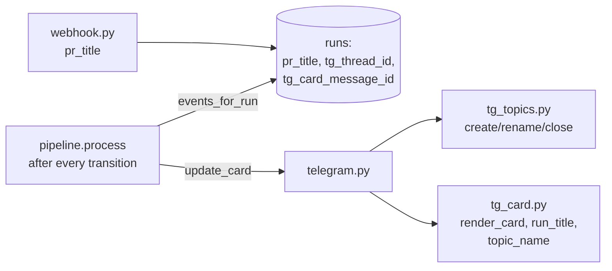

# Telegram Notifications (Topics + Live Card) Implementation Plan

> **For agentic workers:** REQUIRED SUB-SKILL: Use `.claude/skills/parallel-plan-execution` (recommended, streams below) or superpowers:subagent-driven-development / superpowers:executing-plans to implement this plan task-by-task. Steps use checkbox (`- [ ]`) syntax for tracking.

**Goal:** every Run lives in its own Telegram forum topic with a live progress card (edited on state transitions), titles are driven by the PR title instead of "Run #N", and only final messages push.

**Architecture:** a new `clients/tg_topics.py` (a fail-safe `TopicManager` adapted from <sibling-project>) and a pure rendering module `clients/tg_card.py`; `TelegramNotifier` gains `message_thread_id` in every send method, `send_card`/`update_card` (`editMessageText`) and the topic lifecycle; the pipeline explicitly repaints the card after every `transition()` (option A of the spec). Three new Run columns survive a restart.

**Tech Stack:** Python 3.12, httpx, aiosqlite, stdlib `zoneinfo`; pytest (`asyncio_mode="auto"`), respx.

**Spec:** `docs/superpowers/specs/2026-08-01-loop-tg-notifications-design.md` — the Locked Decisions are binding.

## Locked Decisions

- **Run/DB schema:** columns `pr_title TEXT`, `tg_thread_id INTEGER`, `tg_card_message_id INTEGER`; `ALTER TABLE` migration driven by `PRAGMA table_info` (there is a live database on the VPS).
- **Feature name:** the webhook's `pull_request.title` → `Run.pr_title`; the fallback in texts is `Run #<id>`.
- **Topic:** `createForumTopic` with the name `⏳ <title> · #<pr>`; at the end, `editForumTopic` with a ✅ (done) / ⚠️ (review or e2e escalation) / ❌ (failed) prefix plus `closeForumTopic`. A failure in any of these calls → `None`/no-op → flat delivery.
- **Card:** `sendMessage` with `parse_mode=HTML` + `disable_notification=true`; updates via `editMessageText`; a 400 "message is not modified" response is not an error. Stage icons: ✅ passed (with a time), ⏳ current, ⬜ ahead, ➖ skipped (review/e2e disabled), ⛔ the stage that failed.
- **Push policy:** only `notify_done`, videos, escalations and `notify_failed` push; `notify_queued`/`notify_started` are removed.
- **Timezone:** `Settings.tz` (`LOOP_TZ`, IANA, default `UTC`); a bad name → UTC.
- **Language:** all texts are English.

## Global Constraints

- No new dependencies (`zoneinfo` is stdlib); settings only through `Settings` (prefix `LOOP_`).
- Clients accept an optional `httpx.AsyncClient`; transient errors go through `with_retries` (3 attempts) wherever the error is not deliberately degraded.
- Topic/card errors never fail a Run (the principle from phases 2–3).
- Code comments are English; async tests carry no decorators (`asyncio_mode="auto"`).

## Architecture (change overview)



**Streams for parallel-plan-execution** (disjoint file sets):
- Stream A: Task 1 (models/db/webhook + their tests)
- Stream B: Task 2 (config + test_config + .env.example)
- Stream C: Task 3 (tg_topics — new files)
- Wave 2: Task 4 (tg_card — new files; needs the Run fields from Task 1)
- Wave 3: Task 5 (telegram.py + main.py + test_telegram)
- Wave 4: Task 6 (pipeline + conftest + test_pipeline_process) → Task 7 (docs)

---

### Task 1: Run.pr_title, tg fields, events_for_run, webhook

**Files:**
- Modify: `src/loop_orchestrator/models.py`
- Modify: `src/loop_orchestrator/db.py`
- Modify: `src/loop_orchestrator/webhook.py:56-57`
- Test: `tests/test_db.py`, `tests/test_webhook.py`

**Interfaces:**
- Reuses: the `Run` dataclass (`models.py`), `SCHEMA`/`_RUN_FIELDS`/`_MIGRATIONS`/`create_run`/`save_run`/`add_event` (`db.py`), `labeled_payload`/`make_app` from `tests/test_webhook.py`, the `db` fixture from conftest.
- Produces: the fields `Run.pr_title: str | None = None`, `Run.tg_thread_id: int | None = None`, `Run.tg_card_message_id: int | None = None`; `create_run(db, repo, pr_number, head_branch, pr_title: str | None = None) -> Run`; `events_for_run(db, run_id: int) -> list[tuple[str, str]]` (`(to_state, created_at UTC)` in insertion order); the webhook stores `pr_title` from the payload.

- [x] **Step 1: Write failing tests**

Add to `tests/test_db.py`:

```python
async def test_tg_fields_roundtrip(db):
    run = await dbmod.create_run(db, "o/r", 1, "b", pr_title="feat: web playground")
    run.tg_thread_id = 777
    run.tg_card_message_id = 555
    await dbmod.save_run(db, run)
    got = await dbmod.get_run(db, run.id)
    assert got.pr_title == "feat: web playground"
    assert got.tg_thread_id == 777
    assert got.tg_card_message_id == 555


async def test_create_run_without_title(db):
    run = await dbmod.create_run(db, "o/r", 1, "b")
    assert run.pr_title is None


async def test_events_for_run_ordered(db):
    run = await dbmod.create_run(db, "o/r", 1, "b")  # writes the queued event
    await dbmod.add_event(db, run.id, "queued", "preparing")
    await dbmod.add_event(db, run.id, "preparing", "executing")
    events = await dbmod.events_for_run(db, run.id)
    assert [s for s, _ in events] == ["queued", "preparing", "executing"]
    assert all(t for _, t in events)
```

In the existing `tests/test_db.py::test_e2e_migration_on_old_db` (a phase-2 database), append before `await db2.close()`:

```python
    assert got.pr_title is None
    assert got.tg_thread_id is None
    assert got.tg_card_message_id is None
```

In `tests/test_webhook.py`: add the title to `pull_request` inside `labeled_payload`:

```python
        "pull_request": {"number": 5, "state": state, "head": {"ref": "feat/x"},
                         "title": "feat: x"},
```

and a new test:

```python
async def test_webhook_stores_pr_title(tmp_path):
    app = await make_app(tmp_path)
    body = labeled_payload()
    await post(app, body, sign(body))
    run = await dbmod.get_run(app.state.db, 1)
    assert run.pr_title == "feat: x"
```

- [x] **Step 2: Run them — they fail**

Run: `python -m pytest tests/test_db.py tests/test_webhook.py -v`
Expected: FAIL — `TypeError: create_run() got an unexpected keyword argument 'pr_title'` / `AttributeError: 'Run' object has no attribute 'tg_thread_id'`.

- [x] **Step 3: Implementation**

`src/loop_orchestrator/models.py` — at the end of the `Run` dataclass (after `e2e_env_json`):

```python
    pr_title: str | None = None
    tg_thread_id: int | None = None
    tg_card_message_id: int | None = None
```

`src/loop_orchestrator/db.py`:

In `SCHEMA` (after `e2e_env_json TEXT,`):

```sql
  pr_title TEXT,
  tg_thread_id INTEGER,
  tg_card_message_id INTEGER,
```

Add `"pr_title", "tg_thread_id", "tg_card_message_id"` to `_RUN_FIELDS`.

Add to `_MIGRATIONS`:

```python
    ("pr_title", "TEXT"),
    ("tg_thread_id", "INTEGER"),
    ("tg_card_message_id", "INTEGER"),
```

`create_run` — new parameter and INSERT:

```python
async def create_run(db: aiosqlite.Connection, repo: str, pr_number: int,
                     head_branch: str, pr_title: str | None = None) -> Run:
    cur = await db.execute(
        "INSERT INTO runs (repo, pr_number, head_branch, state, pr_title) "
        "VALUES (?, ?, ?, ?, ?)",
        (repo, pr_number, head_branch, QUEUED, pr_title),
    )
```

`save_run` — in the UPDATE, add `pr_title=?, tg_thread_id=?, tg_card_message_id=?,` after `e2e_status=?, e2e_json=?, e2e_env_json=?,`; in the parameter tuple, add `run.pr_title, run.tg_thread_id, run.tg_card_message_id` after `run.e2e_env_json`.

New function (after `add_event`):

```python
async def events_for_run(db: aiosqlite.Connection, run_id: int) -> list[tuple[str, str]]:
    """(to_state, created_at UTC) in insertion order — feeds the progress card."""
    async with db.execute(
        "SELECT to_state, created_at FROM run_events WHERE run_id=? ORDER BY id",
        (run_id,),
    ) as cur:
        rows = await cur.fetchall()
    return [(r["to_state"], r["created_at"]) for r in rows]
```

`src/loop_orchestrator/webhook.py` — extend the `create_run` call:

```python
        run = None if existing is not None else await dbmod.create_run(
            db, repo=repo, pr_number=number, head_branch=pr["head"]["ref"],
            pr_title=pr.get("title"))
```

- [x] **Step 4: Run them — green**

Run: `python -m pytest tests/test_db.py tests/test_webhook.py -v`
Expected: PASS (the old ones included).

- [x] **Step 5: Commit**

```bash
git add src/loop_orchestrator/models.py src/loop_orchestrator/db.py src/loop_orchestrator/webhook.py tests/test_db.py tests/test_webhook.py
git commit -m "feat: pr_title and telegram thread/card columns on Run"
```

---

### Task 2: Settings.tz

**Files:**
- Modify: `src/loop_orchestrator/config.py`
- Modify: `.env.example`
- Test: `tests/test_config.py`

**Interfaces:**
- Reuses: `Settings` (pydantic-settings, prefix `LOOP_`), the `test_e2e_settings_defaults` pattern from `tests/test_config.py`.
- Produces: `Settings.tz: str = "UTC"`.

- [x] **Step 1: Write a failing test**

Add to `tests/test_config.py` (the required env vars follow the neighbouring tests in that file):

```python
def test_tz_default(monkeypatch):
    for key, val in (("LOOP_GITHUB_TOKEN", "t"), ("LOOP_GITHUB_WEBHOOK_SECRET", "s"),
                     ("LOOP_TELEGRAM_BOT_TOKEN", "b"), ("LOOP_TELEGRAM_CHAT_ID", "1"),
                     ("LOOP_SANDBOXD_API_KEY", "k"), ("LOOP_GIT_CREDENTIAL_ID", "c")):
        monkeypatch.setenv(key, val)
    s = Settings(_env_file=None)
    assert s.tz == "UTC"
    monkeypatch.setenv("LOOP_TZ", "Asia/Almaty")
    assert Settings(_env_file=None).tz == "Asia/Almaty"
```

- [x] **Step 2: Run it — it fails**

Run: `python -m pytest tests/test_config.py -v`
Expected: FAIL — `AttributeError: 'Settings' object has no attribute 'tz'`.

- [x] **Step 3: Implementation**

At the end of `Settings` (`src/loop_orchestrator/config.py`):

```python
    tz: str = "UTC"  # IANA zone for progress-card timestamps
```

Add a line to `.env.example`:

```
# LOOP_TZ=Asia/Almaty
```

- [x] **Step 4: Run them — green**

Run: `python -m pytest tests/test_config.py -v`
Expected: PASS.

- [x] **Step 5: Commit**

```bash
git add src/loop_orchestrator/config.py tests/test_config.py .env.example
git commit -m "feat: LOOP_TZ setting for card timestamps"
```

---

### Task 3: clients/tg_topics.py — fail-safe TopicManager

**Files:**
- Create: `src/loop_orchestrator/clients/tg_topics.py`
- Test: `tests/test_tg_topics.py` (new file)

**Interfaces:**
- Reuses: the `TopicManager` pattern from <sibling-project> `gateway/topics.py` (fail-safe degradation to `None`/no-op); the respx pattern of `tests/test_telegram.py` (base_url `https://api.telegram.org/bottok`).
- Produces: `TopicManager(http: httpx.AsyncClient, chat_id: int)`; `TopicManager.create(name: str) -> int | None`; `TopicManager.rename(thread_id: int, name: str) -> None`; `TopicManager.close(thread_id: int) -> None`; the constant `TOPIC_NAME_LIMIT = 128`.

- [x] **Step 1: Write failing tests**

Create `tests/test_tg_topics.py`:

```python
"""Fail-safe forum-topic manager: create/rename/close degrade, never raise."""
import httpx
import respx

from loop_orchestrator.clients.tg_topics import TOPIC_NAME_LIMIT, TopicManager

BASE = "https://api.telegram.org/bottok"


def make_manager() -> TopicManager:
    return TopicManager(httpx.AsyncClient(base_url=BASE), chat_id=42)


@respx.mock
async def test_create_returns_thread_id():
    route = respx.post(f"{BASE}/createForumTopic").respond(
        200, json={"ok": True, "result": {"message_thread_id": 777}})
    tm = make_manager()
    assert await tm.create("⏳ feat: x · #5") == 777
    body = route.calls[0].request.content.decode()
    assert "42" in body and "feat: x" in body


@respx.mock
async def test_create_failure_degrades_to_none():
    respx.post(f"{BASE}/createForumTopic").respond(400, json={"ok": False})
    tm = make_manager()
    assert await tm.create("⏳ feat: x · #5") is None


@respx.mock
async def test_create_truncates_long_names():
    route = respx.post(f"{BASE}/createForumTopic").respond(
        200, json={"ok": True, "result": {"message_thread_id": 1}})
    tm = make_manager()
    await tm.create("x" * 500)
    import json as jsonlib
    sent = jsonlib.loads(route.calls[0].request.content)
    assert len(sent["name"]) == TOPIC_NAME_LIMIT


@respx.mock
async def test_rename_and_close_swallow_errors():
    respx.post(f"{BASE}/editForumTopic").respond(400, json={"ok": False})
    respx.post(f"{BASE}/closeForumTopic").respond(500)
    tm = make_manager()
    await tm.rename(777, "✅ feat: x · #5")  # must not raise
    await tm.close(777)                       # must not raise


@respx.mock
async def test_rename_and_close_hit_api():
    r1 = respx.post(f"{BASE}/editForumTopic").respond(200, json={"ok": True, "result": True})
    r2 = respx.post(f"{BASE}/closeForumTopic").respond(200, json={"ok": True, "result": True})
    tm = make_manager()
    await tm.rename(777, "✅ done")
    await tm.close(777)
    assert r1.called and r2.called
```

- [x] **Step 2: Run them — they fail**

Run: `python -m pytest tests/test_tg_topics.py -v`
Expected: FAIL — `ModuleNotFoundError: No module named 'loop_orchestrator.clients.tg_topics'`.

- [x] **Step 3: Implementation**

Create `src/loop_orchestrator/clients/tg_topics.py`:

```python
"""Forum topics per run (Bot API 10.0; works in private chats too).

Adapted from <sibling-project> gateway/topics.py: every operation is fail-safe.
A chat without topics, a missing right or a rate limit degrades to None/no-op,
never to a raised exception. A None thread id means "deliver flat" — exactly
what the bot did before threads existed.
"""
import logging

import httpx

log = logging.getLogger(__name__)

TOPIC_NAME_LIMIT = 128  # Telegram's limit on a forum-topic name


class TopicManager:
    def __init__(self, http: httpx.AsyncClient, chat_id: int):
        self._http = http
        self.chat_id = chat_id

    async def _call(self, method: str, payload: dict) -> dict | bool:
        r = await self._http.post(f"/{method}", json=payload)
        r.raise_for_status()
        data = r.json()
        if not data.get("ok"):
            raise RuntimeError(f"{method} returned ok=false")
        return data["result"]

    async def create(self, name: str) -> int | None:
        try:
            result = await self._call("createForumTopic", {
                "chat_id": self.chat_id, "name": name[:TOPIC_NAME_LIMIT]})
            return int(result["message_thread_id"])
        except Exception:
            log.warning("createForumTopic failed for chat=%s; delivering flat",
                        self.chat_id, exc_info=True)
            return None

    async def rename(self, thread_id: int, name: str) -> None:
        try:
            await self._call("editForumTopic", {
                "chat_id": self.chat_id, "message_thread_id": thread_id,
                "name": name[:TOPIC_NAME_LIMIT]})
        except Exception:
            log.warning("editForumTopic failed for chat=%s thread=%s",
                        self.chat_id, thread_id, exc_info=True)

    async def close(self, thread_id: int) -> None:
        try:
            await self._call("closeForumTopic", {
                "chat_id": self.chat_id, "message_thread_id": thread_id})
        except Exception:
            log.warning("closeForumTopic failed for chat=%s thread=%s",
                        self.chat_id, thread_id, exc_info=True)
```

- [x] **Step 4: Run them — green**

Run: `python -m pytest tests/test_tg_topics.py -v`
Expected: PASS.

- [x] **Step 5: Commit**

```bash
git add src/loop_orchestrator/clients/tg_topics.py tests/test_tg_topics.py
git commit -m "feat: fail-safe forum topic manager for telegram"
```

---

### Task 4: clients/tg_card.py — card and title rendering

**Files:**
- Create: `src/loop_orchestrator/clients/tg_card.py`
- Test: `tests/test_tg_card.py` (new file)

**Interfaces:**
- Reuses: the state constants and `Run` (`src/loop_orchestrator/models.py`), stdlib `zoneinfo`/`datetime`/`html`.
- Consumes: Task 1 (`Run.pr_title`), the `events_for_run` shape — `list[tuple[to_state, created_at]]`, where `created_at` is `"YYYY-MM-DD HH:MM:SS"` UTC (sqlite `datetime('now')`).
- Produces: `run_title(run: Run) -> str`; `render_card(run: Run, events: list[tuple[str, str]], tz: str) -> str` (HTML); `topic_name(run: Run) -> str`; `topic_final_name(run: Run) -> str`; `STAGES: tuple[str, ...]`.

- [x] **Step 1: Write failing tests**

Create `tests/test_tg_card.py`:

```python
"""Progress-card rendering: icons per stage, times, titles, topic names."""
from loop_orchestrator.clients.tg_card import (
    render_card,
    run_title,
    topic_final_name,
    topic_name,
)
from loop_orchestrator.models import Run


def make_run(**kw) -> Run:
    base = dict(id=8, repo="o/r", pr_number=7, head_branch="b", state="executing",
                pr_title="feat: web playground")
    base.update(kw)
    return Run(**base)


EVENTS = [("queued", "2026-08-01 07:01:00"), ("preparing", "2026-08-01 07:01:30"),
          ("executing", "2026-08-01 07:02:00")]


def test_run_title_falls_back_to_run_id():
    assert run_title(make_run()) == "feat: web playground"
    assert run_title(make_run(pr_title=None)) == "Run #8"


def test_card_running_marks_past_current_future():
    card = render_card(make_run(), EVENTS, "UTC")
    assert "<b>feat: web playground</b>" in card
    assert 'href="https://github.com/o/r/pull/7"' in card
    assert "· Run 8" in card
    assert "✅ queued" in card and "07:01" in card
    assert "⏳ executing" in card
    assert "⬜ publishing" in card and "⬜ reporting" in card


def test_card_times_respect_tz():
    card = render_card(make_run(), EVENTS, "Etc/GMT-5")  # UTC+5
    assert "12:01" in card


def test_card_bad_tz_falls_back_to_utc():
    card = render_card(make_run(), EVENTS, "No/Such_Zone")
    assert "07:01" in card


def test_card_skipped_stages_after_prepare():
    run = make_run(review_enabled=False, e2e_enabled=False)
    card = render_card(run, EVENTS, "UTC")
    assert "➖ reviewing" in card
    assert "➖ e2e testing" in card


def test_card_before_prepare_shows_future_not_skipped():
    run = make_run(state="queued", review_enabled=True, e2e_enabled=False)
    card = render_card(run, [("queued", "2026-08-01 07:01:00")], "UTC")
    assert "➖" not in card
    assert "⏳ queued" in card


def test_card_failed_marks_last_stage():
    run = make_run(state="failed", e2e_enabled=True)
    card = render_card(run, EVENTS, "UTC")
    assert card.startswith("❌")
    assert "⛔ executing" in card
    assert "✅ preparing" in card


def test_card_done_all_green():
    events = EVENTS + [("reviewing", "2026-08-01 07:10:00"),
                       ("e2e_testing", "2026-08-01 07:15:00"),
                       ("publishing", "2026-08-01 07:20:00"),
                       ("reporting", "2026-08-01 07:21:00")]
    run = make_run(state="done", e2e_enabled=True)
    card = render_card(run, events, "UTC")
    assert card.startswith("✅")
    assert "⏳" not in card and "⬜" not in card


def test_card_done_escalated_header():
    run = make_run(state="done", review_status="escalated")
    assert render_card(run, EVENTS, "UTC").startswith("⚠️")


def test_card_escapes_html_in_title():
    run = make_run(pr_title="feat: a <b> & c")
    card = render_card(run, EVENTS, "UTC")
    assert "a &lt;b&gt; &amp; c" in card


def test_topic_names():
    run = make_run()
    assert topic_name(run) == "⏳ feat: web playground · #7"
    assert topic_final_name(make_run(state="done")) == "✅ feat: web playground · #7"
    assert topic_final_name(make_run(state="failed")) == "❌ feat: web playground · #7"
    assert topic_final_name(
        make_run(state="done", e2e_status="escalated")) == "⚠️ feat: web playground · #7"
```

- [x] **Step 2: Run them — they fail**

Run: `python -m pytest tests/test_tg_card.py -v`
Expected: FAIL — `ModuleNotFoundError: No module named 'loop_orchestrator.clients.tg_card'`.

- [x] **Step 3: Implementation**

Create `src/loop_orchestrator/clients/tg_card.py`:

```python
"""Progress-card rendering: one HTML checklist message edited in place.

Pure functions — no I/O — so every state combination is unit-testable.
"""
import html
from datetime import datetime, timezone
from zoneinfo import ZoneInfo

from ..models import (
    DONE,
    E2E_TESTING,
    EXECUTING,
    FAILED,
    PREPARING,
    PUBLISHING,
    QUEUED,
    REPORTING,
    REVIEWING,
    Run,
)

STAGES = (QUEUED, PREPARING, EXECUTING, REVIEWING, E2E_TESTING, PUBLISHING, REPORTING)
_LABELS = {QUEUED: "queued", PREPARING: "preparing", EXECUTING: "executing",
           REVIEWING: "reviewing", E2E_TESTING: "e2e testing",
           PUBLISHING: "publishing", REPORTING: "reporting"}


def run_title(run: Run) -> str:
    return run.pr_title or f"Run #{run.id}"


def _header_emoji(run: Run) -> str:
    if run.state == FAILED:
        return "❌"
    if run.state == DONE:
        if run.review_status == "escalated" or run.e2e_status == "escalated":
            return "⚠️"
        return "✅"
    return "🌀"


def topic_name(run: Run) -> str:
    return f"⏳ {run_title(run)} · #{run.pr_number}"


def topic_final_name(run: Run) -> str:
    return f"{_header_emoji(run)} {run_title(run)} · #{run.pr_number}"


def _fmt_time(created_at: str, tz: str) -> str:
    try:
        zone = ZoneInfo(tz)
    except Exception:  # unknown zone name — fall back to UTC
        zone = timezone.utc
    dt = datetime.strptime(created_at, "%Y-%m-%d %H:%M:%S").replace(tzinfo=timezone.utc)
    return dt.astimezone(zone).strftime("%H:%M")


def render_card(run: Run, events: list[tuple[str, str]], tz: str) -> str:
    """HTML for the progress message; `events` is (to_state, created_at UTC)."""
    times: dict[str, str] = {}
    for state, created in events:
        times.setdefault(state, created)
    reached = [s for s in STAGES if s in times]
    last = reached[-1] if reached else QUEUED
    prepared = EXECUTING in times  # review/e2e flags are meaningful after prepare
    lines = []
    for stage in STAGES:
        if run.state == FAILED and stage == last:
            icon = "⛔"
        elif stage == run.state:
            icon = "⏳"
        elif stage in times:
            icon = "✅"
        elif prepared and stage == REVIEWING and not run.review_enabled:
            icon = "➖"
        elif prepared and stage == E2E_TESTING and not run.e2e_enabled:
            icon = "➖"
        else:
            icon = "⬜"
        t = f"  {_fmt_time(times[stage], tz)}" if stage in times else ""
        lines.append(f"{icon} {_LABELS[stage]}{t}")
    url = f"https://github.com/{run.repo}/pull/{run.pr_number}"
    head = (f"{_header_emoji(run)} <b>{html.escape(run_title(run))}</b>\n"
            f'<a href="{url}">{run.repo}#{run.pr_number}</a> · Run {run.id}')
    return head + "\n\n" + "\n".join(lines)
```

- [x] **Step 4: Run them — green**

Run: `python -m pytest tests/test_tg_card.py -v`
Expected: PASS.

- [x] **Step 5: Commit**

```bash
git add src/loop_orchestrator/clients/tg_card.py tests/test_tg_card.py
git commit -m "feat: progress card renderer and feature-name titles"
```

---

### Task 5: TelegramNotifier — threads, card, new texts

**Files:**
- Modify: `src/loop_orchestrator/clients/telegram.py`
- Modify: `src/loop_orchestrator/main.py:24`
- Test: `tests/test_telegram.py`

**Interfaces:**
- Reuses: the `send_rich_markdown` → `send` → plain ladder (`clients/telegram.py`), `md_to_telegram_html` (`clients/tg_format.py`), the respx pattern of `tests/test_telegram.py`.
- Consumes: Task 1 (`Run.pr_title`/`tg_thread_id`/`tg_card_message_id`), Task 3 (`TopicManager`), Task 4 (`render_card`, `run_title`, `topic_name`, `topic_final_name`).
- Produces: `TelegramNotifier(token, chat_id, tz: str = "UTC", client=None)` with a `topics: TopicManager` attribute; `send(text, thread_id: int | None = None)`; `send_rich_markdown(markdown, fallback_html, thread_id: int | None = None)`; `send_video(video, filename, caption, thread_id: int | None = None)`; `start_run_thread(run) -> int | None`; `finish_run_thread(run) -> None`; `send_card(run, events) -> int | None`; `update_card(run, events) -> None`; reworked `notify_done`/`notify_failed`/`notify_review_escalation`/`notify_e2e_escalation` (title from `run_title`, delivery into the thread); the `notify_queued`/`notify_started` methods are REMOVED.

- [x] **Step 1: Update the tests**

In `tests/test_telegram.py`:

1. Delete the `notify_queued`/`notify_started` tests if present.
2. Add:

```python
@respx.mock
async def test_send_passes_thread_id():
    route = respx.post("https://api.telegram.org/bottok/sendMessage").respond(
        200, json={"ok": True})
    tg = TelegramNotifier("tok", 42)
    await tg.send("hello", thread_id=777)
    body = json.loads(route.calls[0].request.content)
    assert body["message_thread_id"] == 777


@respx.mock
async def test_rich_passes_thread_id_and_falls_back_with_it():
    respx.post("https://api.telegram.org/bottok/sendRichMessage").respond(500)
    fallback = respx.post("https://api.telegram.org/bottok/sendMessage").respond(
        200, json={"ok": True})
    tg = TelegramNotifier("tok", 42)
    await tg.send_rich_markdown("hi", fallback_html="hi", thread_id=777)
    body = json.loads(fallback.calls[0].request.content)
    assert body["message_thread_id"] == 777


@respx.mock
async def test_send_video_passes_thread_id():
    route = respx.post("https://api.telegram.org/bottok/sendVideo").respond(
        200, json={"ok": True})
    tg = TelegramNotifier("tok", 42)
    await tg.send_video(b"v", "main.mp4", "cap", thread_id=777)
    assert b"777" in route.calls[0].request.content


@respx.mock
async def test_send_card_is_silent_and_returns_message_id():
    route = respx.post("https://api.telegram.org/bottok/sendMessage").respond(
        200, json={"ok": True, "result": {"message_id": 555}})
    tg = TelegramNotifier("tok", 42)
    run = Run(id=8, repo="o/r", pr_number=7, head_branch="b", state="queued",
              pr_title="feat: x", tg_thread_id=777)
    mid = await tg.send_card(run, [("queued", "2026-08-01 07:01:00")])
    assert mid == 555
    body = json.loads(route.calls[0].request.content)
    assert body["disable_notification"] is True
    assert body["message_thread_id"] == 777
    assert "feat: x" in body["text"]


@respx.mock
async def test_send_card_failure_degrades_to_none():
    respx.post("https://api.telegram.org/bottok/sendMessage").respond(400)
    tg = TelegramNotifier("tok", 42)
    run = Run(id=8, repo="o/r", pr_number=7, head_branch="b", state="queued")
    assert await tg.send_card(run, []) is None


@respx.mock
async def test_update_card_edits_message():
    route = respx.post("https://api.telegram.org/bottok/editMessageText").respond(
        200, json={"ok": True})
    tg = TelegramNotifier("tok", 42)
    run = Run(id=8, repo="o/r", pr_number=7, head_branch="b", state="executing",
              tg_card_message_id=555)
    await tg.update_card(run, [("queued", "2026-08-01 07:01:00")])
    body = json.loads(route.calls[0].request.content)
    assert body["message_id"] == 555


@respx.mock
async def test_update_card_ignores_not_modified_and_absence():
    respx.post("https://api.telegram.org/bottok/editMessageText").respond(
        400, json={"ok": False, "description": "Bad Request: message is not modified"})
    tg = TelegramNotifier("tok", 42)
    run = Run(id=8, repo="o/r", pr_number=7, head_branch="b", state="executing",
              tg_card_message_id=555)
    await tg.update_card(run, [])          # must not raise
    run.tg_card_message_id = None
    await tg.update_card(run, [])          # no card -> silent no-op


@respx.mock
async def test_start_and_finish_run_thread():
    respx.post("https://api.telegram.org/bottok/createForumTopic").respond(
        200, json={"ok": True, "result": {"message_thread_id": 777}})
    rename = respx.post("https://api.telegram.org/bottok/editForumTopic").respond(
        200, json={"ok": True, "result": True})
    close = respx.post("https://api.telegram.org/bottok/closeForumTopic").respond(
        200, json={"ok": True, "result": True})
    tg = TelegramNotifier("tok", 42)
    run = Run(id=8, repo="o/r", pr_number=7, head_branch="b", state="queued",
              pr_title="feat: x")
    assert await tg.start_run_thread(run) == 777
    run.state, run.tg_thread_id = "done", 777
    await tg.finish_run_thread(run)
    assert rename.called and close.called
    sent = json.loads(rename.calls[0].request.content)
    assert sent["name"].startswith("✅")


@respx.mock
async def test_finish_run_thread_without_thread_is_noop():
    tg = TelegramNotifier("tok", 42)
    run = Run(id=8, repo="o/r", pr_number=7, head_branch="b", state="done")
    await tg.finish_run_thread(run)  # no respx routes -> would raise if it called out


@respx.mock
async def test_notify_done_uses_feature_title_and_thread():
    route = respx.post("https://api.telegram.org/bottok/sendRichMessage").respond(
        200, json={"ok": True})
    tg = TelegramNotifier("tok", 42)
    run = Run(id=8, repo="o/r", pr_number=7, head_branch="b", state="reporting",
              pr_title="feat: web playground", tg_thread_id=777,
              summary="done", review_status="clean", review_iteration=1,
              e2e_status="passed", e2e_iteration=0)
    await tg.notify_done(run)
    body = json.loads(route.calls[0].request.content)
    assert body["message_thread_id"] == 777
    text = body["rich_message"]["markdown"]
    assert "feat: web playground" in text and "finished" in text
    assert "Review: ✅ clean (1 fix iteration(s))" in text
    assert "E2E: ✅ passed (0 fix iteration(s)) 🎬" in text


@respx.mock
async def test_notify_failed_uses_feature_title():
    route = respx.post("https://api.telegram.org/bottok/sendRichMessage").respond(
        200, json={"ok": True})
    tg = TelegramNotifier("tok", 42)
    run = Run(id=8, repo="o/r", pr_number=7, head_branch="b", state="failed",
              pr_title="feat: x", error="[executing] boom")
    await tg.notify_failed(run)
    text = json.loads(route.calls[0].request.content)["rich_message"]["markdown"]
    assert "❌ **feat: x** — failed" in text and "boom" in text
```

Extend the file's imports: `import json`, `from loop_orchestrator.models import Run` (if not already there).

- [x] **Step 2: Run them — they fail**

Run: `python -m pytest tests/test_telegram.py -v`
Expected: FAIL — no `thread_id`/`send_card`/`start_run_thread`; the old texts.

- [x] **Step 3: Implementation**

`src/loop_orchestrator/clients/telegram.py` — rework it wholesale along these lines (the ladder and the retries stay):

```python
import html
import logging

import httpx

from ..models import Run
from .retry import with_retries
from .tg_card import render_card, run_title, topic_final_name, topic_name
from .tg_format import md_to_telegram_html
from .tg_topics import TopicManager

log = logging.getLogger(__name__)


def _with_thread(payload: dict, thread_id: int | None) -> dict:
    if thread_id is not None:
        payload["message_thread_id"] = thread_id
    return payload


class TelegramNotifier:
    def __init__(self, token: str, chat_id: int, tz: str = "UTC",
                 client: httpx.AsyncClient | None = None):
        self.chat_id = chat_id
        self.tz = tz
        self._owns_http = client is None
        self._http = client or httpx.AsyncClient(
            base_url=f"https://api.telegram.org/bot{token}", timeout=30)
        self.topics = TopicManager(self._http, chat_id)

    async def aclose(self) -> None:
        if self._owns_http:
            await self._http.aclose()

    async def send(self, text: str, thread_id: int | None = None) -> None:
        async def call() -> None:
            r = await self._http.post("/sendMessage", json=_with_thread({
                "chat_id": self.chat_id, "text": text[:4000],
                "parse_mode": "HTML", "disable_web_page_preview": True,
            }, thread_id))
            r.raise_for_status()
        await with_retries(call)

    async def send_rich_markdown(self, markdown: str, fallback_html: str,
                                 thread_id: int | None = None) -> None:
        """Bot API 10.x rich message; falls back to parse_mode=HTML."""
        async def call() -> None:
            r = await self._http.post("/sendRichMessage", json=_with_thread({
                "chat_id": self.chat_id,
                "rich_message": {"markdown": markdown[:4000]},
            }, thread_id))
            r.raise_for_status()
            if not r.json().get("ok", True):
                raise RuntimeError("sendRichMessage returned ok=false")
        try:
            await with_retries(call)
        except Exception:
            await self.send(fallback_html, thread_id=thread_id)

    async def send_video(self, video: bytes, filename: str, caption: str,
                         thread_id: int | None = None) -> None:
        """Upload a video (mp4 plays inline; anything else goes as a document).
        Delivery failures degrade to a text message — never fail the run."""
        is_mp4 = filename.endswith(".mp4")
        method = "/sendVideo" if is_mp4 else "/sendDocument"
        part = "video" if is_mp4 else "document"
        mime = "video/mp4" if is_mp4 else "application/octet-stream"
        data = {"chat_id": str(self.chat_id), "caption": caption[:1000]}
        if thread_id is not None:
            data["message_thread_id"] = str(thread_id)

        async def call() -> None:
            r = await self._http.post(method, data=data,
                                      files={part: (filename, video, mime)})
            r.raise_for_status()
        try:
            await with_retries(call)
        except Exception:
            await self.send(f"{caption}\n⚠️ video upload failed", thread_id=thread_id)

    # -- run thread lifecycle -------------------------------------------------

    async def start_run_thread(self, run: Run) -> int | None:
        return await self.topics.create(topic_name(run))

    async def finish_run_thread(self, run: Run) -> None:
        if run.tg_thread_id is None:
            return
        await self.topics.rename(run.tg_thread_id, topic_final_name(run))
        await self.topics.close(run.tg_thread_id)

    # -- progress card --------------------------------------------------------

    async def send_card(self, run: Run, events: list[tuple[str, str]]) -> int | None:
        """Silent checklist message; returns its message_id (None on failure)."""
        try:
            r = await self._http.post("/sendMessage", json=_with_thread({
                "chat_id": self.chat_id,
                "text": render_card(run, events, self.tz)[:4000],
                "parse_mode": "HTML", "disable_web_page_preview": True,
                "disable_notification": True,
            }, run.tg_thread_id))
            r.raise_for_status()
            return int(r.json()["result"]["message_id"])
        except Exception:
            log.warning("progress card send failed for run=%s", run.id, exc_info=True)
            return None

    async def update_card(self, run: Run, events: list[tuple[str, str]]) -> None:
        if run.tg_card_message_id is None:
            return
        try:
            r = await self._http.post("/editMessageText", json={
                "chat_id": self.chat_id, "message_id": run.tg_card_message_id,
                "text": render_card(run, events, self.tz)[:4000],
                "parse_mode": "HTML", "disable_web_page_preview": True,
            })
            if r.status_code == 400 and "not modified" in r.text:
                return
            r.raise_for_status()
        except Exception:
            log.warning("progress card edit failed for run=%s", run.id, exc_info=True)

    # -- final notifications --------------------------------------------------

    def _pr_url(self, run: Run) -> str:
        return f"https://github.com/{run.repo}/pull/{run.pr_number}"

    def _sub_md(self, run: Run) -> str:
        return f"[{run.repo}#{run.pr_number}]({self._pr_url(run)}) · Run {run.id}"

    def _sub_html(self, run: Run) -> str:
        return (f'<a href="{self._pr_url(run)}">{run.repo}#{run.pr_number}</a>'
                f" · Run {run.id}")

    async def notify_done(self, run: Run) -> None:
        review_line = ""
        if run.review_status == "clean":
            review_line = f"Review: ✅ clean ({run.review_iteration} fix iteration(s))\n"
        elif run.review_status == "escalated":
            review_line = "Review: ⚠️ findings remain — see the PR comment\n"
        elif run.review_status == "skipped":
            review_line = "Review: ⛔ skipped (see the PR note)\n"
        e2e_line = ""
        if run.e2e_status == "passed":
            e2e_line = f"E2E: ✅ passed ({run.e2e_iteration} fix iteration(s)) 🎬\n"
        elif run.e2e_status == "escalated":
            e2e_line = "E2E: ⚠️ failures remain — see the PR comment\n"
        elif run.e2e_status == "skipped":
            e2e_line = "E2E: ⛔ skipped (see the PR note)\n"
        t = run_title(run)
        summary_md = (run.summary or "(no summary)")[:3200]
        markdown = (f"✅ **{t}** — finished\n{self._sub_md(run)}\n"
                    f"{review_line}{e2e_line}\n{summary_md}")
        head = (f"✅ <b>{html.escape(t)}</b> — finished\n{self._sub_html(run)}\n"
                f"{review_line}{e2e_line}")
        text = f"{head}<blockquote expandable>{md_to_telegram_html(summary_md)}</blockquote>"
        if len(text) > 4000:
            text = f"{head}\n{html.escape(run.summary or '')[:3400]}"
        await self.send_rich_markdown(markdown, fallback_html=text,
                                      thread_id=run.tg_thread_id)

    async def notify_review_escalation(self, run: Run, remaining: int) -> None:
        t = run_title(run)
        body = (f"⚠️ %s: review is not clean after {run.review_iteration} "
                f"fix iteration(s), {remaining} finding(s) remain — "
                f"your attention is needed: {self._pr_url(run)}")
        await self.send_rich_markdown(
            body % f"**{t}**", fallback_html=body % f"<b>{html.escape(t)}</b>",
            thread_id=run.tg_thread_id)

    async def notify_e2e_escalation(self, run: Run, failed: int) -> None:
        t = run_title(run)
        body = (f"⚠️ %s: e2e is not green after {run.e2e_iteration} "
                f"fix iteration(s), {failed} failing scenario(s) — "
                f"your attention is needed: {self._pr_url(run)}")
        await self.send_rich_markdown(
            body % f"**{t}**", fallback_html=body % f"<b>{html.escape(t)}</b>",
            thread_id=run.tg_thread_id)

    async def notify_failed(self, run: Run) -> None:
        t = run_title(run)
        error = run.error or "unknown error"
        markdown = (f"❌ **{t}** — failed\n{self._sub_md(run)}\n"
                    f"```\n{error[:3000]}\n```")
        await self.send_rich_markdown(
            markdown,
            fallback_html=(f"❌ <b>{html.escape(t)}</b> — failed\n{self._sub_html(run)}\n"
                           f"<blockquote>{html.escape(error)[:3400]}</blockquote>"),
            thread_id=run.tg_thread_id)
```

Delete the `notify_queued` and `notify_started` methods.

`src/loop_orchestrator/main.py:24` — pass the timezone through:

```python
        tg = TelegramNotifier(resolved.telegram_bot_token, resolved.telegram_chat_id,
                              tz=resolved.tz)
```

- [x] **Step 4: Run them — green**

Run: `python -m pytest tests/test_telegram.py tests/test_tg_topics.py tests/test_tg_card.py -v`
Expected: PASS.

- [x] **Step 5: Commit**

```bash
git add src/loop_orchestrator/clients/telegram.py src/loop_orchestrator/main.py tests/test_telegram.py
git commit -m "feat: telegram threads, progress card and feature-name texts"
```

---

### Task 6: Pipeline — topic/card creation and repaints on transitions

**Files:**
- Modify: `src/loop_orchestrator/pipeline.py`
- Modify: `tests/conftest.py`
- Test: `tests/test_pipeline_process.py`

**Interfaces:**
- Reuses: `process()`/`fail()`/`_report_success`/`_send_e2e_videos` (`pipeline.py:420-555`), `transition` (`state_machine.py`), the `FakeTG`/`FakeSandboxd` fakes (`tests/conftest.py`), the `make_pipeline`/`make_run_in` helpers from `tests/test_pipeline_process.py`.
- Consumes: Task 1 (`events_for_run`, the Run fields), Task 4 (`run_title`), Task 5 (`start_run_thread`/`finish_run_thread`/`send_card`/`update_card`, `thread_id` in the send methods; `notify_queued`/`notify_started` no longer exist).
- Produces: `Pipeline._refresh_card(run) -> None` (best-effort); topic + card on `QUEUED`; `update_card` after every `transition()`; `finish_run_thread` on a terminal state; videos and degradation messages go into the thread with a caption built from `run_title`.

- [x] **Step 1: Update the conftest fakes**

In `FakeTG` (`tests/conftest.py`):

1. Delete `notify_queued`/`notify_started`.
2. Add to `__init__`: `self.card_states: list[str] = []`, `self.thread_finished = False`.
3. Add the methods:

```python
    async def start_run_thread(self, run):
        return 777

    async def finish_run_thread(self, run):
        self.thread_finished = True
        self.sent.append(f"thread-finished:{run.id}:{run.state}")

    async def send_card(self, run, events):
        self.card_states.append(run.state)
        return 555

    async def update_card(self, run, events):
        self.card_states.append(run.state)
```

Add a parameter to `send_video`: `async def send_video(self, video, filename, caption, thread_id=None):` (body unchanged). Add `thread_id=None` to `send`.

- [x] **Step 2: Write failing tests**

Add to `tests/test_pipeline_process.py`:

```python
async def test_process_creates_thread_and_card(db):
    p, gh, sb, tg = make_pipeline(db)
    run = await make_run_in(db, QUEUED)
    await p.process(run)
    saved = await dbmod.get_run(db, run.id)
    assert saved.tg_thread_id == 777
    assert saved.tg_card_message_id == 555
    assert tg.card_states[0] == QUEUED           # initial card
    assert tg.card_states[-1] == DONE            # refreshed at the end
    assert tg.thread_finished


async def test_process_updates_card_on_each_transition(db):
    p, gh, sb, tg = make_pipeline(db)
    run = await make_run_in(db, QUEUED)
    await p.process(run)
    # one snapshot per transition target at minimum
    for state in (PREPARING, EXECUTING, PUBLISHING, REPORTING, DONE):
        assert state in tg.card_states


async def test_fail_updates_card_and_finishes_thread(db):
    p, gh, sb, tg = make_pipeline(db)
    run = await make_run_in(db, QUEUED)
    await p.fail(run, "executing", "boom")
    assert FAILED in tg.card_states
    assert tg.thread_finished
    assert any(m.startswith("failed:") or "failed" in m for m in tg.sent)


async def test_video_caption_uses_feature_title(db):
    p, gh, sb, tg = make_pipeline(db)
    run = await make_run_in(db, REPORTING)
    run.pr_title = "feat: web playground"
    run.e2e_status = "passed"
    run.e2e_json = json.dumps({"summary": "works", "main_video": ".loop/e2e/main.mp4",
                               "tests": []})
    sb.files = [{"path": ".loop/e2e/main.mp4", "type": "file", "size": 100}]
    sb.file_contents[".loop/e2e/main.mp4"] = b"vid"
    await p._report_success(run)
    assert tg.videos == [("main.mp4", "🎬 feat: web playground — main.mp4")]
```

Extend the file's imports as needed: `QUEUED, PREPARING, EXECUTING, PUBLISHING, REPORTING, DONE, FAILED` from `loop_orchestrator.models`, plus `json`. If `make_run_in` does not accept `QUEUED`, adapt the calls to the file's actual helpers (create the Run in the required state + persist it with `dbmod.save_run`) without changing what the assertions mean. Existing tests that expect `queued:{id}`/`started:{id}` in `tg.sent` must be updated: those messages are gone.

- [x] **Step 3: Run them — they fail**

Run: `python -m pytest tests/test_pipeline_process.py -v`
Expected: FAIL — `AttributeError: 'FakeTG' object has no attribute 'card_states'` before the conftest edits; after them, the pipeline has no `_refresh_card`/topic.

- [x] **Step 4: Implementation**

`src/loop_orchestrator/pipeline.py`:

Import: `from .clients.tg_card import run_title` (next to the other client imports).

New method (next to `_swap_labels_start`):

```python
    async def _refresh_card(self, run: Run) -> None:
        """Best-effort card repaint; notification failures never fail the run."""
        try:
            events = await dbmod.events_for_run(self.db, run.id)
            await self.tg.update_card(run, events)
        except Exception:  # noqa: BLE001
            pass
```

`process()` — replace the QUEUED block (instead of `notify_queued`):

```python
            if run.state == QUEUED:
                run.tg_thread_id = await self.tg.start_run_thread(run)
                events = await dbmod.events_for_run(self.db, run.id)
                run.tg_card_message_id = await self.tg.send_card(run, events)
                await dbmod.save_run(self.db, run)
                await self._swap_labels_start(run)
                await transition(self.db, run, PREPARING)
                await self._refresh_card(run)
```

The PREPARING block (instead of `notify_started`):

```python
            if run.state == PREPARING:
                await self._prepare(run)
                await transition(self.db, run, EXECUTING)
                await self._refresh_card(run)
```

After every remaining `transition(...)` in `process()`, add `await self._refresh_card(run)`:

```python
                await transition(
                    self.db, run,
                    REVIEWING if run.review_enabled
                    else E2E_TESTING if run.e2e_enabled else PUBLISHING)
                await self._refresh_card(run)
            if run.state == REVIEWING:
                await self._review(run)
                await transition(self.db, run,
                                 E2E_TESTING if run.e2e_enabled else PUBLISHING)
                await self._refresh_card(run)
            if run.state == E2E_TESTING:
                await self._e2e(run)
                await transition(self.db, run, PUBLISHING)
                await self._refresh_card(run)
            if run.state == PUBLISHING:
                await self._publish(run)
                await transition(self.db, run, REPORTING)
                await self._refresh_card(run)
            if run.state == REPORTING:
                await self._report_success(run)
                await transition(self.db, run, DONE)
                await self._refresh_card(run)
                await self.tg.finish_run_thread(run)
                await self.sb.delete_app(run.app_id)
```

`fail()` — add to the list of best-effort actions (after `notify_failed`):

```python
            lambda: self._refresh_card(run),
            lambda: self.tg.finish_run_thread(run),
```

`_send_e2e_videos` — caption and thread:

```python
            for p in wanted:
                if p in videos:
                    name = PurePosixPath(p).name
                    await self.tg.send_video(
                        videos[p], name, f"🎬 {run_title(run)} — {name}",
                        thread_id=run.tg_thread_id)
            skipped = len(paths) - len(videos)
            if skipped:
                await self.tg.send(
                    f"⚠️ {run_title(run)}: {skipped} e2e video(s) skipped "
                    "(missing or over 45 MB).", thread_id=run.tg_thread_id)
        except Exception:  # noqa: BLE001 — video delivery must never fail the run
            await self.tg.send(f"⚠️ {run_title(run)}: e2e video could not be delivered.",
                               thread_id=run.tg_thread_id)
```

The remaining `self.tg.send(...)` calls in the pipeline (`pipeline.py:203`, `pipeline.py:248`) get `thread_id=run.tg_thread_id`.

- [x] **Step 5: Run the whole suite**

Run: `python -m pytest tests -v`
Expected: PASS.

- [x] **Step 6: Commit**

```bash
git add src/loop_orchestrator/pipeline.py tests/conftest.py tests/test_pipeline_process.py
git commit -m "feat: run thread lifecycle and live progress card in pipeline"
```

---

### Task 7: Documentation

**Files:**
- Modify: `CLAUDE.md`
- Modify: `docs/deploy.md`

**Interfaces:**
- Reuses: the "Architecture" section of CLAUDE.md, the deploy section of `docs/deploy.md`.
- Produces: documented topics/card/`LOOP_TZ`.

- [x] **Step 1: CLAUDE.md**

In the Telegram paragraph (after the line "Every Run outcome ends with a Telegram message.") replace/extend with: "Every Run lives in its own forum topic (Bot API 10.0, fail-safe: a chat without topics → flat delivery) with a live progress card (`clients/tg_card.py`, `editMessageText`, silent updates); only final messages push (summary, videos, escalations, errors). Titles are driven by the PR's `pr_title`; the card timestamp timezone is `LOOP_TZ`."

- [x] **Step 2: docs/deploy.md**

Append a section at the end of the file:

```markdown
## Telegram topics and the progress card

Runs are delivered into per-run forum topics with a live progress card. For
topics to work the target chat must support them (a supergroup with Topics
enabled, or a private bot chat on Bot API 10.0); otherwise the bot silently
falls back to flat delivery — no configuration needed. Set `LOOP_TZ`
(IANA name, e.g. `Asia/Almaty`) in `~/loop/.env` to render card timestamps
in your local time; the default is UTC.
```

- [x] **Step 3: Run the whole suite (regression)**

Run: `python -m pytest tests -v`
Expected: PASS.

- [x] **Step 4: Commit**

```bash
git add CLAUDE.md docs/deploy.md
git commit -m "docs: telegram topics, progress card and LOOP_TZ"
```

---

## Open Questions

1. **Does `sendRichMessage` support the `message_thread_id` parameter?** Options: it does (the message lands in the thread) / it ignores or rejects it (the ladder falls through to the HTML fallback, which definitely supports threads). **Default: always pass it** — if the rich path is refused, the `send()` fallback delivers into the thread; verify during the smoke test.
2. **`Etc/GMT-5` in the timezone test on Windows without the tzdata package.** Options: keep it (zoneinfo finds the zone in the system database or skips) / replace the test with a fixed UTC check. **Default: keep `Etc/GMT-5`** — it is a POSIX zone from the standard zoneinfo shipment; if CI lacks it, there is no need to rewrite the test as `timezone(timedelta(hours=5))` via a monkeypatched `_fmt_time` — just weaken it to a UTC check.
3. **What `closeForumTopic` does in a private bot chat.** Options: it works / it does not (fail-safe swallows it). **Default: always call it** — the degradation is silent by construction.
