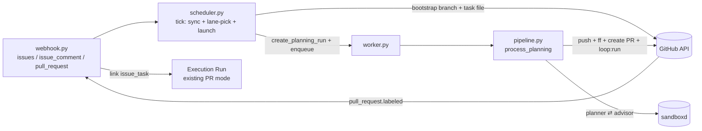

# Loop Backlog Mode (Phase 5a) Implementation Plan

> **For agentic workers:** REQUIRED SUB-SKILL: Use superpowers:subagent-driven-development (recommended) or superpowers:executing-plans to implement this plan task-by-task. Steps use checkbox (`- [ ]`) syntax for tracking.

**Goal:** Backlog mode on top of GitHub Issues: the `loop:ready` label → a scheduler with lane locks → a Planning Run (planner + Implementor Advisor + asynchronous questions) → a PR with `loop:run` → the existing Execution Run.

**Architecture:** An intake layer on top of the current pipeline (spec: `docs/superpowers/specs/2026-08-03-loop-backlog-phase5-design.md`). A new `issue_tasks` table, a `scheduler.py` module (idempotent `tick`), a new Run kind `kind="planning"` with its own state flow `queued → preparing → planning → publishing → reporting → done|failed`; execution is today's PR mode, started by the `loop:run` label on the PR the planner publishes.

**Tech Stack:** Python 3.12, FastAPI, aiosqlite, httpx, pytest (`asyncio_mode = "auto"`), respx.

## Locked Decisions

- `runs.kind` — `'pr' | 'planning'`; a planning Run has `pr_number = 0` until its PR exists (sentinel), `head_branch = loop/issue-<N>`. `active_run_for_pr` filters on `kind='pr'` — otherwise a planning Run that already got a `pr_number` would block Execution Run deduplication.
- The `planning` state joins `ACTIVE_STATES` and `CANCELABLE`; transitions: `preparing → planning`, `planning → {publishing, reporting, failed, cancelled}` (straight to `reporting` for the "questions" outcome).
- `issue_tasks`: `UNIQUE(repo, issue_number)`; states `backlog → running → done` plus `needs_info`, `failed`, `withdrawn`; `blocked_by` is a JSON array of **open** blocker numbers.
- The planner writes the spec to `<specs_dir>/issue-<N>-design.md` and the plan to `<plans_dir>/issue-<N>.md` (paths from `.loop.yml` — exactly where PR mode's `find_spec_plan_pair` looks for them).
- Planner protocol: the final message is JSON `{"outcome": "plan|questions", "summary", "questions"}`; the advisor's is `{"verdict": "approved|revise", "summary", "issues"}`.
- GitHub wire formats: task branch `loop/issue-<N>`, task file `.loop/task.md`, the PR body starts with `Closes #<N>.`, and the PR is a regular one (not a draft: a draft cannot be merged by the merge button from 4a).
- New settings: `LOOP_PLANNER_MODEL` (default `""` = the executor's model), `LOOP_ADVISOR_MODEL` (default `claude-fable-5`), `LOOP_PLAN_MAX_ITERATIONS` (default 3), `LOOP_BACKLOG_POLL_MINUTES` (default 5), `LOOP_BACKLOG_REPOS` (CSV, default `""`).

## Global Constraints

- English in every code string: prompts, GitHub comments, Telegram texts, task files.
- Settings — only through `Settings` (pydantic-settings, `LOOP_` prefix).
- Scheduler errors never take the service down: warning + next tick.
- Tests: pytest + the fakes from `tests/conftest.py`; the GitHub HTTP client via respx.
- Every task ends with a `python -m pytest tests -v` run — all tests green — and a commit.

## Architecture Diagram



---

### Task 1: Run model — kind, issue_number, lane, the planning state

**Files:**
- Modify: `src/loop_orchestrator/models.py`
- Modify: `src/loop_orchestrator/state_machine.py:20-30`
- Modify: `src/loop_orchestrator/db.py`
- Test: `tests/test_db.py`, `tests/test_state_machine.py`

**Interfaces:**
- Reuses: the `Run` dataclass, `SCHEMA`/`_MIGRATIONS`/`_RUN_FIELDS`/`save_run` in `db.py`, `TRANSITIONS` in `state_machine.py`.
- Produces: `models.PLANNING = "planning"`; fields `Run.kind: str = "pr"`, `Run.issue_number: int | None`, `Run.lane: str | None`; `db.create_planning_run(db, repo, issue_number, head_branch, title, lane) -> Run`; `db.active_run_for_issue(db, repo, issue_number) -> Run | None`; `db.previous_app_ids_for_issue(db, repo, issue_number, before_run_id) -> list[str]`; `active_run_for_pr` now considers only `kind='pr'`.

- [x] **Step 1: Write the failing tests**

Add to `tests/test_state_machine.py`:

```python
async def test_planning_flow_transitions(db):
    run = await dbmod.create_planning_run(db, "o/r", 7, "loop/issue-7", "T", None)
    await transition(db, run, PREPARING)
    await transition(db, run, PLANNING)
    await transition(db, run, PUBLISHING)
    await transition(db, run, REPORTING)
    await transition(db, run, DONE)


async def test_planning_to_reporting_directly(db):
    run = await dbmod.create_planning_run(db, "o/r", 7, "loop/issue-7", "T", None)
    await transition(db, run, PREPARING)
    await transition(db, run, PLANNING)
    await transition(db, run, REPORTING)  # questions outcome skips publishing
```

Add to `tests/test_db.py`:

```python
async def test_create_planning_run_defaults(db):
    run = await dbmod.create_planning_run(db, "o/r", 7, "loop/issue-7", "Fix login", "auth")
    assert run.kind == "planning"
    assert run.pr_number == 0
    assert run.issue_number == 7
    assert run.lane == "auth"
    assert run.pr_title == "Fix login"
    assert run.state == "queued"


async def test_active_run_for_pr_ignores_planning_runs(db):
    planning = await dbmod.create_planning_run(db, "o/r", 7, "loop/issue-7", "T", None)
    planning.pr_number = 5
    await dbmod.save_run(db, planning)
    assert await dbmod.active_run_for_pr(db, "o/r", 5) is None
    pr_run = await dbmod.create_run(db, "o/r", 5, "loop/issue-7")
    assert (await dbmod.active_run_for_pr(db, "o/r", 5)).id == pr_run.id


async def test_active_run_for_issue(db):
    run = await dbmod.create_planning_run(db, "o/r", 7, "loop/issue-7", "T", None)
    assert (await dbmod.active_run_for_issue(db, "o/r", 7)).id == run.id
    run.state = "failed"
    await dbmod.save_run(db, run)
    assert await dbmod.active_run_for_issue(db, "o/r", 7) is None


async def test_previous_app_ids_for_issue(db):
    old = await dbmod.create_planning_run(db, "o/r", 7, "loop/issue-7", "T", None)
    old.app_id = "app-old"
    old.state = "failed"
    await dbmod.save_run(db, old)
    new = await dbmod.create_planning_run(db, "o/r", 7, "loop/issue-7", "T", None)
    assert await dbmod.previous_app_ids_for_issue(db, "o/r", 7, new.id) == ["app-old"]
```

Extend the test imports with `PLANNING` from `loop_orchestrator.models`.

- [x] **Step 2: Run tests to verify they fail**

Run: `python -m pytest tests/test_db.py tests/test_state_machine.py -v`
Expected: FAIL — `AttributeError`/`ImportError` (no `create_planning_run`, no `PLANNING`).

- [x] **Step 3: Implement**

`models.py` — add after `CANCELLED`:

```python
PLANNING = "planning"
```

Replace `ACTIVE_STATES` and `CANCELABLE`:

```python
ACTIVE_STATES = {QUEUED, PREPARING, PLANNING, EXECUTING, REVIEWING, E2E_TESTING,
                 STAGING, AWAITING_APPROVAL, PUBLISHING, REPORTING}

# States from which a human may cancel a run (before its work is staged).
CANCELABLE = {QUEUED, PREPARING, PLANNING, EXECUTING, REVIEWING, E2E_TESTING}
```

Append these fields to `Run`:

```python
    kind: str = "pr"  # pr | planning
    issue_number: int | None = None
    lane: str | None = None
```

`state_machine.py` — import `PLANNING`, update two transitions:

```python
    PREPARING: {EXECUTING, PLANNING, FAILED, CANCELLED},
    ...
    PLANNING: {PUBLISHING, REPORTING, FAILED, CANCELLED},
```

`db.py`:
- in the `runs` table `SCHEMA`, after `tg_approval_message_id INTEGER,`, add the lines `kind TEXT NOT NULL DEFAULT 'pr',`, `issue_number INTEGER,`, `lane TEXT,`;
- add `"kind", "issue_number", "lane"` to `_RUN_FIELDS`;
- add `("kind", "TEXT NOT NULL DEFAULT 'pr'"), ("issue_number", "INTEGER"), ("lane", "TEXT")` to `_MIGRATIONS`;
- in `save_run`, add `kind=?, issue_number=?, lane=?` to the SET clause and `run.kind, run.issue_number, run.lane` to the parameters (before `run.id`);
- in `active_run_for_pr`, replace the condition with `WHERE repo = ? AND pr_number = ? AND kind = 'pr' AND state IN (...)`;
- add the functions:

```python
async def create_planning_run(db: aiosqlite.Connection, repo: str, issue_number: int,
                              head_branch: str, title: str | None, lane: str | None) -> Run:
    cur = await db.execute(
        "INSERT INTO runs (repo, pr_number, head_branch, state, pr_title, kind, "
        "issue_number, lane) VALUES (?, 0, ?, ?, ?, 'planning', ?, ?)",
        (repo, head_branch, QUEUED, title, issue_number, lane),
    )
    await db.commit()
    run = await get_run(db, cur.lastrowid)
    await add_event(db, run.id, None, QUEUED)
    return run


async def active_run_for_issue(db: aiosqlite.Connection, repo: str, issue_number: int) -> Run | None:
    marks = ",".join("?" * len(ACTIVE_STATES))
    async with db.execute(
        f"SELECT * FROM runs WHERE repo = ? AND issue_number = ? AND state IN ({marks}) LIMIT 1",
        (repo, issue_number, *ACTIVE_STATES),
    ) as cur:
        row = await cur.fetchone()
    return _to_run(row) if row else None


async def previous_app_ids_for_issue(db: aiosqlite.Connection, repo: str,
                                     issue_number: int, before_run_id: int) -> list[str]:
    async with db.execute(
        "SELECT DISTINCT app_id FROM runs WHERE repo=? AND issue_number=? "
        "AND id<? AND app_id IS NOT NULL",
        (repo, issue_number, before_run_id),
    ) as cur:
        rows = await cur.fetchall()
    return [r["app_id"] for r in rows]
```

- [x] **Step 4: Run the full suite**

Run: `python -m pytest tests -v`
Expected: PASS (existing tests are untouched: `kind='pr'` is the default).

- [x] **Step 5: Commit**

```bash
git add src/loop_orchestrator/models.py src/loop_orchestrator/state_machine.py src/loop_orchestrator/db.py tests/test_db.py tests/test_state_machine.py
git commit -m "feat: planning run kind, issue fields and planning state"
```

---

### Task 2: The issue_tasks table and its CRUD

**Files:**
- Create: `src/loop_orchestrator/issue_tasks.py`
- Modify: `src/loop_orchestrator/db.py:8-52` (SCHEMA)
- Test: `tests/test_issue_tasks.py`

**Interfaces:**
- Reuses: `db.connect` (executescript applies the new CREATE TABLE), the Row-mapping pattern from `db.py`.
- Produces: the constants `BACKLOG, RUNNING, DONE, NEEDS_INFO, FAILED, WITHDRAWN`; the dataclass `IssueTask(id, repo, issue_number, title, lane, state, blocked_by: list[int], run_id, topic_id, updated_at)`; the functions `upsert_task(db, repo, issue_number, title, lane) -> IssueTask`, `get_task(db, repo, issue_number) -> IssueTask | None`, `tasks_for_repo(db, repo) -> list[IssueTask]` (ORDER BY issue_number), `set_state(db, repo, issue_number, state)`, `set_blocked_by(db, repo, issue_number, blockers: list[int])`, `set_run(db, repo, issue_number, run_id)`, `set_topic(db, repo, issue_number, topic_id)`, `repos_with_tasks(db) -> list[str]`.

- [x] **Step 1: Write the failing tests**

`tests/test_issue_tasks.py`:

```python
from loop_orchestrator import issue_tasks as it


async def test_upsert_creates_backlog_task(db):
    task = await it.upsert_task(db, "o/r", 7, "Fix login", "auth")
    assert (task.state, task.lane, task.blocked_by) == (it.BACKLOG, "auth", [])


async def test_upsert_updates_title_and_lane_but_not_state(db):
    await it.upsert_task(db, "o/r", 7, "Fix login", "auth")
    await it.set_state(db, "o/r", 7, it.RUNNING)
    task = await it.upsert_task(db, "o/r", 7, "Fix login v2", None)
    assert (task.title, task.lane, task.state) == ("Fix login v2", None, it.RUNNING)


async def test_blocked_by_roundtrip(db):
    await it.upsert_task(db, "o/r", 7, "T", None)
    await it.set_blocked_by(db, "o/r", 7, [3, 5])
    assert (await it.get_task(db, "o/r", 7)).blocked_by == [3, 5]


async def test_tasks_for_repo_ordered_fifo(db):
    await it.upsert_task(db, "o/r", 9, "B", None)
    await it.upsert_task(db, "o/r", 7, "A", None)
    await it.upsert_task(db, "other/r", 1, "X", None)
    assert [t.issue_number for t in await it.tasks_for_repo(db, "o/r")] == [7, 9]


async def test_run_topic_and_repos(db):
    await it.upsert_task(db, "o/r", 7, "T", None)
    await it.set_run(db, "o/r", 7, 42)
    await it.set_topic(db, "o/r", 7, 777)
    task = await it.get_task(db, "o/r", 7)
    assert (task.run_id, task.topic_id) == (42, 777)
    assert await it.repos_with_tasks(db) == ["o/r"]
```

- [x] **Step 2: Run tests to verify they fail**

Run: `python -m pytest tests/test_issue_tasks.py -v`
Expected: FAIL — `ModuleNotFoundError: loop_orchestrator.issue_tasks`.

- [x] **Step 3: Implement**

In `db.py`, append to the end of `SCHEMA` (after `run_events`):

```sql
CREATE TABLE IF NOT EXISTS issue_tasks (
  id INTEGER PRIMARY KEY AUTOINCREMENT,
  repo TEXT NOT NULL,
  issue_number INTEGER NOT NULL,
  title TEXT NOT NULL DEFAULT '',
  lane TEXT,
  state TEXT NOT NULL DEFAULT 'backlog',
  blocked_by TEXT NOT NULL DEFAULT '[]',
  run_id INTEGER,
  topic_id INTEGER,
  created_at TEXT NOT NULL DEFAULT (datetime('now')),
  updated_at TEXT NOT NULL DEFAULT (datetime('now')),
  UNIQUE(repo, issue_number)
);
```

`src/loop_orchestrator/issue_tasks.py`:

```python
"""Backlog mirror: one row per loop:ready GitHub issue.

GitHub is the source of truth; the scheduler rebuilds these rows on every
tick, so any conflict resolves in GitHub's favour by construction.
"""
import json
from dataclasses import dataclass

import aiosqlite

BACKLOG = "backlog"
RUNNING = "running"
DONE = "done"
NEEDS_INFO = "needs_info"
FAILED = "failed"
WITHDRAWN = "withdrawn"


@dataclass
class IssueTask:
    id: int
    repo: str
    issue_number: int
    title: str
    lane: str | None
    state: str
    blocked_by: list[int]
    run_id: int | None
    topic_id: int | None
    updated_at: str


def _to_task(row: aiosqlite.Row) -> IssueTask:
    return IssueTask(
        id=row["id"], repo=row["repo"], issue_number=row["issue_number"],
        title=row["title"], lane=row["lane"], state=row["state"],
        blocked_by=json.loads(row["blocked_by"]), run_id=row["run_id"],
        topic_id=row["topic_id"], updated_at=row["updated_at"])


async def upsert_task(db: aiosqlite.Connection, repo: str, issue_number: int,
                      title: str, lane: str | None) -> IssueTask:
    await db.execute(
        "INSERT INTO issue_tasks (repo, issue_number, title, lane) VALUES (?, ?, ?, ?) "
        "ON CONFLICT(repo, issue_number) DO UPDATE SET title=excluded.title, "
        "lane=excluded.lane, updated_at=datetime('now')",
        (repo, issue_number, title, lane))
    await db.commit()
    return await get_task(db, repo, issue_number)


async def get_task(db: aiosqlite.Connection, repo: str, issue_number: int) -> IssueTask | None:
    async with db.execute(
            "SELECT * FROM issue_tasks WHERE repo=? AND issue_number=?",
            (repo, issue_number)) as cur:
        row = await cur.fetchone()
    return _to_task(row) if row else None


async def tasks_for_repo(db: aiosqlite.Connection, repo: str) -> list[IssueTask]:
    async with db.execute(
            "SELECT * FROM issue_tasks WHERE repo=? ORDER BY issue_number",
            (repo,)) as cur:
        rows = await cur.fetchall()
    return [_to_task(r) for r in rows]


async def _set(db: aiosqlite.Connection, repo: str, issue_number: int,
               column: str, value) -> None:
    await db.execute(
        f"UPDATE issue_tasks SET {column}=?, updated_at=datetime('now') "
        "WHERE repo=? AND issue_number=?",
        (value, repo, issue_number))
    await db.commit()


async def set_state(db, repo, issue_number, state: str) -> None:
    await _set(db, repo, issue_number, "state", state)


async def set_blocked_by(db, repo, issue_number, blockers: list[int]) -> None:
    await _set(db, repo, issue_number, "blocked_by", json.dumps(sorted(blockers)))


async def set_run(db, repo, issue_number, run_id: int) -> None:
    await _set(db, repo, issue_number, "run_id", run_id)


async def set_topic(db, repo, issue_number, topic_id: int | None) -> None:
    await _set(db, repo, issue_number, "topic_id", topic_id)


async def repos_with_tasks(db: aiosqlite.Connection) -> list[str]:
    async with db.execute("SELECT DISTINCT repo FROM issue_tasks ORDER BY repo") as cur:
        rows = await cur.fetchall()
    return [r["repo"] for r in rows]
```

- [x] **Step 4: Run tests**

Run: `python -m pytest tests/test_issue_tasks.py tests/test_db.py -v`
Expected: PASS.

- [x] **Step 5: Commit**

```bash
git add src/loop_orchestrator/issue_tasks.py src/loop_orchestrator/db.py tests/test_issue_tasks.py
git commit -m "feat: issue_tasks backlog table and CRUD"
```

---

### Task 3: GitHubClient — issues, dependencies, branches, PRs

**Files:**
- Modify: `src/loop_orchestrator/clients/github.py`
- Modify: `tests/conftest.py` (FakeGitHub)
- Test: `tests/test_github_client.py`

**Interfaces:**
- Reuses: `GitHubClient._req` (retry), `LOOP_LABELS`, the respx pattern from `tests/test_github_client.py`.
- Produces: `get_repo_default_branch(repo) -> str`; `get_branch_sha(repo, branch) -> str | None` (404 → None); `create_branch(repo, branch, sha)` (422 "exists" is fine); `put_file(repo, branch, path, content, message)` (create-or-update via sha); `create_pr(repo, head, base, title, body) -> int`; `list_ready_issues(repo, label="loop:ready") -> list[dict]` (PRs excluded); `issue_blocked_by(repo, number) -> list[int]` (numbers of **open** blockers; 404/410 → `[]`); `list_issue_comments(repo, number, since=None) -> list[dict]`; `get_issue(repo, number) -> dict`. `LOOP_LABELS` += `loop:ready`.

- [x] **Step 1: Write the failing tests**

Add to `tests/test_github_client.py` (following the respx test pattern already in that file):

```python
@respx.mock
async def test_get_branch_sha_none_on_404():
    respx.get("https://api.github.com/repos/o/r/git/ref/heads/loop/issue-7").mock(
        return_value=httpx.Response(404))
    gh = GitHubClient("t")
    assert await gh.get_branch_sha("o", "loop/issue-7") is None  # see Step 3: signature is (repo, branch)


@respx.mock
async def test_create_branch_tolerates_existing():
    route = respx.post("https://api.github.com/repos/o/r/git/refs").mock(
        return_value=httpx.Response(422))
    gh = GitHubClient("t")
    await gh.create_branch("o/r", "loop/issue-7", "abc")
    assert route.called


@respx.mock
async def test_put_file_updates_with_existing_sha():
    respx.get("https://api.github.com/repos/o/r/contents/.loop/task.md").mock(
        return_value=httpx.Response(200, json={"sha": "oldsha", "content": ""}))
    put = respx.put("https://api.github.com/repos/o/r/contents/.loop/task.md").mock(
        return_value=httpx.Response(200, json={}))
    gh = GitHubClient("t")
    await gh.put_file("o/r", "loop/issue-7", ".loop/task.md", "body", "msg")
    sent = json.loads(put.calls[0].request.content)
    assert sent["sha"] == "oldsha" and sent["branch"] == "loop/issue-7"


@respx.mock
async def test_create_pr_returns_number():
    respx.post("https://api.github.com/repos/o/r/pulls").mock(
        return_value=httpx.Response(201, json={"number": 51}))
    gh = GitHubClient("t")
    assert await gh.create_pr("o/r", "loop/issue-7", "main", "T", "Closes #7.") == 51


@respx.mock
async def test_list_ready_issues_filters_prs():
    respx.get("https://api.github.com/repos/o/r/issues").mock(
        return_value=httpx.Response(200, json=[
            {"number": 7, "title": "A"},
            {"number": 8, "title": "PR", "pull_request": {}},
        ]))
    gh = GitHubClient("t")
    assert [i["number"] for i in await gh.list_ready_issues("o/r")] == [7]


@respx.mock
async def test_issue_blocked_by_open_only_and_absent_api():
    respx.get("https://api.github.com/repos/o/r/issues/9/dependencies/blocked_by").mock(
        return_value=httpx.Response(200, json=[
            {"number": 3, "state": "open"}, {"number": 4, "state": "closed"}]))
    respx.get("https://api.github.com/repos/o/r/issues/10/dependencies/blocked_by").mock(
        return_value=httpx.Response(404))
    gh = GitHubClient("t")
    assert await gh.issue_blocked_by("o/r", 9) == [3]
    assert await gh.issue_blocked_by("o/r", 10) == []
```

(Fix the call in the first test to `gh.get_branch_sha("o/r", "loop/issue-7")` — repo is always `owner/name`.)

- [x] **Step 2: Run tests to verify they fail**

Run: `python -m pytest tests/test_github_client.py -v`
Expected: FAIL — `AttributeError` on the new methods.

- [x] **Step 3: Implement**

Add `"loop:ready": "5319e7",` to `LOOP_LABELS`. Add to the `GitHubClient` class:

```python
    async def get_repo_default_branch(self, repo: str) -> str:
        r = await self._req("GET", f"/repos/{repo}")
        r.raise_for_status()
        return r.json()["default_branch"]

    async def get_branch_sha(self, repo: str, branch: str) -> str | None:
        r = await self._req("GET", f"/repos/{repo}/git/ref/heads/{branch}")
        if r.status_code == 404:
            return None
        r.raise_for_status()
        return r.json()["object"]["sha"]

    async def create_branch(self, repo: str, branch: str, sha: str) -> None:
        r = await self._req("POST", f"/repos/{repo}/git/refs",
                            json={"ref": f"refs/heads/{branch}", "sha": sha})
        if r.status_code != 422:  # 422 = reference already exists
            r.raise_for_status()

    async def put_file(self, repo: str, branch: str, path: str,
                       content: str, message: str) -> None:
        existing = await self._req("GET", f"/repos/{repo}/contents/{path}",
                                   params={"ref": branch})
        body = {"message": message, "branch": branch,
                "content": base64.b64encode(content.encode()).decode()}
        if existing.status_code == 200:
            body["sha"] = existing.json()["sha"]
        r = await self._req("PUT", f"/repos/{repo}/contents/{path}", json=body)
        r.raise_for_status()

    async def create_pr(self, repo: str, head: str, base: str,
                        title: str, body: str) -> int:
        r = await self._req("POST", f"/repos/{repo}/pulls",
                            json={"title": title, "head": head,
                                  "base": base, "body": body})
        r.raise_for_status()
        return r.json()["number"]

    async def list_ready_issues(self, repo: str, label: str = "loop:ready") -> list[dict]:
        issues: list[dict] = []
        page = 1
        while True:
            r = await self._req("GET", f"/repos/{repo}/issues",
                                params={"labels": label, "state": "open",
                                        "per_page": 100, "page": page})
            r.raise_for_status()
            batch = r.json()
            issues += [i for i in batch if "pull_request" not in i]
            if len(batch) < 100:
                return issues
            page += 1

    async def issue_blocked_by(self, repo: str, number: int) -> list[int]:
        """Numbers of OPEN issues this one is blocked by (native dependencies).

        Repos/plans without the dependencies feature answer 404/410 — treated
        as "no blockers" so the scheduler keeps working.
        """
        r = await self._req("GET",
                            f"/repos/{repo}/issues/{number}/dependencies/blocked_by")
        if r.status_code in (404, 410):
            return []
        r.raise_for_status()
        return [i["number"] for i in r.json() if i.get("state") == "open"]

    async def list_issue_comments(self, repo: str, number: int,
                                  since: str | None = None) -> list[dict]:
        params: dict = {"per_page": 100}
        if since:
            params["since"] = since
        r = await self._req("GET", f"/repos/{repo}/issues/{number}/comments",
                            params=params)
        r.raise_for_status()
        return r.json()

    async def get_issue(self, repo: str, number: int) -> dict:
        r = await self._req("GET", f"/repos/{repo}/issues/{number}")
        r.raise_for_status()
        return r.json()
```

Extend `FakeGitHub.__init__` in `tests/conftest.py`:

```python
        self.default_branch = "main"
        self.ready_issues: list[dict] = []          # list_ready_issues response
        self.issues: dict[int, dict] = {}           # get_issue responses
        self.blocked: dict[int, list[int]] = {}     # issue_blocked_by responses
        self.issue_comments: dict[int, list[dict]] = {}
        self.branches_created: list[tuple[str, str]] = []
        self.files_put: list[tuple[str, str, str]] = []  # (branch, path, content)
        self.prs_created: list[dict] = []
```

and the methods:

```python
    async def get_repo_default_branch(self, repo):
        return self.default_branch

    async def get_branch_sha(self, repo, branch):
        return self.branch_shas.get(branch)

    async def create_branch(self, repo, branch, sha):
        self.branches_created.append((branch, sha))
        self.branch_shas[branch] = sha

    async def put_file(self, repo, branch, path, content, message):
        self.files_put.append((branch, path, content))

    async def create_pr(self, repo, head, base, title, body):
        self.prs_created.append({"head": head, "base": base,
                                 "title": title, "body": body})
        return 500 + len(self.prs_created)

    async def list_ready_issues(self, repo, label="loop:ready"):
        return self.ready_issues

    async def issue_blocked_by(self, repo, number):
        return self.blocked.get(number, [])

    async def list_issue_comments(self, repo, number, since=None):
        return self.issue_comments.get(number, [])

    async def get_issue(self, repo, number):
        return self.issues.get(number, {"number": number, "state": "open"})
```

- [x] **Step 4: Run tests**

Run: `python -m pytest tests -v`
Expected: PASS.

- [x] **Step 5: Commit**

```bash
git add src/loop_orchestrator/clients/github.py tests/conftest.py tests/test_github_client.py
git commit -m "feat: github client issue/branch/pr endpoints for backlog mode"
```

---

### Task 4: The planning protocol — prompts and parsers (`planning.py`)

**Files:**
- Create: `src/loop_orchestrator/planning.py`
- Test: `tests/test_planning.py`

**Interfaces:**
- Reuses: the style of `review.py` (`_JSON_RE`, verdict dataclasses, `*_SCHEMA` strings), `loopconfig.plans_dir`.
- Produces: `PlannerResult(outcome: str, summary: str, questions: list[str])`; `AdvisorVerdict(verdict: str, summary: str, issues: list[str])`; `PlanningError(Exception)`; `parse_planner_output(text) -> PlannerResult`; `parse_advisor_verdict(text) -> AdvisorVerdict`; `plan_paths(specs_dir, issue_number) -> tuple[str, str]`; `build_planner_prompt(issue_number, spec_path, plan_path, setup_cmd)`; `build_planner_revise_prompt(verdict)`; `build_advisor_prompt(spec_path, plan_path)`; the constant `TASK_FILE = ".loop/task.md"`; `build_task_file(issue: dict, comments: list[dict]) -> str`.

- [x] **Step 1: Write the failing tests**

`tests/test_planning.py`:

```python
import pytest

from loop_orchestrator.planning import (
    PlanningError,
    build_advisor_prompt,
    build_planner_prompt,
    build_planner_revise_prompt,
    build_task_file,
    parse_advisor_verdict,
    parse_planner_output,
    plan_paths,
)


def test_plan_paths_follow_loopconfig_convention():
    assert plan_paths("docs/superpowers/specs", 7) == (
        "docs/superpowers/specs/issue-7-design.md",
        "docs/superpowers/plans/issue-7.md")


def test_parse_planner_output_plan():
    out = parse_planner_output('done\n{"outcome": "plan", "summary": "Two tasks."}')
    assert (out.outcome, out.summary, out.questions) == ("plan", "Two tasks.", [])


def test_parse_planner_output_questions():
    out = parse_planner_output('{"outcome": "questions", "questions": ["Which DB?"]}')
    assert out.outcome == "questions"
    assert out.questions == ["Which DB?"]


def test_parse_planner_output_rejects_garbage():
    with pytest.raises(PlanningError):
        parse_planner_output("no json here")
    with pytest.raises(PlanningError):
        parse_planner_output('{"outcome": "maybe"}')
    with pytest.raises(PlanningError):
        parse_planner_output('{"outcome": "questions", "questions": []}')


def test_parse_advisor_verdict():
    v = parse_advisor_verdict('{"verdict": "revise", "summary": "Gaps.", '
                              '"issues": ["No rollback step"]}')
    assert (v.verdict, v.issues) == ("revise", ["No rollback step"])
    with pytest.raises(PlanningError):
        parse_advisor_verdict('{"verdict": "revise", "issues": []}')


def test_prompts_mention_paths_and_schema():
    p = build_planner_prompt(7, "s/issue-7-design.md", "p/issue-7.md", "make setup")
    assert ".loop/task.md" in p and "s/issue-7-design.md" in p and "make setup" in p
    a = build_advisor_prompt("s/issue-7-design.md", "p/issue-7.md")
    assert "approved | revise" in a
    r = build_planner_revise_prompt(parse_advisor_verdict(
        '{"verdict": "revise", "summary": "s", "issues": ["fix X"]}'))
    assert "fix X" in r


def test_build_task_file_snapshot():
    text = build_task_file(
        {"number": 7, "title": "Fix login", "body": "Steps...",
         "labels": [{"name": "loop:ready"}, {"name": "loop:lane:auth"}]},
        [{"user": {"login": "alice"}, "body": "Also check SSO."}])
    assert "# Issue #7: Fix login" in text
    assert "loop:lane:auth" in text
    assert "alice" in text and "Also check SSO." in text
```

- [x] **Step 2: Run tests to verify they fail**

Run: `python -m pytest tests/test_planning.py -v`
Expected: FAIL — `ModuleNotFoundError`.

- [x] **Step 3: Implement**

`src/loop_orchestrator/planning.py`:

```python
"""Planning protocol: planner/advisor prompts, JSON parsing, task snapshot."""
import json
import re
from dataclasses import dataclass, field

from .loopconfig import plans_dir

TASK_FILE = ".loop/task.md"

_JSON_RE = re.compile(r"\{.*\}", re.DOTALL)


class PlanningError(Exception):
    pass


@dataclass
class PlannerResult:
    outcome: str  # "plan" | "questions"
    summary: str = ""
    questions: list[str] = field(default_factory=list)


@dataclass
class AdvisorVerdict:
    verdict: str  # "approved" | "revise"
    summary: str = ""
    issues: list[str] = field(default_factory=list)


def plan_paths(specs_dir: str, issue_number: int) -> tuple[str, str]:
    """Spec/plan locations the PR-mode pipeline will find via find_spec_plan_pair."""
    return (f"{specs_dir}/issue-{issue_number}-design.md",
            f"{plans_dir(specs_dir)}/issue-{issue_number}.md")


def _extract_json(text: str) -> dict:
    m = _JSON_RE.search(text or "")
    if not m:
        raise PlanningError("no JSON object in the agent message")
    try:
        data = json.loads(m.group(0))
    except json.JSONDecodeError as e:
        raise PlanningError(f"invalid JSON: {e}") from e
    return data


def parse_planner_output(text: str) -> PlannerResult:
    data = _extract_json(text)
    outcome = data.get("outcome")
    if outcome == "plan":
        return PlannerResult(outcome="plan", summary=str(data.get("summary") or ""))
    if outcome == "questions":
        questions = [str(q) for q in (data.get("questions") or []) if str(q).strip()]
        if not questions:
            raise PlanningError("outcome=questions but the questions list is empty")
        return PlannerResult(outcome="questions", questions=questions)
    raise PlanningError(f"unknown planner outcome: {outcome!r}")


def parse_advisor_verdict(text: str) -> AdvisorVerdict:
    data = _extract_json(text)
    verdict = data.get("verdict")
    if verdict not in ("approved", "revise"):
        raise PlanningError(f"unknown advisor verdict: {verdict!r}")
    issues = [str(i) for i in (data.get("issues") or []) if str(i).strip()]
    if verdict == "revise" and not issues:
        raise PlanningError("verdict=revise but the issues list is empty")
    return AdvisorVerdict(verdict=verdict, summary=str(data.get("summary") or ""),
                          issues=issues)


PLANNER_OUTPUT_SCHEMA = """{
  "outcome": "plan | questions",
  "summary": "for outcome=plan: 2-4 sentence overview of the planned work",
  "questions": ["for outcome=questions: concrete questions for the issue author"]
}"""

ADVISOR_VERDICT_SCHEMA = """{
  "verdict": "approved | revise",
  "summary": "1-2 sentence overall assessment",
  "issues": ["concrete problems the planner must fix (empty when approved)"]
}"""


def build_planner_prompt(issue_number: int, spec_path: str, plan_path: str,
                         setup_cmd: str | None = None) -> str:
    setup_line = (f"First install the project dependencies with `{setup_cmd}`.\n"
                  if setup_cmd else "")
    return (
        "You are a planning agent for this repository.\n"
        f"The task is described in {TASK_FILE} — a snapshot of GitHub issue "
        f"#{issue_number} including its discussion thread.\n\n"
        + setup_line +
        "Study the repository and the task, then produce two documents:\n"
        f"1. Specification (what to build, why, acceptance criteria): {spec_path}\n"
        f"2. Implementation plan (ordered tasks, files to touch, test steps): {plan_path}\n"
        "Write both files and make a single git commit containing them. "
        "Do not git push. Do not switch branches. Do not implement the feature itself.\n"
        "If the issue is critically underspecified and you cannot plan responsibly, "
        "write no files and ask the author instead.\n\n"
        "Your FINAL message must be a single JSON object and nothing else, "
        "matching exactly this schema:\n"
        f"{PLANNER_OUTPUT_SCHEMA}"
    )


def build_planner_revise_prompt(verdict: AdvisorVerdict) -> str:
    issues = "\n".join(f"- {i}" for i in verdict.issues)
    return (
        "The Implementor Advisor reviewed your specification and plan and "
        "requires changes before implementation can start.\n\n"
        f"Advisor summary: {verdict.summary}\n"
        f"Issues to address:\n{issues}\n\n"
        "Update the specification and plan files accordingly and commit the "
        "changes. Do not git push. Do not switch branches.\n"
        "Finish with the same JSON schema as before:\n"
        f"{PLANNER_OUTPUT_SCHEMA}"
    )


def build_advisor_prompt(spec_path: str, plan_path: str) -> str:
    return (
        "You are the Implementor Advisor: a senior engineer who decides whether "
        "a prepared plan is ready to be implemented by an autonomous agent.\n"
        f"Task: {TASK_FILE}\n"
        f"Specification: {spec_path}\n"
        f"Plan: {plan_path}\n\n"
        "Read all three documents and check them against the repository: "
        "feasibility, completeness, hidden risks, missing acceptance criteria, "
        "and whether the plan actually solves the issue.\n"
        "Do NOT modify, commit or push anything — you only advise.\n\n"
        "Your FINAL message must be a single JSON object and nothing else, "
        "matching exactly this schema:\n"
        f"{ADVISOR_VERDICT_SCHEMA}"
    )


def build_task_file(issue: dict, comments: list[dict]) -> str:
    labels = ", ".join(
        (l["name"] if isinstance(l, dict) else str(l))
        for l in (issue.get("labels") or []))
    lines = [f"# Issue #{issue['number']}: {issue.get('title') or ''}", ""]
    if labels:
        lines += [f"Labels: {labels}", ""]
    lines += [issue.get("body") or "(no description)", ""]
    if comments:
        lines += ["## Discussion", ""]
        for c in comments:
            author = (c.get("user") or {}).get("login") or "unknown"
            lines += [f"**{author}:**", c.get("body") or "", ""]
    return "\n".join(lines)
```

- [x] **Step 4: Run tests**

Run: `python -m pytest tests/test_planning.py -v`
Expected: PASS.

- [x] **Step 5: Commit**

```bash
git add src/loop_orchestrator/planning.py tests/test_planning.py
git commit -m "feat: planning protocol - planner/advisor prompts and parsers"
```

---

### Task 5: Bootstrapping the task branch (`scheduler.py`, part 1)

**Files:**
- Create: `src/loop_orchestrator/scheduler.py`
- Test: `tests/test_scheduler_bootstrap.py`

**Interfaces:**
- Reuses: `planning.build_task_file`, `planning.TASK_FILE`, the `GitHubClient` methods from Task 3, `FakeGitHub` from conftest.
- Produces: `branch_for_issue(issue_number) -> str` (`loop/issue-<N>`); `lane_from_labels(labels: list) -> str | None`; `async bootstrap(gh, repo, issue: dict, comments: list[dict]) -> str` — idempotent: the branch is created once off the default branch, the task file is refreshed on every call.

- [x] **Step 1: Write the failing tests**

`tests/test_scheduler_bootstrap.py`:

```python
from tests.conftest import FakeGitHub

from loop_orchestrator.scheduler import bootstrap, branch_for_issue, lane_from_labels


def test_branch_and_lane_helpers():
    assert branch_for_issue(7) == "loop/issue-7"
    assert lane_from_labels([{"name": "loop:ready"}, {"name": "loop:lane:auth"}]) == "auth"
    assert lane_from_labels([{"name": "loop:ready"}]) is None


async def test_bootstrap_creates_branch_and_task_file():
    gh = FakeGitHub()
    gh.branch_shas["main"] = "basesha"
    branch = await bootstrap(gh, "o/r", {"number": 7, "title": "T", "body": "B",
                                         "labels": []}, [])
    assert branch == "loop/issue-7"
    assert gh.branches_created == [("loop/issue-7", "basesha")]
    assert gh.files_put[0][0:2] == ("loop/issue-7", ".loop/task.md")
    assert "# Issue #7" in gh.files_put[0][2]


async def test_bootstrap_is_idempotent_for_existing_branch():
    gh = FakeGitHub()
    gh.branch_shas["main"] = "basesha"
    gh.branch_shas["loop/issue-7"] = "existing"
    await bootstrap(gh, "o/r", {"number": 7, "title": "T", "body": "B",
                                "labels": []}, [])
    assert gh.branches_created == []          # branch untouched
    assert len(gh.files_put) == 1             # task file refreshed
```

- [x] **Step 2: Run tests to verify they fail**

Run: `python -m pytest tests/test_scheduler_bootstrap.py -v`
Expected: FAIL — `ModuleNotFoundError: loop_orchestrator.scheduler`.

- [x] **Step 3: Implement**

`src/loop_orchestrator/scheduler.py` (first part of the file):

```python
"""Backlog scheduler: GitHub issues -> lane-aware planning runs.

bootstrap() prepares the per-issue branch the sandbox will import; the
Scheduler class (added in the next task) owns sync/pick/launch.
"""
import logging

from .planning import TASK_FILE, build_task_file

log = logging.getLogger(__name__)

LANE_PREFIX = "loop:lane:"


def branch_for_issue(issue_number: int) -> str:
    return f"loop/issue-{issue_number}"


def lane_from_labels(labels: list) -> str | None:
    for label in labels or []:
        name = label["name"] if isinstance(label, dict) else str(label)
        if name.startswith(LANE_PREFIX):
            return name[len(LANE_PREFIX):]
    return None


async def bootstrap(gh, repo: str, issue: dict, comments: list[dict]) -> str:
    """Ensure the issue branch exists and holds a fresh task snapshot.

    The branch must exist BEFORE the sandbox app is created (sandboxd cannot
    change an app's branch later); the task-file commit also provides the
    diff the future PR needs.
    """
    number = issue["number"]
    branch = branch_for_issue(number)
    if await gh.get_branch_sha(repo, branch) is None:
        base = await gh.get_repo_default_branch(repo)
        base_sha = await gh.branch_sha(repo, base)
        await gh.create_branch(repo, branch, base_sha)
    await gh.put_file(repo, branch, TASK_FILE, build_task_file(issue, comments),
                      f"loop: task snapshot for issue #{number}")
    return branch
```

- [x] **Step 4: Run tests**

Run: `python -m pytest tests/test_scheduler_bootstrap.py -v`
Expected: PASS.

- [x] **Step 5: Commit**

```bash
git add src/loop_orchestrator/scheduler.py tests/test_scheduler_bootstrap.py
git commit -m "feat: issue branch bootstrap with task snapshot"
```

---

### Task 6: Scheduler — sync, lane picking, launch, tick, polling

**Files:**
- Modify: `src/loop_orchestrator/scheduler.py`
- Modify: `src/loop_orchestrator/config.py`
- Modify: `tests/conftest.py` (FakeSettings)
- Test: `tests/test_scheduler.py`

**Interfaces:**
- Reuses: the `issue_tasks` CRUD (Task 2), `db.create_planning_run`/`get_run` (Task 1), `bootstrap` (Task 5), the reaper pattern of `worker._reap_loop`, `models.FAILED/CANCELLED/DONE`.
- Consumes: `worker.enqueue(run_id)` (existing).
- Produces: the pure `pick_candidates(backlog: list[IssueTask], running: list[IssueTask]) -> list[IssueTask]`; the class `Scheduler(db, settings, gh, worker)` with `async tick(repo)` (idempotent, under an `asyncio.Lock`, errors become warnings), `async start()`, `async stop()`. `Settings` += `backlog_poll_minutes: int = 5`, `backlog_repos: str = ""`, and the method `backlog_repo_list() -> list[str]`.

- [x] **Step 1: Write the failing tests**

`tests/test_scheduler.py`:

```python
from tests.conftest import FakeGitHub, FakeSettings

from loop_orchestrator import db as dbmod
from loop_orchestrator import issue_tasks as it
from loop_orchestrator.issue_tasks import IssueTask
from loop_orchestrator.scheduler import Scheduler, pick_candidates


def _task(n, lane, state=it.BACKLOG, blocked=()):
    return IssueTask(id=n, repo="o/r", issue_number=n, title=f"T{n}", lane=lane,
                     state=state, blocked_by=list(blocked), run_id=None,
                     topic_id=None, updated_at="2026-08-03 00:00:00")


class FakeWorker:
    def __init__(self):
        self.enqueued: list[int] = []

    def enqueue(self, run_id):
        self.enqueued.append(run_id)


def _issue(n, labels=("loop:ready",), state="open"):
    return {"number": n, "title": f"T{n}", "body": "b", "state": state,
            "labels": [{"name": l} for l in labels]}


def test_pick_different_lanes_run_in_parallel():
    picked = pick_candidates([_task(1, "auth"), _task(2, "billing")], [])
    assert [t.issue_number for t in picked] == [1, 2]


def test_pick_same_lane_is_a_strict_queue():
    picked = pick_candidates([_task(2, "auth")], [_task(1, "auth", it.RUNNING)])
    assert picked == []


def test_pick_exclusive_task_waits_for_empty_repo_and_blocks_others():
    assert pick_candidates([_task(2, None)], [_task(1, "auth", it.RUNNING)]) == []
    assert pick_candidates([_task(2, "auth")], [_task(1, None, it.RUNNING)]) == []
    picked = pick_candidates([_task(1, None), _task(2, "auth")], [])
    assert [t.issue_number for t in picked] == [1]  # exclusive runs alone


async def test_tick_launches_planning_run_for_ready_issue(db):
    gh = FakeGitHub()
    gh.branch_shas["main"] = "base"
    gh.ready_issues = [_issue(7, ("loop:ready", "loop:lane:auth"))]
    worker = FakeWorker()
    sched = Scheduler(db=db, settings=FakeSettings(), gh=gh, worker=worker)
    await sched.tick("o/r")
    task = await it.get_task(db, "o/r", 7)
    assert task.state == it.RUNNING and task.run_id is not None
    run = await dbmod.get_run(db, task.run_id)
    assert (run.kind, run.issue_number, run.lane) == ("planning", 7, "auth")
    assert run.head_branch == "loop/issue-7"
    assert worker.enqueued == [run.id]


async def test_tick_respects_open_blockers(db):
    gh = FakeGitHub()
    gh.branch_shas["main"] = "base"
    gh.ready_issues = [_issue(7)]
    gh.blocked[7] = [3]
    worker = FakeWorker()
    sched = Scheduler(db=db, settings=FakeSettings(), gh=gh, worker=worker)
    await sched.tick("o/r")
    assert (await it.get_task(db, "o/r", 7)).state == it.BACKLOG
    assert worker.enqueued == []
    gh.blocked[7] = []          # blocker closed
    await sched.tick("o/r")
    assert (await it.get_task(db, "o/r", 7)).state == it.RUNNING


async def test_tick_withdraws_unlabeled_and_revives_relabeled(db):
    gh = FakeGitHub()
    gh.branch_shas["main"] = "base"
    gh.ready_issues = []
    await it.upsert_task(db, "o/r", 7, "T", None)
    sched = Scheduler(db=db, settings=FakeSettings(), gh=gh, worker=FakeWorker())
    await sched.tick("o/r")
    assert (await it.get_task(db, "o/r", 7)).state == it.WITHDRAWN
    gh.ready_issues = [_issue(7)]
    await sched.tick("o/r")
    assert (await it.get_task(db, "o/r", 7)).state == it.RUNNING


async def test_tick_marks_failed_run_and_labels_issue(db):
    gh = FakeGitHub()
    gh.ready_issues = [_issue(7)]
    run = await dbmod.create_planning_run(db, "o/r", 7, "loop/issue-7", "T", None)
    run.state = "failed"
    await dbmod.save_run(db, run)
    await it.upsert_task(db, "o/r", 7, "T", None)
    await it.set_run(db, "o/r", 7, run.id)
    await it.set_state(db, "o/r", 7, it.RUNNING)
    sched = Scheduler(db=db, settings=FakeSettings(), gh=gh, worker=FakeWorker())
    await sched.tick("o/r")
    assert (await it.get_task(db, "o/r", 7)).state == it.FAILED
    assert ["loop:failed"] in gh.labels_added


async def test_tick_needs_info_returns_on_new_comment(db):
    gh = FakeGitHub()
    gh.branch_shas["main"] = "base"
    gh.ready_issues = [_issue(7)]
    await it.upsert_task(db, "o/r", 7, "T", None)
    await it.set_state(db, "o/r", 7, it.NEEDS_INFO)
    sched = Scheduler(db=db, settings=FakeSettings(), gh=gh, worker=FakeWorker())
    await sched.tick("o/r")            # no comments yet -> still parked
    assert (await it.get_task(db, "o/r", 7)).state == it.NEEDS_INFO
    gh.issue_comments[7] = [{"user": {"login": "author"}, "body": "Postgres."}]
    await sched.tick("o/r")
    assert (await it.get_task(db, "o/r", 7)).state == it.RUNNING  # relaunched


async def test_tick_survives_github_errors(db):
    class BrokenGH(FakeGitHub):
        async def list_ready_issues(self, repo, label="loop:ready"):
            raise RuntimeError("boom")
    sched = Scheduler(db=db, settings=FakeSettings(), gh=BrokenGH(),
                      worker=FakeWorker())
    await sched.tick("o/r")  # must not raise
```

- [x] **Step 2: Run tests to verify they fail**

Run: `python -m pytest tests/test_scheduler.py -v`
Expected: FAIL — no `Scheduler`/`pick_candidates`.

- [x] **Step 3: Implement**

`config.py` — add to `Settings`:

```python
    backlog_poll_minutes: int = 5
    backlog_repos: str = ""  # CSV of owner/repo polled even before first webhook

    def backlog_repo_list(self) -> list[str]:
        return [r for r in self.backlog_repos.replace(" ", "").split(",") if r]
```

`tests/conftest.py` — add to `FakeSettings`:

```python
    backlog_poll_minutes = 5
    backlog_repos = ""
    planner_model = ""
    advisor_model = "claude-fable-5"
    plan_max_iterations = 3

    def backlog_repo_list(self):
        return []
```

`scheduler.py` — append after `bootstrap`:

```python
import asyncio  # these imports go to the top of the file, next to the existing ones

from . import db as dbmod
from . import issue_tasks as it
from .models import CANCELLED, DONE, FAILED

QUESTION_MARKER = "Loop planner needs more information"


def pick_candidates(backlog: list["it.IssueTask"],
                    running: list["it.IssueTask"]) -> list["it.IssueTask"]:
    """Lane policy: same lane = strict queue, different lanes = parallel,
    no lane = exclusive (runs only in an otherwise empty repo)."""
    if any(t.lane is None for t in running):
        return []
    held = {t.lane for t in running}
    picked: list[it.IssueTask] = []
    for task in backlog:
        if task.lane is None:
            if not running and not picked:
                return [task]
            continue
        if task.lane not in held:
            held.add(task.lane)
            picked.append(task)
    return picked


def _iso(ts: str) -> str:
    """SQLite 'YYYY-MM-DD HH:MM:SS' (UTC) -> GitHub `since` format."""
    return ts.replace(" ", "T") + "Z"


class Scheduler:
    def __init__(self, db, settings, gh, worker):
        self.db = db
        self.settings = settings
        self.gh = gh
        self.worker = worker
        self._lock = asyncio.Lock()
        self._poll: asyncio.Task | None = None

    async def tick(self, repo: str) -> None:
        """Idempotent scheduling pass; errors are logged, never raised."""
        async with self._lock:
            try:
                await self._sync(repo)
                await self._launch_ready(repo)
            except Exception:  # noqa: BLE001 — the scheduler must survive anything
                log.warning("scheduler tick failed for %s", repo, exc_info=True)

    async def _sync(self, repo: str) -> None:
        present = {i["number"]: i for i in await self.gh.list_ready_issues(repo)}
        for number, issue in present.items():
            task = await it.upsert_task(self.db, repo, number,
                                        issue.get("title") or "",
                                        lane_from_labels(issue.get("labels")))
            if task.state == it.WITHDRAWN:
                await it.set_state(self.db, repo, number, it.BACKLOG)
        for task in await it.tasks_for_repo(self.db, repo):
            if (task.issue_number not in present
                    and task.state in (it.BACKLOG, it.NEEDS_INFO, it.FAILED)):
                await it.set_state(self.db, repo, task.issue_number, it.WITHDRAWN)
        for task in await it.tasks_for_repo(self.db, repo):
            if task.state == it.NEEDS_INFO:
                await self._check_answered(task)
            elif task.state == it.RUNNING:
                await self._resolve_running(task)
            elif task.state == it.BACKLOG:
                await it.set_blocked_by(
                    self.db, repo, task.issue_number,
                    await self.gh.issue_blocked_by(repo, task.issue_number))

    async def _check_answered(self, task: "it.IssueTask") -> None:
        comments = await self.gh.list_issue_comments(
            task.repo, task.issue_number, since=_iso(task.updated_at))
        if any(QUESTION_MARKER not in (c.get("body") or "") for c in comments):
            await it.set_state(self.db, task.repo, task.issue_number, it.BACKLOG)

    async def _resolve_running(self, task: "it.IssueTask") -> None:
        run = await dbmod.get_run(self.db, task.run_id) if task.run_id else None
        if run is None:
            return
        if run.state in (FAILED, CANCELLED):
            await it.set_state(self.db, task.repo, task.issue_number, it.FAILED)
            await self.gh.add_labels(task.repo, task.issue_number, ["loop:failed"])
            if run.kind == "pr":
                # Planning-run failures already commented the issue (pipeline.fail
                # targets the issue for kind=planning); execution runs comment the
                # PR there, so mirror the outcome to the issue here.
                await self.gh.create_comment(
                    task.repo, task.issue_number,
                    f"❌ Loop run #{run.id} failed: {run.error or 'see the PR'}")
        elif run.kind == "pr" and run.state == DONE:
            issue = await self.gh.get_issue(task.repo, task.issue_number)
            if issue.get("state") == "closed":  # merge closed it via "Closes #N"
                await it.set_state(self.db, task.repo, task.issue_number, it.DONE)

    async def _launch_ready(self, repo: str) -> None:
        tasks = await it.tasks_for_repo(self.db, repo)
        backlog = [t for t in tasks if t.state == it.BACKLOG and not t.blocked_by]
        running = [t for t in tasks if t.state == it.RUNNING]
        for task in pick_candidates(backlog, running):
            issue = await self.gh.get_issue(repo, task.issue_number)
            comments = await self.gh.list_issue_comments(repo, task.issue_number)
            branch = await bootstrap(self.gh, repo, issue, comments)
            run = await dbmod.create_planning_run(
                self.db, repo, task.issue_number, branch, task.title, task.lane)
            await it.set_run(self.db, repo, task.issue_number, run.id)
            await it.set_state(self.db, repo, task.issue_number, it.RUNNING)
            self.worker.enqueue(run.id)

    async def start(self) -> None:
        self._poll = asyncio.create_task(self._poll_loop())

    async def stop(self) -> None:
        if self._poll is not None:
            self._poll.cancel()
            try:
                await self._poll
            except asyncio.CancelledError:
                pass
            self._poll = None

    async def _poll_loop(self) -> None:
        while True:
            try:
                repos = set(self.settings.backlog_repo_list())
                repos |= set(await it.repos_with_tasks(self.db))
                for repo in sorted(repos):
                    await self.tick(repo)
            except Exception:  # noqa: BLE001 — the poller must survive anything
                log.warning("backlog poll failed", exc_info=True)
            await asyncio.sleep(self.settings.backlog_poll_minutes * 60)
```

A note on `_sync`: a `failed` task goes to `withdrawn` once the label is removed; while the label is still on, it stays `failed` (upsert does not touch state) — a rerun happens only by cycling the label or via restart (Task 12). `_check_answered` filters on the marker of its own question (`QUESTION_MARKER` — it is part of the comment text from Task 9).

- [x] **Step 4: Run tests**

Run: `python -m pytest tests -v`
Expected: PASS.

- [x] **Step 5: Commit**

```bash
git add src/loop_orchestrator/scheduler.py src/loop_orchestrator/config.py tests/conftest.py tests/test_scheduler.py
git commit -m "feat: backlog scheduler - sync, lane picking, launch, polling"
```

---

### Task 7: Webhook — issue events and linking the Execution Run

**Files:**
- Modify: `src/loop_orchestrator/webhook.py`
- Test: `tests/test_webhook.py`

**Interfaces:**
- Reuses: `verify_signature`, `_dedup_lock`, the background-task retention pattern from `telegram_webhook._keep`, the `issue_tasks` CRUD, `dbmod.get_run/save_run`.
- Consumes: `app.state.scheduler` (the Scheduler from Task 6; wired in main in Task 11 — tests install a fake).
- Produces: the `issues` (`labeled/unlabeled/closed/reopened`) and `issue_comment` (`created`) events call `scheduler.tick(repo)` as a background task; a `loop/issue-<N>` PR branch labeled `loop:run` links the Run to the task (`issue_number`, `lane`, the planning Run's `tg_thread_id`, `issue_tasks.run_id/topic_id`).

- [x] **Step 1: Write the failing tests**

Add to `tests/test_webhook.py` (using the signature/client helpers already in the file; if their names differ, adapt the calls to the file's local style):

```python
async def test_issue_labeled_triggers_scheduler_tick(client, app):
    ticks: list[str] = []

    class FakeScheduler:
        async def tick(self, repo):
            ticks.append(repo)

    app.state.scheduler = FakeScheduler()
    body = json.dumps({"action": "labeled",
                       "label": {"name": "loop:ready"},
                       "repository": {"full_name": "o/r"},
                       "issue": {"number": 7}}).encode()
    r = await client.post("/webhooks/github", content=body,
                          headers=_signed_headers(body, event="issues"))
    assert r.status_code == 204
    await asyncio.sleep(0)  # let the background tick run
    assert ticks == ["o/r"]


async def test_issue_comment_triggers_tick(client, app):
    ticks = []

    class FakeScheduler:
        async def tick(self, repo):
            ticks.append(repo)

    app.state.scheduler = FakeScheduler()
    body = json.dumps({"action": "created",
                       "repository": {"full_name": "o/r"},
                       "issue": {"number": 7}, "comment": {"body": "hi"}}).encode()
    r = await client.post("/webhooks/github", content=body,
                          headers=_signed_headers(body, event="issue_comment"))
    assert r.status_code == 204
    await asyncio.sleep(0)
    assert ticks == ["o/r"]


async def test_loop_run_label_links_execution_run_to_issue_task(client, app):
    db = app.state.db
    planning = await dbmod.create_planning_run(db, "o/r", 7, "loop/issue-7", "T", "auth")
    planning.tg_thread_id = 777
    planning.state = "done"
    await dbmod.save_run(db, planning)
    await it.upsert_task(db, "o/r", 7, "T", "auth")
    await it.set_run(db, "o/r", 7, planning.id)
    await it.set_state(db, "o/r", 7, it.RUNNING)

    body = json.dumps({"action": "labeled", "label": {"name": "loop:run"},
                       "repository": {"full_name": "o/r"},
                       "pull_request": {"number": 51, "state": "open",
                                        "title": "T",
                                        "head": {"ref": "loop/issue-7"}}}).encode()
    r = await client.post("/webhooks/github", content=body,
                          headers=_signed_headers(body, event="pull_request"))
    assert r.status_code == 202
    task = await it.get_task(db, "o/r", 7)
    run = await dbmod.get_run(db, task.run_id)
    assert run.kind == "pr" and run.pr_number == 51
    assert (run.issue_number, run.lane, run.tg_thread_id) == (7, "auth", 777)
    assert task.topic_id == 777
```

Test imports: `asyncio`, `json`, `loop_orchestrator.db as dbmod`, `loop_orchestrator.issue_tasks as it`.

- [x] **Step 2: Run tests to verify they fail**

Run: `python -m pytest tests/test_webhook.py -v`
Expected: FAIL — issue events answer 204 without ticking, and no linking happens.

- [x] **Step 3: Implement**

In `webhook.py`:

```python
import re

from . import issue_tasks as it

_ISSUE_BRANCH_RE = re.compile(r"loop/issue-(\d+)")

_ISSUE_ACTIONS = {"labeled", "unlabeled", "closed", "reopened"}


def _spawn_tick(app: FastAPI, repo: str) -> None:
    scheduler = getattr(app.state, "scheduler", None)
    if scheduler is None:
        return
    tasks = getattr(app.state, "tick_tasks", None)
    if tasks is None:
        tasks = app.state.tick_tasks = set()
    task = asyncio.create_task(scheduler.tick(repo))
    tasks.add(task)
    task.add_done_callback(tasks.discard)
```

In `github_webhook`, replace the event filter:

```python
    event = request.headers.get("X-GitHub-Event")
    if event in ("issues", "issue_comment"):
        payload = json.loads(body)
        wanted = _ISSUE_ACTIONS if event == "issues" else {"created"}
        if payload.get("action") in wanted:
            _spawn_tick(request.app, payload["repository"]["full_name"])
        return Response(status_code=204)
    if event != "pull_request":
        return Response(status_code=204)
```

After `request.app.state.worker.enqueue(run.id)` — the linking (before `return`):

```python
    m = _ISSUE_BRANCH_RE.fullmatch(pr["head"]["ref"])
    if m:
        await _link_issue_task(db, run, repo, int(m.group(1)))
    request.app.state.worker.enqueue(run.id)
    return Response(status_code=202)
```

(move the existing `enqueue` below the linking) and add:

```python
async def _link_issue_task(db, run, repo: str, issue_number: int) -> None:
    """Attach a PR-mode run to its backlog chain: lane, issue and TG topic."""
    task = await it.get_task(db, repo, issue_number)
    if task is None:
        return
    run.issue_number = issue_number
    run.lane = task.lane
    planning = await dbmod.get_run(db, task.run_id) if task.run_id else None
    if planning is not None and planning.tg_thread_id is not None:
        run.tg_thread_id = planning.tg_thread_id
    await dbmod.save_run(db, run)
    await it.set_run(db, repo, issue_number, run.id)
    await it.set_topic(db, repo, issue_number, run.tg_thread_id)
```

- [x] **Step 4: Run tests**

Run: `python -m pytest tests/test_webhook.py -v`
Expected: PASS (the old webhook tests too: the `pull_request` path is behaviourally unchanged).

- [x] **Step 5: Commit**

```bash
git add src/loop_orchestrator/webhook.py tests/test_webhook.py
git commit -m "feat: webhook issue events trigger scheduler, execution runs link to issue tasks"
```

---

### Task 8: Pipeline — prepare for a planning Run and the planner ⇄ advisor cycle

**Files:**
- Modify: `src/loop_orchestrator/pipeline.py`
- Modify: `src/loop_orchestrator/config.py`
- Modify: `tests/conftest.py` (FakeSettings — already done in Task 6)
- Test: `tests/test_pipeline_planning.py`

**Interfaces:**
- Reuses: `_run_sandbox_task` (polling + rate-limit pauses), `_submit_resumable`, `parse_loop_config`, `load_repo_secrets`, `dbmod.previous_app_ids_for_issue` (Task 1), `planning.*` (Task 4).
- Produces: `Settings` += `planner_model: str = ""`, `advisor_model: str = "claude-fable-5"`, `plan_max_iterations: int = 3`; `Pipeline.process_planning(run)` — dispatched from `process()` on `run.kind`; `Pipeline._prepare_planning(run)`; `Pipeline._planning(run) -> PlannerResult` (the advisor cycle lives inside); `planning_app_name(run) -> str`.

- [x] **Step 1: Write the failing tests**

`tests/test_pipeline_planning.py`:

```python
import json

from tests.conftest import FakeGitHub, FakeSandboxd, FakeSettings, FakeTG

from loop_orchestrator import db as dbmod
from loop_orchestrator import issue_tasks as it
from loop_orchestrator.pipeline import Pipeline

LOOP_YML = "specs_dir: docs/specs\n"

PLAN_JSON = json.dumps({"outcome": "plan", "summary": "Two tasks planned."})
QUESTIONS_JSON = json.dumps({"outcome": "questions",
                             "questions": ["Which database?"]})
APPROVED_JSON = json.dumps({"verdict": "approved", "summary": "Solid."})
REVISE_JSON = json.dumps({"verdict": "revise", "summary": "Gaps.",
                          "issues": ["Add a rollback step"]})


def _ok(msg):
    return {"status": "succeeded", "agent_message_final": msg}


async def _make(db, tmp_path, task_results):
    gh = FakeGitHub()
    gh.files[".loop.yml"] = LOOP_YML
    sb = FakeSandboxd()
    sb.task_results = list(task_results)
    tg = FakeTG()
    settings = FakeSettings()
    settings.secrets_dir = str(tmp_path)
    pipeline = Pipeline(db=db, settings=settings, gh=gh, sb=sb, tg=tg)
    run = await dbmod.create_planning_run(db, "o/r", 7, "loop/issue-7", "T", "auth")
    await it.upsert_task(db, "o/r", 7, "T", "auth")
    await it.set_run(db, "o/r", 7, run.id)
    await it.set_state(db, "o/r", 7, it.RUNNING)
    return pipeline, run, gh, sb, tg


async def test_advisor_never_approves_escalates_without_publish(db, tmp_path):
    settings_results = [_ok(PLAN_JSON)] + [_ok(REVISE_JSON), _ok(PLAN_JSON)] * 4
    pipeline, run, gh, sb, tg = await _make(db, tmp_path, settings_results)
    pipeline.settings.plan_max_iterations = 1
    await pipeline.process(run)
    assert run.state == "failed"
    assert gh.prs_created == [] and gh.ff_calls == []
    assert (await it.get_task(db, "o/r", 7)).state == it.RUNNING  # tick will mark failed
```

- [x] **Step 2: Run tests to verify they fail**

Run: `python -m pytest tests/test_pipeline_planning.py -v`
Expected: FAIL — `process` knows nothing about `kind="planning"`.

- [x] **Step 3: Implement**

`config.py` — add to `Settings`:

```python
    planner_model: str = ""  # empty = the executor's default model
    advisor_model: str = "claude-fable-5"
    plan_max_iterations: int = 3
```

`pipeline.py` — extend the imports:

```python
from . import issue_tasks as it
from .models import PLANNING
from .planning import (
    PlanningError,
    build_advisor_prompt,
    build_planner_prompt,
    build_planner_revise_prompt,
    parse_advisor_verdict,
    parse_planner_output,
    plan_paths,
)
```

Add a function next to `app_name`:

```python
def planning_app_name(run: Run) -> str:
    repo_short = run.repo.split("/")[-1][:20]
    return f"loop-{repo_short}-i{run.issue_number}-r{run.id}"
```

At the top of `Pipeline.process` (the first line of the body):

```python
        if run.kind == "planning":
            return await self.process_planning(run)
```

Add the methods (after `process`):

```python
    async def process_planning(self, run: Run) -> None:
        try:
            if run.state == QUEUED:
                if run.tg_thread_id is None:
                    run.tg_thread_id = await self.tg.start_run_thread(run)
                    await it.set_topic(self.db, run.repo, run.issue_number,
                                      run.tg_thread_id)
                if run.tg_card_message_id is None:
                    events = await dbmod.events_for_run(self.db, run.id)
                    run.tg_card_message_id = await self.tg.send_card(run, events)
                await dbmod.save_run(self.db, run)
                await transition(self.db, run, PREPARING)
                await self._refresh_card(run)
            if run.state == PREPARING:
                await self._prepare_planning(run)
                await transition(self.db, run, PLANNING)
                await self._refresh_card(run)
            if run.state == PLANNING:
                result = await self._planning(run)
                run.summary = (result.summary or
                               "\n".join(f"- {q}" for q in result.questions))
                await dbmod.save_run(self.db, run)
                if result.outcome == "questions":
                    await transition(self.db, run, REPORTING,
                                     detail="questions for the issue author")
                else:
                    await transition(self.db, run, PUBLISHING)
                await self._refresh_card(run)
            if run.state == PUBLISHING:
                await self._publish_plan(run)
                await transition(self.db, run, REPORTING)
                await self._refresh_card(run)
            if run.state == REPORTING:
                await self._report_planning(run)
                await transition(self.db, run, DONE)
                await self._refresh_card(run)
                await self.sb.delete_app(run.app_id)
        except RunFailure as f:
            await self.fail(run, f.stage, str(f))
        except Exception as e:  # noqa: BLE001 — every failure must still be reported
            await self.fail(run, run.state, f"internal error: {e!r}")

    async def _prepare_planning(self, run: Run) -> None:
        raw = await self.gh.get_file(run.repo, run.head_branch, ".loop.yml")
        if raw is None:
            raise RunFailure(PREPARING, "no .loop.yml in the repository")
        try:
            cfg = parse_loop_config(raw)
        except LoopConfigError as e:
            raise RunFailure(PREPARING, f".loop.yml is invalid: {e}") from e
        run.spec_path, run.plan_path = plan_paths(cfg.specs_dir, run.issue_number)
        run.timeout_minutes = cfg.timeout_minutes or self.settings.default_timeout_minutes
        run.prompt = build_planner_prompt(run.issue_number, run.spec_path,
                                          run.plan_path, cfg.setup)
        repo_secrets = load_repo_secrets(self.settings.secrets_dir, run.repo)
        missing = [k for k in cfg.required_env if k not in repo_secrets]
        if missing:
            raise RunFailure(PREPARING,
                             "missing project secrets: " + ", ".join(missing))
        for old_app in await dbmod.previous_app_ids_for_issue(
                self.db, run.repo, run.issue_number, run.id):
            await self.sb.delete_app(old_app)
        run.app_id = await self.sb.create_app(
            name=planning_app_name(run),
            repo_url=f"https://github.com/{run.repo}.git",
            branch=run.head_branch,
            credential_id=self.settings.git_credential_id,
            preset=cfg.sandbox_preset,
        )
        await dbmod.save_run(self.db, run)
        for key, value in repo_secrets.items():
            await self.sb.set_app_secret(run.app_id, key, value)
        run.sandbox_id = await self.sb.create_sandbox(run.app_id)
        await dbmod.save_run(self.db, run)

    async def _planning(self, run: Run) -> "PlannerResult":
        """Planner produces spec+plan; the Implementor Advisor gates them."""
        deadline = monotonic() + run.timeout_minutes * 60
        task_timeout_s = min(run.timeout_minutes * 60, MAX_TASK_TIMEOUT_S)
        prompt = run.prompt
        iteration = 0
        while True:
            try:
                task, deadline = await self._run_sandbox_task(
                    run, prompt, task_timeout_s, deadline,
                    model=self.settings.planner_model or None)
                result = parse_planner_output(task.get("agent_message_final")
                                              or task.get("agent_message") or "")
            except ReviewDeadline:
                raise RunFailure(PLANNING, "planning timed out") from None
            except (ReviewTaskError, PlanningError) as e:
                raise RunFailure(PLANNING, f"planner failed: {e}") from e
            if result.outcome == "questions":
                return result
            try:
                task, deadline = await self._run_sandbox_task(
                    run, build_advisor_prompt(run.spec_path, run.plan_path),
                    task_timeout_s, deadline, model=self.settings.advisor_model)
                verdict = parse_advisor_verdict(task.get("agent_message_final")
                                                or task.get("agent_message") or "")
            except ReviewDeadline:
                raise RunFailure(PLANNING, "planning timed out") from None
            except (ReviewTaskError, PlanningError) as e:
                raise RunFailure(PLANNING, f"advisor failed: {e}") from e
            await dbmod.add_event(self.db, run.id, PLANNING, PLANNING,
                                  f"advisor verdict: {verdict.verdict}")
            if verdict.verdict == "approved":
                return result
            if iteration >= self.settings.plan_max_iterations:
                raise RunFailure(
                    PLANNING,
                    "the advisor did not approve the plan after "
                    f"{iteration + 1} iteration(s): {verdict.summary} "
                    f"(issues: {'; '.join(verdict.issues)})")
            iteration += 1
            prompt = build_planner_revise_prompt(verdict)
```

Agent sessions: every sandboxd task starts a new session unless
`continue_session` is passed. On a revise round the planner must continue ITS OWN
session (the context of studying the repo and of the advisor's remarks); the
advisor always gets a fresh session (someone else's context must not be mixed in;
it sees the planner's files in the shared working copy). To that end:

- add a `continue_session: bool = False` parameter to the `_submit_resumable`
  signature and forward it into both `self.sb.submit_task(...)` calls inside;
- add `continue_session: bool = False` to the `_run_sandbox_task` signature and
  forward it into the `_submit_resumable` call (the rate-limit retry branch
  inside already passes `continue_session=True` — leave it alone);
- the calls in `_execute`/`_review`/`_e2e` do not change (the `False` default
  preserves current behaviour).

In the `_planning` code above, make the planner call with
`continue_session=iteration > 0` (first round — a new session, revise — a
continuation), and the advisor call without `continue_session` (default `False`):

```python
                task, deadline = await self._run_sandbox_task(
                    run, prompt, task_timeout_s, deadline,
                    model=self.settings.planner_model or None,
                    continue_session=iteration > 0)
```

- [x] **Step 4: Run tests**

Run: `python -m pytest tests -v`
Expected: PASS (the escalation test never reaches the publish stage; the end-to-end happy-path tests arrive in Task 9 together with `_publish_plan`).

- [x] **Step 5: Commit**

```bash
git add src/loop_orchestrator/pipeline.py src/loop_orchestrator/config.py tests/test_pipeline_planning.py
git commit -m "feat: planning run pipeline - prepare and planner/advisor cycle"
```

---

### Task 9: Pipeline — plan publication, report, questions, fail for planning

**Files:**
- Modify: `src/loop_orchestrator/pipeline.py`
- Test: `tests/test_pipeline_planning.py`

**Interfaces:**
- Reuses: `_stage` (push into the temporary branch `loop/run-<id>`), `gh.branch_sha/fast_forward/delete_branch`, `gh.create_pr/get_repo_default_branch/add_labels/create_comment/ensure_labels` (Task 3), `scheduler.QUESTION_MARKER`.
- Produces: `Pipeline._publish_plan(run)` (push → ff → PR → `run.pr_number`); `Pipeline._report_planning(run)` (questions → comment + `needs_info`; plan → comment + `loop:run` on the PR); `fail()` addresses the issue instead of the PR for planning Runs.

- [x] **Step 1: Write the failing tests**

Add to `tests/test_pipeline_planning.py`:

```python
async def test_prepare_planning_builds_prompt_and_app(db, tmp_path):
    pipeline, run, gh, sb, tg = await _make(db, tmp_path, [_ok(PLAN_JSON),
                                                           _ok(APPROVED_JSON)])
    gh.branch_shas[f"loop/run-{run.id}"] = "plansha"
    await pipeline.process(run)
    assert sb.apps_created[0]["branch"] == "loop/issue-7"
    assert run.spec_path == "docs/specs/issue-7-design.md"
    assert run.plan_path == "docs/plans/issue-7.md"
    first_prompt = sb.tasks_submitted[0]["prompt"]
    assert ".loop/task.md" in first_prompt and "docs/specs/issue-7-design.md" in first_prompt


async def test_advisor_model_and_revise_cycle(db, tmp_path):
    pipeline, run, gh, sb, tg = await _make(
        db, tmp_path,
        [_ok(PLAN_JSON), _ok(REVISE_JSON), _ok(PLAN_JSON), _ok(APPROVED_JSON)])
    gh.branch_shas[f"loop/run-{run.id}"] = "plansha"
    await pipeline.process(run)
    assert run.state == "done"
    prompts = [t["prompt"] for t in sb.tasks_submitted]
    assert "Add a rollback step" in prompts[2]          # revise prompt to planner
    assert sb.tasks_submitted[1]["model"] == "claude-fable-5"  # advisor model
    assert sb.tasks_submitted[2]["continue"] is True    # planner keeps its session


async def test_full_planning_run_publishes_pr_with_loop_run_label(db, tmp_path):
    pipeline, run, gh, sb, tg = await _make(db, tmp_path,
                                            [_ok(PLAN_JSON), _ok(APPROVED_JSON)])
    gh.branch_shas[f"loop/run-{run.id}"] = "plansha"
    await pipeline.process(run)
    assert run.state == "done"
    assert gh.ff_calls == [("loop/issue-7", "plansha")]
    pr = gh.prs_created[0]
    assert pr["head"] == "loop/issue-7" and pr["base"] == "main"
    assert pr["body"].startswith("Closes #7.")
    assert run.pr_number == 501
    assert ["loop:run"] in gh.labels_added
    assert any("#7" in c for c in gh.comments)      # issue comment with PR link
    assert sb.apps_deleted == [run.app_id] or run.app_id in sb.apps_deleted


async def test_questions_outcome_parks_task_as_needs_info(db, tmp_path):
    pipeline, run, gh, sb, tg = await _make(db, tmp_path, [_ok(QUESTIONS_JSON)])
    await pipeline.process(run)
    assert run.state == "done"
    assert run.pr_number == 0 and gh.prs_created == []
    assert (await it.get_task(db, "o/r", 7)).state == it.NEEDS_INFO
    assert any("Which database?" in c for c in gh.comments)
    assert any("more information" in s for s in tg.sent)


async def test_planning_failure_comments_issue_not_pr(db, tmp_path):
    pipeline, run, gh, sb, tg = await _make(
        db, tmp_path, [{"status": "failed", "error_message": "boom"}])
    await pipeline.process(run)
    assert run.state == "failed"
    assert any("Loop run" in c and "failed" in c for c in gh.comments)
    assert "loop:running" not in [l for ls in gh.labels_added for l in ls]
```

- [x] **Step 2: Run tests to verify they fail**

Run: `python -m pytest tests/test_pipeline_planning.py -v`
Expected: FAIL — no `_publish_plan`/`_report_planning`.

- [x] **Step 3: Implement**

Add to `pipeline.py`:

```python
    async def _publish_plan(self, run: Run) -> None:
        if not await self._stage(run):
            raise RunFailure(PUBLISHING, "the planner produced no commits")
        sha = await self.gh.branch_sha(run.repo, run.staging_branch)
        try:
            await self.gh.fast_forward(run.repo, run.head_branch, sha)
        except FastForwardError as e:
            raise RunFailure(
                PUBLISHING,
                f"the issue branch moved ahead, fast-forward is impossible; "
                f"the plan is preserved in branch {run.staging_branch}") from e
        await self.gh.delete_branch(run.repo, run.staging_branch)
        run.staging_branch = None
        base = await self.gh.get_repo_default_branch(run.repo)
        title = run.pr_title or f"loop: issue #{run.issue_number}"
        body = (f"Closes #{run.issue_number}.\n\n"
                f"Automated plan for issue #{run.issue_number} — see "
                f"`{run.spec_path}` and `{run.plan_path}`.\n\n"
                f"{run.summary or ''}").strip()
        run.pr_number = await self.gh.create_pr(
            run.repo, head=run.head_branch, base=base, title=title, body=body)
        await dbmod.save_run(self.db, run)

    async def _report_planning(self, run: Run) -> None:
        if run.pr_number == 0:  # questions outcome — no PR was created
            await self.gh.create_comment(
                run.repo, run.issue_number,
                "❓ Loop planner needs more information before it can plan "
                "this issue. Please answer in a comment; the task will resume "
                f"automatically.\n\n{run.summary or ''}")
            await it.set_state(self.db, run.repo, run.issue_number,
                               it.NEEDS_INFO)
            await self.tg.send(
                f"❓ Issue #{run.issue_number} ({run.repo}): the planner needs "
                "more information — reply in the issue to resume.",
                thread_id=run.tg_thread_id)
            return
        await self.gh.ensure_labels(run.repo)
        await self.gh.create_comment(
            run.repo, run.issue_number,
            f"🧭 Plan ready and approved by the Implementor Advisor: "
            f"see PR #{run.pr_number}. Execution starts automatically.")
        await self.tg.send(
            f"🧭 Issue #{run.issue_number}: plan approved — PR "
            f"#{run.pr_number} queued for execution.",
            thread_id=run.tg_thread_id)
        await self.gh.add_labels(run.repo, run.pr_number, ["loop:run"])
```

The string `"Loop planner needs more information"` must contain `scheduler.QUESTION_MARKER` (Task 6) verbatim — otherwise the bot's own question would pull the task back out of `needs_info`.

In `fail()`, replace the use of `run.pr_number` with the target number:

```python
        number = run.pr_number if run.kind == "pr" else run.issue_number
```

and in the three lambdas (`remove_label`, `add_labels`, `create_comment`) pass `number` instead of `run.pr_number`; run the `remove_label(..., "loop:running")` lambda only for `run.kind == "pr"` (planning Runs never got that label — wrap the action list: build `actions` as a list and skip its first element for planning).

- [x] **Step 4: Run tests**

Run: `python -m pytest tests -v`
Expected: PASS.

- [x] **Step 5: Commit**

```bash
git add src/loop_orchestrator/pipeline.py tests/test_pipeline_planning.py
git commit -m "feat: planning run publish/report - PR with loop:run, questions to needs_info"
```

---

### Task 10: The Telegram card for planning Runs

**Files:**
- Modify: `src/loop_orchestrator/clients/tg_card.py`
- Test: `tests/test_tg_card.py`

**Interfaces:**
- Reuses: `STAGES`, `_LABELS`, `render_card`, `topic_name`, `run_title` — pure functions.
- Produces: `PLANNING_STAGES = (QUEUED, PREPARING, PLANNING, PUBLISHING, REPORTING)`; `render_card`/`topic_name`/`topic_final_name` account for `run.kind == "planning"` (stages, a link to the issue instead of the PR, `#<issue>` in the header).

- [x] **Step 1: Write the failing tests**

Add to `tests/test_tg_card.py`:

```python
def test_planning_card_shows_planning_stages_and_issue_link():
    run = Run(id=1, repo="o/r", pr_number=0, head_branch="loop/issue-7",
              state="planning", kind="planning", issue_number=7, pr_title="T")
    card = render_card(run, [("queued", "2026-08-03 10:00:00"),
                             ("preparing", "2026-08-03 10:01:00"),
                             ("planning", "2026-08-03 10:02:00")], tz="UTC")
    assert "planning" in card and "executing" not in card
    assert "https://github.com/o/r/issues/7" in card


def test_planning_topic_name_uses_issue_number():
    run = Run(id=1, repo="o/r", pr_number=0, head_branch="loop/issue-7",
              state="queued", kind="planning", issue_number=7, pr_title="T")
    assert topic_name(run) == "⏳ T · #7"
```

- [x] **Step 2: Run tests to verify they fail**

Run: `python -m pytest tests/test_tg_card.py -v`
Expected: FAIL — the planning stages are not rendered and the link points at PR #0.

- [x] **Step 3: Implement**

In `tg_card.py`: import `PLANNING`, add:

```python
PLANNING_STAGES = (QUEUED, PREPARING, PLANNING, PUBLISHING, REPORTING)
_LABELS[PLANNING] = "planning"


def _stages_for(run: Run):
    return PLANNING_STAGES if run.kind == "planning" else STAGES


def _ref(run: Run) -> tuple[str, str]:
    """(url, display-ref) — PR for pr-runs, issue for planning runs."""
    if run.kind == "planning":
        return (f"https://github.com/{run.repo}/issues/{run.issue_number}",
                f"{run.repo}#{run.issue_number}")
    return (f"https://github.com/{run.repo}/pull/{run.pr_number}",
            f"{run.repo}#{run.pr_number}")
```

In `render_card`: replace the `for stage in STAGES:` walk with `stages = _stages_for(run)` / `for stage in stages:`, `reached = [s for s in stages if s in times]`, and the URL block with:

```python
    url, ref = _ref(run)
    ...
    head = (f"{_header_emoji(run)} <b>{html.escape(run_title(run))}</b>\n"
            f'<a href="{url}">{ref}</a> · Run {run.id}{rev}')
```

In `topic_name`/`topic_final_name`, replace `#{run.pr_number}` with a kind-aware number:

```python
def _topic_number(run: Run) -> int:
    return run.issue_number if run.kind == "planning" else run.pr_number


def topic_name(run: Run) -> str:
    return f"⏳ {run_title(run)} · #{_topic_number(run)}"


def topic_final_name(run: Run) -> str:
    return f"{_header_emoji(run)} {run_title(run)} · #{_topic_number(run)}"
```

- [x] **Step 4: Run tests**

Run: `python -m pytest tests/test_tg_card.py tests/test_tg_topics.py -v`
Expected: PASS.

- [x] **Step 5: Commit**

```bash
git add src/loop_orchestrator/clients/tg_card.py tests/test_tg_card.py
git commit -m "feat: progress card and topic names for planning runs"
```

---

### Task 11: Worker recovery, a tick after each Run, wiring in main

**Files:**
- Modify: `src/loop_orchestrator/worker.py`
- Modify: `src/loop_orchestrator/main.py`
- Test: `tests/test_worker.py`, `tests/test_config.py`

**Interfaces:**
- Reuses: `Worker._consume/recover`, the lifespan in `main.create_app`, `Scheduler` (Task 6).
- Produces: `Worker.scheduler` (an optional attribute, default `None`) — `scheduler.tick(run.repo)` is called after every processed Run; `PLANNING` joins the restartable recovery set; `app.state.scheduler` in the lifespan + `scheduler.start()/stop()`.

- [x] **Step 1: Write the failing tests**

Add to `tests/test_worker.py`:

```python
async def test_recover_requeues_planning_runs(db):
    run = await dbmod.create_planning_run(db, "o/r", 7, "loop/issue-7", "T", None)
    run.state = "planning"
    await dbmod.save_run(db, run)
    worker = Worker(db=db, settings=FakeSettings(), pipeline=None)
    enqueued = []
    worker.enqueue = enqueued.append
    await worker.recover()
    assert run.id in enqueued


async def test_consumer_ticks_scheduler_after_run(db):
    run = await dbmod.create_run(db, "o/r", 5, "b")

    class NoopPipeline:
        async def process(self, run):
            pass

    ticks = []

    class FakeScheduler:
        async def tick(self, repo):
            ticks.append(repo)

    worker = Worker(db=db, settings=FakeSettings(), pipeline=NoopPipeline())
    worker.scheduler = FakeScheduler()
    await worker.start()
    worker.enqueue(run.id)
    await worker._queue.join()
    await worker.stop()
    assert ticks == ["o/r"]
```

Add to `tests/test_config.py`:

```python
def test_backlog_settings_defaults(monkeypatch):
    for key in ("LOOP_GITHUB_TOKEN", "LOOP_GITHUB_WEBHOOK_SECRET",
                "LOOP_TELEGRAM_BOT_TOKEN", "LOOP_SANDBOXD_API_KEY",
                "LOOP_GIT_CREDENTIAL_ID"):
        monkeypatch.setenv(key, "x")
    monkeypatch.setenv("LOOP_TELEGRAM_CHAT_ID", "1")
    s = Settings(_env_file=None)
    assert s.planner_model == ""
    assert s.advisor_model == "claude-fable-5"
    assert s.plan_max_iterations == 3
    assert s.backlog_poll_minutes == 5
    assert s.backlog_repo_list() == []
    monkeypatch.setenv("LOOP_BACKLOG_REPOS", "o/r, o/r2")
    assert Settings(_env_file=None).backlog_repo_list() == ["o/r", "o/r2"]
```

(follow the way `tests/test_config.py` already sets the required env — if it has a helper, use it).

- [x] **Step 2: Run tests to verify they fail**

Run: `python -m pytest tests/test_worker.py tests/test_config.py -v`
Expected: FAIL — recovery does not include `planning`, and there is no tick.

- [x] **Step 3: Implement**

`worker.py`: import `PLANNING`; add `self.scheduler = None` in `__init__`; in `_consume`, the tick does not belong after `finally: self._queue.task_done()` — and it cannot go inside `try` after `process` either (exceptions), so extend the `finally`:

```python
            finally:
                self._queue.task_done()
                if self.scheduler is not None and run is not None:
                    try:
                        await self.scheduler.tick(run.repo)
                    except Exception:  # noqa: BLE001 — ticks never kill a consumer
                        pass
```

(initialise `run = None` before the `try`). In `recover()`, replace the first set with `{QUEUED, PLANNING, EXECUTING, REVIEWING, E2E_TESTING}` and extend the comment: `planning: restartable — _planning starts a fresh planner iteration`.

`main.py`: import `Scheduler` from `.scheduler`; in the lifespan, after `actions` is created:

```python
        scheduler = Scheduler(db=db, settings=resolved, gh=gh, worker=worker)
        worker.scheduler = scheduler
        app.state.scheduler = scheduler
```

after `await worker.start()` add `await scheduler.start()`; in the teardown, before `await worker.stop()` — `await scheduler.stop()`.

- [x] **Step 4: Run tests**

Run: `python -m pytest tests -v`
Expected: PASS.

- [x] **Step 5: Commit**

```bash
git add src/loop_orchestrator/worker.py src/loop_orchestrator/main.py tests/test_worker.py tests/test_config.py
git commit -m "feat: wire scheduler into worker recovery loop and app lifespan"
```

---

### Task 12: restart for backlog chains

**Files:**
- Modify: `src/loop_orchestrator/actions.py:134-154`
- Test: `tests/test_actions.py`

**Interfaces:**
- Reuses: `Actions.restart`, `dbmod.active_run_for_issue`/`create_planning_run` (Task 1), the `issue_tasks` CRUD.
- Produces: restart of a failed Run that has an `issue_number`: deduplication by issue (not by PR), the new Run inherits `kind/issue_number/lane`, the task goes back to `running` with the new `run_id`, and the `loop:failed` label is removed from the issue.

- [x] **Step 1: Write the failing test**

Add to `tests/test_actions.py` (using the file's fixtures/fakes):

```python
async def test_restart_planning_run_recreates_chain(db):
    gh, sb, tg = FakeGitHub(), FakeSandboxd(), FakeTG()
    worker = FakeWorkerRecorder()          # local fake with .enqueue(list)
    actions = Actions(db=db, settings=FakeSettings(), gh=gh, sb=sb, tg=tg,
                      worker=worker, pipeline=None)
    old = await dbmod.create_planning_run(db, "o/r", 7, "loop/issue-7", "T", "auth")
    old.state = "failed"
    await dbmod.save_run(db, old)
    await it.upsert_task(db, "o/r", 7, "T", "auth")
    await it.set_run(db, "o/r", 7, old.id)
    await it.set_state(db, "o/r", 7, it.FAILED)

    msg = await actions.restart(old.id, actor=1)

    assert "restarted" in msg
    task = await it.get_task(db, "o/r", 7)
    assert task.state == it.RUNNING and task.run_id != old.id
    new = await dbmod.get_run(db, task.run_id)
    assert (new.kind, new.issue_number, new.lane) == ("planning", 7, "auth")
    assert "loop:failed" in gh.labels_removed
    assert worker.enqueued == [new.id]
```

(`FakeWorkerRecorder` — a three-line class in that same test file, like `FakeWorker` in `tests/test_scheduler.py`.)

- [x] **Step 2: Run test to verify it fails**

Run: `python -m pytest tests/test_actions.py -v`
Expected: FAIL — restart creates a `kind="pr"` Run with `pr_number=0` and leaves the task alone.

- [x] **Step 3: Implement**

In `actions.py`, import `from . import issue_tasks as it` and, inside `restart` after the state validation, replace the dedup/create block:

```python
            if old.issue_number is not None:
                existing = await dbmod.active_run_for_issue(
                    self.db, old.repo, old.issue_number)
                if existing is not None:
                    raise ActionError(
                        f"run #{existing.id} is already active for "
                        f"{old.repo} issue #{old.issue_number}")
                if old.kind == "planning":
                    new = await dbmod.create_planning_run(
                        self.db, old.repo, old.issue_number,
                        old.head_branch, old.pr_title, old.lane)
                else:
                    new = await dbmod.create_run(
                        self.db, repo=old.repo, pr_number=old.pr_number,
                        head_branch=old.head_branch, pr_title=old.pr_title)
                    new.issue_number = old.issue_number
                    new.lane = old.lane
                    new.tg_thread_id = old.tg_thread_id
                    await dbmod.save_run(self.db, new)
                await it.set_run(self.db, old.repo, old.issue_number, new.id)
                await it.set_state(self.db, old.repo, old.issue_number, it.RUNNING)
            else:
                existing = await dbmod.active_run_for_pr(self.db, old.repo,
                                                         old.pr_number)
                if existing is not None:
                    raise ActionError(
                        f"run #{existing.id} is already active for "
                        f"{old.repo}#{old.pr_number}")
                new = await dbmod.create_run(self.db, repo=old.repo,
                                             pr_number=old.pr_number,
                                             head_branch=old.head_branch,
                                             pr_title=old.pr_title)
            await dbmod.add_event(self.db, new.id, None, new.state,
                                  f"restarted from run #{old.id} by tg:{actor}")
        if old.issue_number is not None:
            try:
                await self.gh.remove_label(old.repo, old.issue_number, "loop:failed")
            except Exception:  # noqa: BLE001 — label cleanup is best-effort
                pass
        self.worker.enqueue(new.id)
        return f"🔁 restarted as run #{new.id}"
```

- [x] **Step 4: Run the full suite**

Run: `python -m pytest tests -v`
Expected: PASS.

- [x] **Step 5: Commit**

```bash
git add src/loop_orchestrator/actions.py tests/test_actions.py
git commit -m "feat: restart rebuilds backlog chains by issue"
```

---

## Open Questions

1. **The native dependencies endpoint.** The plan uses `GET /repos/{repo}/issues/{n}/dependencies/blocked_by`; verify the exact response shape against the GitHub docs while implementing Task 3. Options: it holds / it differs. **Default:** if the shape differs, adapt only `issue_blocked_by` (the `list[int]`-of-open-blockers interface stays); if the account has no such API at all, the method already degrades to `[]` (404/410).
2. **Fairness for exclusive tasks.** `pick_candidates` starts an exclusive task only from a completely empty repository; a stream of lane tasks can defer it for a long time. Options: A — leave it (simple, predictable); B — "draining": stop starting new lane tasks while an exclusive one waits. **Default: A** — for 5a; add B if starvation shows up in practice.
3. **One consumer for both planner and executor.** The planning and execution Runs of one task are two separate passes through the queue; between them the lane is held by the `issue_tasks.running` state. Does polling close the "PR created but webhook lost" race? No: the Execution Run is created only by the `pull_request.labeled` webhook. Options: A — leave it (a lost webhook is cured by removing/re-adding `loop:run` by hand); B — the tick also looks for PRs labeled `loop:run` with no active Run. **Default: A** for 5a — GitHub redelivers undelivered webhooks, and the case is marginal.
