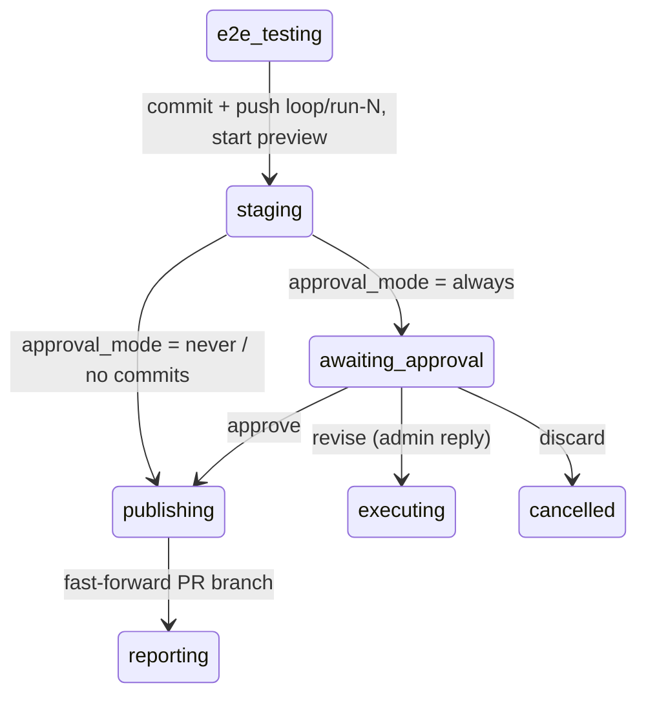
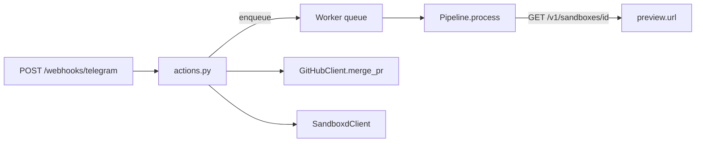

# Phase 4a — Control Plane and Telegram Run Control Implementation Plan

> **For agentic workers:** REQUIRED SUB-SKILL: Use superpowers:subagent-driven-development (recommended) or superpowers:executing-plans to implement this plan task-by-task. Steps use checkbox (`- [ ]`) syntax for tracking.

**Goal:** Human-in-the-loop pipeline: a Run pauses before publishing with a summary + e2e video + working preview link in its Telegram thread; approve/discard/revise/cancel/restart/merge are driven from chat buttons and replies.

**Architecture:** The pipeline is cut at today's `publishing` stage: commit + push-to-temp-branch move into a new `staging` stage before the pause, fast-forward stays in `publishing` after approve. `awaiting_approval` is a plain persistent state — the worker slot is released, approve re-enqueues the run. A new `actions.py` module is the single entry point for all run actions; the Telegram webhook (`POST /webhooks/telegram`) is a thin front over it. Preview links are sandboxd's native per-sandbox Traefik preview URLs (no proxy in the orchestrator).

**Tech Stack:** FastAPI, aiosqlite, httpx (+respx in tests), Telegram Bot API 10.x, sandboxd control-plane API.

Spec: `docs/superpowers/specs/2026-08-03-loop-control-phase4a-design.md` — read it first; its Locked Decisions govern this plan.

## Locked Decisions

- **States:** new `staging`, `awaiting_approval` (both in `ACTIVE_STATES`), new terminal `cancelled`. `merge` is an action on a `done` run, not a state.
- **`callback_data` wire format:** `"<code>:<run_id>"` with codes `ap` (approve), `dc` (discard), `cn` (cancel), `rs` (restart), `mg` (merge). Buttons must keep working weeks later and across restarts — the format is self-contained and stable.
- **DB columns on `runs`:** `approval_mode TEXT NOT NULL DEFAULT 'always'`, `staging_branch TEXT`, `preview_url TEXT`, `sandbox_expires_at TEXT`, `merged_at TEXT`, `tg_approval_message_id INTEGER`. `ALTER TABLE` migration like phases 2–3.
- **`.loop.yml`:** top-level `approval: always|never`, default `always`.
- **Merge:** squash into the PR base, commit title from `pr_title`; PR head branch and `loop/run-*` deleted after. No merge settings in `.loop.yml`.
- **Cancel:** kill task → best-effort push to `loop/run-<id>` → delete app → `cancelled`. The PR branch is never touched by cancel.
- **Preview:** sandboxd's native `preview.url` from `GET /v1/sandboxes/{id}`. The orchestrator never proxies preview traffic.
- **Auth:** `LOOP_TELEGRAM_ADMIN_IDS` (CSV of user ids) gates every button and reply.
- **All user-facing texts:** English (project convention).

## Global Constraints

- Settings only via `Settings` (pydantic-settings, `LOOP_` prefix).
- Any notification/topics/card error degrades with a warning and never fails a run.
- HTTP clients accept an optional `httpx.AsyncClient` for respx/ASGI tests; transient errors go through `clients/retry.with_retries`.
- Tests: pytest, `asyncio_mode = "auto"` — async tests need no decorators.
- Run tests with `python -m pytest tests -v` (Windows venv: `.venv/Scripts/python`).

## Architecture Diagram





---

### Task 1: States, Run fields, DB migration

**Files:**
- Modify: `src/loop_orchestrator/models.py`
- Modify: `src/loop_orchestrator/state_machine.py:17-25`
- Modify: `src/loop_orchestrator/db.py`
- Test: `tests/test_state_machine.py`, `tests/test_db.py`

**Interfaces:**
- Reuses: `transition()` mechanics and `run_events` writing in `state_machine.py`; `_MIGRATIONS` ALTER TABLE pattern in `db.py:58-75`.
- Produces: constants `STAGING = "staging"`, `AWAITING_APPROVAL = "awaiting_approval"`, `CANCELLED = "cancelled"`, `CANCELABLE` set; `Run` fields `approval_mode: str`, `staging_branch`, `preview_url`, `sandbox_expires_at`, `merged_at`, `tg_approval_message_id` (all `| None` except `approval_mode`); `db.utcnow() -> str`; `db.run_by_approval_message(db, message_id) -> Run | None`.

- [x] **Step 1: Write the failing tests**

Append to `tests/test_state_machine.py`:

```python
from loop_orchestrator.models import (
    AWAITING_APPROVAL, CANCELLED, E2E_TESTING, EXECUTING, PUBLISHING, STAGING,
)
from loop_orchestrator.state_machine import TRANSITIONS


def test_phase4a_transitions_present():
    assert STAGING in TRANSITIONS[E2E_TESTING]
    assert TRANSITIONS[STAGING] == {AWAITING_APPROVAL, PUBLISHING, "failed"}
    assert TRANSITIONS[AWAITING_APPROVAL] == {PUBLISHING, EXECUTING, CANCELLED, "failed"}
    # cancel is allowed from every pre-staging active state
    for state in ("queued", "preparing", EXECUTING, "reviewing", E2E_TESTING):
        assert CANCELLED in TRANSITIONS[state]
    # publishing/reporting still cannot be cancelled
    assert CANCELLED not in TRANSITIONS[PUBLISHING]
```

Append to `tests/test_db.py`:

```python
from loop_orchestrator import db as dbmod
from loop_orchestrator.models import AWAITING_APPROVAL


async def test_phase4a_columns_roundtrip(db):
    run = await dbmod.create_run(db, "o/r", 1, "b")
    run.approval_mode = "never"
    run.staging_branch = "loop/run-1"
    run.preview_url = "https://s-x-3000.preview.example.com"
    run.sandbox_expires_at = "2026-08-03 12:00:00"
    run.merged_at = "2026-08-03 13:00:00"
    run.tg_approval_message_id = 42
    await dbmod.save_run(db, run)
    got = await dbmod.get_run(db, run.id)
    assert got.approval_mode == "never"
    assert got.staging_branch == "loop/run-1"
    assert got.preview_url == "https://s-x-3000.preview.example.com"
    assert got.sandbox_expires_at == "2026-08-03 12:00:00"
    assert got.merged_at == "2026-08-03 13:00:00"
    assert got.tg_approval_message_id == 42


async def test_run_by_approval_message(db):
    run = await dbmod.create_run(db, "o/r", 1, "b")
    run.tg_approval_message_id = 77
    await dbmod.save_run(db, run)
    assert (await dbmod.run_by_approval_message(db, 77)).id == run.id
    assert await dbmod.run_by_approval_message(db, 78) is None
    assert await dbmod.run_by_approval_message(db, None) is None


def test_utcnow_format():
    s = dbmod.utcnow()
    assert len(s) == 19 and s[4] == "-" and s[13] == ":"
```

- [x] **Step 2: Run tests to verify they fail**

Run: `python -m pytest tests/test_state_machine.py tests/test_db.py -v`
Expected: FAIL — `ImportError: cannot import name 'STAGING'` etc.

- [x] **Step 3: Implement models.py**

In `src/loop_orchestrator/models.py`, add after the existing state constants:

```python
STAGING = "staging"
AWAITING_APPROVAL = "awaiting_approval"
CANCELLED = "cancelled"

ACTIVE_STATES = {QUEUED, PREPARING, EXECUTING, REVIEWING, E2E_TESTING,
                 STAGING, AWAITING_APPROVAL, PUBLISHING, REPORTING}

# States from which a human may cancel a run (before its work is staged).
CANCELABLE = {QUEUED, PREPARING, EXECUTING, REVIEWING, E2E_TESTING}
```

(the old `ACTIVE_STATES` line is replaced). Add to the end of the `Run` dataclass:

```python
    approval_mode: str = "always"  # always | never — snapshot of .loop.yml
    staging_branch: str | None = None
    preview_url: str | None = None
    sandbox_expires_at: str | None = None  # UTC "YYYY-MM-DD HH:MM:SS"
    merged_at: str | None = None
    tg_approval_message_id: int | None = None
```

- [x] **Step 4: Implement state_machine.py**

Replace `TRANSITIONS` in `src/loop_orchestrator/state_machine.py` (extend the imports with `AWAITING_APPROVAL, CANCELLED, STAGING`):

```python
TRANSITIONS: dict[str, set[str]] = {
    QUEUED: {PREPARING, FAILED, CANCELLED},
    PREPARING: {EXECUTING, FAILED, CANCELLED},
    EXECUTING: {REVIEWING, E2E_TESTING, STAGING, FAILED, CANCELLED},
    REVIEWING: {E2E_TESTING, STAGING, FAILED, CANCELLED},
    E2E_TESTING: {STAGING, FAILED, CANCELLED},
    STAGING: {AWAITING_APPROVAL, PUBLISHING, FAILED},
    AWAITING_APPROVAL: {PUBLISHING, EXECUTING, CANCELLED, FAILED},
    PUBLISHING: {REPORTING, FAILED},
    REPORTING: {DONE, FAILED},
}
```

- [x] **Step 5: Implement db.py**

In `src/loop_orchestrator/db.py`: add to `SCHEMA` (before `created_at`):

```sql
  approval_mode TEXT NOT NULL DEFAULT 'always',
  staging_branch TEXT,
  preview_url TEXT,
  sandbox_expires_at TEXT,
  merged_at TEXT,
  tg_approval_message_id INTEGER,
```

Append to `_RUN_FIELDS`: `"approval_mode", "staging_branch", "preview_url", "sandbox_expires_at", "merged_at", "tg_approval_message_id",`. Append to `_MIGRATIONS`:

```python
    ("approval_mode", "TEXT NOT NULL DEFAULT 'always'"),
    ("staging_branch", "TEXT"),
    ("preview_url", "TEXT"),
    ("sandbox_expires_at", "TEXT"),
    ("merged_at", "TEXT"),
    ("tg_approval_message_id", "INTEGER"),
```

Extend `save_run` SQL and parameter tuple with the six new fields (same order, before `updated_at`):

```python
           approval_mode=?, staging_branch=?, preview_url=?,
           sandbox_expires_at=?, merged_at=?, tg_approval_message_id=?,
```

and in the values tuple, after `run.tg_card_message_id`:

```python
         run.approval_mode, run.staging_branch, run.preview_url,
         run.sandbox_expires_at, run.merged_at, run.tg_approval_message_id,
```

Add at module level (after `events_for_run`):

```python
def utcnow() -> str:
    """UTC timestamp in the run_events format ('YYYY-MM-DD HH:MM:SS')."""
    from datetime import datetime, timezone
    return datetime.now(timezone.utc).strftime("%Y-%m-%d %H:%M:%S")


async def run_by_approval_message(db: aiosqlite.Connection,
                                  message_id: int | None) -> Run | None:
    if message_id is None:
        return None
    async with db.execute(
        "SELECT * FROM runs WHERE tg_approval_message_id = ? LIMIT 1",
        (message_id,),
    ) as cur:
        row = await cur.fetchone()
    return _to_run(row) if row else None
```

- [x] **Step 6: Run tests, then the whole suite**

Run: `python -m pytest tests/test_state_machine.py tests/test_db.py -v` → PASS.
Run: `python -m pytest tests -v` → all green (nothing existing depended on the old transition table shape beyond what stays valid).

- [x] **Step 7: Commit**

```bash
git add src/loop_orchestrator/models.py src/loop_orchestrator/state_machine.py src/loop_orchestrator/db.py tests/test_state_machine.py tests/test_db.py
git commit -m "feat: staging/awaiting_approval/cancelled states, run approval fields, db migration"
```

---

### Task 2: `.loop.yml` approval field and new Settings

**Files:**
- Modify: `src/loop_orchestrator/loopconfig.py`
- Modify: `src/loop_orchestrator/config.py`
- Test: `tests/test_loopconfig.py`, `tests/test_config.py`

**Interfaces:**
- Reuses: `parse_loop_config` validation style (`LoopConfigError`, English messages).
- Produces: `LoopConfig.approval: str` (`"always"|"never"`, default `"always"`); `Settings.telegram_admin_ids: str`, `Settings.admin_ids() -> set[int]`, `Settings.telegram_webhook_secret: str`, `Settings.preview_ttl_minutes: int`, `Settings.public_url: str`.

- [x] **Step 1: Write the failing tests**

Append to `tests/test_loopconfig.py`:

```python
def test_approval_default_always():
    cfg = parse_loop_config("specs_dir: docs/specs")
    assert cfg.approval == "always"


def test_approval_never():
    cfg = parse_loop_config("specs_dir: docs/specs\napproval: never")
    assert cfg.approval == "never"


def test_approval_invalid_rejected():
    with pytest.raises(LoopConfigError, match="approval"):
        parse_loop_config("specs_dir: docs/specs\napproval: sometimes")
```

Append to `tests/test_config.py`:

```python
def test_admin_ids_parsing(monkeypatch):
    for key in ("LOOP_GITHUB_TOKEN", "LOOP_GITHUB_WEBHOOK_SECRET",
                "LOOP_TELEGRAM_BOT_TOKEN", "LOOP_SANDBOXD_API_KEY",
                "LOOP_GIT_CREDENTIAL_ID"):
        monkeypatch.setenv(key, "x")
    monkeypatch.setenv("LOOP_TELEGRAM_CHAT_ID", "1")
    monkeypatch.setenv("LOOP_TELEGRAM_ADMIN_IDS", "123, 456")
    s = Settings(_env_file=None)
    assert s.admin_ids() == {123, 456}
    assert s.preview_ttl_minutes == 120
    assert s.telegram_webhook_secret == ""
    assert s.public_url == ""
    monkeypatch.setenv("LOOP_TELEGRAM_ADMIN_IDS", "")
    assert Settings(_env_file=None).admin_ids() == set()
```

(match the import style already used at the top of each test file: `from loop_orchestrator.loopconfig import LoopConfigError, parse_loop_config`, `from loop_orchestrator.config import Settings`, `import pytest`.)

- [x] **Step 2: Run tests to verify they fail**

Run: `python -m pytest tests/test_loopconfig.py tests/test_config.py -v`
Expected: FAIL — `AttributeError: 'LoopConfig' object has no attribute 'approval'` / `admin_ids`.

- [x] **Step 3: Implement**

`src/loop_orchestrator/loopconfig.py` — add to the `LoopConfig` dataclass:

```python
    approval: str = "always"  # always | never — pause before publishing
```

In `parse_loop_config`, before the `return`:

```python
    approval = data.get("approval", "always")
    if approval not in ("always", "never"):
        raise LoopConfigError("approval must be 'always' or 'never'")
```

and pass `approval=approval` in the `LoopConfig(...)` constructor call.

`src/loop_orchestrator/config.py` — add to `Settings`:

```python
    telegram_admin_ids: str = ""  # CSV of Telegram user ids allowed to press buttons
    telegram_webhook_secret: str = ""  # X-Telegram-Bot-Api-Secret-Token value
    preview_ttl_minutes: int = 120  # sandbox lifetime while awaiting approval
    public_url: str = ""  # external base URL of the orchestrator (for setWebhook)

    def admin_ids(self) -> set[int]:
        return {int(x) for x in self.telegram_admin_ids.replace(" ", "").split(",") if x}
```

- [x] **Step 4: Run tests to verify they pass**

Run: `python -m pytest tests/test_loopconfig.py tests/test_config.py -v` → PASS.

- [x] **Step 5: Commit**

```bash
git add src/loop_orchestrator/loopconfig.py src/loop_orchestrator/config.py tests/test_loopconfig.py tests/test_config.py
git commit -m "feat: approval mode in .loop.yml, admin/webhook/preview-ttl settings"
```

---

### Task 3: Client methods — `get_sandbox` and `merge_pr`

**Files:**
- Modify: `src/loop_orchestrator/clients/sandboxd.py`
- Modify: `src/loop_orchestrator/clients/github.py`
- Test: `tests/test_sandboxd_client.py`, `tests/test_github_client.py`

**Interfaces:**
- Reuses: `_req` retry wrapper in both clients; `GitHubError` hierarchy (`FastForwardError` pattern).
- Produces: `SandboxdClient.get_sandbox(sandbox_id) -> dict` (raw JSON; caller reads `["preview"]["url"]`); `GitHubClient.merge_pr(repo, pr_number, commit_title=None) -> None` raising `MergeError` (subclass of `GitHubError`) with GitHub's message on 404/405/409/422.

- [x] **Step 1: Write the failing tests**

Append to `tests/test_sandboxd_client.py` (mirror the file's existing respx style — base url and auth header as in its other tests):

```python
async def test_get_sandbox(respx_mock_client):
    client, mock = respx_mock_client
    mock.get("/v1/sandboxes/sb1").respond(
        200, json={"id": "sb1", "preview": {"url": "https://s-sb1-3000.preview.x", "port": 3000}})
    info = await client.get_sandbox("sb1")
    assert info["preview"]["url"] == "https://s-sb1-3000.preview.x"
```

If the file has no shared fixture, follow its local pattern of constructing `SandboxdClient("http://sb", "key", client=httpx.AsyncClient(transport=..., base_url="http://sb"))` with `respx.mock` — copy the exact arrangement from the neighbouring test in that file.

Append to `tests/test_github_client.py` (same note — mirror the file's respx arrangement):

```python
async def test_merge_pr_squash(gh_client):
    client, mock = gh_client
    route = mock.put("/repos/o/r/pulls/5/merge").respond(200, json={"merged": True})
    await client.merge_pr("o/r", 5, commit_title="feat: x (#5)")
    body = json.loads(route.calls[0].request.content)
    assert body == {"merge_method": "squash", "commit_title": "feat: x (#5)"}


async def test_merge_pr_conflict_raises(gh_client):
    client, mock = gh_client
    mock.put("/repos/o/r/pulls/5/merge").respond(
        405, json={"message": "Pull Request is not mergeable"})
    with pytest.raises(MergeError, match="not mergeable"):
        await client.merge_pr("o/r", 5)
```

- [x] **Step 2: Run tests to verify they fail**

Run: `python -m pytest tests/test_sandboxd_client.py tests/test_github_client.py -v`
Expected: FAIL — `AttributeError` / `ImportError: MergeError`.

- [x] **Step 3: Implement**

`src/loop_orchestrator/clients/sandboxd.py` — add after `create_sandbox`:

```python
    async def get_sandbox(self, sandbox_id: str) -> dict:
        r = await self._req("GET", f"/v1/sandboxes/{sandbox_id}")
        r.raise_for_status()
        return r.json()
```

`src/loop_orchestrator/clients/github.py` — add after `FastForwardError`:

```python
class MergeError(GitHubError):
    pass
```

and after `fast_forward`:

```python
    async def merge_pr(self, repo: str, pr_number: int,
                       commit_title: str | None = None) -> None:
        body: dict = {"merge_method": "squash"}
        if commit_title:
            body["commit_title"] = commit_title
        r = await self._req("PUT", f"/repos/{repo}/pulls/{pr_number}/merge", json=body)
        if r.status_code in (404, 405, 409, 422):
            try:
                msg = r.json().get("message") or r.text
            except ValueError:
                msg = r.text
            raise MergeError(msg)
        r.raise_for_status()
```

- [x] **Step 4: Run tests to verify they pass**

Run: `python -m pytest tests/test_sandboxd_client.py tests/test_github_client.py -v` → PASS.

- [x] **Step 5: Commit**

```bash
git add src/loop_orchestrator/clients/sandboxd.py src/loop_orchestrator/clients/github.py tests/test_sandboxd_client.py tests/test_github_client.py
git commit -m "feat: sandboxd get_sandbox (preview url) and github squash merge_pr"
```

---

### Task 4: Progress card — new stages, cancelled, preview deadline

**Files:**
- Modify: `src/loop_orchestrator/clients/tg_card.py`
- Test: `tests/test_tg_card.py`

**Interfaces:**
- Reuses: pure-function card renderer (`render_card`, `_fmt_time`, `run_title`, `topic_final_name`) — no I/O.
- Produces: `STAGES` now includes `STAGING` and `AWAITING_APPROVAL` between `E2E_TESTING` and `PUBLISHING`; `_header_emoji` returns `"🚫"` for `CANCELLED`; awaiting-approval line renders a preview deadline; skipped-pause runs (`approval_mode == "never"`) render `➖` for `awaiting approval`.

- [x] **Step 1: Write the failing tests**

Append to `tests/test_tg_card.py` (reuse the file's existing Run-construction helper style):

```python
from loop_orchestrator.models import AWAITING_APPROVAL, CANCELLED, Run


def _run4a(state, **kw):
    return Run(id=9, repo="o/r", pr_number=3, head_branch="b", state=state,
               pr_title="feat: x", **kw)


def test_card_awaiting_approval_shows_deadline():
    run = _run4a(AWAITING_APPROVAL, sandbox_expires_at="2026-08-03 10:30:00")
    events = [("queued", "2026-08-03 08:00:00"), ("staging", "2026-08-03 09:00:00"),
              (AWAITING_APPROVAL, "2026-08-03 09:01:00")]
    card = render_card(run, events, "UTC")
    assert "⏳ awaiting approval" in card
    assert "preview until 10:30" in card
    assert "✅ staging" in card


def test_card_skips_pause_when_approval_never():
    run = _run4a("publishing", approval_mode="never")
    events = [("queued", "2026-08-03 08:00:00"), ("executing", "2026-08-03 08:01:00"),
              ("staging", "2026-08-03 08:30:00"), ("publishing", "2026-08-03 08:31:00")]
    card = render_card(run, events, "UTC")
    assert "➖ awaiting approval" in card


def test_card_cancelled_header_and_topic():
    run = _run4a(CANCELLED)
    events = [("queued", "2026-08-03 08:00:00"), ("executing", "2026-08-03 08:01:00"),
              (CANCELLED, "2026-08-03 08:10:00")]
    card = render_card(run, events, "UTC")
    assert card.startswith("🚫")
    assert "🚫 executing" in card  # the stage it died on
    assert topic_final_name(run).startswith("🚫")
```

Extend the imports at the top of the file with `topic_final_name` if not already imported.

- [x] **Step 2: Run tests to verify they fail**

Run: `python -m pytest tests/test_tg_card.py -v`
Expected: FAIL — new stages missing from `STAGES`, no `🚫` handling.

- [x] **Step 3: Implement**

In `src/loop_orchestrator/clients/tg_card.py`: extend the models import with `AWAITING_APPROVAL, CANCELLED, STAGING`. Replace `STAGES`/`_LABELS`:

```python
STAGES = (QUEUED, PREPARING, EXECUTING, REVIEWING, E2E_TESTING,
          STAGING, AWAITING_APPROVAL, PUBLISHING, REPORTING)
_LABELS = {QUEUED: "queued", PREPARING: "preparing", EXECUTING: "executing",
           REVIEWING: "reviewing", E2E_TESTING: "e2e testing",
           STAGING: "staging", AWAITING_APPROVAL: "awaiting approval",
           PUBLISHING: "publishing", REPORTING: "reporting"}
```

In `_header_emoji`, add before the `DONE` branch:

```python
    if run.state == CANCELLED:
        return "🚫"
```

In `render_card`, replace the loop body with:

```python
    for stage in STAGES:
        if run.state == FAILED and stage == last:
            icon = "⛔"
        elif run.state == CANCELLED and stage == last:
            icon = "🚫"
        elif stage == run.state:
            icon = "⏳"
        elif stage in times:
            icon = "✅"
        elif prepared and stage == REVIEWING and not run.review_enabled:
            icon = "➖"
        elif prepared and stage == E2E_TESTING and not run.e2e_enabled:
            icon = "➖"
        elif prepared and stage == AWAITING_APPROVAL and run.approval_mode == "never":
            icon = "➖"
        else:
            icon = "⬜"
        t = f"  {_fmt_time(times[stage], tz)}" if stage in times else ""
        extra = ""
        if (stage == AWAITING_APPROVAL and run.state == AWAITING_APPROVAL
                and run.sandbox_expires_at):
            extra = f"  (preview until {_fmt_time(run.sandbox_expires_at, tz)})"
        lines.append(f"{icon} {_LABELS[stage]}{t}{extra}")
```

Note: `CANCELLED` is terminal and not in `STAGES` — `reached`/`last` keep working because `times` only indexes stages present in `STAGES`.

- [x] **Step 4: Run tests to verify they pass**

Run: `python -m pytest tests/test_tg_card.py -v` → PASS (including the pre-existing card tests).

- [x] **Step 5: Commit**

```bash
git add src/loop_orchestrator/clients/tg_card.py tests/test_tg_card.py
git commit -m "feat: progress card renders staging, approval pause with deadline, cancelled"
```

---

### Task 5: Telegram outgoing — keyboards, approval message, callback plumbing

**Files:**
- Modify: `src/loop_orchestrator/clients/telegram.py`
- Test: `tests/test_telegram.py`

**Interfaces:**
- Reuses: `_with_thread`, `with_retries`, the rich→HTML→plain ladder, `run_title`, `md_to_telegram_html`, `_sub_html/_sub_md`.
- Produces (used by pipeline, actions, and the webhook task):
  - `notify_awaiting_approval(run) -> int | None` — pushing HTML message with Approve/Discard buttons, returns `message_id`;
  - `notify_cancelled(run, note) -> None` — push with a Restart button;
  - `notify_done(run)` gains a `🔀 Merge PR` button, `notify_failed(run)` gains a `🔁 Restart` button (buttons ride `reply_markup` through the rich ladder and its fallback);
  - `send_card`/`update_card` attach a `⛔ Cancel` button while `run.state in CANCELABLE`;
  - `answer_callback(callback_id, text) -> None`, `clear_buttons(message_id) -> None`, `set_webhook(url, secret) -> None` — all best-effort.
  - Keyboard helpers `approve_kb(run_id)`, `merge_kb(run_id)`, `restart_kb(run_id)`, `cancel_kb(run_id)` (module-level, pure).

- [x] **Step 1: Write the failing tests**

Append to `tests/test_telegram.py` (the file already builds a `TelegramNotifier` over a respx-mocked client — reuse its fixture/arrangement; below `notifier, mock` stands for that arrangement):

```python
from loop_orchestrator.clients.telegram import approve_kb, cancel_kb

def _payload(route, i=0):
    return json.loads(route.calls[i].request.content)


async def test_notify_awaiting_approval_buttons_and_id(notifier_and_mock):
    tg, mock = notifier_and_mock
    route = mock.post("/sendMessage").respond(
        200, json={"ok": True, "result": {"message_id": 321}})
    run = Run(id=9, repo="o/r", pr_number=3, head_branch="b",
              state="awaiting_approval", pr_title="feat: x",
              summary="did things", preview_url="https://s-a-3000.preview.x",
              tg_thread_id=777)
    msg_id = await tg.notify_awaiting_approval(run)
    assert msg_id == 321
    body = _payload(route)
    assert body["message_thread_id"] == 777
    assert "preview" in body["text"] and "Reply to this message" in body["text"]
    assert body["reply_markup"] == approve_kb(9)
    assert "disable_notification" not in body  # this one must push


async def test_card_carries_cancel_button_while_cancelable(notifier_and_mock):
    tg, mock = notifier_and_mock
    route = mock.post("/sendMessage").respond(
        200, json={"ok": True, "result": {"message_id": 1}})
    run = Run(id=9, repo="o/r", pr_number=3, head_branch="b", state="executing")
    await tg.send_card(run, [])
    assert _payload(route)["reply_markup"] == cancel_kb(9)
    # terminal/paused states get no cancel button
    run.state = "awaiting_approval"
    run.tg_card_message_id = 1
    edit = mock.post("/editMessageText").respond(200, json={"ok": True})
    await tg.update_card(run, [])
    assert "reply_markup" not in _payload(edit)


async def test_answer_callback_and_clear_buttons_swallow_errors(notifier_and_mock):
    tg, mock = notifier_and_mock
    mock.post("/answerCallbackQuery").respond(400, json={"ok": False})
    mock.post("/editMessageReplyMarkup").respond(400, json={"ok": False})
    await tg.answer_callback("cbid", "hi")   # must not raise
    await tg.clear_buttons(55)               # must not raise


async def test_set_webhook(notifier_and_mock):
    tg, mock = notifier_and_mock
    route = mock.post("/setWebhook").respond(200, json={"ok": True})
    await tg.set_webhook("https://loop.example.com/webhooks/telegram", "s3cret")
    body = _payload(route)
    assert body["secret_token"] == "s3cret"
    assert body["url"].endswith("/webhooks/telegram")
```

Adapt `notifier_and_mock` to the fixture that already exists in the file (or add one mirroring the existing arrangement exactly).

- [x] **Step 2: Run tests to verify they fail**

Run: `python -m pytest tests/test_telegram.py -v`
Expected: FAIL — missing methods/helpers.

- [x] **Step 3: Implement**

In `src/loop_orchestrator/clients/telegram.py`:

Module-level keyboard helpers (after `_with_thread`), plus the models import gains `CANCELABLE`:

```python
def approve_kb(run_id: int) -> dict:
    return {"inline_keyboard": [[
        {"text": "✅ Approve", "callback_data": f"ap:{run_id}"},
        {"text": "❌ Discard", "callback_data": f"dc:{run_id}"},
    ]]}


def cancel_kb(run_id: int) -> dict:
    return {"inline_keyboard": [[{"text": "⛔ Cancel", "callback_data": f"cn:{run_id}"}]]}


def merge_kb(run_id: int) -> dict:
    return {"inline_keyboard": [[{"text": "🔀 Merge PR", "callback_data": f"mg:{run_id}"}]]}


def restart_kb(run_id: int) -> dict:
    return {"inline_keyboard": [[{"text": "🔁 Restart", "callback_data": f"rs:{run_id}"}]]}
```

Extend `send` and `send_rich_markdown` with an optional `reply_markup: dict | None = None` parameter; when not `None`, include `"reply_markup": reply_markup` in the JSON payload (both in the rich call and in the HTML fallback call, which `send_rich_markdown` passes through to `send`).

Card buttons — in `send_card` and `update_card`, build the payload with:

```python
            payload = _with_thread({...as today...}, run.tg_thread_id)
            if run.state in CANCELABLE:
                payload["reply_markup"] = cancel_kb(run.id)
```

(`update_card` has no `_with_thread` — just conditionally add `reply_markup`; an edit without the key drops the button, which is exactly right once the run leaves a cancelable state.)

Status lines helper — extract the `review_line`/`e2e_line` construction from `notify_done` into:

```python
    def _status_lines(self, run: Run) -> str:
        review_line = ""
        if run.review_status == "clean":
            review_line = f"Review: ✅ clean ({run.review_iteration} fix iteration(s))\n"
        elif run.review_status == "escalated":
            review_line = "Review: ⚠️ findings remain — see the PR comment\n"
        elif run.review_status == "skipped":
            review_line = "Review: ⛔ skipped (see the PR note)\n"
        e2e_line = ""
        if run.e2e_status == "passed":
            e2e_line = f"E2E: ✅ passed ({run.e2e_iteration} fix iteration(s)) 🎬\n"
        elif run.e2e_status == "escalated":
            e2e_line = "E2E: ⚠️ failures remain — see the PR comment\n"
        elif run.e2e_status == "skipped":
            e2e_line = "E2E: ⛔ skipped (see the PR note)\n"
        return review_line + e2e_line
```

and have `notify_done` use it (behaviour unchanged) while passing `reply_markup=merge_kb(run.id)` to `send_rich_markdown`. `notify_failed` passes `reply_markup=restart_kb(run.id)`.

New methods:

```python
    async def notify_awaiting_approval(self, run: Run) -> int | None:
        """Pushing approval request with buttons; returns its message_id."""
        t = run_title(run)
        preview_line = (f'🔗 <a href="{run.preview_url}">preview</a>\n'
                        if run.preview_url else "🔗 preview unavailable\n")
        head = (f"⏸ <b>{html.escape(t)}</b> — awaiting approval\n"
                f"{self._sub_html(run)}\n{self._status_lines(run)}{preview_line}")
        summary_md = (run.summary or "(no summary)")[:3200]
        text = (f"{head}<blockquote expandable>{md_to_telegram_html(summary_md)}"
                f"</blockquote>\nReply to this message to request changes.")
        if len(text) > 4000:
            text = (f"{head}\n{html.escape(run.summary or '')[:3200]}\n"
                    "Reply to this message to request changes.")
        try:
            r = await self._http.post("/sendMessage", json=_with_thread({
                "chat_id": self.chat_id, "text": text[:4000],
                "parse_mode": "HTML", "disable_web_page_preview": True,
                "reply_markup": approve_kb(run.id),
            }, run.tg_thread_id))
            r.raise_for_status()
            return int(r.json()["result"]["message_id"])
        except Exception:
            log.warning("approval message send failed for run=%s", run.id, exc_info=True)
            return None

    async def notify_cancelled(self, run: Run, note: str = "") -> None:
        t = run_title(run)
        suffix = f"\n{note}" if note else ""
        markdown = f"🚫 **{t}** — cancelled\n{self._sub_md(run)}{suffix}"
        await self.send_rich_markdown(
            markdown,
            fallback_html=(f"🚫 <b>{html.escape(t)}</b> — cancelled\n"
                           f"{self._sub_html(run)}{html.escape(suffix)}"),
            thread_id=run.tg_thread_id, reply_markup=restart_kb(run.id))

    # -- inbound-control plumbing --------------------------------------------

    async def answer_callback(self, callback_id: str, text: str) -> None:
        try:
            await self._http.post("/answerCallbackQuery", json={
                "callback_query_id": callback_id, "text": text[:200]})
        except Exception:
            log.warning("answerCallbackQuery failed", exc_info=True)

    async def clear_buttons(self, message_id: int) -> None:
        try:
            await self._http.post("/editMessageReplyMarkup", json={
                "chat_id": self.chat_id, "message_id": message_id,
                "reply_markup": {"inline_keyboard": []}})
        except Exception:
            log.warning("clear_buttons failed for message=%s", message_id, exc_info=True)

    async def set_webhook(self, url: str, secret: str) -> None:
        try:
            r = await self._http.post("/setWebhook", json={
                "url": url, "secret_token": secret,
                "allowed_updates": ["callback_query", "message"]})
            r.raise_for_status()
        except Exception:
            log.warning("setWebhook failed", exc_info=True)
```

- [x] **Step 4: Run tests to verify they pass**

Run: `python -m pytest tests/test_telegram.py -v` → PASS.

- [x] **Step 5: Commit**

```bash
git add src/loop_orchestrator/clients/telegram.py tests/test_telegram.py
git commit -m "feat: inline keyboards, approval message, callback/webhook plumbing in telegram client"
```

---

### Task 6: Pipeline — staging stage, approval pause, publish split

**Files:**
- Modify: `src/loop_orchestrator/pipeline.py`
- Modify: `src/loop_orchestrator/worker.py:49-61` (recover)
- Modify: `tests/conftest.py` (fakes), `tests/test_pipeline_prepare.py` (seed), `tests/test_pipeline_publish.py`
- Test: `tests/test_pipeline_process.py`

**Interfaces:**
- Reuses: `_stage` logic is today's `_publish` first half (`pipeline.py:395-406`), `_publish_ff` its second half (`407-415`); `_send_e2e_videos`, `_refresh_card`, `fail()`.
- Consumes: `STAGING`, `AWAITING_APPROVAL`, `CANCELLED` (Task 1); `cfg.approval` (Task 2); `sb.get_sandbox` (Task 3); `tg.notify_awaiting_approval` (Task 5); `dbmod.utcnow` (Task 1).
- Produces: `Pipeline._stage(run) -> bool`, `Pipeline._publish_ff(run) -> None`, `Pipeline.rescue_to_staging(run) -> bool` (public, for actions), `Pipeline.expire_preview(run) -> None` (for the worker reaper), `build_preview_prompt(run_cmd) -> str`, constant `PREVIEW_TASK_TIMEOUT_S = 600`. `process()` returns after entering `awaiting_approval` (slot released); resuming from `PUBLISHING` completes the run.

- [x] **Step 1: Update shared fakes and seeds**

`tests/conftest.py` — add to `FakeSandboxd.__init__`: `self.sandbox_info = {"preview": {"url": "https://s-x-3000.preview.test", "port": 3000}}` and the method:

```python
    async def get_sandbox(self, sandbox_id):
        return self.sandbox_info
```

Add to `FakeGitHub.__init__`: `self.merges: list[tuple[int, str | None]] = []` and `self.merge_error: Exception | None = None`; method:

```python
    async def merge_pr(self, repo, pr_number, commit_title=None):
        if self.merge_error:
            raise self.merge_error
        self.merges.append((pr_number, commit_title))
```

Add to `FakeTG`:

```python
    async def notify_awaiting_approval(self, run):
        self.sent.append(f"awaiting:{run.id}")
        return 900

    async def notify_cancelled(self, run, note=""):
        self.sent.append(f"cancelled:{run.id}")

    async def answer_callback(self, callback_id, text):
        self.sent.append(f"cb:{callback_id}:{text}")

    async def clear_buttons(self, message_id):
        self.sent.append(f"clear:{message_id}")

    async def set_webhook(self, url, secret):
        self.sent.append(f"webhook:{url}")
```

Add to `FakeSettings`: `preview_ttl_minutes = 120`, `telegram_webhook_secret = "tgsec"`, `public_url = ""`, and:

```python
    def admin_ids(self):
        return {1}
```

`tests/test_pipeline_prepare.py` — append `approval: never\n` to `LOOP_YML` (existing full-cycle tests keep today's no-pause behaviour), and add a prepare test:

```python
async def test_prepare_snapshots_approval_mode(db, tmp_path):
    gh = FakeGitHub()
    seed_ok(gh, tmp_path)
    gh.files[".loop.yml"] = LOOP_YML.replace("approval: never", "approval: always")
    pipe = make_pipeline(db, tmp_path, gh=gh)
    run = await make_run(db)
    await pipe._prepare(run)
    assert run.approval_mode == "always"
```

- [x] **Step 2: Write the failing process tests**

Append to `tests/test_pipeline_process.py`:

```python
from loop_orchestrator.models import AWAITING_APPROVAL, CANCELLED, STAGING


def seed_approval(gh, tmp_path):
    """seed_ok, but with the pause enabled and a run command for preview."""
    seed_ok(gh, tmp_path)
    gh.files[".loop.yml"] = (gh.files[".loop.yml"]
                             .replace("approval: never", "approval: always")
                             + "run: npm run dev -- --port 3000\n")


async def test_process_pauses_for_approval(db, tmp_path):
    gh, sb, tg = FakeGitHub(), FakeSandboxd(), FakeTG()
    seed_approval(gh, tmp_path)
    run = await dbmod.create_run(db, "o/myrepo", 5, "feat/x")
    branch = f"loop/run-{run.id}"
    sb.task_results = [
        {"status": "succeeded", "agent_message": "did the work"},   # execute
        {"status": "succeeded",
         "agent_message_final": '{"verdict": "clean", "summary": "ok", "findings": []}'},
        {"status": "succeeded", "agent_message": "server is up"},   # preview task
    ]
    sb.push_resp = {"pushed": True, "branch": branch, "commits": 2}
    await make_pipe(db, tmp_path, gh, sb, tg).process(run)
    assert run.state == AWAITING_APPROVAL
    assert run.staging_branch == branch
    assert run.preview_url == "https://s-x-3000.preview.test"
    assert run.sandbox_expires_at is not None
    assert run.tg_approval_message_id == 900
    assert f"awaiting:{run.id}" in tg.sent
    assert gh.ff_calls == []                  # PR branch untouched before approve
    assert sb.apps_deleted == []              # sandbox stays alive for the preview
    # the preview task was submitted with the run command
    assert any("npm run dev" in t["prompt"] for t in sb.tasks_submitted)


async def test_process_resumes_from_publishing_after_approve(db, tmp_path):
    gh, sb, tg = FakeGitHub(), FakeSandboxd(), FakeTG()
    seed_ok(gh, tmp_path)
    run = await dbmod.create_run(db, "o/myrepo", 5, "feat/x")
    run.state = "publishing"
    run.staging_branch = f"loop/run-{run.id}"
    run.approval_mode = "always"
    run.summary = "did the work"
    await dbmod.save_run(db, run)
    gh.branch_shas[run.staging_branch] = "sha1"
    await make_pipe(db, tmp_path, gh, sb, tg).process(run)
    assert run.state == DONE
    assert gh.ff_calls == [("feat/x", "sha1")]
    assert f"loop/run-{run.id}" in gh.deleted_branches


async def test_process_no_commits_skips_pause(db, tmp_path):
    gh, sb, tg = FakeGitHub(), FakeSandboxd(), FakeTG()
    seed_approval(gh, tmp_path)
    run = await dbmod.create_run(db, "o/myrepo", 5, "feat/x")
    sb.task_results = [
        {"status": "succeeded", "agent_message": "nothing to do"},
        {"status": "succeeded",
         "agent_message_final": '{"verdict": "clean", "summary": "ok", "findings": []}'},
    ]
    sb.push_resp = {"pushed": False, "reason": "no_local_commits"}
    await make_pipe(db, tmp_path, gh, sb, tg).process(run)
    assert run.state == DONE
    assert "nothing to publish" in (run.summary or "")
    assert f"awaiting:{run.id}" not in tg.sent


async def test_fail_is_noop_when_run_already_cancelled(db, tmp_path):
    pipe, gh, sb, tg = make_pipeline(db)
    run = await make_run_in(db, EXECUTING)
    fresh = await dbmod.get_run(db, run.id)
    fresh.state = CANCELLED
    await dbmod.save_run(db, fresh)
    await pipe.fail(run, EXECUTING, "task died after cancel")
    assert (await dbmod.get_run(db, run.id)).state == CANCELLED
    assert tg.sent == []  # no failure notification fired
```

And in `tests/test_pipeline_publish.py`, rename/adjust references from `_publish` to the split methods where the file calls it directly (keep assertions; `_stage` covers push behaviour, `_publish_ff` covers fast-forward + `FastForwardError`).

- [x] **Step 3: Run tests to verify they fail**

Run: `python -m pytest tests/test_pipeline_process.py tests/test_pipeline_publish.py -v`
Expected: FAIL — `STAGING` transitions absent from `process()`, `_stage` missing.

- [x] **Step 4: Implement pipeline changes**

In `src/loop_orchestrator/pipeline.py`:

Imports: extend the models import with `AWAITING_APPROVAL, CANCELLED, STAGING`; add `from datetime import datetime, timedelta, timezone`.

Add near `CONTINUE_PROMPT`:

```python
PREVIEW_TASK_TIMEOUT_S = 600


def build_preview_prompt(run_cmd: str) -> str:
    return (
        "Start the app's web server so a human can try it in a browser.\n"
        f"Run `{run_cmd}` in the background (e.g. with nohup), wait until it "
        "responds on its port, and finish with a one-line confirmation. "
        "Do not stop the server before finishing."
    )
```

In `_prepare`, after `run.review_max_iterations = ...`: `run.approval_mode = cfg.approval`.

Replace `_publish`/`_publish_partial` with:

```python
    async def _stage(self, run: Run) -> bool:
        """Commit and push the agent's work to the temp branch.

        Returns False when the agent made no commits (nothing to stage).
        """
        await self.sb.git_commit(run.app_id, message=f"loop: run #{run.id} leftovers")
        branch = f"loop/run-{run.id}"
        push = await self.sb.git_push(run.app_id, branch)
        if not push.get("pushed"):
            if push.get("reason") == "no_local_commits":
                run.summary = ((run.summary or "") +
                               "\n\n⚠️ The agent made no code changes — "
                               "nothing to publish.").strip()
                await dbmod.save_run(self.db, run)
                return False
            raise RunFailure(STAGING, f"push rejected by sandboxd: {push.get('reason')}")
        run.staging_branch = branch
        await dbmod.save_run(self.db, run)
        return True

    async def _publish_ff(self, run: Run) -> None:
        if not run.staging_branch:
            return  # nothing was staged
        sha = await self.gh.branch_sha(run.repo, run.staging_branch)
        try:
            await self.gh.fast_forward(run.repo, run.head_branch, sha)
        except FastForwardError as e:
            raise RunFailure(
                PUBLISHING,
                f"the PR branch moved ahead, fast-forward is impossible; "
                f"the code is preserved in branch {run.staging_branch}") from e
        await self.gh.delete_branch(run.repo, run.staging_branch)

    async def rescue_to_staging(self, run: Run) -> bool:
        """Best-effort push of whatever was committed; the PR branch is untouched."""
        try:
            return await self._stage(run)
        except Exception:  # noqa: BLE001
            return False

    async def _publish_partial(self, run: Run) -> None:
        try:
            if await self._stage(run):
                await self._publish_ff(run)
        except Exception:  # noqa: BLE001 — best-effort rescue of partial progress
            pass
```

Add the preview/pause helpers:

```python
    async def _start_preview(self, run: Run) -> None:
        """Best-effort: bring the web server up and record the sandbox preview URL."""
        if not run.run_cmd:
            return
        try:
            task_id = await self.sb.submit_task(
                run.sandbox_id, build_preview_prompt(run.run_cmd),
                timeout_s=PREVIEW_TASK_TIMEOUT_S)
            deadline = monotonic() + PREVIEW_TASK_TIMEOUT_S
            while monotonic() < deadline:
                task = await self.sb.get_task(run.sandbox_id, task_id)
                if task.get("status") != "running":
                    break
                await asyncio.sleep(self.settings.poll_interval_seconds)
            info = await self.sb.get_sandbox(run.sandbox_id)
            run.preview_url = (info.get("preview") or {}).get("url") or None
            await dbmod.save_run(self.db, run)
        except Exception:  # noqa: BLE001 — preview is auxiliary
            pass

    async def _notify_awaiting(self, run: Run) -> None:
        try:
            msg_id = await self.tg.notify_awaiting_approval(run)
            if msg_id:
                run.tg_approval_message_id = msg_id
                await dbmod.save_run(self.db, run)
            await self._send_e2e_videos(run)
        except Exception:  # noqa: BLE001
            pass

    async def expire_preview(self, run: Run) -> None:
        """TTL sweep: tear down the paused run's sandbox; the run stays paused."""
        try:
            await self.sb.delete_app(run.app_id)
        except Exception:  # noqa: BLE001 — retried on the next sweep
            return
        run.app_id = None
        run.sandbox_id = None
        run.preview_url = None
        run.sandbox_expires_at = None
        await dbmod.save_run(self.db, run)
        await dbmod.add_event(self.db, run.id, AWAITING_APPROVAL, AWAITING_APPROVAL,
                              "preview expired — sandbox deleted")
        await self._refresh_card(run)
```

Rewire `process()`:

- `EXECUTING` block: transition target becomes `REVIEWING if run.review_enabled else E2E_TESTING if run.e2e_enabled else STAGING`.
- `REVIEWING` block: target `E2E_TESTING if run.e2e_enabled else STAGING`.
- `E2E_TESTING` block: target `STAGING`.
- Insert between them and `PUBLISHING`:

```python
            if run.state == STAGING:
                staged = await self._stage(run)
                if staged and run.approval_mode == "always":
                    await self._start_preview(run)
                    run.sandbox_expires_at = (
                        datetime.now(timezone.utc)
                        + timedelta(minutes=self.settings.preview_ttl_minutes)
                    ).strftime("%Y-%m-%d %H:%M:%S")
                    await transition(self.db, run, AWAITING_APPROVAL)
                    await self._refresh_card(run)
                    await self._notify_awaiting(run)
                    return  # release the worker slot; approve/revise/discard re-enqueue
                await transition(self.db, run, PUBLISHING)
                await self._refresh_card(run)
            if run.state == PUBLISHING:
                await self._publish_ff(run)
                await transition(self.db, run, REPORTING)
                await self._refresh_card(run)
```

In `_report_success`, guard the video delivery so paused runs don't get them twice:

```python
        if run.tg_approval_message_id is None:
            await self._send_e2e_videos(run)
```

In `fail()`, add at the very top:

```python
        fresh = await dbmod.get_run(self.db, run.id)
        if fresh is not None and fresh.state == CANCELLED:
            return  # a concurrent cancel/discard won — not a failure
```

Known small race (accepted): if a cancel lands in the instant between a pipeline stage finishing and its `transition()`, the in-memory `save_run` can overwrite `cancelled`. `cancel_task` makes the in-flight sandbox task fail, which funnels the pipeline into `fail()` where the guard yields — the window is a few milliseconds and self-heals on the failure path.

In `worker.py` `recover()`: add `STAGING` to the fail-honest set (`{PREPARING, STAGING, PUBLISHING, REPORTING}`) — a restart mid-staging cannot re-push to the same branch. `AWAITING_APPROVAL` is deliberately in neither set: it is persistent and needs no recovery.

- [x] **Step 5: Run tests**

Run: `python -m pytest tests/test_pipeline_process.py tests/test_pipeline_publish.py tests/test_pipeline_prepare.py tests/test_worker.py -v` → PASS.
Run: `python -m pytest tests -v` → all green.

- [x] **Step 6: Commit**

```bash
git add src/loop_orchestrator/pipeline.py src/loop_orchestrator/worker.py tests/conftest.py tests/test_pipeline_prepare.py tests/test_pipeline_process.py tests/test_pipeline_publish.py
git commit -m "feat: staging stage, approval pause with preview, publish split, cancelled guard"
```

---

### Task 7: Actions layer

**Files:**
- Create: `src/loop_orchestrator/actions.py`
- Test: `tests/test_actions.py`

**Interfaces:**
- Reuses: `transition()`/`run_events`, `dbmod.active_run_for_pr`/`create_run` (restart = the webhook's dedup-checked path), `Pipeline.rescue_to_staging` (cancel), `GitHubClient.merge_pr`/`delete_branch`, `Worker.enqueue`, `MAX_TASK_TIMEOUT_S` from pipeline.
- Consumes: everything from Tasks 1–6.
- Produces: `class Actions(db, settings, gh, sb, tg, worker, pipeline)` with `async` methods `approve(run_id, actor) -> str`, `discard(run_id, actor) -> str`, `revise(run_id, actor, feedback) -> str`, `cancel(run_id, actor) -> str`, `restart(run_id, actor) -> str`, `merge(run_id, actor) -> str`; `class ActionError(Exception)`. Every method validates state atomically under one `asyncio.Lock` and records the actor in `run_events`; returned strings are the user-facing result.

- [x] **Step 1: Write the failing tests**

Create `tests/test_actions.py`:

```python
import pytest

from loop_orchestrator import db as dbmod
from loop_orchestrator.actions import ActionError, Actions
from loop_orchestrator.models import (
    AWAITING_APPROVAL, CANCELLED, DONE, EXECUTING, FAILED, PUBLISHING,
)
from loop_orchestrator.pipeline import Pipeline

from tests.conftest import FakeGitHub, FakeSandboxd, FakeSettings, FakeTG
from tests.test_webhook import FakeWorker


def make_actions(db):
    gh, sb, tg, worker = FakeGitHub(), FakeSandboxd(), FakeTG(), FakeWorker()
    pipeline = Pipeline(db=db, settings=FakeSettings(), gh=gh, sb=sb, tg=tg)
    return Actions(db=db, settings=FakeSettings(), gh=gh, sb=sb, tg=tg,
                   worker=worker, pipeline=pipeline), gh, sb, tg, worker


async def make_run_in(db, state, **kw):
    run = await dbmod.create_run(db, "o/r", 5, "feat/x", pr_title="feat: x")
    run.state = state
    run.app_id = "app-1"
    run.sandbox_id = "sb-app-1"
    for k, v in kw.items():
        setattr(run, k, v)
    await dbmod.save_run(db, run)
    return run


async def test_approve_moves_to_publishing_and_enqueues(db):
    actions, gh, sb, tg, worker = make_actions(db)
    run = await make_run_in(db, AWAITING_APPROVAL, staging_branch="loop/run-1")
    result = await actions.approve(run.id, actor=1)
    assert "approved" in result
    fresh = await dbmod.get_run(db, run.id)
    assert fresh.state == PUBLISHING
    assert worker.enqueued == [run.id]
    events = await dbmod.events_for_run(db, run.id)
    assert events[-1][0] == PUBLISHING


async def test_approve_rejects_wrong_state(db):
    actions, *_ = make_actions(db)
    run = await make_run_in(db, EXECUTING)
    with pytest.raises(ActionError, match="already executing"):
        await actions.approve(run.id, actor=1)


async def test_discard_cancels_and_keeps_branch(db):
    actions, gh, sb, tg, worker = make_actions(db)
    run = await make_run_in(db, AWAITING_APPROVAL, staging_branch="loop/run-1")
    await actions.discard(run.id, actor=1)
    fresh = await dbmod.get_run(db, run.id)
    assert fresh.state == CANCELLED
    assert fresh.app_id is None
    assert sb.apps_deleted == ["app-1"]
    assert f"cancelled:{run.id}" in tg.sent
    assert "loop/run-1" not in gh.deleted_branches  # staged work preserved


async def test_revise_resubmits_and_resets_cycles(db):
    actions, gh, sb, tg, worker = make_actions(db)
    run = await make_run_in(db, AWAITING_APPROVAL, staging_branch="loop/run-1",
                            review_status="clean", review_iteration=1,
                            e2e_status="passed", e2e_iteration=2,
                            sandbox_expires_at="2026-08-03 10:00:00")
    await actions.revise(run.id, actor=1, feedback="make the button blue")
    fresh = await dbmod.get_run(db, run.id)
    assert fresh.state == EXECUTING
    assert fresh.staging_branch is None
    assert "loop/run-1" in gh.deleted_branches       # temp branch freed for re-push
    assert fresh.review_status is None and fresh.review_iteration == 0
    assert fresh.e2e_status is None and fresh.e2e_iteration == 0
    assert fresh.sandbox_expires_at is None
    task = sb.tasks_submitted[-1]
    assert "make the button blue" in task["prompt"] and task["continue"]
    assert fresh.task_id is not None
    assert worker.enqueued == [run.id]


async def test_revise_fails_after_preview_expiry(db):
    actions, *_ = make_actions(db)
    run = await make_run_in(db, AWAITING_APPROVAL, app_id=None, sandbox_id=None)
    with pytest.raises(ActionError, match="expired"):
        await actions.revise(run.id, actor=1, feedback="x")


async def test_cancel_rescues_work_to_staging(db):
    actions, gh, sb, tg, worker = make_actions(db)
    run = await make_run_in(db, EXECUTING, task_id="task-1")
    sb.push_resp = {"pushed": True, "branch": f"loop/run-{run.id}", "commits": 1}
    result = await actions.cancel(run.id, actor=1)
    assert "cancelled" in result
    fresh = await dbmod.get_run(db, run.id)
    assert fresh.state == CANCELLED
    assert fresh.staging_branch == f"loop/run-{run.id}"
    assert sb.cancelled == ["task-1"]
    assert gh.ff_calls == []  # the PR branch is never touched by cancel
    assert sb.apps_deleted == ["app-1"]


async def test_restart_creates_fresh_run(db):
    actions, gh, sb, tg, worker = make_actions(db)
    run = await make_run_in(db, FAILED)
    result = await actions.restart(run.id, actor=1)
    assert "restarted" in result
    assert len(worker.enqueued) == 1
    new = await dbmod.get_run(db, worker.enqueued[0])
    assert new.id != run.id and new.pr_number == 5 and new.pr_title == "feat: x"


async def test_restart_rejected_while_active_run_exists(db):
    actions, *_ = make_actions(db)
    old = await make_run_in(db, FAILED)
    await make_run_in(db, EXECUTING)  # a second, active run on the same PR
    with pytest.raises(ActionError, match="already active"):
        await actions.restart(old.id, actor=1)


async def test_merge_squashes_and_cleans_branches(db):
    actions, gh, sb, tg, worker = make_actions(db)
    run = await make_run_in(db, DONE, staging_branch="loop/run-1")
    result = await actions.merge(run.id, actor=1)
    assert "merged" in result
    assert gh.merges == [(5, "feat: x (#5)")]
    assert "feat/x" in gh.deleted_branches
    assert (await dbmod.get_run(db, run.id)).merged_at is not None
    with pytest.raises(ActionError, match="already merged"):
        await actions.merge(run.id, actor=1)


async def test_merge_error_reported_not_swallowed(db):
    from loop_orchestrator.clients.github import MergeError
    actions, gh, *_ = make_actions(db)
    run = await make_run_in(db, DONE)
    gh.merge_error = MergeError("Pull Request is not mergeable")
    with pytest.raises(ActionError, match="not mergeable"):
        await actions.merge(run.id, actor=1)
    assert (await dbmod.get_run(db, run.id)).merged_at is None
```

- [x] **Step 2: Run tests to verify they fail**

Run: `python -m pytest tests/test_actions.py -v`
Expected: FAIL — `ModuleNotFoundError: loop_orchestrator.actions`.

- [x] **Step 3: Implement `actions.py`**

Create `src/loop_orchestrator/actions.py`:

```python
"""Single entry point for human actions on runs.

Telegram buttons today and the dashboard (phase 4c) call these methods;
neither touches the pipeline or worker directly. Every action validates
"state x action" atomically, records the actor in run_events, then applies
its effect. Invalid requests raise ActionError with a user-facing message.
"""
import asyncio

from . import db as dbmod
from .clients.github import GitHubError
from .models import (
    AWAITING_APPROVAL,
    CANCELLED,
    CANCELABLE,
    DONE,
    EXECUTING,
    FAILED,
    PUBLISHING,
    Run,
)
from .pipeline import MAX_TASK_TIMEOUT_S
from .state_machine import transition

REVISE_PROMPT = (
    "A human reviewer looked at the staged result and left feedback:\n\n"
    "{feedback}\n\n"
    "Address the feedback in this repository, run the tests if a test command "
    "was given earlier, commit your changes, and finish with a short summary "
    "of what you changed."
)


class ActionError(Exception):
    """The action is not applicable; str(e) is safe to show to the user."""


class Actions:
    def __init__(self, db, settings, gh, sb, tg, worker, pipeline):
        self.db = db
        self.settings = settings
        self.gh = gh
        self.sb = sb
        self.tg = tg
        self.worker = worker
        self.pipeline = pipeline
        # One lock serialises the check-then-act of every action: two clicks
        # on the same button can never both pass validation.
        self._lock = asyncio.Lock()

    async def _load(self, run_id: int, *states: str) -> Run:
        run = await dbmod.get_run(self.db, run_id)
        if run is None:
            raise ActionError(f"run #{run_id} not found")
        if run.state not in states:
            raise ActionError(f"run #{run_id} is already {run.state}")
        return run

    async def approve(self, run_id: int, actor: int) -> str:
        async with self._lock:
            run = await self._load(run_id, AWAITING_APPROVAL)
            await transition(self.db, run, PUBLISHING, detail=f"approved by tg:{actor}")
        self.worker.enqueue(run.id)
        return f"✅ run #{run.id} approved — publishing"

    async def discard(self, run_id: int, actor: int) -> str:
        async with self._lock:
            run = await self._load(run_id, AWAITING_APPROVAL)
            await transition(self.db, run, CANCELLED, detail=f"discarded by tg:{actor}")
        note = (f"The staged code remains in branch {run.staging_branch}."
                if run.staging_branch else "")
        await self._cleanup_cancelled(run, note)
        return f"🚫 run #{run.id} discarded"

    async def revise(self, run_id: int, actor: int, feedback: str) -> str:
        async with self._lock:
            run = await self._load(run_id, AWAITING_APPROVAL)
            if not run.sandbox_id:
                raise ActionError(
                    f"run #{run.id}: the sandbox has expired — approve, discard "
                    "or restart instead")
            # Free the temp branch: sandboxd only pushes to NEW branches, and
            # the next staging pass will re-push the same name.
            if run.staging_branch:
                await self.gh.delete_branch(run.repo, run.staging_branch)
                run.staging_branch = None
            try:
                run.task_id = await self.sb.submit_task(
                    run.sandbox_id, REVISE_PROMPT.format(feedback=feedback),
                    timeout_s=min(run.timeout_minutes * 60, MAX_TASK_TIMEOUT_S),
                    continue_session=True)
            except Exception as e:  # noqa: BLE001 — dead sandbox, network, ...
                raise ActionError(f"run #{run.id}: could not reach the sandbox "
                                  f"({e}) — approve, discard or restart") from e
            # A fresh verification cycle for the revised work.
            run.review_status = None
            run.review_iteration = 0
            run.review_json = None
            run.e2e_status = None
            run.e2e_iteration = 0
            run.e2e_json = None
            run.sandbox_expires_at = None
            await transition(self.db, run, EXECUTING, detail=f"revise by tg:{actor}")
        self.worker.enqueue(run.id)
        return f"✏️ run #{run.id}: feedback sent to the agent"

    async def cancel(self, run_id: int, actor: int) -> str:
        async with self._lock:
            run = await self._load(run_id, *CANCELABLE)
            await transition(self.db, run, CANCELLED, detail=f"cancelled by tg:{actor}")
        if run.task_id:
            await self.sb.cancel_task(run.sandbox_id, run.task_id)
        note = ""
        if run.app_id and await self.pipeline.rescue_to_staging(run):
            note = f"The agent's work is preserved in branch {run.staging_branch}."
        await self._cleanup_cancelled(run, note)
        return f"🚫 run #{run.id} cancelled"

    async def restart(self, run_id: int, actor: int) -> str:
        async with self._lock:
            old = await dbmod.get_run(self.db, run_id)
            if old is None:
                raise ActionError(f"run #{run_id} not found")
            if old.state not in (FAILED, CANCELLED):
                raise ActionError(
                    f"run #{run_id} is {old.state} — restart applies to failed "
                    "or cancelled runs")
            existing = await dbmod.active_run_for_pr(self.db, old.repo, old.pr_number)
            if existing is not None:
                raise ActionError(
                    f"run #{existing.id} is already active for {old.repo}#{old.pr_number}")
            new = await dbmod.create_run(self.db, repo=old.repo,
                                         pr_number=old.pr_number,
                                         head_branch=old.head_branch,
                                         pr_title=old.pr_title)
            await dbmod.add_event(self.db, new.id, None, new.state,
                                  f"restarted from run #{old.id} by tg:{actor}")
        self.worker.enqueue(new.id)
        return f"🔁 restarted as run #{new.id}"

    async def merge(self, run_id: int, actor: int) -> str:
        async with self._lock:
            run = await self._load(run_id, DONE)
            if run.merged_at:
                raise ActionError(f"run #{run.id}: the PR is already merged")
            title = (f"{run.pr_title} (#{run.pr_number})" if run.pr_title else None)
            try:
                await self.gh.merge_pr(run.repo, run.pr_number, commit_title=title)
            except GitHubError as e:
                raise ActionError(f"merge rejected by GitHub: {e}") from e
            run.merged_at = dbmod.utcnow()
            await dbmod.save_run(self.db, run)
            await dbmod.add_event(self.db, run.id, DONE, DONE,
                                  f"PR merged by tg:{actor}")
        await self.gh.delete_branch(run.repo, run.head_branch)
        if run.staging_branch:
            await self.gh.delete_branch(run.repo, run.staging_branch)
        return f"🔀 {run.repo}#{run.pr_number} merged (squash)"

    async def _cleanup_cancelled(self, run: Run, note: str) -> None:
        """Post-cancel teardown; every step is best-effort, like Pipeline.fail."""
        for step in (
            lambda: self.sb.delete_app(run.app_id),
            lambda: self.gh.remove_label(run.repo, run.pr_number, "loop:running"),
            lambda: self.gh.create_comment(
                run.repo, run.pr_number,
                f"🚫 Loop run #{run.id} was cancelled. {note}".strip()),
            lambda: self.tg.notify_cancelled(run, note),
            lambda: self.pipeline._refresh_card(run),
            lambda: self.tg.finish_run_thread(run),
        ):
            try:
                await step()
            except Exception:  # noqa: BLE001 — teardown must not fail as a whole
                pass
        run.app_id = None
        run.sandbox_id = None
        await dbmod.save_run(self.db, run)
```

- [x] **Step 4: Run tests to verify they pass**

Run: `python -m pytest tests/test_actions.py -v` → PASS.

- [x] **Step 5: Commit**

```bash
git add src/loop_orchestrator/actions.py tests/test_actions.py
git commit -m "feat: actions layer - approve/discard/revise/cancel/restart/merge"
```

---

### Task 8: Telegram webhook endpoint

**Files:**
- Create: `src/loop_orchestrator/telegram_webhook.py`
- Test: `tests/test_telegram_webhook.py`

**Interfaces:**
- Reuses: header-secret check pattern of `webhook.py`; `dbmod.run_by_approval_message` (Task 1); `Actions`/`ActionError` (Task 7); `tg.answer_callback`/`clear_buttons`/`send` (Task 5).
- Produces: `router` with `POST /webhooks/telegram`; module map `ACTION_CODES = {"ap": "approve", "dc": "discard", "cn": "cancel", "rs": "restart", "mg": "merge"}`. Actions run in a background task; the endpoint always answers Telegram fast with 200.

- [x] **Step 1: Write the failing tests**

Create `tests/test_telegram_webhook.py`:

```python
import asyncio
import json

import httpx
from fastapi import FastAPI

from loop_orchestrator import db as dbmod
from loop_orchestrator.actions import ActionError
from loop_orchestrator.telegram_webhook import router

from tests.conftest import FakeTG

SECRET = "tgsec"


class FakeActions:
    def __init__(self):
        self.calls: list[tuple] = []
        self.error: ActionError | None = None

    async def approve(self, run_id, actor):
        if self.error:
            raise self.error
        self.calls.append(("approve", run_id, actor))
        return "✅ approved"

    async def revise(self, run_id, actor, feedback):
        self.calls.append(("revise", run_id, actor, feedback))
        return "✏️ sent"


class Settings:
    telegram_webhook_secret = SECRET

    def admin_ids(self):
        return {100}


async def make_app(tmp_path):
    app = FastAPI()
    app.include_router(router)
    app.state.settings = Settings()
    app.state.db = await dbmod.connect(str(tmp_path / "t.db"))
    app.state.tg = FakeTG()
    app.state.actions = FakeActions()
    return app


async def post(app, update, secret=SECRET):
    transport = httpx.ASGITransport(app=app)
    async with httpx.AsyncClient(transport=transport, base_url="http://t") as c:
        return await c.post("/webhooks/telegram", content=json.dumps(update).encode(),
                            headers={"X-Telegram-Bot-Api-Secret-Token": secret})


async def drain():
    for _ in range(10):
        await asyncio.sleep(0)


def cb(data, user_id=100, message_id=555):
    return {"callback_query": {"id": "cb1", "from": {"id": user_id},
                               "data": data, "message": {"message_id": message_id}}}


async def test_bad_secret_rejected(tmp_path):
    app = await make_app(tmp_path)
    r = await post(app, cb("ap:1"), secret="wrong")
    assert r.status_code == 401
    assert app.state.actions.calls == []


async def test_callback_dispatches_action_and_clears_buttons(tmp_path):
    app = await make_app(tmp_path)
    run = await dbmod.create_run(app.state.db, "o/r", 1, "b")
    r = await post(app, cb(f"ap:{run.id}"))
    assert r.status_code == 200
    await drain()
    assert ("approve", run.id, 100) in app.state.actions.calls
    assert any(s.startswith("cb:cb1") for s in app.state.tg.sent)   # answered
    assert "clear:555" in app.state.tg.sent                          # buttons removed
    assert any("✅ approved" in s for s in app.state.tg.sent)        # result in thread


async def test_unauthorized_click_answered_without_action(tmp_path):
    app = await make_app(tmp_path)
    r = await post(app, cb("ap:1", user_id=999))
    assert r.status_code == 200
    await drain()
    assert app.state.actions.calls == []
    assert any("not authorized" in s for s in app.state.tg.sent)


async def test_action_error_reported_to_thread(tmp_path):
    app = await make_app(tmp_path)
    app.state.actions.error = ActionError("run #1 is already done")
    await post(app, cb("ap:1"))
    await drain()
    assert any("already done" in s for s in app.state.tg.sent)
    assert "clear:555" not in app.state.tg.sent  # buttons stay on failure


async def test_reply_to_approval_message_triggers_revise(tmp_path):
    app = await make_app(tmp_path)
    run = await dbmod.create_run(app.state.db, "o/r", 1, "b")
    run.tg_approval_message_id = 321
    await dbmod.save_run(app.state.db, run)
    update = {"message": {"from": {"id": 100}, "text": "make it blue",
                          "reply_to_message": {"message_id": 321}}}
    await post(app, update)
    await drain()
    assert ("revise", run.id, 100, "make it blue") in app.state.actions.calls


async def test_stray_messages_ignored(tmp_path):
    app = await make_app(tmp_path)
    for update in (
        {"message": {"from": {"id": 100}, "text": "hello"}},                # no reply
        {"message": {"from": {"id": 999}, "text": "x",
                     "reply_to_message": {"message_id": 321}}},             # not admin
        {"message": {"from": {"id": 100}, "text": "x",
                     "reply_to_message": {"message_id": 999}}},             # unknown msg
        {"edited_message": {"text": "x"}},                                  # other update
    ):
        r = await post(app, update)
        assert r.status_code == 200
    await drain()
    assert app.state.actions.calls == []
```

- [x] **Step 2: Run tests to verify they fail**

Run: `python -m pytest tests/test_telegram_webhook.py -v`
Expected: FAIL — module missing.

- [x] **Step 3: Implement `telegram_webhook.py`**

Create `src/loop_orchestrator/telegram_webhook.py`:

```python
"""Inbound Telegram updates: inline-button clicks and revise replies.

Always answers 200 fast (Telegram retries anything else); the action itself
runs in a background task and reports its outcome into the run's thread.
"""
import asyncio
import json
import logging

from fastapi import APIRouter, FastAPI, Request, Response

from . import db as dbmod
from .actions import ActionError

router = APIRouter()
log = logging.getLogger(__name__)

ACTION_CODES = {"ap": "approve", "dc": "discard", "cn": "cancel",
                "rs": "restart", "mg": "merge"}


@router.post("/webhooks/telegram")
async def telegram_webhook(request: Request) -> Response:
    settings = request.app.state.settings
    secret = settings.telegram_webhook_secret
    if secret and request.headers.get("X-Telegram-Bot-Api-Secret-Token") != secret:
        return Response(status_code=401)
    try:
        update = json.loads(await request.body())
    except ValueError:
        return Response(status_code=200)
    if cq := update.get("callback_query"):
        await _handle_callback(request.app, cq)
    elif msg := update.get("message"):
        await _handle_message(request.app, msg)
    return Response(status_code=200)


async def _handle_callback(app: FastAPI, cq: dict) -> None:
    tg, settings = app.state.tg, app.state.settings
    callback_id = cq.get("id", "")
    user_id = (cq.get("from") or {}).get("id")
    code, _, run_id_s = (cq.get("data") or "").partition(":")
    if user_id not in settings.admin_ids():
        await tg.answer_callback(callback_id, "not authorized")
        return
    if code not in ACTION_CODES or not run_id_s.isdigit():
        await tg.answer_callback(callback_id, "unknown action")
        return
    await tg.answer_callback(callback_id, "working on it…")
    button_message_id = (cq.get("message") or {}).get("message_id")
    task = asyncio.create_task(_run_action(
        app, ACTION_CODES[code], int(run_id_s), user_id, button_message_id))
    _keep(app, task)


async def _handle_message(app: FastAPI, msg: dict) -> None:
    settings = app.state.settings
    user_id = (msg.get("from") or {}).get("id")
    text = (msg.get("text") or "").strip()
    reply_to = (msg.get("reply_to_message") or {}).get("message_id")
    if user_id not in settings.admin_ids() or not text or reply_to is None:
        return  # not a revise reply — ignore silently
    run = await dbmod.run_by_approval_message(app.state.db, reply_to)
    if run is None:
        return
    task = asyncio.create_task(_run_revise(app, run.id, user_id, text))
    _keep(app, task)


def _keep(app: FastAPI, task: asyncio.Task) -> None:
    """Hold a strong reference so in-flight action tasks are not GC'd."""
    tasks = getattr(app.state, "tg_tasks", None)
    if tasks is None:
        tasks = app.state.tg_tasks = set()
    tasks.add(task)
    task.add_done_callback(tasks.discard)


async def _report(app: FastAPI, run_id: int, text: str) -> None:
    run = await dbmod.get_run(app.state.db, run_id)
    try:
        await app.state.tg.send(text, thread_id=run.tg_thread_id if run else None)
    except Exception:  # noqa: BLE001 — reporting is best-effort
        log.warning("action result delivery failed for run=%s", run_id, exc_info=True)


async def _run_action(app: FastAPI, name: str, run_id: int, actor: int,
                      button_message_id: int | None) -> None:
    tg, actions = app.state.tg, app.state.actions
    try:
        result = await getattr(actions, name)(run_id, actor)
        if button_message_id is not None:
            await tg.clear_buttons(button_message_id)
    except ActionError as e:
        result = f"⚠️ {e}"
    except Exception as e:  # noqa: BLE001 — never die silently
        log.warning("action %s failed for run=%s", name, run_id, exc_info=True)
        result = f"⚠️ {name} failed: {e!r}"
    await _report(app, run_id, result)


async def _run_revise(app: FastAPI, run_id: int, actor: int, feedback: str) -> None:
    try:
        result = await app.state.actions.revise(run_id, actor, feedback)
    except ActionError as e:
        result = f"⚠️ {e}"
    except Exception as e:  # noqa: BLE001
        log.warning("revise failed for run=%s", run_id, exc_info=True)
        result = f"⚠️ revise failed: {e!r}"
    await _report(app, run_id, result)
```

- [x] **Step 4: Run tests to verify they pass**

Run: `python -m pytest tests/test_telegram_webhook.py -v` → PASS.

- [x] **Step 5: Commit**

```bash
git add src/loop_orchestrator/telegram_webhook.py tests/test_telegram_webhook.py
git commit -m "feat: telegram webhook - button dispatch, revise replies, auth"
```

---

### Task 9: Wiring — app state, setWebhook, TTL reaper

**Files:**
- Modify: `src/loop_orchestrator/main.py`
- Modify: `src/loop_orchestrator/worker.py`
- Test: `tests/test_worker.py`, `tests/test_healthz.py` (app still builds)

**Interfaces:**
- Reuses: lifespan wiring in `main.py`; `Pipeline.expire_preview` (Task 6); `dbmod.utcnow`.
- Consumes: `Actions` (Task 7), `telegram_webhook.router` (Task 8), `tg.set_webhook` (Task 5), `Settings.public_url`/`telegram_webhook_secret` (Task 2).
- Produces: `app.state.actions`; the Telegram router mounted; `setWebhook` called on startup when `public_url` and `telegram_webhook_secret` are both set; `Worker` runs a 60-second reaper loop over `awaiting_approval` runs with expired `sandbox_expires_at`.

- [x] **Step 1: Write the failing tests**

Append to `tests/test_worker.py`:

```python
from loop_orchestrator.models import AWAITING_APPROVAL


class FakePipelineReap:
    def __init__(self):
        self.expired: list[int] = []

    async def expire_preview(self, run):
        self.expired.append(run.id)


async def test_reap_expired_previews(db):
    from tests.conftest import FakeSettings
    from loop_orchestrator.worker import Worker
    pipeline = FakePipelineReap()
    worker = Worker(db=db, settings=FakeSettings(), pipeline=pipeline)
    expired = await dbmod.create_run(db, "o/r", 1, "b")
    expired.state = AWAITING_APPROVAL
    expired.app_id = "app-1"
    expired.sandbox_expires_at = "2000-01-01 00:00:00"
    await dbmod.save_run(db, expired)
    alive = await dbmod.create_run(db, "o/r", 2, "b")
    alive.state = AWAITING_APPROVAL
    alive.app_id = "app-2"
    alive.sandbox_expires_at = "2999-01-01 00:00:00"
    await dbmod.save_run(db, alive)
    torn_down = await dbmod.create_run(db, "o/r", 3, "b")
    torn_down.state = AWAITING_APPROVAL  # already reaped: no app, no deadline
    await dbmod.save_run(db, torn_down)
    await worker.reap_expired_once()
    assert pipeline.expired == [expired.id]


async def test_recover_leaves_awaiting_approval_alone(db):
    from tests.conftest import FakeSettings
    from loop_orchestrator.worker import Worker

    class FailRecorder:
        def __init__(self):
            self.failed: list[int] = []

        async def fail(self, run, stage, message):
            self.failed.append(run.id)

    pipeline = FailRecorder()
    worker = Worker(db=db, settings=FakeSettings(), pipeline=pipeline)
    paused = await dbmod.create_run(db, "o/r", 1, "b")
    paused.state = AWAITING_APPROVAL
    await dbmod.save_run(db, paused)
    staging = await dbmod.create_run(db, "o/r", 2, "b")
    staging.state = "staging"
    await dbmod.save_run(db, staging)
    await worker.recover()
    assert pipeline.failed == [staging.id]      # staging fails honestly
    assert worker._queue.qsize() == 0 or paused.id not in list(worker._queue._queue)
```

(if `test_worker.py` already imports `dbmod`/`Worker`, reuse its imports instead of duplicating.)

- [x] **Step 2: Run tests to verify they fail**

Run: `python -m pytest tests/test_worker.py -v`
Expected: FAIL — `reap_expired_once` missing.

- [x] **Step 3: Implement**

`src/loop_orchestrator/worker.py` — extend the models import with `AWAITING_APPROVAL, STAGING`; in `__init__` add `self._reaper: asyncio.Task | None = None`; in `start()` add `self._reaper = asyncio.create_task(self._reap_loop())`; in `stop()` cancel it alongside the consumers:

```python
    async def stop(self) -> None:
        tasks = [*self._consumers]
        if self._reaper is not None:
            tasks.append(self._reaper)
        for t in tasks:
            t.cancel()
        await asyncio.gather(*tasks, return_exceptions=True)
        self._consumers.clear()
        self._reaper = None
```

Add the reaper:

```python
    async def reap_expired_once(self) -> None:
        """Tear down sandboxes of paused runs whose preview TTL has passed."""
        now = dbmod.utcnow()
        for run in await dbmod.runs_in_states(self.db, {AWAITING_APPROVAL}):
            if run.app_id and run.sandbox_expires_at and run.sandbox_expires_at <= now:
                await self.pipeline.expire_preview(run)

    async def _reap_loop(self) -> None:
        while True:
            try:
                await self.reap_expired_once()
            except Exception:  # noqa: BLE001 — the reaper must survive anything
                pass
            await asyncio.sleep(60)
```

In `recover()`, the fail-honest set becomes `{PREPARING, STAGING, PUBLISHING, REPORTING}` (done in Task 6 — verify it landed; if not, do it here).

`src/loop_orchestrator/main.py` — imports: `from .actions import Actions`, `from .telegram_webhook import router as tg_router`. In `create_app`:

```python
        pipeline = Pipeline(db=db, settings=resolved, gh=gh, sb=sb, tg=tg)
        worker = Worker(db=db, settings=resolved, pipeline=pipeline)
        actions = Actions(db=db, settings=resolved, gh=gh, sb=sb, tg=tg,
                          worker=worker, pipeline=pipeline)
        app.state.db, app.state.worker, app.state.tg = db, worker, tg
        app.state.actions = actions
        await worker.start()
        if resolved.public_url and resolved.telegram_webhook_secret:
            # Idempotent; failures degrade to log — buttons then need a manual setWebhook.
            await tg.set_webhook(
                resolved.public_url.rstrip("/") + "/webhooks/telegram",
                resolved.telegram_webhook_secret)
```

and mount the router next to the GitHub one: `app.include_router(tg_router)`.

- [x] **Step 4: Run tests**

Run: `python -m pytest tests/test_worker.py tests/test_healthz.py -v` → PASS.
Run: `python -m pytest tests -v` → all green.

- [x] **Step 5: Commit**

```bash
git add src/loop_orchestrator/main.py src/loop_orchestrator/worker.py tests/test_worker.py
git commit -m "feat: wire actions and telegram webhook, setWebhook on startup, preview TTL reaper"
```

---

### Task 10: Documentation

**Files:**
- Modify: `docs/deploy.md`
- Modify: `CLAUDE.md`

**Interfaces:**
- Reuses: deploy.md's per-phase section structure; CLAUDE.md's architecture paragraphs.

- [x] **Step 1: deploy.md — phase 4a section**

Append to `docs/deploy.md`:

```markdown
## Phase 4a: approval pause and Telegram control

New env vars in `~/loop/.env`:

- `LOOP_TELEGRAM_ADMIN_IDS` — CSV of Telegram user ids allowed to press run
  buttons and send revise replies (get yours from @userinfobot).
- `LOOP_TELEGRAM_WEBHOOK_SECRET` — any random string; used as the
  `secret_token` of the Telegram webhook.
- `LOOP_PUBLIC_URL` — external base URL of the orchestrator
  (e.g. `https://loop.example.com`). When set together with the secret, the
  orchestrator calls `setWebhook` on startup — no manual BotFather step.
- `LOOP_PREVIEW_TTL_MINUTES` — how long the sandbox (and its preview link)
  lives while a run awaits approval; default 120.

Preview links are sandboxd's native per-sandbox preview
(`https://s-<sandbox>-<port>.preview.<domain>`): make sure the sandboxd
install has its preview domain configured and a wildcard DNS record
`*.preview.<domain>` pointing at the VPS. The port in the link is resolved by
sandboxd at sandbox creation: repo's `sandbox.yaml` (`web: {port: N}`) →
runtime preset → 3000. Repos whose dev server uses a non-3000 port should
commit a `sandbox.yaml`.

By default every run now pauses before publishing (`approval: always`).
Repos that should publish unattended set `approval: never` in `.loop.yml`.

Smoke test:

1. PR in loop-smoke-test with `approval: always` (or nothing — it is the
   default): the run reaches "awaiting approval", the thread gets a pushed
   message with the summary, the e2e video and a working preview link.
2. Open the preview link in a browser; the app responds.
3. Reply to the approval message with a small change request — the agent
   revises, the run returns to a new approval pause.
4. Press ✅ Approve — the PR branch fast-forwards, the run finishes, the
   final message has a 🔀 Merge PR button.
5. Press 🔀 Merge PR — the PR merges (squash), branches are deleted.
6. Press ⛔ Cancel on a running card and 🔁 Restart on the cancelled final —
   a fresh run starts.
7. Wait out `LOOP_PREVIEW_TTL_MINUTES` on a paused run: the preview link
   dies, the card shows the expiry, Approve still publishes.
```

- [x] **Step 2: CLAUDE.md — architecture note**

In `CLAUDE.md`, update the Run states line to:

```
Run states: `queued → preparing → executing → reviewing → e2e_testing → staging → awaiting_approval → publishing → reporting → done|failed|cancelled` (`reviewing`/`e2e_testing` are skipped per config; `awaiting_approval` is skipped when `.loop.yml` says `approval: never`); transitions are validated in `state_machine.py` and written to `run_events`.
```

and append after the E2E paragraph:

```
Before publishing, a Run pauses (`awaiting_approval`): a push with the summary, the e2e videos and a preview link (sandboxd's native preview, `GET /v1/sandboxes/{id}` → `preview.url`) goes into the thread. Control is via Telegram buttons (`telegram_webhook.py` → `actions.py`: approve/discard/cancel/restart/merge) and revise replies to the approval message; permissions come from `LOOP_TELEGRAM_ADMIN_IDS`. Publishing is still two-phase, but the pause splits it: the push to the temp branch happens on `staging` (before the pause), the fast-forward of the PR branch on `publishing` (after approve). The pause sandbox lives for `LOOP_PREVIEW_TTL_MINUTES` (reaper in `worker.py`); its death does not block approve/merge — the code is already in the temp branch.
```

- [x] **Step 3: Full suite, then commit**

Run: `python -m pytest tests -v` → all green.

```bash
git add docs/deploy.md CLAUDE.md
git commit -m "docs: phase 4a deploy notes and architecture summary"
```

---

## Open Questions

1. **Stale-callback age check?** Telegram's `callback_query` carries no timestamp; the atomic "state × action" validation already rejects anything outdated. **Default: no separate age check** — a click on a stale button gets "run #N is already <state>".
2. **Server start when the repo has `sandbox.yaml`.** runtimed starts `web.command` itself; the orchestrator's preview micro-task then only re-confirms. Options: skip the micro-task when a `sandbox.yaml` is present / always run it. **Default: always run it** — one cheap uniform path; revisit if the extra task proves wasteful.
3. **Cancel race window.** A cancel landing exactly between a pipeline stage finishing and its `transition()` can be overwritten by the in-memory `save_run`; the failure path self-heals it (see Task 6 note). Options: accept / re-read state inside `transition()`. **Default: accept** — the window is milliseconds and the state machine change would touch every stage.
