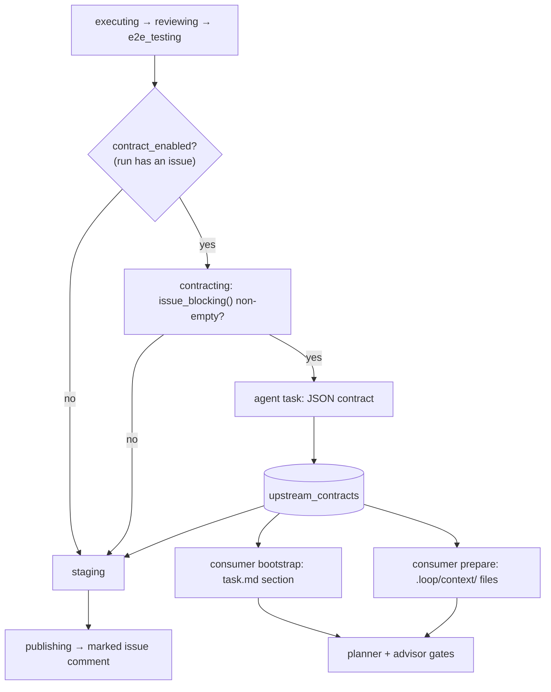

# Upstream API Contract Handoff Implementation Plan

> **For agentic workers:** REQUIRED SUB-SKILL: Use superpowers:subagent-driven-development (recommended) or superpowers:executing-plans to implement this plan task-by-task. Steps use checkbox (`- [x]`) syntax for tracking.

**Goal:** A Run whose issue blocks other issues describes the interface it built, and every dependent task's planning agent is planned against that description plus the real source files — instead of inventing endpoints.

**Architecture:** A new `contracting` stage of the Execution Run runs one agent task in the already-live sandbox, returns a JSON contract, and stores it in `upstream_contracts`. The dependency link survives the blocker closing through a new `issue_tasks.depends_on` column. When the dependent task starts, the scheduler renders the contract into `.loop/task.md` and the pipeline uploads the authoritative source files into `.loop/context/`; the planner prompt forbids un-sourced endpoints and the advisor prompt checks for them.

**Tech Stack:** Python 3.12, FastAPI, aiosqlite, httpx, pytest (`asyncio_mode = "auto"`), respx.

Spec: `docs/superpowers/specs/2026-08-08-upstream-api-contract-handoff-design.md`.

## Locked Decisions

- **Stage name and position:** `contracting`, between `e2e_testing` and `staging`, so a revise from `awaiting_approval` re-derives the contract.
- **Verdict wire format:** `{"outcome": "contract|none", "contract": str, "sources": [str], "breaking_changes": [str]}`, parsed through `jsonextract.find_json_object` like every other stage verdict.
- **`outcome: "none"` is a result, not a failure** — it still writes a row.
- **Storage key:** `upstream_contracts(repo, issue_number)` UNIQUE, latest write wins, no history.
- **`blocked_by` keeps its meaning** (open blockers, `list[int]`) because `_launch_ready` gates on it; the new `depends_on` column holds every dependency as `{"repo": str, "number": int}`.
- **Comment markers:** `<!-- loop:api-contract -->` … `<!-- /loop:api-contract -->`. The text between them is the contract, and a human edit of that comment outranks the stored row.
- **Sources are read from the producer's base branch** at consumer prepare time, never from a pinned sha.
- **Delivery paths:** `.loop/task.md` section `## Upstream dependencies` (committed), `.loop/context/<repo>/<path>` (uploaded to the sandbox, never committed — `.loop/.gitignore` already carries `*`).
- **Limits:** ≤10 source paths per upstream, ≤256 KiB of context in total.
- **Failure never blocks publication:** any contracting failure sets `contract_status = "failed"` and proceeds to `staging`.

## Global Constraints

- **English everywhere** — code, comments, prompts, comment bodies, rendered Markdown, test names.
- **No environment specifics** — no real repo/org names in code or docs; use `<backend-repo>`, `<owner>` in prose.
- Settings only through `Settings` (pydantic-settings, prefix `LOOP_`).
- HTTP clients take an optional `httpx.AsyncClient`; transient errors go through `clients/retry.with_retries`.
- Tests are pytest with `asyncio_mode = "auto"` — async tests need no decorator.
- Run: `python -m pytest tests -v` (Windows venv: `.venv/Scripts/python`).

## Architecture Diagram



---

### Task 1: The contract protocol module

Pure functions only — prompt, schema, parser, renderings, budget arithmetic. No I/O, so every branch is unit-testable.

**Files:**
- Create: `src/loop_orchestrator/contracts.py`
- Test: `tests/test_contracts.py`

**Interfaces:**
- Reuses: `jsonextract.find_json_object` (the shared verdict parser that survives prose before the JSON), `review.WORKING_EFFICIENTLY` (the cost rule shared verbatim by every stage prompt).
- Produces: `Contract`, `Upstream`, `ContractError`, `CONTRACT_OUTPUT_SCHEMA`, `COMMENT_MARKER`, `COMMENT_END_MARKER`, `CONTEXT_DIR`, `MAX_SOURCES`, `MAX_CONTEXT_BYTES`, `parse_contract_output(text) -> Contract`, `build_contract_prompt(head_branch) -> str`, `render_contract_comment(contract, pr_number, head_sha) -> str`, `extract_contract(comment_body) -> str`, `render_upstream_section(upstreams) -> str`, `render_context_readme(upstreams, dropped) -> str`, `missing_source_note(repo, base, path) -> str`.

- [x] **Step 1: Write the failing tests**

```python
# tests/test_contracts.py
"""The contract protocol: verdict parsing and the renderings that carry it."""
import pytest

from loop_orchestrator.contracts import (
    COMMENT_END_MARKER,
    COMMENT_MARKER,
    Contract,
    ContractError,
    Upstream,
    build_contract_prompt,
    extract_contract,
    missing_source_note,
    parse_contract_output,
    render_context_readme,
    render_contract_comment,
    render_upstream_section,
)


def test_parse_contract():
    c = parse_contract_output(
        'Here is the result: {"outcome": "contract", "contract": "### GET /v1/x",'
        ' "sources": ["/src/api.py", " "], "breaking_changes": ["drops v0"]}')
    assert c.outcome == "contract"
    assert c.contract == "### GET /v1/x"
    assert c.sources == ["src/api.py"]          # leading slash and blanks dropped
    assert c.breaking_changes == ["drops v0"]


def test_parse_none_outcome_needs_no_body():
    c = parse_contract_output('{"outcome": "none", "contract": "", "sources": []}')
    assert c.outcome == "none" and c.contract == "" and c.sources == []


def test_parse_survives_prose_json_before_the_verdict():
    # Regression: the agent quoting `{op: ...}` in prose used to win a greedy match.
    c = parse_contract_output(
        'I considered `{"op": "noop"}` first.\n'
        '{"outcome": "contract", "contract": "POST /v1/y", "sources": []}')
    assert c.contract == "POST /v1/y"


def test_parse_caps_sources_at_ten():
    c = parse_contract_output(
        '{"outcome": "contract", "contract": "x", "sources": %s}'
        % str([f"f{i}.py" for i in range(15)]).replace("'", '"'))
    assert len(c.sources) == 10


@pytest.mark.parametrize("text", [
    "no json here",
    '{"outcome": "maybe"}',
    '{"outcome": "contract", "contract": "   ", "sources": []}',
])
def test_parse_rejects_bad_input(text):
    with pytest.raises(ContractError):
        parse_contract_output(text)


def test_prompt_names_the_diff_and_forbids_writing():
    p = build_contract_prompt("feat/x")
    assert "origin/feat/x..HEAD" in p
    assert "Do NOT modify, commit or push anything" in p
    assert "at most 10 repo-relative paths" in p
    assert '"outcome": "contract | none"' in p


def test_comment_round_trips_through_the_markers():
    body = render_contract_comment(
        Contract(outcome="contract", contract="### GET /v1/x",
                 sources=["src/api.py"], breaking_changes=["drops v0"]),
        pr_number=45, head_sha="abcdef1234")
    assert body.startswith(COMMENT_MARKER)
    assert COMMENT_END_MARKER in body
    assert "PR #45" in body and "abcdef1" in body
    assert "drops v0" in body and "`src/api.py`" in body
    assert extract_contract(body) == "### GET /v1/x"


def test_extract_falls_back_to_the_whole_body():
    assert extract_contract(f"{COMMENT_MARKER}\nhand written\n") == "hand written"


def test_upstream_section_marks_the_contract_authoritative():
    s = render_upstream_section([Upstream(
        repo="o/backend", number=12, title="Ingest API", pr_number=45,
        contract_md="### POST /v1/ingest", sources=["src/api.py"])])
    assert "## Upstream dependencies" in s
    assert "### o/backend#12 — Ingest API (PR #45)" in s
    assert "do not invent endpoints" in s
    assert "### POST /v1/ingest" in s
    assert "`.loop/context/o/backend/`" in s and "- `src/api.py`" in s


def test_upstream_section_without_a_contract_says_so():
    s = render_upstream_section([Upstream(repo="o/backend", number=12, pr_number=45)])
    assert "No contract digest was captured" in s
    assert "do not invent endpoints" not in s


def test_upstream_section_is_empty_without_dependencies():
    assert render_upstream_section([]) == ""


def test_context_readme_lists_producers_and_drops():
    r = render_context_readme(
        [Upstream(repo="o/backend", number=12, sources=["src/api.py"])],
        dropped=["o/backend/src/huge.py"])
    assert "o/backend#12" in r and "o/backend/src/huge.py" in r


def test_missing_source_note_explains_itself():
    n = missing_source_note("o/backend", "main", "src/gone.py")
    assert "src/gone.py" in n and "main" in n and "o/backend" in n
```

- [x] **Step 2: Run the tests to verify they fail**

Run: `python -m pytest tests/test_contracts.py -q`
Expected: FAIL — `ModuleNotFoundError: No module named 'loop_orchestrator.contracts'`

- [x] **Step 3: Write the module**

```python
# src/loop_orchestrator/contracts.py
"""Upstream contract protocol: the contracting stage's prompt and verdict, and
the renderings that carry a captured contract to a dependent task.

Pure functions — the I/O that collects and delivers contracts lives in
`scheduler.py` and `pipeline.py`.
"""
from dataclasses import dataclass, field

from .jsonextract import find_json_object
from .review import WORKING_EFFICIENTLY

COMMENT_MARKER = "<!-- loop:api-contract -->"
COMMENT_END_MARKER = "<!-- /loop:api-contract -->"
CONTEXT_DIR = ".loop/context"
MAX_SOURCES = 10
MAX_CONTEXT_BYTES = 256 * 1024


class ContractError(Exception):
    pass


@dataclass
class Contract:
    outcome: str  # "contract" | "none"
    contract: str = ""
    sources: list[str] = field(default_factory=list)
    breaking_changes: list[str] = field(default_factory=list)


@dataclass
class Upstream:
    """One dependency of a task, with whatever is known about what it built."""
    repo: str
    number: int
    title: str = ""
    pr_number: int | None = None
    contract_md: str = ""
    sources: list[str] = field(default_factory=list)


CONTRACT_OUTPUT_SCHEMA = """{
  "outcome": "contract | none",
  "contract": "markdown: endpoints (method, path, authentication, request schema, response schema, status and error codes), events, shared types",
  "sources": ["repo-relative paths of the files that define the interface"],
  "breaking_changes": ["what existing consumers must change"]
}"""


def parse_contract_output(text: str) -> Contract:
    data = find_json_object(text, "outcome")
    if data is None:
        raise ContractError("no JSON object in the agent message")
    outcome = data.get("outcome")
    if outcome not in ("contract", "none"):
        raise ContractError(f"unknown contract outcome: {outcome!r}")
    body = str(data.get("contract") or "").strip()
    if outcome == "contract" and not body:
        raise ContractError("outcome=contract but the contract body is empty")
    sources = [str(s).strip().lstrip("/")
               for s in (data.get("sources") or []) if str(s).strip()]
    breaking = [str(b).strip()
                for b in (data.get("breaking_changes") or []) if str(b).strip()]
    return Contract(outcome=outcome, contract=body,
                    sources=sources[:MAX_SOURCES], breaking_changes=breaking)


def build_contract_prompt(head_branch: str) -> str:
    return (
        "You have just changed this branch. Tasks in other repositories will be "
        "planned against whatever you describe here — the consumer's planning "
        "agent will never see your code.\n"
        "This is a fresh session: there is no earlier conversation to recall. The "
        "work is exactly what sits on top of the imported branch:\n"
        f"  git diff --stat origin/{head_branch}..HEAD   # which files changed\n"
        f"  git diff origin/{head_branch}..HEAD          # the change itself\n"
        "Uncommitted leftovers count too — `git status --short` shows them.\n\n"
        "Describe the externally consumable interface this branch adds or changes: "
        "HTTP endpoints (method, path, authentication, request schema, response "
        "schema, status and error codes), events, and shared types. Verify every "
        "item against the source — anything the code does not implement must not "
        "appear in the description. List separately any breaking change to an "
        "interface that already had consumers.\n"
        f"List the authoritative source files a reader should open to check you: at "
        f"most {MAX_SOURCES} repo-relative paths, the ones that define the interface "
        "rather than the ones that merely use it.\n"
        'If the branch exposes no externally consumable interface at all, answer with '
        'outcome "none" — that is a real answer, not a failure.\n'
        "Do NOT modify, commit or push anything — you only describe.\n\n"
        + WORKING_EFFICIENTLY +
        "\nYour FINAL message must be a single JSON object and nothing else, "
        "matching exactly this schema:\n"
        f"{CONTRACT_OUTPUT_SCHEMA}"
    )


def render_contract_comment(contract: Contract, pr_number: int,
                            head_sha: str) -> str:
    """The issue comment. The body between the markers is the contract itself,
    so a human edit of it can be read back verbatim."""
    body = (contract.contract if contract.outcome == "contract"
            else "This change exposes no externally consumable interface.")
    lines = [COMMENT_MARKER,
             "**🤖 loop-orchestrator — API contract for dependent tasks**", "",
             body, COMMENT_END_MARKER, ""]
    if contract.breaking_changes:
        lines += ["**Breaking changes:**"]
        lines += [f"- {b}" for b in contract.breaking_changes]
        lines += [""]
    if contract.sources:
        lines += ["**Authoritative sources:**"]
        lines += [f"- `{s}`" for s in contract.sources]
        lines += [""]
    lines += [f"Captured from PR #{pr_number} at `{head_sha[:7]}`. Edit the text "
              "above this line to correct it — the planning agent of every "
              "dependent task reads this comment in preference to the stored copy."]
    return "\n".join(lines)


def extract_contract(comment_body: str) -> str:
    """The contract text a human may have edited, from a marked comment."""
    body = comment_body or ""
    if COMMENT_MARKER in body and COMMENT_END_MARKER in body:
        head = body.split(COMMENT_MARKER, 1)[1]
        inner = head.split(COMMENT_END_MARKER, 1)[0]
        # The bot heading is the first line of the block; a hand-written
        # replacement has no heading and must survive untouched.
        lines = [ln for ln in inner.strip().splitlines()
                 if not ln.startswith("**🤖 loop-orchestrator")]
        return "\n".join(lines).strip()
    return body.replace(COMMENT_MARKER, "").replace(COMMENT_END_MARKER, "").strip()


def render_upstream_section(upstreams: list[Upstream]) -> str:
    """The `.loop/task.md` block. Rendered whenever dependencies exist, with or
    without a contract: silence reads as "there was no upstream"."""
    if not upstreams:
        return ""
    out = ["## Upstream dependencies", ""]
    for u in upstreams:
        head = f"### {u.repo}#{u.number}"
        if u.title:
            head += f" — {u.title}"
        if u.pr_number:
            head += f" (PR #{u.pr_number})"
        out += [head, ""]
        if u.contract_md:
            out += ["**Upstream API contract — authoritative, do not invent "
                    "endpoints.**", "", u.contract_md, ""]
        else:
            out += ["No contract digest was captured for this dependency. Do not "
                    "guess its interface: read its code if it is reachable, "
                    "otherwise ask.", ""]
        if u.sources:
            out += [f"Authoritative sources, fetched into "
                    f"`{CONTEXT_DIR}/{u.repo}/`:"]
            out += [f"- `{s}`" for s in u.sources]
            out += [""]
    return "\n".join(out)


def render_context_readme(upstreams: list[Upstream], dropped: list[str]) -> str:
    lines = ["# Upstream context", "",
             "Read-only copies of the files that define the interfaces this task "
             "consumes. They are the authority: where this directory and any "
             "description disagree, these files are right.", ""]
    for u in upstreams:
        lines += [f"- `{u.repo}#{u.number}` → `{CONTEXT_DIR}/{u.repo}/`"]
    if dropped:
        lines += ["", f"Dropped to stay within {MAX_CONTEXT_BYTES // 1024} KiB:"]
        lines += [f"- {d}" for d in dropped]
    return "\n".join(lines) + "\n"


def missing_source_note(repo: str, base: str, path: str) -> str:
    return (f"This file was named as an authoritative source of {repo}, but "
            f"`{path}` does not exist on `{base}` — it was renamed or removed "
            "after the contract was captured. Do not assume its contents.\n")
```

- [x] **Step 4: Run the tests to verify they pass**

Run: `python -m pytest tests/test_contracts.py -q`
Expected: PASS (14 tests)

- [x] **Step 5: Commit**

```bash
git add src/loop_orchestrator/contracts.py tests/test_contracts.py
git commit -m "feat(contracts): contract verdict protocol and its renderings"
```

---

### Task 2: GitHub dependency records and marked comments

`issue_blocked_by` throws away the blocker's repository and everything that is closed, which is exactly the information the handoff needs. Add a record-returning call underneath it, the reverse direction, and comment upsert-by-marker.

**Files:**
- Modify: `src/loop_orchestrator/clients/github.py:251-262`
- Modify: `tests/conftest.py:32,111` (FakeGitHub)
- Test: `tests/test_github_client.py:226-235`

**Interfaces:**
- Reuses: `GitHubClient._req` (retry + 5xx handling), `list_issue_comments`, `create_comment`.
- Produces: `issue_dependencies(repo, number) -> list[dict]` with `{"repo": str, "number": int, "state": str}`; `issue_blocking(repo, number) -> list[dict]` (same shape); `issue_blocked_by(repo, number) -> list[int]` (unchanged signature, now derived); `find_comment(repo, number, marker) -> dict | None`; `update_comment(repo, comment_id, body) -> None`; `upsert_marked_comment(repo, number, marker, body) -> None`.

- [x] **Step 1: Probe the reverse-dependency endpoint**

The trigger for the whole stage depends on it. On a repository with a known dependency pair, run:

```bash
gh api "repos/<owner>/<repo>/issues/<blocker-number>/dependencies/blocking"
```

Expected: a JSON array of issue objects. If it 404s, the endpoint has a different name — check `gh api /` output and the current REST docs for "issue dependencies", and adjust the path constant in Step 3. If no such endpoint exists at all, implement `issue_blocking` as a scan instead: `list_ready_issues` over the repos in `LOOP_BACKLOG_REPOS` and keep those whose `issue_dependencies` contain this issue. Record whichever answer you get in the module docstring so the next reader does not re-probe.

- [x] **Step 2: Write the failing tests**

```python
# tests/test_github_client.py — replace test_issue_blocked_by_open_only_and_absent_api
@respx.mock
async def test_issue_dependencies_keep_repo_and_closed_entries():
    respx.get(f"{GH}/repos/o/r/issues/9/dependencies/blocked_by").mock(
        return_value=httpx.Response(200, json=[
            {"number": 3, "state": "open"},
            {"number": 4, "state": "closed",
             "repository": {"full_name": "o/backend"}}]))
    respx.get(f"{GH}/repos/o/r/issues/10/dependencies/blocked_by").mock(
        return_value=httpx.Response(404))
    gh = GitHubClient("t")
    assert await gh.issue_dependencies("o/r", 9) == [
        {"repo": "o/r", "number": 3, "state": "open"},
        {"repo": "o/backend", "number": 4, "state": "closed"}]
    assert await gh.issue_dependencies("o/r", 10) == []


@respx.mock
async def test_issue_blocked_by_is_open_numbers_only():
    respx.get(f"{GH}/repos/o/r/issues/9/dependencies/blocked_by").mock(
        return_value=httpx.Response(200, json=[
            {"number": 3, "state": "open"}, {"number": 4, "state": "closed"}]))
    assert await GitHubClient("t").issue_blocked_by("o/r", 9) == [3]


@respx.mock
async def test_issue_blocking_reverses_the_direction():
    respx.get(f"{GH}/repos/o/r/issues/12/dependencies/blocking").mock(
        return_value=httpx.Response(200, json=[
            {"number": 13, "state": "open",
             "repository": {"full_name": "o/frontend"}}]))
    respx.get(f"{GH}/repos/o/r/issues/14/dependencies/blocking").mock(
        return_value=httpx.Response(410))
    gh = GitHubClient("t")
    assert await gh.issue_blocking("o/r", 12) == [
        {"repo": "o/frontend", "number": 13, "state": "open"}]
    assert await gh.issue_blocking("o/r", 14) == []


@respx.mock
async def test_upsert_marked_comment_edits_the_existing_one():
    respx.get(f"{GH}/repos/o/r/issues/12/comments").mock(
        return_value=httpx.Response(200, json=[
            {"id": 1, "body": "unrelated"},
            {"id": 2, "body": "<!-- loop:api-contract -->old"}]))
    patch = respx.patch(f"{GH}/repos/o/r/issues/comments/2").mock(
        return_value=httpx.Response(200, json={}))
    await GitHubClient("t").upsert_marked_comment(
        "o/r", 12, "<!-- loop:api-contract -->", "new")
    assert patch.called
    assert patch.calls[0].request.read() == b'{"body": "new"}'


@respx.mock
async def test_upsert_marked_comment_creates_when_absent():
    respx.get(f"{GH}/repos/o/r/issues/12/comments").mock(
        return_value=httpx.Response(200, json=[{"id": 1, "body": "unrelated"}]))
    post = respx.post(f"{GH}/repos/o/r/issues/12/comments").mock(
        return_value=httpx.Response(201, json={}))
    await GitHubClient("t").upsert_marked_comment(
        "o/r", 12, "<!-- loop:api-contract -->", "new")
    assert post.called
```

- [x] **Step 3: Run the tests to verify they fail**

Run: `python -m pytest tests/test_github_client.py -q`
Expected: FAIL — `AttributeError: 'GitHubClient' object has no attribute 'issue_dependencies'`

- [x] **Step 4: Implement in the client**

Replace `issue_blocked_by` (`clients/github.py:251-262`) with:

```python
    async def _dependencies(self, repo: str, number: int, rel: str) -> list[dict]:
        """`{repo, number, state}` for one direction of the native dependencies.

        The blocker's own repository only appears on cross-repo links, so a
        missing `repository` means "same repo". Repos/plans without the feature
        answer 404/410 — treated as "none" so the scheduler keeps working.
        """
        r = await self._req("GET",
                            f"/repos/{repo}/issues/{number}/dependencies/{rel}")
        if r.status_code in (404, 410):
            return []
        r.raise_for_status()
        return [{"repo": ((i.get("repository") or {}).get("full_name") or repo),
                 "number": i["number"],
                 "state": i.get("state") or "open"}
                for i in r.json()]

    async def issue_dependencies(self, repo: str, number: int) -> list[dict]:
        """Every issue this one is blocked by, open or closed."""
        return await self._dependencies(repo, number, "blocked_by")

    async def issue_blocking(self, repo: str, number: int) -> list[dict]:
        """Every issue this one blocks — the direction the handoff needs."""
        return await self._dependencies(repo, number, "blocking")

    async def issue_blocked_by(self, repo: str, number: int) -> list[int]:
        """Numbers of the OPEN blockers — the scheduler's launch gate."""
        return [d["number"] for d in await self.issue_dependencies(repo, number)
                if d["state"] == "open"]

    async def find_comment(self, repo: str, number: int, marker: str) -> dict | None:
        for c in await self.list_issue_comments(repo, number):
            if marker in (c.get("body") or ""):
                return c
        return None

    async def update_comment(self, repo: str, comment_id: int, body: str) -> None:
        r = await self._req("PATCH", f"/repos/{repo}/issues/comments/{comment_id}",
                            json={"body": body})
        r.raise_for_status()

    async def upsert_marked_comment(self, repo: str, number: int, marker: str,
                                    body: str) -> None:
        """One marked comment per issue — a re-run edits it instead of piling up."""
        existing = await self.find_comment(repo, number, marker)
        if existing is None:
            await self.create_comment(repo, number, body)
        else:
            await self.update_comment(repo, int(existing["id"]), body)
```

- [x] **Step 5: Teach FakeGitHub the new calls**

In `tests/conftest.py`, replace the `self.blocked` attribute line (`:32`) and the `issue_blocked_by` method (`:111`):

```python
        self.blocked: dict[int, list[int]] = {}     # issue -> open blocker numbers
        self.deps: dict[int, list[dict]] = {}       # issue -> dependency records
        self.blocking: dict[int, list[dict]] = {}   # issue -> issues it blocks
        self.comments_updated: list[tuple[int, str]] = []
```

```python
    async def issue_blocked_by(self, repo, number):
        if number in self.deps:
            return [d["number"] for d in self.deps[number] if d["state"] == "open"]
        return self.blocked.get(number, [])

    async def issue_dependencies(self, repo, number):
        if number in self.deps:
            return self.deps[number]
        return [{"repo": repo, "number": n, "state": "open"}
                for n in self.blocked.get(number, [])]

    async def issue_blocking(self, repo, number):
        return self.blocking.get(number, [])

    async def find_comment(self, repo, number, marker):
        for c in self.issue_comments.get(number, []):
            if marker in (c.get("body") or ""):
                return c
        return None

    async def update_comment(self, repo, comment_id, body):
        self.comments_updated.append((comment_id, body))

    async def upsert_marked_comment(self, repo, number, marker, body):
        existing = await self.find_comment(repo, number, marker)
        if existing is None:
            await self.create_comment(repo, number, body)
        else:
            await self.update_comment(repo, int(existing["id"]), body)
```

- [x] **Step 6: Run the whole suite**

Run: `python -m pytest tests -q`
Expected: PASS — `issue_blocked_by` kept its signature, so `tests/test_scheduler.py` is untouched.

- [x] **Step 7: Commit**

```bash
git add src/loop_orchestrator/clients/github.py tests/test_github_client.py tests/conftest.py
git commit -m "feat(github): dependency records, the blocking direction and marked comments"
```

---

### Task 3: Storage — contracts, dependency memory, run status

**Files:**
- Modify: `src/loop_orchestrator/db.py:8-160` (schema, migrations, run fields), append accessors
- Modify: `src/loop_orchestrator/models.py:24-67` (Run fields)
- Modify: `src/loop_orchestrator/issue_tasks.py:19-38,86` (IssueTask.depends_on)
- Test: `tests/test_db.py`, `tests/test_issue_tasks.py`

**Interfaces:**
- Reuses: the `_MIGRATIONS`/`ALTER TABLE` pattern in `db.connect`, the `ON CONFLICT … DO UPDATE` pattern of `db.save_stage_cost`, `issue_tasks._set`.
- Produces: `db.save_contract(db, repo, issue_number, run_id, pr_number, head_sha, contract_md, sources, breaking)`, `db.get_contract(db, repo, issue_number) -> dict | None`, `it.set_depends_on(db, repo, issue_number, deps)`, `IssueTask.depends_on: list[dict]`, `Run.contract_enabled: bool`, `Run.contract_status: str | None`, `Run.contract_json: str | None`.

`contract_json` duplicates the row's text on the Run deliberately, exactly as
`review_json` and `e2e_json` already do: Telegram renders from the Run it holds,
and the approval message has to show the contract *before* the issue comment
exists.

- [x] **Step 1: Write the failing tests**

```python
# tests/test_db.py — append
async def test_contract_round_trip_and_replacement(db):
    await dbmod.save_contract(db, "o/backend", 12, run_id=7, pr_number=45,
                              head_sha="abc1234", contract_md="### GET /x",
                              sources=["src/api.py"], breaking=["drops v0"])
    row = await dbmod.get_contract(db, "o/backend", 12)
    assert row["contract_md"] == "### GET /x"
    assert json.loads(row["sources_json"]) == ["src/api.py"]
    assert json.loads(row["breaking_json"]) == ["drops v0"]
    assert row["pr_number"] == 45 and row["head_sha"] == "abc1234"

    # A revise re-runs the stage; the later capture is the one that shipped.
    await dbmod.save_contract(db, "o/backend", 12, run_id=8, pr_number=45,
                              head_sha="def5678", contract_md="### GET /y",
                              sources=[], breaking=[])
    row = await dbmod.get_contract(db, "o/backend", 12)
    assert row["contract_md"] == "### GET /y" and row["run_id"] == 8


async def test_get_contract_is_none_when_never_captured(db):
    assert await dbmod.get_contract(db, "o/backend", 99) is None


async def test_run_carries_contract_columns(db):
    run = await dbmod.create_run(db, "o/r", 5, "b")
    # SQLite hands booleans back as 0/1, so assert truthiness, not identity.
    assert not run.contract_enabled
    assert run.contract_status is None and run.contract_json is None
    run.contract_enabled = True
    run.contract_status = "produced"
    run.contract_json = '{"outcome": "contract"}'
    await dbmod.save_run(db, run)
    reloaded = await dbmod.get_run(db, run.id)
    assert reloaded.contract_status == "produced"
    assert json.loads(reloaded.contract_json)["outcome"] == "contract"
```

`tests/test_db.py` needs `import json` at the top if it is not already there.

```python
# tests/test_issue_tasks.py — append
async def test_depends_on_survives_the_blocker_closing(db):
    await it.upsert_task(db, "o/frontend", 13, "T", None)
    await it.set_blocked_by(db, "o/frontend", 13, [12])
    await it.set_depends_on(db, "o/frontend", 13,
                            [{"repo": "o/backend", "number": 12}])
    # The blocker closes: the gate clears, the link does not.
    await it.set_blocked_by(db, "o/frontend", 13, [])
    task = await it.get_task(db, "o/frontend", 13)
    assert task.blocked_by == []
    assert task.depends_on == [{"repo": "o/backend", "number": 12}]


async def test_depends_on_defaults_to_empty(db):
    await it.upsert_task(db, "o/frontend", 14, "T", None)
    assert (await it.get_task(db, "o/frontend", 14)).depends_on == []
```

- [x] **Step 2: Run the tests to verify they fail**

Run: `python -m pytest tests/test_db.py tests/test_issue_tasks.py -q`
Expected: FAIL — `AttributeError: module 'loop_orchestrator.db' has no attribute 'save_contract'`

- [x] **Step 3: Extend the schema and migrations**

In `db.py`, add `import json` beside the existing imports. Append to `SCHEMA` (after the `issue_tasks` table):

```sql
-- What a Run built, for the tasks its issue blocks. Keyed by the producing
-- issue: a consumer resolves it through issue_tasks.depends_on. A revise
-- re-runs the stage, so the row is replaced rather than appended to.
CREATE TABLE IF NOT EXISTS upstream_contracts (
  id INTEGER PRIMARY KEY AUTOINCREMENT,
  repo TEXT NOT NULL,
  issue_number INTEGER NOT NULL,
  run_id INTEGER,
  pr_number INTEGER,
  head_sha TEXT NOT NULL DEFAULT '',
  contract_md TEXT NOT NULL DEFAULT '',
  sources_json TEXT NOT NULL DEFAULT '[]',
  breaking_json TEXT NOT NULL DEFAULT '[]',
  created_at TEXT NOT NULL DEFAULT (datetime('now')),
  UNIQUE(repo, issue_number)
);
```

Add the two run columns to `_RUN_FIELDS` (after `"lane", "tg_merge_message_id",`):

```python
    "contract_enabled", "contract_status", "contract_json",
```

and to `_MIGRATIONS`:

```python
    ("contract_enabled", "INTEGER NOT NULL DEFAULT 0"),
    ("contract_status", "TEXT"),
    ("contract_json", "TEXT"),
```

Add the issue_tasks migration table and generalise `connect`:

```python
# issue_tasks columns added after phase 5a.
_ISSUE_TASK_MIGRATIONS = (
    ("depends_on", "TEXT NOT NULL DEFAULT '[]'"),
)


async def _add_missing_columns(db: aiosqlite.Connection, table: str,
                               migrations: tuple) -> None:
    async with db.execute(f"PRAGMA table_info({table})") as cur:
        have = {row["name"] for row in await cur.fetchall()}
    for col, decl in migrations:
        if col not in have:
            await db.execute(f"ALTER TABLE {table} ADD COLUMN {col} {decl}")
```

and rewrite the body of `connect` after `executescript`:

```python
    await _add_missing_columns(db, "runs", _MIGRATIONS)
    await _add_missing_columns(db, "issue_tasks", _ISSUE_TASK_MIGRATIONS)
    await db.commit()
    return db
```

Add `contract_enabled=?, contract_status=?, contract_json=?` to the `UPDATE` in `save_run` (right before `updated_at=datetime('now')`) and `run.contract_enabled, run.contract_status, run.contract_json,` to its parameter tuple in the same position.

- [x] **Step 4: Add the contract accessors**

Append to `db.py`:

```python
async def save_contract(db: aiosqlite.Connection, repo: str, issue_number: int,
                        run_id: int | None, pr_number: int | None, head_sha: str,
                        contract_md: str, sources: list[str],
                        breaking: list[str]) -> None:
    """One row per producing issue, replaced on every re-capture."""
    await db.execute(
        "INSERT INTO upstream_contracts (repo, issue_number, run_id, pr_number, "
        "head_sha, contract_md, sources_json, breaking_json, created_at) "
        "VALUES (?,?,?,?,?,?,?,?,datetime('now')) "
        "ON CONFLICT(repo, issue_number) DO UPDATE SET run_id=excluded.run_id, "
        "pr_number=excluded.pr_number, head_sha=excluded.head_sha, "
        "contract_md=excluded.contract_md, sources_json=excluded.sources_json, "
        "breaking_json=excluded.breaking_json, created_at=excluded.created_at",
        (repo, issue_number, run_id, pr_number, head_sha, contract_md,
         json.dumps(sources), json.dumps(breaking)))
    await db.commit()


async def get_contract(db: aiosqlite.Connection, repo: str,
                       issue_number: int) -> dict | None:
    async with db.execute(
            "SELECT * FROM upstream_contracts WHERE repo=? AND issue_number=?",
            (repo, issue_number)) as cur:
        row = await cur.fetchone()
    return dict(row) if row else None
```

- [x] **Step 5: Extend Run and IssueTask**

In `models.py`, add to the `Run` dataclass after `lane`:

```python
    # Set at prepare: only a Run tied to an issue can hand anything downstream.
    contract_enabled: bool = False
    contract_status: str | None = None  # produced | none | skipped | failed
    contract_json: str | None = None    # the captured Contract, for Telegram
```

and add the state constant next to the others:

```python
CONTRACTING = "contracting"
```

extending both sets:

```python
ACTIVE_STATES = {QUEUED, PREPARING, PLANNING, EXECUTING, REVIEWING, E2E_TESTING,
                 CONTRACTING, STAGING, AWAITING_APPROVAL, PUBLISHING, REPORTING}

# States from which a human may cancel a run (before its work is staged).
CANCELABLE = {QUEUED, PREPARING, PLANNING, EXECUTING, REVIEWING, E2E_TESTING,
              CONTRACTING}
```

In `issue_tasks.py`, add `depends_on: list[dict]` to the `IssueTask` dataclass after `blocked_by`, read it in `_to_task`:

```python
        blocked_by=json.loads(row["blocked_by"]),
        depends_on=json.loads(row["depends_on"]),
```

and add the setter beside `set_blocked_by`:

```python
async def set_depends_on(db, repo, issue_number, deps: list[dict]) -> None:
    """Every dependency, open or closed — `blocked_by` forgets them on closing,
    and closing is exactly when the handoff needs them."""
    await _set(db, repo, issue_number, "depends_on", json.dumps(deps))
```

- [x] **Step 6: Run the tests to verify they pass**

Run: `python -m pytest tests/test_db.py tests/test_issue_tasks.py -q`
Expected: PASS

- [x] **Step 7: Run the whole suite**

Run: `python -m pytest tests -q`
Expected: PASS

- [x] **Step 8: Commit**

```bash
git add src/loop_orchestrator/db.py src/loop_orchestrator/models.py src/loop_orchestrator/issue_tasks.py tests/test_db.py tests/test_issue_tasks.py
git commit -m "feat(db): upstream_contracts table, depends_on and the run contract columns"
```

---

### Task 4: The scheduler remembers dependencies

**Files:**
- Modify: `src/loop_orchestrator/scheduler.py:114-122` (`_sync`)
- Test: `tests/test_scheduler.py`

**Interfaces:**
- Reuses: `Scheduler._sync`'s existing per-task loop, `gh.issue_blocked_by` (the gate), `it.set_blocked_by`.
- Consumes: `gh.issue_dependencies` (Task 2), `it.set_depends_on` (Task 3).

- [x] **Step 1: Write the failing test**

```python
# tests/test_scheduler.py — append
async def test_sync_records_every_dependency_not_just_the_open_ones(db):
    gh = FakeGitHub()
    gh.ready_issues = [{"number": 13, "title": "F", "labels": []}]
    gh.deps[13] = [{"repo": "o/backend", "number": 12, "state": "closed"},
                   {"repo": "o/frontend", "number": 11, "state": "open"}]
    sched = Scheduler(db, FakeSettings(), gh, FakeWorker())
    await sched.tick("o/frontend")
    task = await it.get_task(db, "o/frontend", 13)
    assert task.blocked_by == [11]                       # the gate: open only
    assert task.depends_on == gh.deps[13]                # the memory: everything
```

Match the imports and the worker fake already used by the file's other tests.

- [x] **Step 2: Run the test to verify it fails**

Run: `python -m pytest tests/test_scheduler.py -q`
Expected: FAIL — `assert [] == [{'repo': 'o/backend', ...}]`

- [x] **Step 3: Record both in `_sync`**

Replace the `BACKLOG` branch of the state loop in `scheduler.py:119-122`:

```python
            elif task.state == it.BACKLOG:
                deps = await self.gh.issue_dependencies(repo, task.issue_number)
                await it.set_depends_on(self.db, repo, task.issue_number, [
                    {"repo": d["repo"], "number": d["number"]} for d in deps])
                await it.set_blocked_by(
                    self.db, repo, task.issue_number,
                    [d["number"] for d in deps if d["state"] == "open"])
```

`set_blocked_by` sorts its input, so the gate behaves exactly as before; one API
call now answers both questions.

- [x] **Step 4: Run the tests to verify they pass**

Run: `python -m pytest tests/test_scheduler.py -q`
Expected: PASS

- [x] **Step 5: Commit**

```bash
git add src/loop_orchestrator/scheduler.py tests/test_scheduler.py
git commit -m "feat(scheduler): remember every dependency, not only the open ones"
```

---

### Task 5: The `contracting` state

**Files:**
- Modify: `src/loop_orchestrator/state_machine.py:4-32`
- Modify: `src/loop_orchestrator/clients/tg_card.py:9-33,119-126`
- Modify: `src/loop_orchestrator/worker.py:122-129`
- Test: `tests/test_state_machine.py`, `tests/test_tg_card.py`

**Interfaces:**
- Reuses: `TRANSITIONS`, `tg_card.STAGES`/`_LABELS` and its `➖` skip rule for `review_enabled`/`e2e_enabled`, `worker.recover`'s restartable set.
- Consumes: `models.CONTRACTING`, `Run.contract_enabled`, `Run.contract_status` (Task 3).

- [x] **Step 1: Write the failing tests**

```python
# tests/test_state_machine.py — append
async def test_contracting_sits_between_verification_and_staging(db):
    run = await dbmod.create_run(db, "o/r", 5, "b")
    for state in (PREPARING, EXECUTING, CONTRACTING, STAGING):
        await transition(db, run, state)
    assert run.state == STAGING


async def test_every_verification_stage_can_reach_contracting(db):
    assert CONTRACTING in TRANSITIONS[EXECUTING]
    assert CONTRACTING in TRANSITIONS[REVIEWING]
    assert CONTRACTING in TRANSITIONS[E2E_TESTING]
    assert TRANSITIONS[CONTRACTING] == {STAGING, FAILED, CANCELLED}
```

```python
# tests/test_tg_card.py — append
def test_card_shows_contracting_and_skips_it_when_disabled():
    run = Run(id=1, repo="o/r", pr_number=5, head_branch="b", state=STAGING)
    events = [(QUEUED, "2026-08-08 10:00:00"), (PREPARING, "2026-08-08 10:01:00"),
              (EXECUTING, "2026-08-08 10:02:00"), (STAGING, "2026-08-08 10:30:00")]
    text = render_card(run, events, "UTC")
    assert "➖ contracting" in text          # run not tied to an issue

    run.contract_enabled = True
    run.contract_status = "skipped"          # the issue blocks nobody
    assert "➖ contracting" in render_card(run, events, "UTC")

    run.contract_status = "produced"
    run.state = CONTRACTING
    assert "⏳ contracting" in render_card(run, events, "UTC")
```

- [x] **Step 2: Run the tests to verify they fail**

Run: `python -m pytest tests/test_state_machine.py tests/test_tg_card.py -q`
Expected: FAIL — `ImportError: cannot import name 'CONTRACTING'`

- [x] **Step 3: Wire the state into the machine**

In `state_machine.py`, add `CONTRACTING` to the imports from `.models` and rewrite the four affected rows:

```python
    EXECUTING: {REVIEWING, E2E_TESTING, CONTRACTING, STAGING, FAILED, CANCELLED},
    REVIEWING: {E2E_TESTING, CONTRACTING, STAGING, FAILED, CANCELLED},
    E2E_TESTING: {CONTRACTING, STAGING, FAILED, CANCELLED},
    CONTRACTING: {STAGING, FAILED, CANCELLED},
```

`STAGING` stays a legal target of the three verification states: a Run with no issue skips `contracting` entirely.

- [x] **Step 4: Wire the state into the card**

In `tg_card.py`, import `CONTRACTING`, insert it into `STAGES` between `E2E_TESTING` and `STAGING`, add `CONTRACTING: "contracting"` to `_LABELS`, and add the skip rule after the `e2e_enabled` one:

```python
        elif prepared and stage == CONTRACTING and (
                not run.contract_enabled or run.contract_status == "skipped"):
            icon = "➖"
```

- [x] **Step 5: Make the state restartable**

In `worker.py`, add `CONTRACTING` to the `.models` import and to the restartable set, and extend the comment:

```python
        # queued: not started yet; planning/executing/reviewing/e2e_testing/
        # contracting: restartable — _planning starts a fresh planner iteration,
        # _execute re-polls its task, _review starts a fresh review iteration,
        # _e2e starts a fresh e2e iteration, _contracting re-captures the
        # contract and overwrites the row it keys.
        for run in await dbmod.runs_in_states(
                self.db, {QUEUED, PLANNING, EXECUTING, REVIEWING, E2E_TESTING,
                          CONTRACTING}):
            self.enqueue(run.id)
```

- [x] **Step 6: Run the tests to verify they pass**

Run: `python -m pytest tests/test_state_machine.py tests/test_tg_card.py tests/test_worker.py -q`
Expected: PASS

- [x] **Step 7: Commit**

```bash
git add src/loop_orchestrator/state_machine.py src/loop_orchestrator/clients/tg_card.py src/loop_orchestrator/worker.py tests/test_state_machine.py tests/test_tg_card.py
git commit -m "feat(states): the contracting stage in the machine, the card and recovery"
```

---

### Task 6: The contracting stage in the pipeline

**Files:**
- Modify: `src/loop_orchestrator/pipeline.py` — imports (`:35-50`), `_prepare` (`:302-345`), `process` (`:1079-1093`), new methods beside `_e2e`
- Modify: `src/loop_orchestrator/config.py:31-38`
- Modify: `tests/conftest.py:294-332` (FakeSettings)
- Test: `tests/test_pipeline_contracting.py` (create)

**Interfaces:**
- Reuses: `Pipeline._run_sandbox_task` (submission, rate-limit and transient-error handling, tracing span), `ReviewDeadline`/`ReviewTaskError`, the `_finish_review`/`_finish_e2e` shape for recording a stage outcome, `settings.review_timeout_minutes` as the per-task cap.
- Consumes: `contracts.build_contract_prompt`, `contracts.parse_contract_output`, `contracts.ContractError` (Task 1); `gh.issue_blocking` (Task 2); `dbmod.save_contract`, `Run.contract_enabled`, `Run.contract_status` (Task 3); `models.CONTRACTING` (Task 5).
- Produces: `Pipeline._contracting(run)`, `Pipeline._finish_contract(run, status, detail)`, `Settings.contract_model`.

- [x] **Step 1: Write the failing tests**

```python
# tests/test_pipeline_contracting.py
"""The contracting stage: capture the interface for the tasks this issue blocks."""
import json

from loop_orchestrator import db as dbmod
from loop_orchestrator.models import DONE

from tests.conftest import FakeGitHub, FakeSandboxd, FakeTG
from tests.test_pipeline_prepare import make_pipeline, seed_ok
from tests.test_pipeline_review import seed_run_env

EXEC_OK = {"status": "succeeded", "agent_message_final": "did the work"}
CONTRACT_OK = {"status": "succeeded", "agent_message_final": json.dumps({
    "outcome": "contract", "contract": "### POST /v1/ingest",
    "sources": ["src/api/ingest.py"], "breaking_changes": []})}
CONTRACT_JUNK = {"status": "succeeded", "agent_message_final": "no json at all"}


async def start_run(db, gh, sb, tg, tmp_path, issue_number=12):
    seed_ok(gh, tmp_path)
    gh.files[".loop.yml"] = "specs_dir: docs/superpowers/specs\ntest: npm test\n"
    run = await dbmod.create_run(db, "o/myrepo", 5, "feat/x")
    run.issue_number = issue_number
    await dbmod.save_run(db, run)
    seed_run_env(gh, sb, tmp_path, run.id)
    return make_pipeline(db, tmp_path, gh=gh, sb=sb, tg=tg), run


async def test_contract_captured_when_the_issue_blocks_another(db, tmp_path):
    gh, sb, tg = FakeGitHub(), FakeSandboxd(), FakeTG()
    pipe, run = await start_run(db, gh, sb, tg, tmp_path)
    gh.blocking[12] = [{"repo": "o/frontend", "number": 13, "state": "open"}]
    gh.branch_shas["feat/x"] = "headsha1"
    sb.task_results = [EXEC_OK, CONTRACT_OK]
    await pipe.process(run)
    assert run.state == DONE
    assert run.contract_status == "produced"
    task = sb.tasks_submitted[1]
    assert task["model"] == "claude-sonnet-5"
    assert task["continue"] is False          # describes the code, not the session
    assert "origin/feat/x..HEAD" in task["prompt"]
    row = await dbmod.get_contract(db, "o/myrepo", 12)
    assert row["contract_md"] == "### POST /v1/ingest"
    assert json.loads(row["sources_json"]) == ["src/api/ingest.py"]
    assert row["pr_number"] == 5 and row["head_sha"] == "headsha1"


async def test_stage_skipped_when_the_issue_blocks_nobody(db, tmp_path):
    gh, sb, tg = FakeGitHub(), FakeSandboxd(), FakeTG()
    pipe, run = await start_run(db, gh, sb, tg, tmp_path)
    sb.task_results = [EXEC_OK]               # no contract task is submitted
    await pipe.process(run)
    assert run.state == DONE and run.contract_status == "skipped"
    assert len(sb.tasks_submitted) == 1
    assert await dbmod.get_contract(db, "o/myrepo", 12) is None


async def test_run_without_an_issue_never_enters_the_stage(db, tmp_path):
    gh, sb, tg = FakeGitHub(), FakeSandboxd(), FakeTG()
    seed_ok(gh, tmp_path)
    gh.files[".loop.yml"] = "specs_dir: docs/superpowers/specs\ntest: npm test\n"
    run = await dbmod.create_run(db, "o/myrepo", 5, "feat/x")
    seed_run_env(gh, sb, tmp_path, run.id)
    pipe = make_pipeline(db, tmp_path, gh=gh, sb=sb, tg=tg)
    sb.task_results = [EXEC_OK]
    await pipe.process(run)
    assert run.state == DONE
    assert not run.contract_enabled and run.contract_status is None
    states = [e[0] for e in await dbmod.events_for_run(db, run.id)]
    assert "contracting" not in states


async def test_a_broken_verdict_does_not_block_publication(db, tmp_path):
    gh, sb, tg = FakeGitHub(), FakeSandboxd(), FakeTG()
    pipe, run = await start_run(db, gh, sb, tg, tmp_path)
    gh.blocking[12] = [{"repo": "o/frontend", "number": 13, "state": "open"}]
    sb.task_results = [EXEC_OK, CONTRACT_JUNK]
    await pipe.process(run)
    assert run.state == DONE                  # publication went through
    assert run.contract_status == "failed"
    assert await dbmod.get_contract(db, "o/myrepo", 12) is None


async def test_outcome_none_is_recorded_as_a_result(db, tmp_path):
    gh, sb, tg = FakeGitHub(), FakeSandboxd(), FakeTG()
    pipe, run = await start_run(db, gh, sb, tg, tmp_path)
    gh.blocking[12] = [{"repo": "o/frontend", "number": 13, "state": "open"}]
    sb.task_results = [EXEC_OK, {"status": "succeeded", "agent_message_final":
                                 '{"outcome": "none", "contract": "", "sources": []}'}]
    await pipe.process(run)
    assert run.contract_status == "none"
    row = await dbmod.get_contract(db, "o/myrepo", 12)
    assert row is not None and row["contract_md"] == ""
```

- [x] **Step 2: Run the tests to verify they fail**

Run: `python -m pytest tests/test_pipeline_contracting.py -q`
Expected: FAIL — `AttributeError: 'FakeSettings' object has no attribute 'contract_model'`

- [x] **Step 3: Add the setting**

In `config.py`, after `advisor_model`:

```python
    # The contracting stage reads code it did not write and its output is
    # planned against in another repository — a mistake here surfaces only when
    # the consumer's implementation runs, so this is not reviewer-grade work.
    contract_model: str = "claude-sonnet-5"
```

In `tests/conftest.py`, add `contract_model = "claude-sonnet-5"` to `FakeSettings` beside `advisor_model`.

- [x] **Step 4: Add the stage to the pipeline**

Import in `pipeline.py`:

```python
from dataclasses import asdict

from .contracts import (
    ContractError,
    build_contract_prompt,
    parse_contract_output,
)
```

and add `CONTRACTING` to the `.models` import list.

Set the flag at the end of `_prepare`, right after `run.approval_mode = cfg.approval`:

```python
        # Only a Run tied to an issue can hand anything to a dependent task;
        # whether the issue actually blocks anyone is decided at stage time,
        # because a dependency may be added hours after prepare.
        run.contract_enabled = run.issue_number is not None
```

Add the two methods after `_e2e`:

```python
    async def _finish_contract(self, run: Run, status: str, detail: str) -> None:
        run.contract_status = status
        await dbmod.save_run(self.db, run)
        await dbmod.add_event(self.db, run.id, CONTRACTING, CONTRACTING,
                              f"contracting: {status} — {detail}")

    async def _contracting(self, run: Run) -> None:
        """Describe the interface this Run built, for the tasks it blocks.

        Never fatal: the work is already reviewed, and a consumer that gets no
        contract stops at its own planner gate instead of guessing.
        """
        try:
            blocking = await self.gh.issue_blocking(run.repo, run.issue_number)
        except Exception as e:  # noqa: BLE001 — a lookup failure is not a Run failure
            return await self._finish_contract(run, "skipped",
                                               f"blocking lookup failed: {e}")
        if not blocking:
            return await self._finish_contract(run, "skipped",
                                               "the issue blocks nothing")
        timeout_s = min(self.settings.review_timeout_minutes * 60, MAX_TASK_TIMEOUT_S)
        deadline = monotonic() + timeout_s
        try:
            # Fresh session: the prompt names the branch to diff against, and a
            # describing agent that inherits the executor's session inherits its
            # belief about what it built rather than reading what it did build.
            task, _ = await self._run_sandbox_task(
                run, build_contract_prompt(run.head_branch), timeout_s, deadline,
                model=self.settings.contract_model or None,
                continue_session=False, trace_stage="contract")
            contract = parse_contract_output(task.get("agent_message_final")
                                             or task.get("agent_message") or "")
        except ReviewDeadline:
            return await self._finish_contract(run, "failed",
                                               "contracting timed out")
        except (ReviewTaskError, ContractError) as e:
            return await self._finish_contract(run, "failed",
                                               f"contract not captured: {e}")
        head_sha = ""
        try:
            head_sha = await self.gh.branch_sha(run.repo, run.head_branch)
        except Exception:  # noqa: BLE001 — provenance only
            pass
        await dbmod.save_contract(
            self.db, run.repo, run.issue_number, run.id, run.pr_number, head_sha,
            contract.contract, contract.sources, contract.breaking_changes)
        # Also on the Run, like review_json/e2e_json: the approval message has to
        # render the contract before the issue comment exists.
        run.contract_json = json.dumps(asdict(contract), ensure_ascii=False)
        await self._finish_contract(
            run, "produced" if contract.outcome == "contract" else "none",
            f"captured for {len(blocking)} dependent issue(s)")
```

- [x] **Step 5: Route through the stage in `process`**

In `process`, replace the three transitions that lead into `STAGING`
(`pipeline.py:1079-1092`):

```python
                await transition(
                    self.db, run,
                    REVIEWING if run.review_enabled
                    else E2E_TESTING if run.e2e_enabled
                    else CONTRACTING if run.contract_enabled else STAGING)
                await self._refresh_card(run)
            if run.state == REVIEWING:
                await self._review(run)
                await transition(self.db, run,
                                 E2E_TESTING if run.e2e_enabled
                                 else CONTRACTING if run.contract_enabled
                                 else STAGING)
                await self._refresh_card(run)
            if run.state == E2E_TESTING:
                await self._e2e(run)
                await transition(self.db, run,
                                 CONTRACTING if run.contract_enabled else STAGING)
                await self._refresh_card(run)
            if run.state == CONTRACTING:
                await self._contracting(run)
                await transition(self.db, run, STAGING)
                await self._refresh_card(run)
```

- [x] **Step 6: Run the new tests, then the whole suite**

Run: `python -m pytest tests/test_pipeline_contracting.py -q`
Expected: PASS (5 tests)

Run: `python -m pytest tests -q`
Expected: PASS — runs created without an `issue_number` keep `contract_enabled = False` and their old `executing → staging` edge, so the existing pipeline tests are unaffected. If any test that *does* set `issue_number` now fails on a missing task result, give it a `CONTRACT_OK` entry or leave `gh.blocking` empty so the stage skips.

- [x] **Step 7: Commit**

```bash
git add src/loop_orchestrator/pipeline.py src/loop_orchestrator/config.py tests/conftest.py tests/test_pipeline_contracting.py
git commit -m "feat(pipeline): the contracting stage captures the interface for dependents"
```

---

### Task 7: Publish the contract where humans can correct it

Two audiences, two moments. The human decides at `awaiting_approval`, before the
comment exists — so the approval message carries the contract text itself, read
off `run.contract_json`. The issue comment lands at `publishing`, when the code
is final, and becomes the copy a human can edit.

**Files:**
- Modify: `src/loop_orchestrator/pipeline.py` — `process` (`PUBLISHING` branch), new `_publish_contract_comment`
- Modify: `src/loop_orchestrator/clients/telegram.py:218-233,284-307` (`_status_lines`, `notify_awaiting_approval`)
- Test: `tests/test_pipeline_contracting.py`, `tests/test_telegram.py`

**Interfaces:**
- Reuses: `_publish_ff`'s position in `process`, `gh.upsert_marked_comment` (Task 2), `telegram._status_lines`'s review/e2e line pattern, `md_to_telegram_html` and the expandable-blockquote pattern already used for the summary.
- Consumes: `dbmod.get_contract`, `Run.contract_json` (Task 3), `contracts.render_contract_comment`, `contracts.COMMENT_MARKER`, `contracts.Contract` (Task 1).
- Produces: `Pipeline._publish_contract_comment(run)`, `telegram._contract_block(run)`.

- [x] **Step 1: Write the failing tests**

```python
# tests/test_pipeline_contracting.py — append
async def test_contract_is_published_as_a_marked_issue_comment(db, tmp_path):
    gh, sb, tg = FakeGitHub(), FakeSandboxd(), FakeTG()
    pipe, run = await start_run(db, gh, sb, tg, tmp_path)
    gh.blocking[12] = [{"repo": "o/frontend", "number": 13, "state": "open"}]
    sb.task_results = [EXEC_OK, CONTRACT_OK]
    await pipe.process(run)
    body = next(c for c in gh.comments if "<!-- loop:api-contract -->" in c)
    assert "### POST /v1/ingest" in body
    assert "`src/api/ingest.py`" in body


async def test_republishing_edits_the_existing_comment(db, tmp_path):
    gh, sb, tg = FakeGitHub(), FakeSandboxd(), FakeTG()
    pipe, run = await start_run(db, gh, sb, tg, tmp_path)
    gh.blocking[12] = [{"repo": "o/frontend", "number": 13, "state": "open"}]
    gh.issue_comments[12] = [{"id": 77, "body": "<!-- loop:api-contract -->old"}]
    sb.task_results = [EXEC_OK, CONTRACT_OK]
    await pipe.process(run)
    assert [cid for cid, _ in gh.comments_updated] == [77]
    assert not any("<!-- loop:api-contract -->" in c for c in gh.comments)


async def test_a_failed_capture_publishes_no_comment(db, tmp_path):
    gh, sb, tg = FakeGitHub(), FakeSandboxd(), FakeTG()
    pipe, run = await start_run(db, gh, sb, tg, tmp_path)
    gh.blocking[12] = [{"repo": "o/frontend", "number": 13, "state": "open"}]
    sb.task_results = [EXEC_OK, CONTRACT_JUNK]
    await pipe.process(run)
    assert not any("<!-- loop:api-contract -->" in c for c in gh.comments)
```

```python
# tests/test_telegram.py — append
def test_status_lines_report_the_contract():
    tg = TelegramNotifier("TOK", 1)
    run = make_run()
    run.contract_enabled = True
    run.contract_status = "produced"
    assert "Contract: 📄 captured" in tg._status_lines(run)

    run.contract_status = "failed"
    assert "Contract: ⚠️" in tg._status_lines(run)

    run.contract_status = "skipped"
    assert "Contract" not in tg._status_lines(run)


@respx.mock
async def test_approval_message_carries_the_contract_text():
    # The human approves before the issue comment exists, so the contract has
    # to travel in the message itself.
    route = respx.post("https://api.telegram.org/botTOK/sendMessage").mock(
        return_value=httpx.Response(200, json={"ok": True,
                                               "result": {"message_id": 42}}))
    tg = TelegramNotifier("TOK", 1)
    run = make_run()
    run.state = "awaiting_approval"
    run.contract_enabled = True
    run.contract_status = "produced"
    run.contract_json = json.dumps({"outcome": "contract",
                                    "contract": "### POST /v1/ingest",
                                    "sources": ["src/api/ingest.py"],
                                    "breaking_changes": []})
    assert await tg.notify_awaiting_approval(run) == 42
    text = json.loads(route.calls[0].request.read())["text"]
    assert "POST /v1/ingest" in text
```

- [x] **Step 2: Run the tests to verify they fail**

Run: `python -m pytest tests/test_pipeline_contracting.py tests/test_telegram.py -q`
Expected: FAIL — `StopIteration` on the comment lookup; `assert "Contract: 📄 captured" in lines`

- [x] **Step 3: Publish the comment**

Add to `pipeline.py` beside `_publish_ff`:

```python
    async def _publish_contract_comment(self, run: Run) -> None:
        """Put the captured contract where a human can read and correct it.

        Published here rather than at capture time: this is the first moment the
        code is final. Best-effort — the stored row is what consumers fall back
        to when the comment never lands.
        """
        if run.issue_number is None or run.contract_status not in ("produced", "none"):
            return
        row = await dbmod.get_contract(self.db, run.repo, run.issue_number)
        if row is None:
            return
        body = render_contract_comment(
            Contract(outcome="contract" if row["contract_md"] else "none",
                     contract=row["contract_md"],
                     sources=json.loads(row["sources_json"]),
                     breaking_changes=json.loads(row["breaking_json"])),
            run.pr_number, row["head_sha"])
        try:
            await self.gh.upsert_marked_comment(run.repo, run.issue_number,
                                                COMMENT_MARKER, body)
        except Exception:  # noqa: BLE001 — the stored contract still reaches consumers
            log.warning("contract comment failed for run=%s", run.id, exc_info=True)
```

Extend the `contracts` import with `COMMENT_MARKER`, `Contract`, `render_contract_comment`, and call it in `process` right after `_publish_ff`:

```python
            if run.state == PUBLISHING:
                await self._publish_ff(run)
                await self._publish_contract_comment(run)
                await transition(self.db, run, REPORTING)
```

- [x] **Step 4: Add the Telegram status line**

In `telegram.py`, inside `_status_lines`, after the e2e block and before the return:

```python
        contract_line = ""
        if run.contract_status == "produced":
            contract_line = "Contract: 📄 captured for the tasks this one blocks\n"
        elif run.contract_status == "none":
            contract_line = "Contract: 📄 no external interface changed\n"
        elif run.contract_status == "failed":
            contract_line = "Contract: ⚠️ not captured — dependent tasks will ask\n"
```

and include `contract_line` in the string the method returns, after `e2e_line`.

- [x] **Step 5: Put the contract into the approval message**

Still in `telegram.py`, add beside `_status_lines`:

```python
    def _contract_block(self, run: Run) -> str:
        """The captured contract, for the one message a human answers.

        The issue comment does not exist yet at this point — it is published
        after approve — so rejecting a wrong contract is only possible if the
        text travels here.
        """
        if run.contract_status != "produced" or not run.contract_json:
            return ""
        try:
            data = json.loads(run.contract_json)
        except ValueError:
            return ""
        body = (data.get("contract") or "")[:1200]
        if not body:
            return ""
        return ("\n📄 <b>API contract for dependent tasks</b>"
                f"<blockquote expandable>{md_to_telegram_html(body)}</blockquote>")
```

and append it to the approval text in `notify_awaiting_approval`, between the
summary blockquote and the closing instruction:

```python
        text = (f"{head}<blockquote expandable>{md_to_telegram_html(summary_md)}"
                f"</blockquote>{self._contract_block(run)}\n"
                "Reply to this message to request changes.")
```

The existing `len(text) > 4000` fallback below it already covers the case where
summary plus contract overflow: it re-renders from the plain summary, and the
contract stays in the stored row and in the issue comment.

- [x] **Step 6: Run the tests to verify they pass**

Run: `python -m pytest tests/test_pipeline_contracting.py tests/test_telegram.py -q`
Expected: PASS

- [x] **Step 7: Commit**

```bash
git add src/loop_orchestrator/pipeline.py src/loop_orchestrator/clients/telegram.py tests/test_pipeline_contracting.py tests/test_telegram.py
git commit -m "feat(publish): the contract lands in the issue and in the approval message"
```

---

### Task 8: Deliver the contract into the task snapshot

**Files:**
- Create: the `collect_upstreams` coroutine in `src/loop_orchestrator/contracts.py`
- Modify: `src/loop_orchestrator/planning.py:160-173` (`build_task_file`)
- Modify: `src/loop_orchestrator/scheduler.py:34-49,167-179` (`bootstrap`, `_launch_ready`)
- Test: `tests/test_contracts.py`, `tests/test_planning.py`, `tests/test_scheduler_bootstrap.py`

**Interfaces:**
- Reuses: `scheduler.bootstrap`'s existing `put_file` of `.loop/task.md`, `planning.build_task_file`, `dbmod.get_contract`, `dbmod.latest_run_for_issue`, `gh.find_comment`, `gh.get_issue`.
- Produces: `contracts.collect_upstreams(db, gh, task) -> list[Upstream]`; `build_task_file(issue, comments, upstreams=())`; `bootstrap(gh, repo, issue, comments, upstreams=())`.

- [x] **Step 1: Write the failing tests**

```python
# tests/test_contracts.py — append
from loop_orchestrator import db as dbmod
from loop_orchestrator import issue_tasks as it
from loop_orchestrator.contracts import collect_upstreams

from tests.conftest import FakeGitHub


async def test_collect_prefers_the_edited_comment_over_the_stored_row(db):
    gh = FakeGitHub()
    await dbmod.save_contract(db, "o/backend", 12, run_id=7, pr_number=45,
                              head_sha="abc", contract_md="### machine wrote this",
                              sources=["src/api.py"], breaking=[])
    gh.issue_comments[12] = [{"id": 1, "body":
                              "<!-- loop:api-contract -->\n### a human fixed it\n"
                              "<!-- /loop:api-contract -->\nfooter"}]
    gh.issues[12] = {"number": 12, "title": "Ingest API", "state": "closed"}
    await it.upsert_task(db, "o/frontend", 13, "F", None)
    await it.set_depends_on(db, "o/frontend", 13,
                            [{"repo": "o/backend", "number": 12}])
    task = await it.get_task(db, "o/frontend", 13)

    [u] = await collect_upstreams(db, gh, task)
    assert u.contract_md == "### a human fixed it"
    assert u.sources == ["src/api.py"]     # sources still come from the row
    assert u.title == "Ingest API" and u.pr_number == 45


async def test_collect_falls_back_to_the_blocker_pr_when_no_contract(db):
    gh = FakeGitHub()
    gh.issues[12] = {"number": 12, "title": "Ingest API", "state": "closed"}
    run = await dbmod.create_run(db, "o/backend", 45, "loop/issue-12")
    run.issue_number = 12
    await dbmod.save_run(db, run)
    await it.upsert_task(db, "o/frontend", 13, "F", None)
    await it.set_depends_on(db, "o/frontend", 13,
                            [{"repo": "o/backend", "number": 12}])
    task = await it.get_task(db, "o/frontend", 13)

    [u] = await collect_upstreams(db, gh, task)
    assert u.contract_md == "" and u.pr_number == 45 and u.sources == []
```

```python
# tests/test_planning.py — append
def test_task_file_carries_the_upstream_section():
    text = build_task_file(
        {"number": 13, "title": "F", "body": "B", "labels": []}, [],
        [Upstream(repo="o/backend", number=12, contract_md="### POST /v1/x")])
    assert "# Issue #13" in text
    assert "## Upstream dependencies" in text
    assert "### POST /v1/x" in text


def test_task_file_without_upstreams_is_unchanged():
    text = build_task_file({"number": 13, "title": "F", "body": "B", "labels": []}, [])
    assert "Upstream dependencies" not in text
```

```python
# tests/test_scheduler_bootstrap.py — append
async def test_bootstrap_commits_the_upstream_section():
    gh = FakeGitHub()
    gh.branch_shas["main"] = "basesha"
    await bootstrap(gh, "o/frontend",
                    {"number": 13, "title": "F", "body": "B", "labels": []}, [],
                    [Upstream(repo="o/backend", number=12,
                              contract_md="### POST /v1/x")])
    assert "## Upstream dependencies" in gh.files_put[0][2]
```

- [x] **Step 2: Run the tests to verify they fail**

Run: `python -m pytest tests/test_contracts.py tests/test_planning.py tests/test_scheduler_bootstrap.py -q`
Expected: FAIL — `ImportError: cannot import name 'collect_upstreams'`

- [x] **Step 3: Add the collector**

Append to `contracts.py` (its one I/O function — both the scheduler and the
pipeline need the same resolution order, and two copies would drift):

```python
import json

from . import db as dbmod


async def collect_upstreams(db, gh, task) -> list[Upstream]:
    """What every dependency of `task` built, best available source first.

    Contract text: the marked issue comment (a human may have corrected it),
    then the stored row. Everything else — sources, PR number, title — comes
    from the row and the API. A dependency with nothing recorded still yields an
    Upstream: the section it renders is what stops the planner from guessing.
    """
    out: list[Upstream] = []
    for dep in task.depends_on:
        repo, number = dep["repo"], dep["number"]
        row = await dbmod.get_contract(db, repo, number)
        contract_md = row["contract_md"] if row else ""
        sources = json.loads(row["sources_json"]) if row else []
        pr_number = row["pr_number"] if row else None
        try:
            comment = await gh.find_comment(repo, number, COMMENT_MARKER)
        except Exception:  # noqa: BLE001 — the stored row is the fallback
            comment = None
        if comment is not None:
            contract_md = extract_contract(comment.get("body") or "")
        if pr_number is None:
            run = await dbmod.latest_run_for_issue(db, repo, number, "pr")
            pr_number = run.pr_number if run else None
        title = ""
        try:
            title = (await gh.get_issue(repo, number)).get("title") or ""
        except Exception:  # noqa: BLE001 — a heading, not a requirement
            pass
        out.append(Upstream(repo=repo, number=number, title=title,
                            pr_number=pr_number, contract_md=contract_md,
                            sources=sources))
    return out
```

- [x] **Step 4: Render it into the task file**

In `planning.py`, import `Upstream` and `render_upstream_section` from `.contracts`
and change the tail of `build_task_file`:

```python
def build_task_file(issue: dict, comments: list[dict],
                    upstreams: "list[Upstream] | tuple" = ()) -> str:
    ...
    if comments:
        lines += ["## Discussion", ""]
        for c in comments:
            author = (c.get("user") or {}).get("login") or "unknown"
            lines += [f"**{author}:**", c.get("body") or "", ""]
    section = render_upstream_section(list(upstreams))
    if section:
        lines += [section]
    return "\n".join(lines)
```

- [x] **Step 5: Pass upstreams through the scheduler**

In `scheduler.py`, widen `bootstrap`:

```python
async def bootstrap(gh, repo: str, issue: dict, comments: list[dict],
                    upstreams: "list | tuple" = ()) -> str:
```

and forward them to the snapshot:

```python
    await gh.put_file(repo, branch, TASK_FILE,
                      build_task_file(issue, comments, upstreams),
                      f"loop: task snapshot for issue #{number}")
```

In `_launch_ready`, collect them before bootstrapping:

```python
            issue = await self.gh.get_issue(repo, task.issue_number)
            comments = await self.gh.list_issue_comments(repo, task.issue_number)
            upstreams = await collect_upstreams(self.db, self.gh, task)
            branch = await bootstrap(self.gh, repo, issue, comments, upstreams)
```

with `from .contracts import collect_upstreams` at the top.

- [x] **Step 6: Run the tests to verify they pass**

Run: `python -m pytest tests/test_contracts.py tests/test_planning.py tests/test_scheduler_bootstrap.py tests/test_scheduler.py -q`
Expected: PASS

- [x] **Step 7: Commit**

```bash
git add src/loop_orchestrator/contracts.py src/loop_orchestrator/planning.py src/loop_orchestrator/scheduler.py tests/test_contracts.py tests/test_planning.py tests/test_scheduler_bootstrap.py
git commit -m "feat(handoff): the task snapshot carries its upstream contracts"
```

---

### Task 9: Deliver the authoritative files into the sandbox

**Files:**
- Modify: `src/loop_orchestrator/contracts.py` (append `fetch_context_files`)
- Modify: `src/loop_orchestrator/pipeline.py` — `_prepare`, `_prepare_planning`, new `_write_context`
- Test: `tests/test_pipeline_prepare.py`, `tests/test_contracts.py`

**Interfaces:**
- Reuses: `Pipeline._write_secrets`'s `sb.put_file` path and the `.loop/.gitignore` (`*`) it already writes, `loopconfig.resolve_base_branch`, `gh.get_file`.
- Consumes: `collect_upstreams` (Task 8), `it.get_task` (Task 3).
- Produces: `contracts.fetch_context_files(gh, upstreams) -> tuple[dict[str, str], list[str]]`, `Pipeline._write_context(run)`.

- [x] **Step 1: Write the failing tests**

```python
# tests/test_contracts.py — append
from loop_orchestrator.contracts import fetch_context_files


async def test_fetch_places_files_and_notes_a_missing_one():
    gh = FakeGitHub()
    gh.files["src/api.py"] = "print('real')"
    files, dropped = await fetch_context_files(
        gh, [Upstream(repo="o/backend", number=12,
                      sources=["src/api.py", "src/gone.py"])])
    assert files[".loop/context/o/backend/src/api.py"] == "print('real')"
    assert "does not exist" in files[".loop/context/o/backend/src/gone.py"]
    assert dropped == []


async def test_fetch_drops_what_exceeds_the_budget():
    gh = FakeGitHub()
    gh.files["big.py"] = "x" * (300 * 1024)
    files, dropped = await fetch_context_files(
        gh, [Upstream(repo="o/backend", number=12, sources=["big.py"])])
    assert files == {} and dropped == ["o/backend/big.py"]
```

`FakeGitHub.get_file` ignores repo and ref, so one `files` dict serves every producer.

`tests/test_pipeline_prepare.py` needs `from loop_orchestrator import issue_tasks as it` added to its imports (`dbmod` is already there).

```python
# tests/test_pipeline_prepare.py — append
async def test_prepare_uploads_the_upstream_context(db, tmp_path):
    gh, sb = FakeGitHub(), FakeSandboxd()
    seed_ok(gh, tmp_path)
    gh.files["src/api.py"] = "print('real')"
    await dbmod.save_contract(db, "o/backend", 12, run_id=1, pr_number=45,
                              head_sha="abc", contract_md="### POST /v1/x",
                              sources=["src/api.py"], breaking=[])
    await it.upsert_task(db, "o/myrepo", 13, "F", None)
    await it.set_depends_on(db, "o/myrepo", 13,
                            [{"repo": "o/backend", "number": 12}])
    run = await dbmod.create_run(db, "o/myrepo", 5, "feat/x")
    run.issue_number = 13
    await dbmod.save_run(db, run)
    pipe = make_pipeline(db, tmp_path, gh=gh, sb=sb)
    await pipe._prepare(run)
    written = {p: c for _, p, c in sb.files_written}
    assert written[".loop/context/o/backend/src/api.py"] == "print('real')"
    assert "o/backend#12" in written[".loop/context/README.md"]


async def test_prepare_without_dependencies_writes_no_context(db, tmp_path):
    gh, sb = FakeGitHub(), FakeSandboxd()
    seed_ok(gh, tmp_path)
    run = await dbmod.create_run(db, "o/myrepo", 5, "feat/x")
    pipe = make_pipeline(db, tmp_path, gh=gh, sb=sb)
    await pipe._prepare(run)
    assert not any(p.startswith(".loop/context/") for _, p, _ in sb.files_written)
```

- [x] **Step 2: Run the tests to verify they fail**

Run: `python -m pytest tests/test_contracts.py tests/test_pipeline_prepare.py -q`
Expected: FAIL — `ImportError: cannot import name 'fetch_context_files'`

- [x] **Step 3: Add the fetcher**

Append to `contracts.py`:

```python
from .loopconfig import resolve_base_branch


async def fetch_context_files(gh, upstreams: list[Upstream]
                              ) -> tuple[dict[str, str], list[str]]:
    """Read every authoritative source off its producer's base branch.

    The base branch and not a pinned sha: the consumer is planned against what
    is in the trunk when it starts. A source that no longer exists becomes a
    note rather than a silent absence — a promised file that vanishes without
    trace is how a planner talks itself into guessing.
    """
    out: dict[str, str] = {}
    dropped: list[str] = []
    total = 0
    for u in upstreams:
        if not u.sources:
            continue
        base = await resolve_base_branch(gh, u.repo)
        for src in u.sources[:MAX_SOURCES]:
            path = f"{CONTEXT_DIR}/{u.repo}/{src}"
            text = await gh.get_file(u.repo, base, src)
            if text is None:
                out[path] = missing_source_note(u.repo, base, src)
                continue
            size = len(text.encode("utf-8", "replace"))
            if total + size > MAX_CONTEXT_BYTES:
                dropped.append(f"{u.repo}/{src}")
                continue
            total += size
            out[path] = text
    return out, dropped
```

- [x] **Step 4: Upload it from both prepare paths**

Add to `pipeline.py` beside `_write_secrets`:

```python
    async def _write_context(self, run: Run) -> None:
        """Place the upstream sources next to the secrets, under `.loop/`.

        Best-effort: the digest in `.loop/task.md` is already committed, so a
        failure here degrades the context rather than losing it. `.loop/.gitignore`
        (written with the secrets) is what keeps these copies out of the commit.
        """
        if run.issue_number is None:
            return
        task = await it.get_task(self.db, run.repo, run.issue_number)
        if task is None or not task.depends_on:
            return
        try:
            upstreams = await collect_upstreams(self.db, self.gh, task)
            files, dropped = await fetch_context_files(self.gh, upstreams)
            if not files:
                return
            await self.sb.put_file(run.sandbox_id, SECRETS_GITIGNORE, "*\n")
            for path, text in files.items():
                await self.sb.put_file(run.sandbox_id, path, text)
            await self.sb.put_file(run.sandbox_id, f"{CONTEXT_DIR}/README.md",
                                   render_context_readme(upstreams, dropped))
        except Exception as e:  # noqa: BLE001 — the snapshot still carries the digest
            await dbmod.add_event(self.db, run.id, run.state, run.state,
                                  f"upstream context not delivered: {e}")
```

Extend the `contracts` import with `CONTEXT_DIR`, `collect_upstreams`,
`fetch_context_files`, `render_context_readme`, and call it as the last line of
both `_prepare` and `_prepare_planning`:

```python
        await self._write_secrets(run, repo_secrets)
        await self._write_context(run)
```

- [x] **Step 5: Run the tests to verify they pass**

Run: `python -m pytest tests/test_contracts.py tests/test_pipeline_prepare.py -q`
Expected: PASS

- [x] **Step 6: Run the whole suite**

Run: `python -m pytest tests -q`
Expected: PASS

- [x] **Step 7: Commit**

```bash
git add src/loop_orchestrator/contracts.py src/loop_orchestrator/pipeline.py tests/test_contracts.py tests/test_pipeline_prepare.py
git commit -m "feat(handoff): upstream sources delivered into .loop/context"
```

---

### Task 10: The planner and advisor gates

**Files:**
- Modify: `src/loop_orchestrator/planning.py:80-157` (`build_planner_prompt`, `build_advisor_prompt`)
- Test: `tests/test_planning.py`

**Interfaces:**
- Reuses: both prompt builders and their existing `outcome: "questions"` / `verdict: "revise"` exits — no new states, no new failure path.
- Consumes: `contracts.CONTEXT_DIR` (Task 1).

- [x] **Step 1: Write the failing tests**

```python
# tests/test_planning.py — append
def test_planner_prompt_forbids_inventing_an_interface():
    p = build_planner_prompt(7, "s.md", "p.md")
    assert ".loop/context/" in p
    assert "Upstream dependencies" in p
    assert "do not invent" in p.lower()
    assert '"questions"' in p


def test_advisor_prompt_demands_traceable_endpoints():
    a = build_advisor_prompt("s.md", "p.md")
    assert ".loop/context/" in a
    assert "traceable" in a.lower()
```

- [x] **Step 2: Run the tests to verify they fail**

Run: `python -m pytest tests/test_planning.py -q`
Expected: FAIL — `assert '.loop/context/' in p`

- [x] **Step 3: Add the planner rule**

In `planning.py`, import `CONTEXT_DIR` from `.contracts` and insert this block in
`build_planner_prompt`, between the "plan is executed by an autonomous agent"
paragraph and the "Write both files" line:

```python
        "An interface you do not own — an API of another service or repository — "
        "may be planned against exactly three sources: code in this repository, "
        f"files under `{CONTEXT_DIR}/`, and the `## Upstream dependencies` section "
        f"of {TASK_FILE}. Read them before you write an endpoint, a path, a field "
        "name or a status code.\n"
        "If what the task needs is in none of the three, do not invent a "
        "plausible one: a guessed interface passes review and fails only when the "
        "code runs. Ask instead — return the questions outcome naming the "
        "endpoint you could not confirm.\n\n"
```

- [x] **Step 4: Add the advisor check**

In `build_advisor_prompt`, extend the plan checklist paragraph with:

```python
        "Check every external interface the documents rely on: each endpoint, "
        "field name and status code must be traceable to code in this "
        f"repository, to a file under `{CONTEXT_DIR}/`, or to the "
        f"`## Upstream dependencies` section of {TASK_FILE}. One that is "
        "traceable to none of them is invented, however plausible it reads — "
        "raise it as an issue naming that endpoint.\n"
```

- [x] **Step 5: Run the tests to verify they pass**

Run: `python -m pytest tests/test_planning.py -q`
Expected: PASS

- [x] **Step 6: Commit**

```bash
git add src/loop_orchestrator/planning.py tests/test_planning.py
git commit -m "feat(planning): planner and advisor gates against invented interfaces"
```

---

### Task 11: Documentation and the live check

**Files:**
- Modify: `docs/wiki/concepts/agent-steering.md` (§1 prompt list, §2 model list)
- Modify: `docs/wiki/components/pipeline.md`, `docs/wiki/concepts/run-lifecycle.md`, `docs/wiki/components/worker-and-scheduler.md`, `docs/wiki/components/storage-and-config.md`
- Create: `docs/wiki/concepts/contract-handoff.md`
- Modify: `docs/wiki/index.md`, `docs/wiki/overview.md`, `docs/wiki/log.md`
- Modify: `CLAUDE.md` (the Architecture paragraph listing the run states)

**Interfaces:**
- Reuses: the Ingest procedure in `docs/wiki/conventions.md` §4 and the page template in `docs/wiki/components/_template.md`.

- [x] **Step 1: Run the full suite and the linters**

Run: `python -m pytest tests -q`
Expected: PASS

- [x] **Step 2: Write the wiki page**

Create `docs/wiki/concepts/contract-handoff.md` with these sections, following
`docs/wiki/conventions.md` (it links to the spec, it does not restate it):

1. *Why* — one paragraph on the failure it prevents: a dependency carried only "wait", so the consumer's planner invented the producer's API.
2. *What the stage captures* — trigger (`issue_blocking` non-empty), model, fresh session, the four JSON fields, and that `none` is a result.
3. *Resolution order at the consumer* — edited issue comment → stored row → bare PR link; and that the section renders even with none of them.
4. *The two delivery channels* — `.loop/task.md` (committed, readable) and `.loop/context/` (uploaded, authoritative), with the 10-file / 256 KiB limits and why `.loop/.gitignore` matters here.
5. *Gotchas* — `blocked_by` forgets closed dependencies (hence `depends_on`); sources are read from the base branch, not a pinned sha; the stage sits before the approval pause so a revise re-derives it.

Then add the row to `docs/wiki/index.md` (Concepts table), and link the page from
`concepts/run-lifecycle.md` (the new state), `components/pipeline.md` (the new
stage methods), `components/storage-and-config.md` (the new table and columns),
`components/worker-and-scheduler.md` (`depends_on`, the collector call in
`_launch_ready`) and `concepts/agent-steering.md` (§1 the new prompt, §2
`LOOP_CONTRACT_MODEL`). Cross-link `[[concepts/publication]]`.

- [x] **Step 3: Update the state list in CLAUDE.md**

The Architecture section states the run states verbatim; add `contracting`
between `e2e_testing` and `staging` and note that it is skipped when the Run's
issue blocks nobody.

- [x] **Step 4: Append a log entry**

Newest on top in `docs/wiki/log.md`: what shipped, the spec and plan paths, and
the Youtube-connector run that motivated it.

- [x] **Step 5: Commit**

```bash
git add docs/wiki CLAUDE.md
git commit -m "docs(wiki): the upstream contract handoff"
```

- [ ] **Step 6: Live check on the smoke pair**

On the two-repository smoke stand: file a backend issue and a frontend issue,
make the frontend one `blocked_by` the backend one, label both `loop:ready`, and
let the backend run through to merge. Then verify, in order:

1. the backend issue carries a `<!-- loop:api-contract -->` comment whose endpoints match the code that merged;
2. the frontend planning run's `.loop/task.md` commit contains `## Upstream dependencies` with that text;
3. the frontend sandbox has `.loop/context/<backend-repo>/…` (check through the sandboxd files API before the sandbox is torn down);
4. the frontend spec cites those endpoints rather than inventing new ones.

Then hand-edit the contract comment, restart the frontend task (`loop:ready`
off/on), and confirm the edited text is what reaches the new snapshot — the
human-correction path is the one piece no unit test can prove end to end.

---

## Open Questions

1. **Is the reverse endpoint `GET /repos/{repo}/issues/{n}/dependencies/blocking`?** Task 2 Step 1 probes it. **Default: use it**; if absent, fall back to scanning `issue_dependencies` over the open issues of the repositories in `LOOP_BACKLOG_REPOS`.
2. **Should `contract_enabled` be decided by an API call at prepare time instead of `issue_number is not None`?** Options: cheap flag now / an `issue_blocking` call at prepare. **Default: the cheap flag** — a dependency can be added after prepare, so the stage must re-decide anyway, and the card already renders `➖` when it skips.
3. **Should a `breaking_changes` entry raise its own Telegram push?** **Default: no** — it rides in the approval message; revisit if one ever slips past approve unnoticed.
4. **Does `.loop/context/` belong in the executor's sandbox as well as the planner's?** **Default: yes, as implemented** — the plan carries the contract in prose, but one API call is cheaper than trusting that every schema field was transcribed.
