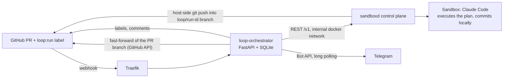
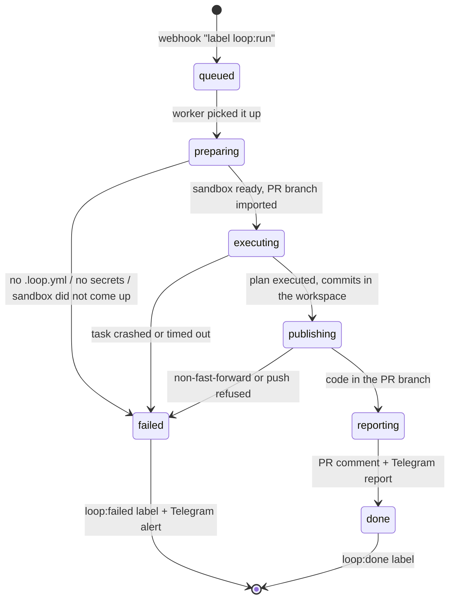

# Loop Engineering MVP — design

Date: 2026-07-31
Status: in review

## What we are building

**loop-orchestrator** — a service that turns the dev loop into automation on top of the self-hosted sandbox platform [sandboxd](https://github.com/tastyeffectco/sandboxes). The user goes through brainstorming → spec → plan locally and pushes all of it to GitHub as a separate PR labelled `loop:run`. Everything after that happens without them: the webhook wakes the orchestrator, it spins up an isolated sandbox on the VPS, runs Claude Code inside it with the parallel plan execution skill, the finished code is pushed back into the same PR, and the report lands in Telegram.

The system is personal: one user, their repositories, one VPS. Multi-tenancy, roles and productisation are out of scope.

### MVP scope (phase 1)

- Deploying sandboxd on the user's VPS.
- Orchestrator: receiving GitHub webhooks, a run state machine, launching Claude Code in a sandbox through the sandboxd API, managing PR labels, posting a report comment on the PR.
- Telegram bot: four text notifications (queued / execution started / success / failure).

Reviewer, e2e with video and the auto-fix loop are phases 2–3 (see "Roadmap phases"); the MVP only lays down the extension points (the `.loop.yml` schema, an extensible state machine).

## Locked Decisions

Decisions that get expensive to change once there is data and connected repositories:

| Decision | What is locked | Why |
|---|---|---|
| Architecture | A separate service alongside sandboxd, not a fork of its control plane | A fork is a permanent cost of staying in sync with an active upstream |
| Orchestrator stack | Python 3.12, FastAPI, httpx, SQLite, in-process worker (no Celery/Redis) | The user's choice; for a single user an external queue is overkill |
| Loop trigger | Only the `pull_request.labeled` event with the `loop:run` label; push events are ignored | An explicit switch plus structural protection against looping on the agent's own push |
| `.loop.yml` format (schema v1) | Fields: `specs_dir`, `base_branch`, `setup`, `run`, `test`, `required_env`, `timeout_minutes`, `sandbox_preset`, `e2e.services`, `e2e.env` | The config spreads across every repository the user owns — changing the format is expensive |
| Spec and plan paths | `docs/superpowers/specs/YYYY-MM-DD-<topic>-design.md` + `docs/superpowers/plans/YYYY-MM-DD-<topic>-plan.md` in the PR diff | Matches the user's local process (the brainstorming / writing-plans skills) |
| Label namespace | `loop:run`, `loop:running`, `loop:done`, `loop:failed` | Labels are the public control interface, visible in every repo |
| Project secrets | The source is per-repo env files on the VPS next to the orchestrator (`secrets/<owner>__<repo>.env`, 0600); at app creation the values are uploaded to sandboxd through the write-only `POST /v1/apps/{id}/config` (sensitive, encrypted by sandboxd); git holds names only, via `required_env` | The app is recreated for every Run (the git branch is fixed at app creation, `PATCH /v1/apps` only changes name/description/tags — verified against the sources), so sandboxd's per-app storage cannot be the primary one |
| App lifecycle | A fresh app + sandbox for every Run (a clone of the current PR branch); apps from previous Runs of this PR are deleted at `preparing`, the successful Run's app after `done` | An app's git branch cannot be changed after creation, and `git/push` cannot fetch/pull — reusing a sandbox would give stale code |
| Claude Code authorisation | A Claude subscription OAuth token (Max/Pro) registered in sandboxd | Fixed cost; the user's choice |
| Orchestrator state | Its own SQLite (a Run table + transition history) | Survives restarts; the only writer is the orchestrator itself |
| Concurrency invariant | At most one active Run per PR | Rules out two agents racing in the same branch |
| Code publication | The sandbox never pushes on its own. After the task the orchestrator calls sandboxd's host-side API (`git/commit` + `git/push` into a fresh `loop/run-<id>` branch), then fast-forwards (`force: false`) the PR branch through the GitHub API and deletes the temporary branch | sandboxd's security model: push is a host-side-only operation, into a new branch only (not import/main/master), without force; advancing the PR branch is the trusted orchestrator's responsibility |

## Architecture

One new service in a Docker container on the VPS, next to sandboxd. The only thing exposed is the `/webhooks/github` endpoint through the existing Traefik (HTTPS, HMAC signature check). Everything else is outbound connections.



### What gets reused

- **sandboxd**: creating/sleeping/waking sandboxes, running Claude Code inside (`POST /v1/sandboxes/{id}/tasks`), host-side git clone/commit/push (credentials never reach the sandbox), encrypted per-app secret storage, the image preset system.
- **Traefik** (installed together with sandboxd): TLS and routing for the webhook endpoint.
- **The user's local skills**: brainstorming / writing-plans produce the spec and the plan; parallel-plan-execution executes the plan inside the sandbox and ticks tasks off in the plan file.

### Orchestrator modules

| Module | Responsibility |
|---|---|
| webhook handler | HMAC validation, event filtering (`pull_request.labeled` + `loop:run`), Run creation, replying to GitHub in ≤ 10 s |
| state machine | Run lifecycle, persisting transitions to SQLite |
| worker | Asynchronous execution of Run steps (in-process queue), a cap of 4 concurrent Runs |
| sandboxd client | httpx client to `127.0.0.1:9090` over the internal docker network |
| github client | Fine-grained PAT: reading the PR diff/files, labels, comments |
| telegram notifier | Bot API over httpx, long polling, a single allowed chat_id |

## Run lifecycle

A Run is one execution of the loop for one PR. Every transition is written to SQLite.



1. **queued.** The webhook passed the HMAC check, a Run was created, GitHub got a 200. Telegram gets "queued". The `loop:run` label is removed, `loop:running` is set.
2. **preparing.** `.loop.yml` and the spec+plan pair are read from the PR branch (looked up in the PR diff by the paths under `specs_dir`). Validation: the config is well-formed, the diff contains exactly one spec+plan pair, every name from `required_env` is registered in sandboxd. Apps from previous Runs of this PR are deleted, a fresh app is created (git branch = the PR branch, fixed at creation), the project secrets are uploaded into it, and a sandbox is created — the workspace is cloned host-side from the branch's current state.
3. **executing.** A Claude Code task is started through the sandboxd API with the prompt "execute the plan using the parallel-plan-execution skill". Telegram gets "the task started working" (repo, PR, feature, time limit). The orchestrator polls the status. Claude Code commits locally in the workspace; it cannot push from the sandbox — that is a host-side-only sandboxd operation.
4. **publishing.** The orchestrator calls `POST /v1/apps/{id}/git/commit` (to sweep up uncommitted changes), then `POST /v1/apps/{id}/git/push` with branch `loop/run-<id>` (push into a new branch only — a sandboxd restriction), after which it advances the PR branch through the GitHub API with a fast-forward (`PATCH /repos/{owner}/{repo}/git/refs/heads/<pr-branch>`, `force: false`) and deletes the temporary branch. The fast-forward is guaranteed as long as the PR branch did not move during the run; otherwise — `failed` with the diagnosis "conflict: the PR branch moved ahead" (a restart via the label will pick up the fresh state).
5. **reporting.** `loop:done` is set, the PR gets a comment with an execution summary, Telegram gets a report with a link to the PR.

### Loop protection

- The trigger is only `labeled` with `loop:run`; push events are not processed at all.
- A PR never has two active Runs: re-labelling while a Run is alive is rejected with a Telegram notification.
- Restart = apply `loop:run` again (the orchestrator removed it when the previous Run started).

### Concurrency and timeouts

- No more than 4 concurrent Runs (configurable through the orchestrator's env). The cap is deliberately conservative: inside each Run Claude Code spawns parallel agents of its own, and subscription limits are shared.
- Run timeout is 180 minutes by default, overridden by `timeout_minutes` in `.loop.yml`. Once it expires the sandboxd task is stopped, Run → `failed`.

## Repository conventions

Connecting a new repository: add `.loop.yml`, register the secrets in sandboxd (if any are needed), set up the webhook (in the MVP — once, by hand or with a script).

### `.loop.yml` (schema v1)

```yaml
specs_dir: docs/superpowers/specs      # where to look for the spec and the plan (required)
base_branch: staging                   # which branch to branch off and merge into
setup: npm install                     # dependency installation
run: npm run dev                       # starting the app (needed from phase 3 on)
test: npm test                         # running the tests
required_env: [DATABASE_URL]           # names of secrets that must exist in sandboxd
timeout_minutes: 180                   # overriding the default
sandbox_preset: node                   # sandboxd preset
e2e:                                   # used from phase 3 on, the schema is laid down now
  services:                            # the "dependencies in one sandbox" option (default)
    - repo: <org>/backend-api
      ref: main
      setup: pip install -r requirements.txt
      run: uvicorn app:main --port 8000
      env_from_sandboxd: backend-api
  env:                                 # how the frontend finds the backend; for external staging —
    VITE_API_URL: http://localhost:8000   # just the external URL, without the services block
```

The plan file is looked up in the sibling `plans` directory next to `specs_dir`: with the default `docs/superpowers/specs` that is `docs/superpowers/plans`. There is no separate field for the plans path — the convention is hard.

Every field except `specs_dir` is optional. If the file is missing or malformed, the Run fails at `preparing` with a concrete reason.

`base_branch` (added 2026-08-04) is the branch the planner branches `loop/issue-<N>` off and the branch the plan PR targets. It defaults to the repository's default branch. It is needed wherever the trunk is not the branch the work should land on: for example, the repository auto-deploys to staging from the `staging` branch, and every run merge must trigger that deployment. Branching off and merging must use the same branch — otherwise the PR diff drags in everything the base is missing.

The value is read **from the default branch**: an override cannot say where to look for itself. A broken or missing config at this step is not fatal — the default branch is used, and the Run will fail later anyway, at `preparing`, with the real parse error.

Multi-repo e2e environments (frontend + backend in separate repos) are supported in two per-repo modes: dependent services are cloned and started in the same sandbox (default), or `e2e.env` points to the URL of the user's already deployed staging server.

### Labels

| Label | Who sets it | Meaning |
|---|---|---|
| `loop:run` | the user / a local skill | start the loop |
| `loop:running` | the orchestrator | a Run is in progress |
| `loop:done` | the orchestrator | finished successfully |
| `loop:failed` | the orchestrator | failure; details in the PR comment and in Telegram |

The orchestrator creates the label definitions in the repository itself on first contact. The normal way to apply `loop:run` is the final step of the local process: the skill that creates the spec PR attaches the label right away (`gh pr create … && gh pr edit --add-label loop:run`). Applying it by hand through the GitHub UI/mobile app or via `gh pr edit <n> --add-label loop:run` is equally valid — the orchestrator does not care where the event came from. Auto-labelling goes into the local skill once the loop has proven itself reliable on manual runs.

## Secrets

Two non-overlapping circuits:

- **Infrastructure** (GitHub PAT, webhook secret, Telegram bot token, sandboxd API key, Claude OAuth token) — in the orchestrator's `.env` and in the sandboxd config on the server. They never reach git.
- **Project** (DATABASE_URL, external service keys of each app) — in per-repo env files on the VPS next to the orchestrator (`secrets/<owner>__<repo>.env`, mode 0600, outside git). sandboxd cannot be the primary storage: the app is created anew for every Run (see Locked Decisions) and its per-app secrets would die on every recreation. At `preparing` the orchestrator reads the file, checks that every name from `required_env` is present (if not — an immediate `failed` before any tokens are spent) and uploads the values into the new app through the write-only `POST /v1/apps/{id}/config` (`sensitive: true` — sandboxd encrypts them with AES-256-GCM and injects them into the sandbox itself; the values cannot be read back through the API).

## Integrations

### GitHub

- Authentication: a fine-grained PAT (`contents:write`, `pull_requests:write`, `webhooks`). A GitHub App is overkill for a single user.
- A webhook per connected repository: the `pull_request` event, an HMAC secret.
- API usage: reading the diff and the files of the PR branch, managing labels (`POST /repos/{owner}/{repo}/issues/{pr_number}/labels` — PR labels live in the issues API), report comments.
- The same PAT is registered in sandboxd as the app's git credential — the control plane uses it for host-side clone and push; the token never reaches the sandbox (the sandboxd model).
- Separately, the orchestrator uses the PAT to fast-forward the PR branch and to delete the temporary `loop/run-*` branches.

### sandboxd

- REST API on `127.0.0.1:9090`, reachable from the orchestrator over the internal docker network; the API is not published externally.
- Operations: create/wake a sandbox, start a Claude Code task (`POST /v1/sandboxes/{id}/tasks` with a prompt), poll the status, read the task log for the report, host-side git operations (`POST /v1/apps/{id}/git/commit`, `POST /v1/apps/{id}/git/push`, `GET /v1/apps/{id}/git/status`).
- sandboxd git push restrictions (verified against the sources): push is host-side only and only into a **new** branch; the import branch and main/master are rejected (`refuses_default_branch`); `--force` is not used; an existing branch yields `branch_exists`; sandboxd does not create PRs. The default branch name is `sandboxd/<slug>-<sha>`, but the API accepts a custom name — the orchestrator passes `loop/run-<id>`.
- The Claude subscription OAuth token is registered in sandboxd once, at deployment time.
- The exact API contract is nailed down against the sandboxd sources during the implementation plan; if capabilities fall short, the fallback is exec commands inside the sandbox.

### Telegram

- A bot over the Bot API, long polling (no public endpoint needed). It talks only to the user's chat_id, everything else is ignored.
- MVP notifications (text, Markdown): "queued", "the task started working", "finished successfully" (summary + link to the PR), "failure" (stage, reason, log tail).
- Buttons, control commands and video are phases 3–4.

## Error handling

The principle: **every Run outcome ends with a Telegram message** — the system never dies silently.

| Class | Examples | Reaction |
|---|---|---|
| Configuration | no `.loop.yml`, no spec+plan pair, missing secrets | Immediate `failed` at `preparing` with a concrete reason; no tokens spent |
| Infrastructure | sandboxd not responding, the sandbox did not come up, GitHub 5xx | 3 retries with exponential backoff; then `failed` marked "can be restarted via the label" |
| Execution | Claude Code crashed, the 180 min timeout | Stopping the sandboxd task, best-effort publication of the commits already made (see "Partial execution"), a log tail (~50 lines) in the report, `failed` |
| Publication | `non_fast_forward` (the PR branch moved ahead during the run), `branch_exists`, `unsafe_repo_config`, push refused | `failed` with the exact reason from sandboxd's response; the code stays in the sandbox workspace and in the temporary branch (if the push went through); a restart via the label starts from the PR branch's fresh state |
| Subscription limits | the task hit a rate limit | The Run is paused and retried on an interval (the limit window refreshes every 5 hours); Telegram gets "hit the limits, continuing at ~HH:MM" |
| Orchestrator restart | the container crashed/was updated | State in SQLite survives the restart; at startup "orphaned" Runs in `executing` are reconciled with sandboxd: the task is alive → keep polling, dead → `failed`. Missed webhooks are recovered via redelivery in GitHub or by re-applying the label |

**Partial execution** is not a catastrophe, but it needs an explicit step: before publication the commits live only in the sandbox workspace. So when the task crashes at `executing` the orchestrator still runs the `publishing` steps (commit + push + fast-forward) — the completed part of the plan lands in the PR, and the parallel-plan-execution skill has ticked the finished tasks off in the plan file. The report says "7/10 done, failed on task X"; a restart via the label continues from where it stopped.

## Testing

- **Unit** (pytest): the state machine (all transitions, invariants), webhook parsing, `.loop.yml` validation.
- **Integration** (pytest + respx): the full `queued → done` scenario against mocked sandboxd/GitHub/Telegram; one scenario per error class.
- **Smoke test on the live VPS**: a test repository, a PR with a toy spec ("add a /ping endpoint"), the full loop.

**MVP acceptance criterion:** a test PR labelled `loop:run` goes through the loop with no manual intervention — code shows up in the PR, the report arrives in Telegram.

## Roadmap phases

Each phase is a separate "spec → plan → implementation" cycle; only the boundaries are locked here.

1. **Phase 1 (MVP, this document):** deploying sandboxd on the VPS + the orchestrator + Telegram notifications.
2. **Phase 2 — Reviewer:** a `reviewing` state after `executing`: a separate task on Fable 5 checks the PR diff (correctness, security), the result being review comments; on problems — an auto-fix loop with an iteration cap (2 by default) and escalation to Telegram.
3. **Phase 3 — E2E:** Playwright with video recording; the environment comes from the `e2e` block of `.loop.yml` (dependencies in one sandbox is the default, or a staging URL); video and verdict go to Telegram.
4. **Phase 4 (optional):** control from Telegram (restart/approve buttons), auto-attaching webhooks to new repos, a dashboard.

## Open Questions

Open questions; each has a default you can work with without waiting for an answer.

1. **The exact sandboxd API contract** — the git part is already verified against the sources (see "Integrations → sandboxd"); what remains is app/sandbox creation, the task format, status polling and the secrets API. *Default: nail it down against the sources during the plan; where capabilities fall short — exec commands in the sandbox and a plan B for secrets.*
2. **How skills get into the sandbox** (parallel-plan-execution and its dependencies must be available to Claude Code inside). *Default: bake `~/.claude/skills` into a custom sandboxd preset/image.*
3. **Domain and TLS for the webhook endpoint.** A public HTTPS URL on the VPS is required. *Default: a subdomain of the user's existing domain via Traefik + Let's Encrypt; pick the domain before deployment.*
4. **Stability of the subscription OAuth token on the server** (how often it expires, the refresh procedure). *Default: register the token at deployment; on expiry — a Telegram alert with instructions to re-upload it, automation later.*
5. **Threshold for the long-queue notification** (all 4 slots busy, new Runs piling up). *Default: a "N tasks queued" notification, no prioritisation.*
