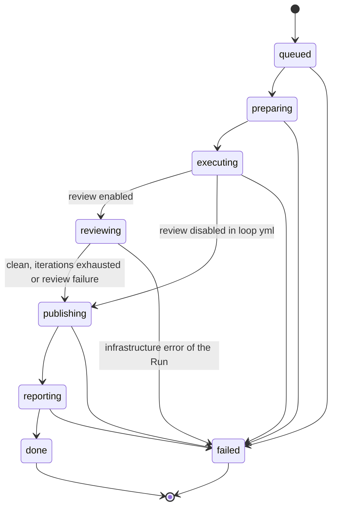
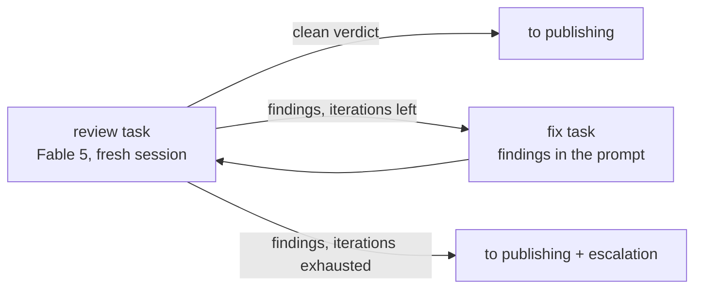

# Loop Engineering — phase 2: Reviewer

Status: in review
Date: 2026-07-31
Base document: `2026-07-31-loop-engineering-mvp-design.md` (phase 1, implemented and accepted)

## Overview

Phase 2 adds automatic review to the loop: after Claude Code has executed the
plan (`executing`), a separate review task on Fable 5 checks the diff of that work in the
same sandbox, the problems it finds are fixed by an auto-fix loop with an iteration cap,
and only then is the code published to the PR branch. The PR always receives already
cleaned-up code in a single publication; raw intermediate states never reach GitHub.

What gets reused from phase 1 (implemented and working): the state machine and
`run_events`, the worker and the queue, the monotonic Run deadline, rate-limit pauses with
`continue`, `SandboxdClient` (tasks, files API), `GitHubClient`
(`create_comment`, `ensure_labels`, `add_labels`, `remove_label`),
`TelegramNotifier`, two-phase publication, the `.loop.yml` parser. Phase 2 is
a new pipeline step and its wiring, not a new subsystem.

## Locked Decisions

1. **Review before publication.** `reviewing` sits between `executing` and `publishing`;
   the fix loop runs entirely inside the sandbox, publication is single and final. Rationale:
   the PR is always clean, and we do not multiply temp-branch + fast-forward cycles per fix.
2. **The reviewer is our own task through sandboxd, not the Claude GitHub App.** The same
   sandbox, a fresh session (`continue: false` — without the executor's context),
   `model: claude-fable-5` (the `model` field of the sandboxd task API, passed to
   `claude --model`; verified against the sources). Rationale: the orchestrator owns
   the loop (iterations, verdict, escalation), the same subscription, zero new infra.
3. **The fix threshold is every finding.** The auto-fix runs on any review finding,
   with no severity filter; the loop spins until a clean verdict or until the iterations
   are exhausted.
4. **Escalation still publishes.** Iterations exhausted while findings remain → the code is
   published to the PR anyway; the remaining findings go into a PR comment, Telegram gets
   an escalation, and the PR gets the `loop:needs-review` label (instead of `loop:done`).
   Rationale: the result of hours of agent work is always available for a
   human to look at and decide on.
5. **The review report is a single summary PR comment** (verdict, iteration count,
   what was fixed, what remains — with paths and lines). No
   inline comments and no commit status.
6. **The verdict protocol is strict JSON in the review task's final message**
   (the `agent_message_final` field of the single `GET .../tasks/{id}`, falling back to
   `agent_message` — the phase 1 pipeline already reads both). The parser tolerates
   ```json fences and text around the JSON.
7. **The `.loop.yml` v1 schema gains an optional `review` block:**
   `review: {enabled: bool = true, max_fix_iterations: int = 2}`. A missing
   block = defaults; `enabled: false` turns `reviewing` off entirely for the repo.
8. **Review does not block code delivery.** Any failure of the review mechanism itself
   (the task crashed, the verdict is unreadable after a retry) → publication without review with
   an explicit "review skipped" note in the PR and in Telegram.
9. **The language of every system text is English.** Agent prompts, the verdict schema and
   contents, PR comments, Telegram messages, label descriptions — all in
   English. Rationale: one language for agents and reports, and models
   follow English-language structured instructions more reliably. Only project
   documents (specs, plans) stay in Russian. Phase 2 scope includes
   migrating the existing Russian phase 1 texts (Telegram notifications,
   PR comments, the executor prompt) to English.

   **Amended 2026-08-06 (open source):** the carve-out for project documents is withdrawn.
   Every document in the repository — specs, plans, the wiki, READMEs, skills, hook texts,
   `.env.example` — is written in English; the only Russian left is the live conversation with
   the user. The existing Russian documents were translated in one pass on that date.

## Architecture



A loop spins inside `reviewing` (not separate Run states; each iteration is
an event in `run_events`):



## Components

### Review task

`POST /v1/sandboxes/{id}/tasks` with `agent: "claude-code"`, `model:
settings.reviewer_model` (default `claude-fable-5`), `continue: false`,
`timeout_s = min(review_timeout_minutes, what is left of the Run deadline)`.

The reviewer prompt (in English, like every prompt in the system):
- role: an independent reviewer; context: the spec and plan paths from the Run;
- subject: the diff of the agent's work — `git diff origin/<PR branch>..HEAD`
  (the imported baseline of the PR branch is always present in the clone);
- check: correctness, security, conformance to the spec/plan, quality and
  completeness of the tests, style — every finding, no severity threshold;
- response format: the final message is the verdict JSON and nothing else (schema below).

### Verdict schema

```json
{
  "verdict": "clean | findings",
  "summary": "1-2 sentences in English",
  "findings": [
    {
      "severity": "critical | major | minor",
      "file": "app/api.py",
      "line": 120,
      "title": "Timeout is not propagated to the httpx client",
      "detail": "What can go wrong and how to fix it"
    }
  ]
}
```

`line` is optional. Parsing: strip the ``` fences, take the first JSON object in the text;
invalid JSON or an unknown `verdict` = a review failure (see error handling).

### Fix loop

Stored on the Run: `review_iteration` (a counter), `review_findings_json` (the last
verdict — for the report). The `_review` step algorithm:

1. Review task → verdict.
2. `clean` → exit to `publishing`.
3. `findings` and `review_iteration < max_fix_iterations` → a fix task:
   a fresh session (`continue: false`), the default model (the executor's), the prompt carrying
   the full findings JSON + an instruction to fix every item and run the tests;
   `timeout_s` = what is left of the Run deadline. Then back to step 1.
4. `findings` and iterations exhausted → exit to `publishing` with the escalation flag.

A rate limit in the review or fix task is handled the same as at `executing`: a
`rate_limit_retry_minutes` pause, a retry with `continue: true`, the same monotonic deadline.

### Reporting

- **PR comment** (after publication, `create_comment`, in English):
  the heading "🤖 loop-orchestrator — review (Fable 5)", the verdict (✅ clean /
  ⚠️ findings remain / ⛔ review skipped), the iteration count, the lists "Fixed in
  the fix cycle" and "Remaining" with `file:line`.
- **Labels:** a clean verdict → `loop:done` (as today); escalation →
  `loop:needs-review` instead of `loop:done`; `ensure_labels` gains the new
  label (yellow, described as "review is not clean, human attention needed").
- **Telegram** (texts in English): there is no separate "review started"
  message; the review outcome is embedded into the existing Run completion message
  (`notify_done`): a line "Review: clean (1 fix iteration)" or "Review:
  skipped (see PR note)". Escalation is a separate message,
  `notify_review_escalation`: "review is not clean after N iterations,
  M findings remain — your attention is needed" + a link to the PR.

### Configuration

| Knob | Where | Default |
|---|---|---|
| `review.enabled` | `.loop.yml` | `true` |
| `review.max_fix_iterations` | `.loop.yml` | `settings.review_max_fix_iterations` |
| `reviewer_model` | `Settings` (`LOOP_REVIEWER_MODEL`) | `claude-fable-5` |
| `review_timeout_minutes` | `Settings` | `30` |
| `review_max_fix_iterations` | `Settings` | `2` |

## Error handling

| Class | Examples | Behaviour |
|---|---|---|
| Reviewer failure | the task is `failed`, the verdict JSON is invalid | 1 retry of the review task; failing again → `publishing` without review, a "⛔ review skipped" note in the PR comment and in Telegram; the Run ends as `done` |
| Fix task failure | the task is `failed`/`cancelled` | no further fix attempts → `publishing` of the current state + escalation (like exhausted iterations, with the reason text) |
| Rate limit | limit markers in the review/fix task | pause + retry with `continue`, as at `executing`; the Run deadline is shared |
| Run deadline | the `timeout_minutes` budget ran out during review/fix | an immediate exit to `publishing` (the code is already there), the note "review interrupted by run timeout" = escalation |
| Orchestrator restart | a Run is stuck in `reviewing` | recovery: a Run in `reviewing` is handled like `executing` — the task is alive → keep polling, dead → re-run the review step from the current iteration |
| Infrastructure | sandboxd unreachable, the sandbox died | `with_retries` retries; exhausted → best-effort `_publish_partial` + `failed`, as in phase 1 |

## Testing

- **Unit** (pytest): the verdict parser (clean JSON, fences, junk around it,
  invalid), the new state machine transitions (`executing → reviewing`,
  `reviewing → publishing|failed`), parsing the `review` block in `.loop.yml`.
- **Integration** (respx + the conftest fakes): clean on the first iteration;
  findings → fix → clean; iterations exhausted → escalation (label, comment,
  Telegram); the reviewer failing twice → publication with a note; `review.enabled:
  false` → `reviewing` skipped; a rate limit inside review.
- **Smoke test on the VPS** (`<org>/loop-smoke-test`): a PR whose plan
  deliberately contains a bug (for example, an endpoint without the input validation the
  spec asks for) — the loop must catch and fix it in the fix loop;
  acceptance: the PR receives the fixed code + a review comment with the verdict.

**Phase 2 acceptance criterion:** a test PR goes through
`loop:run → … → reviewing → … → loop:done` with no manual intervention; the PR carries
the code after the fix loop and a summary review comment; with an artificially lowered
`max_fix_iterations: 0` the same PR ends in escalation with the
`loop:needs-review` label and a Telegram message.

## Open Questions

Open questions; each has a default you can work with.

1. **Reliability of "JSON only" in `agent_message` on long reviews** (the model may
   add a preamble). *Default: the parser extracts the first JSON object from the text and
   tolerates fences; on failure — one retry of the review task; failure statistics are visible
   in `run_events`.*
2. **The fix task's model** — the agent default, or pin it too (for example, to
   the executor's opus)? *Default: do not pass `model` — the agent default in
   sandboxd, same as executing.*
3. **The iteration cap across restarts** — count it per Run or in total per PR (the label
   can be re-applied indefinitely)? *Default: per Run; the protection against infinity is
   the human who applies the label.*
4. **Whether to skip review for docs/config-only diffs** (saving
   subscription limits). *Default: do not skip — YAGNI, add the filter later when it
   actually hurts.*
