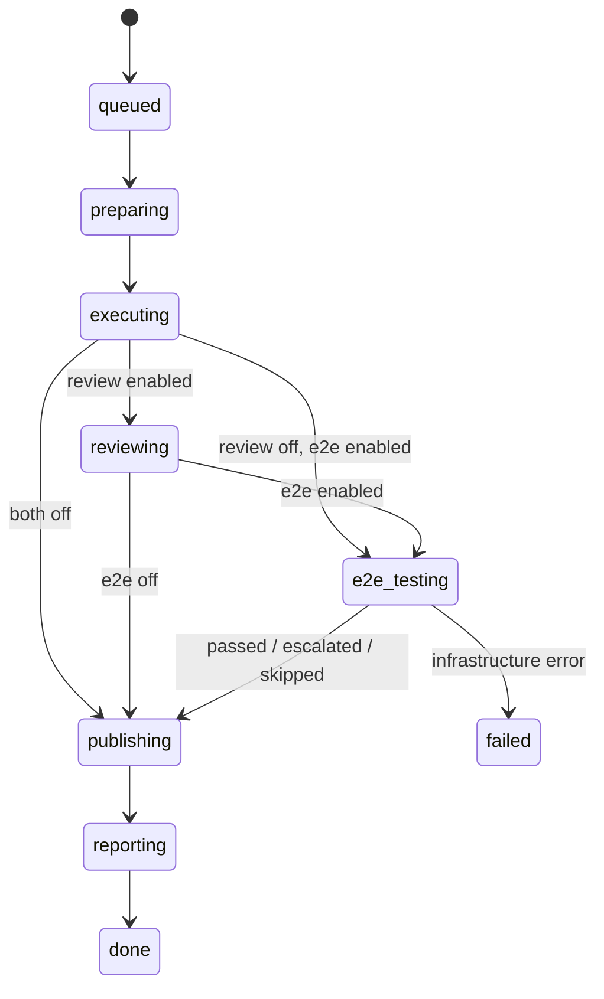
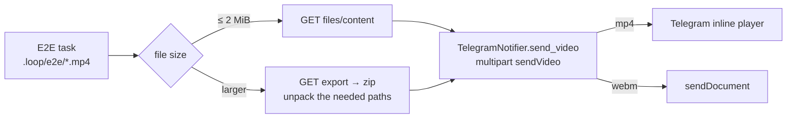

# Loop Engineering — phase 3: E2E testing with video

Date: 2026-08-01
Status: under review

## What we're building

The third phase of loop-orchestrator: after the plan is executed and the code reviewed (phases 1–2), the Run performs an **E2E check of the feature through the user's eyes** — an E2E agent in the same sandbox writes Playwright scenarios from the feature spec, brings the app up, runs the scenarios with video recording and issues a verdict. A failure starts a fix loop (same as review); the video of the main scenario or of the failing tests arrives in Telegram together with the verdict.

The value: without opening a laptop, the user sees from their phone **the working feature on video** — or a video of exactly how it fails.

### Scope of phase 3

- The `e2e_testing` state in the state machine + fix loop + escalation.
- `.loop.yml` extension: interpretation of the `e2e` block (the schema was laid down in phase 1).
- The E2E task: generating Playwright scenarios from the spec via **playwright-cli**, bringing up the environment, running with video, a strict JSON verdict.
- A custom sandbox image (deploy step): the playwright-cli skill, the CLI itself, chromium and ffmpeg baked into the image.
- Extracting video from the sandbox via the sandboxd files/export API, sending it to Telegram (`sendVideo`).
- An E2E section in the summary PR comment and in the Telegram reports.

Out of scope for phase 3:

- **`e2e.services`** (cloning dependent repositories into the same sandbox) — the schema stays reserved, the implementation is postponed; a block containing `services` gives an immediate `failed` on `preparing`.
- Telegram controls (buttons) — phase 4.

## Locked Decisions

| Decision | What is locked | Why |
|---|---|---|
| Place in the loop | `e2e_testing` between `reviewing` and `publishing`; escalation does NOT block publication | The PR gets checked code in a single publication; the phase 2 principle "a check does not block delivery" |
| E2E executor | A Claude Code task in the same sandbox (fresh session), not a separate runner | sandboxd has no exec API (verified against the v1 routes); all the phase 2 task machinery is reused |
| Source of scenarios | The E2E agent writes Playwright scenarios from the feature spec; **the scenarios are committed to the repository** (conventional `e2e/` directory, config in `playwright.config.*`) and ride into the PR | Exactly the new feature gets checked; a regression suite accumulates with every Run |
| Agent tooling | **playwright-cli** (`@playwright/cli`, microsoft/playwright-cli): interactive browser sessions, snapshots with refs, test generation/healing, session video recording | Built specifically for agents; more token-efficient than a blind `npx playwright test` run |
| Tooling delivery | A custom sandbox image (`SANDBOXD_IMAGE`, instance-wide — sandboxd rejects a per-app image): the playwright-cli skill in `~/.claude/skills`, the CLI globally, chromium + ffmpeg preinstalled | The skill is visible at session start; repositories stay clean; a Run does not waste time downloading browsers (~150 MB) |
| Verdict | Strict JSON in the E2E task's `agent_message_final` (schema below); unparsable → one retry → `skipped` | The same channel and ladder as the phase 2 reviewer |
| Artifacts | Video and manifest go to `.loop/e2e/` in the workspace; the directory never lands in commits | A stable convention the orchestrator uses to pick up the files |
| `e2e` block schema | `enabled` (bool, default true), `max_fix_iterations` (int ≥ 0), `services` (reserved), `env` (map) | A compatible extension of the phase 1 locked schema with optional fields |
| Video delivery | sandboxd files API: listing via `GET /v1/sandboxes/{id}/files`, a file ≤ 2 MiB via `files/content`, anything larger via a single `GET .../export` (zip); to Telegram — up to 3 videos of ≤ 45 MB each | Verified sandboxd limits (2 MiB per file) and Bot API limits (50 MB) |
| Languages | Prompts, verdict, PR comments, Telegram — English | Project convention since phase 2 |

## Run flow



The `e2e_testing` step is enabled when `.loop.yml` contains an `e2e:` block and `e2e.enabled` is not `false`. Publication after E2E always happens (except on infrastructure `failed`) — as with review, escalation only changes the label and the report.

## `.loop.yml` configuration

```yaml
run: npm run dev            # starts the app; required for in-sandbox mode
e2e:
  enabled: true             # defaults to true when the block is present
  max_fix_iterations: 2     # default from LOOP_E2E_MAX_FIX_ITERATIONS (= 2)
  env:                      # exported to the E2E task
    VITE_API_URL: http://localhost:8000
  # services: ...           # reserved in phase 1; in phase 3 => failed on preparing
```

Two environment modes:

- **In-sandbox (default):** the app is brought up by the `run` command inside the sandbox, `e2e.env` is exported before the launch. `run` is mandatory — its absence with e2e enabled and an empty `e2e.env` means `failed` on `preparing`.
- **Staging:** no `run`, non-empty `e2e.env` — the values are passed to the agent as parameters of an external environment (for example `E2E_BASE_URL`), nothing is brought up inside the sandbox.

Validation on `preparing` (before spending tokens): a block with `services` → `failed "e2e.services is not supported yet"`; e2e enabled but neither `run` nor `e2e.env` present → `failed` with the concrete reason.

New orchestrator settings: `LOOP_E2E_MAX_FIX_ITERATIONS` (default 2), `LOOP_E2E_MODEL` (optional; empty means the executor's default model).

## The E2E task

A fresh session in the same sandbox as the executor and the reviewer — the code checked is the one **after** the review fixes. The prompt contract (in English; here — its meaning):

The agent works through **playwright-cli** (the skill is baked into the sandbox image, available at session start): it explores the app interactively through a browser session, generates and "heals" tests, records a session video with chapter markers.

1. Read the feature spec (`run.spec_path`) — it is the source of truth about what must work.
2. Bring up the environment according to the mode (export `e2e.env`, run the `run` command in the background, wait for readiness; or take the environment URL from `e2e.env`).
3. Scout the feature live through playwright-cli, then write Playwright scenarios from the spec: the main user scenario of the feature + the critical paths. If the repository already has a Playwright suite — follow its structure and extend it; otherwise create `e2e/` and `playwright.config.*`. Video on, chromium headless.
4. Run the scenarios. Collect the artifacts into `.loop/e2e/`: `main.mp4` — the video of the main scenario (a playwright-cli session recording or a Playwright test video; webm → mp4 via ffmpeg), `fail-<n>.*` — videos of failing tests (at most 3). Videos are short: the main scenario ~60–90 s, 1280×720.
5. Add `.loop/` to `.gitignore` (if the entry is not there yet) and commit the scenarios along with it. The `.gitignore` entry is mandatory: on `publishing` the orchestrator commits every uncommitted change ("leftovers"), and without it the videos would ride into the PR. The final message is strict JSON with no other text:

```json
{
  "verdict": "passed | failed",
  "summary": "one-paragraph human summary",
  "tests": [{"title": "…", "status": "passed | failed", "video": ".loop/e2e/… | null"}],
  "main_video": ".loop/e2e/main.mp4 | null"
}
```

For non-UI features (pure API) Playwright request scenarios without a browser are acceptable — then there is no video, `main_video: null`, and only a text verdict goes to Telegram.

## Fix loop and statuses

Symmetric to the phase 2 review, with the same time budget — a fresh `run.timeout_minutes` for the whole E2E loop, rate-limit pauses extend the deadline (`_run_sandbox_task` is reused).

- `verdict == "passed"` → `e2e_status = "passed"`, on to `publishing`.
- `verdict == "failed"` and `e2e_iteration < max_fix_iterations` → a fix task in the same sandbox (the prompt carries the spec and the failing tests with their errors; fix the app, do not weaken the tests; editing a test is allowed only when the test contradicts the spec) → another E2E task → round again.
- Iteration limit exhausted or deadline hit → `e2e_status = "escalated"`: publication happens anyway, label `loop:needs-review`, a warning in Telegram with the failure videos.
- The task failed for a reason other than a rate limit, or the verdict did not parse after one retry → `e2e_status = "skipped"`: publication marked "E2E skipped" (E2E does not block code delivery).

`Run` gains `e2e_status` (`passed|escalated|skipped|NULL`), `e2e_iteration`, `e2e_json` (verdict + fix history); the live SQLite is migrated the same way as in phase 2.

## Video: extraction and delivery



- After the E2E task the orchestrator fetches the listing `GET /v1/sandboxes/{id}/files?path=.loop/e2e` (paths + sizes). Files ≤ 2 MiB are read through `files/content` (raw bytes); if anything larger is present — a single `export` request (a zip of the whole workspace; node_modules/dist are excluded by sandboxd itself) and unpacking of the needed paths.
- Caps: at most 3 videos per Run, each ≤ 45 MB; anything oversized is skipped with a note in the report.
- `TelegramNotifier.send_video(video_bytes, filename, caption)` — multipart `sendVideo` for mp4 (inline player), `sendDocument` for webm. On `passed` — the main video with the verdict as caption; on `escalated` — the failure videos; on `skipped` — text only.
- Any error while downloading or sending video **does not fail the Run** — it degrades to a text message marked "video unavailable".

## Reporting

- **PR comment:** an E2E section is added to the summary report — verdict, number of fix iterations, a table of tests (title / status). The format follows the review section.
- **Telegram:** `notify_done` gets the line `E2E: passed (N fix iteration(s))` / `E2E: failures remain — see the PR` / `E2E: skipped`; the videos follow as separate messages. Escalation is a warning modelled on `notify_review_escalation`.
- Every Run outcome still ends with a message in Telegram.

## Error handling and recovery

| Class | Examples | Reaction |
|---|---|---|
| Configuration | `services` in the block, neither `run` nor `e2e.env` | Immediate `failed` on `preparing` |
| E2E task | crashed, verdict unparsable | One retry → `skipped`, publication with a note |
| Time budget | E2E loop deadline | `escalated`, publication, warning |
| Subscription limits | rate limit | Pause with deadline extension (phase 2 mechanics) |
| Video | file > 45 MB, export error, sendVideo error | Skip / degrade to text, the Run continues |
| Orchestrator restart | a Run stuck in `e2e_testing` | Same as `reviewing` orphans: the sandboxd task is alive → keep polling, dead → restart the step |

## Testing

- **Unit:** parsing the `e2e` block (including `services` → error, mode validation), verdict parsing, video selection and caps, the new state machine transitions.
- **Integration (respx):** passed / failed + successful fix / escalated / skipped / staging mode / video > 2 MiB via export / degradation on a sendVideo error.
- **Smoke test on the VPS:** needs a test repository with a web app (a small Vite frontend) — the current `loop-smoke-test` (a Python CLI) is not suitable for E2E. Scenarios: a UI feature → `loop:done` + video in Telegram; a planted UI bug → fix loop; `max_fix_iterations: 0` + a bug → escalation with the failure video.

**Acceptance criterion for phase 3:** a PR with a UI feature and an `e2e` block in `.loop.yml` goes through the loop with no manual intervention; Telegram receives the verdict and a playable video of the main scenario; with a planted bug the fix loop either repairs the code or an escalation with the failure video arrives.

## Open Questions

1. **Building and maintaining the custom sandbox image** (FROM the base sandboxd image + skill, CLI, chromium, ffmpeg; upstream updates require a rebuild). *Default: a Dockerfile and instructions in `docs/deploy.md` of this repository; a manual rebuild when sandboxd is updated. The image is instance-wide — non-E2E runs get it too, which is a harmless superset.*
2. **The exact playwright-cli commands** (session video recording, format, test generation). *Default: pin them down from SKILL.md and `--help` at the implementation-plan stage; the spec's contract (the `.loop/e2e/` directory, the JSON verdict) does not depend on the commands.*
3. **A test web repository for the smoke test.** *Default: a new small Vite repo in the <org> org, modelled on `loop-smoke-test`.*
4. **Long `run` commands with DB migrations/seeds** (the app needs a database inside the sandbox). *Default: out of scope — `run` is responsible for everything itself (`setup` has already been executed by the executor); project secrets are available through the sandbox env.*
