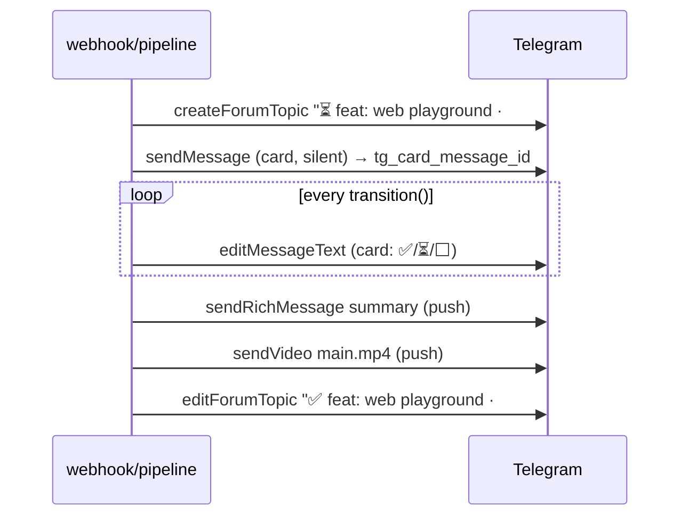

# Loop Engineering — Telegram notifications: topics, live card, feature name

Date: 2026-08-01
Status: under review

## What we're building

A rework of the orchestrator's Telegram notifications around three ideas:

1. **A topic per Run** (Bot API 10.0 forum threads, as in <sibling-project>
   `gateway/topics.py`): every Run lives in its own chat thread — messages from
   different Runs never get mixed.
2. **A live progress card**: a single stage-checklist message that the bot
   silently edits on every state transition; push notifications only for the
   finale (summary, video, escalations, errors).
3. **The feature name instead of "Run #N"**: message headers are driven by the PR
   title (for example "feat: web playground"); the Run number stays a secondary
   line for correlation with the logs.

The wording of the final messages is refreshed to match the same look (see the
mockups below); the rich markdown → HTML → plain delivery ladder is unchanged.

## Locked Decisions

| Decision | What is locked | Why |
|---|---|---|
| Run/DB schema | New columns `pr_title TEXT`, `tg_thread_id INTEGER`, `tg_card_message_id INTEGER`; an `ALTER TABLE` migration modelled on phases 2–3 | The card and the thread must survive an orchestrator restart (recovery) |
| Source of the feature name | `pull_request.title` from the webhook payload, written into `Run.pr_title` when the Run is created | Available from the first second (before any repo files are read), written by a human |
| Topic | `createForumTopic` on enqueue; name `⏳ <pr_title> · #<pr>`; on a terminal state — `editForumTopic` (prefix ✅ done / ⚠️ needs-review / ❌ failed) and `closeForumTopic`. All operations are fail-safe: an error → `tg_thread_id = NULL` → flat delivery (today's behaviour) | The <sibling-project> pattern is proven live; the degradation does not break chats without topics |
| Card | A plain `parse_mode=HTML` message edited via `editMessageText`; `sendRichMessage` is not used for the card | `editMessageText` is a stable API; Bot API 10.x does not guarantee editing of rich messages, and HTML is enough for the card |
| Update points | Option A: explicit calls from `pipeline.process()` after every `transition()` and in `fail()`; `state_machine.py` stays untouched | An explicit flow, cheap tests, zero magic in the pure state machine |
| Push policy | The card is created with `disable_notification=true`; ordinary (pushing) messages are only `notify_done` + video, escalations, `notify_failed` | The chat does not ping 6–8 times per Run |
| Notification errors | Any topic/card/edit error is a warning + degradation, never fails the Run | The phase 2–3 principle: delivering code matters more than reporting |
| Language | All texts — English | Project convention |

## Message flow of a single Run



## Text mockups

The card (HTML, edited in place; `➖` — a skipped stage, `⛔` — a failed one):

```
🌀 feat: web playground
<org>/loop-smoke-test#7 · Run 8

✅ queued       12:01
✅ preparing    12:01
✅ executing    12:14
✅ reviewing    12:21
⏳ e2e testing
⬜ publishing
⬜ reporting
```

The finale (rich markdown, push, in the same thread):

```
✅ feat: web playground — finished
<org>/loop-smoke-test#7 · Run 8
Review: ✅ clean (1 fix iteration)
E2E: ✅ passed (0 fix iterations) 🎬

<agent summary — an expandable blockquote in the HTML fallback>
```

Video caption: `🎬 feat: web playground — main scenario`. A Run error:
`❌ feat: web playground — failed` + a code block with the error. Escalations stay
as they are today, but with the feature name in the header.

## Components

- **`clients/tg_topics.py` (new)** — an adaptation of `TopicManager` from
  <sibling-project>: `create(name) -> int | None`, `rename(thread_id, name)`,
  `close(thread_id)`; works through the `TelegramNotifier` httpx client,
  all methods fail-safe.
- **`clients/telegram.py`** — reuses the existing
  rich→HTML→plain ladder; every send method gains an optional `thread_id`
  (the Bot API `message_thread_id` parameter); new methods `send_card(run) -> int | None`
  and `update_card(run) -> None` (rendering the checklist from `run` + `run_events` timestamps);
  headers are built from `run.pr_title` (fallback `Run #<id>` when the title is empty).
- **`webhook.py`** — extracts `pull_request.title` → `create_run(...)`.
- **`db.py` / `models.py`** — three columns, the Run fields, the migration.
- **`pipeline.py`** — on `queued`: create the topic + the card; after every
  `transition()` and in `fail()`: `update_card`; on a terminal state: rename + close
  the topic. Every call is wrapped in try/except degradation.

The timestamps on the card come from `run_events` (the transition's created_at)
and are rendered in the `Settings.tz` timezone (a new setting `LOOP_TZ`, an IANA name,
stdlib `zoneinfo`, default `UTC`).

## Error handling

| Class | Reaction |
|---|---|
| The chat does not support topics / no permission | `tg_thread_id = NULL`, everything goes flat — today's behaviour |
| The card was not created / an edit failed | warning, the Run continues; the next transition tries the edit again |
| Orchestrator restart mid-run | `tg_thread_id`/`tg_card_message_id` live in the DB — recovery keeps editing the same card |
| editMessageText "message is not modified" | Ignored (not an error) |

## Testing

- Unit (respx): creating/renaming/closing a topic and degradation on 4xx;
  send methods pass `message_thread_id` through; card rendering for every
  combination of states (skipped review/e2e, failed midway); `pr_title`
  from the webhook down to `Run`; the DB migration.
- Integration: a full `process()` with fakes — the sequence of
  card snapshots, the finale in the thread, the fail path.
- Smoke test on the VPS: a Run on loop-smoke-test — a topic in the chat, the card
  gets edited, summary+video in the thread, the topic closed with ✅.

**Acceptance criterion:** two parallel Runs in one chat do not mix their
messages; each one's card is edited in its own thread; a push arrives only for
the finale; in a chat without topics the behaviour is no worse than today's.

## Open Questions

1. **The timezone of the card's timestamps.** *Default: `LOOP_TZ=UTC`; on the VPS the user
   sets their own (for example `Asia/Almaty`) through env.*
2. **Whether a separate push on enqueue is needed** (today
   `notify_queued` pushes). *Default: no — the topic creation itself shows up in
   the chat, the card is silent; the first push is the finale.*
3. **Whether to close the topic on `failed`.** *Default: yes, with the ❌ prefix — the history
   stays readable; a repeat Run of the same PR gets a new topic.*
