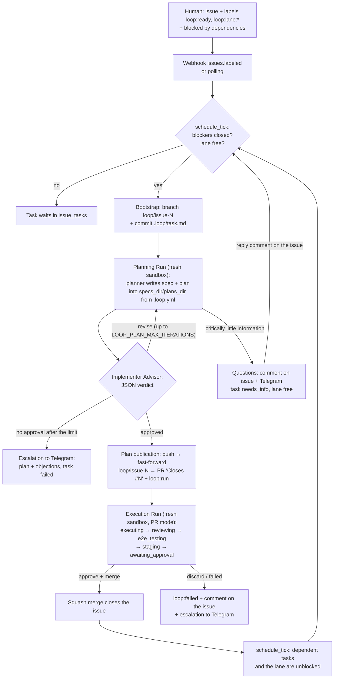

# Loop Engineering — phase 5: backlog mode on top of GitHub Issues

Date: 2026-08-03
Status: in review

## What we are building

The system moves one level above PR mode: the source of work becomes the backlog
in GitHub Issues. A human files an issue with the task description, context and
dependencies, attaches the `loop:ready` label — and from there the orchestrator
runs 24/7 on its own. A ready task is picked up by a **Planning Run**: the planner
agent studies the repository, writes a specification and a plan, defends them
before an advisor agent (Implementor Advisor), and after its approval publishes a
PR with the `loop:run` label. That PR starts an **Execution Run** — today's PR
mode with a fresh sandbox and a clean context: executing → review → e2e →
approve pause (4a) → publication. The merge closes the issue and unblocks
dependent tasks. Independent tasks from different modules run in parallel;
parallelism is controlled declaratively, with labels.

Phase 5 consists of two sub-phases:

- **5a — backlog core:** the `issue_tasks` table, the scheduler with lane locks,
  branch bootstrap, the Planning Run (planner + advisor + async questions),
  label and status synchronisation.
- **5b — integration repositories:** e2e across a bundle of several
  repositories (backend + frontend, for example).

PR mode (`loop:run` on a PR that already has a plan) keeps working unchanged —
backlog mode uses it as its executor. Notion as a backlog source is deliberately
out of scope: GitHub Issues give webhooks, native dependencies and status next to
the code without a new client and without polling a third-party API.

## Locked Decisions

| Decision | What is locked | Why |
|---|---|---|
| Backlog source | GitHub Issues of the project repository; Notion out of scope | The client, webhooks and HMAC already exist; status is visible next to the code and the PR |
| Trigger | The `loop:ready` label on an open issue (`issues.labeled` webhook + periodic polling) | An explicit opt-in in the style of `loop:run`; drafts and bug reports without the label are left alone |
| Dependencies | Native GitHub issue dependencies ("blocked by"), read through the REST API; a blocker counts as cleared once its issue is closed | Set with the mouse in the UI, not broken by typos; merging a PR with `Closes #N` closes the issue — "cleared" means "the code is in main" |
| Parallelism | Lane labels `loop:lane:<module>`: one lane is a strict queue; different lanes run in parallel; no label means exclusive (waits for every active task of the repo and blocks new ones) | The independence call is made by a human who knows the architecture; it is visible in the GitHub UI; cross-module tasks are safe by default |
| Queue and pause | The lane is held by the task's entire chain (`issue_tasks.state = running`): from the start of the Planning Run to the merge/closing of the execution PR; `awaiting_approval` inside the chain does not release the lane | Every task starts from main carrying the previous task's result — no conflicts inside a lane; other lanes do not wait |
| Two Runs per task | The Planning Run (`kind = planning`: `queued → preparing → planning → publishing → reporting → done\|failed`) is separate from the Execution Run (`kind = pr`, the existing flow); execution starts with a fresh sandbox and a clean context off the `loop:run` label on the plan PR | Planning and coding do not share a session — the executor reads the spec and the plan from the repo instead of dragging the planning context along; the executor is the proven PR mode, unchanged |
| Planner | The `planning` stage: an agent (model `LOOP_PLANNER_MODEL`, defaults to the executor's model) studies the repository and writes **a pair of documents**: the spec `<specs_dir>/issue-<N>-design.md` (what and why, acceptance criteria) + the plan `<plans_dir>/issue-<N>.md` (steps, files) — paths from `.loop.yml`, exactly where PR mode looks for them (`find_spec_plan_pair`) | A human writes only the issue; the spec and the plan are versioned in the branch, visible in the PR, and the Execution Run finds them without a single code change |
| Implementor Advisor | Once the plan is drafted, an advisor task in the same sandbox (model `LOOP_ADVISOR_MODEL`, default `claude-fable-5`): it dissects the spec and the plan, the verdict is JSON in the final message (`approved` / `revise` + remarks); the planner↔advisor loop runs up to `LOOP_PLAN_MAX_ITERATIONS` (default 3); the PR is published **only after approval**; no approval after the limit — escalation to Telegram (plan + objections), task `failed` | A machine quality gate on the plan instead of a human pause; a strong model is cheaper dissecting a plan than redoing code |
| Async questions | If the issue is critically underspecified, the planner returns a list of questions instead of a plan: a comment on the issue + a push to Telegram, the task goes to `needs_info` (the sandbox is torn down, the lane is free); a reply comment from the author/admin on the issue returns the task to `backlog`, and a new Planning Run reads the whole issue thread | There is a dialogue, but the pipeline is not blocked and no sandbox sits alive waiting for a human |
| Branch bootstrap | The orchestrator via the GitHub API: branch `loop/issue-<N>` off base + a commit of the task file `.loop/task.md` (an issue snapshot: title, body, links) through the Contents API; the Planning Run app imports that branch | An app's git branch cannot be changed after creation — the branch must exist before the sandbox; the task commit gives the planner context and the future PR a diff |
| Plan publication | Two-phase, by the same mechanism as code: push from the sandbox into the temporary branch `loop/run-<id>` → fast-forward `loop/issue-<N>` → create the PR "Closes #N" → the `loop:run` label (which starts the Execution Run) | A push from a sandbox goes only into a new branch; we reuse proven mechanics; the PR is created already carrying a diff (task + spec + plan) |
| Binding an Execution Run to a task | A Run created by the webhook for a PR whose head branch is `loop/issue-<N>` is bound to `issue_tasks` (inheriting `issue_number`, `lane`, the forum topic) | The lane lock and the reporting span the whole chain; PR mode for ordinary branches is untouched |
| Telegram | One forum topic per task (`issue_tasks.topic_id`): the Planning Run creates it, the Execution Run reuses it; the heading follows the issue title | The task's entire history — questions, plan, advisor verdicts, diff, e2e — lives in one thread |
| Data model | The `issue_tasks` table is a working mirror of the backlog in SQLite; GitHub is always right, the mirror is rebuilt by the tick; `runs` gains `kind`, `issue_number`, `lane` | Fast scheduler decisions without bombarding the API; the source-of-truth conflict is resolved by definition |
| Scheduler | A single idempotent `schedule_tick(repo)`: called on events (issue/issue_comment webhooks, Run terminal states, merge) and on the `LOOP_BACKLOG_POLL_MINUTES` timer (default 5); no separate daemon | The reaper pattern from `worker.py`; polling covers missed webhooks and dependency changes that have no webhooks |
| Task failures | `failed`/discard are not auto-retried: they need a restart (a 4a button) or a `loop:ready` remove/re-add; the issue gets the `loop:failed` label + a comment with the reason; a merge conflict is escalated to Telegram and cured by a restart off the new main | A deliberate retry instead of an endless loop; the lane is released, the pipeline does not stall |
| Integration repositories (5b) | An `e2e.integration_repos` block in the target repo's `.loop.yml`; they are cloned into the sandbox with a read-only token, brought up alongside, and e2e runs across the bundle; pushing to them is impossible | A backend change is checked against a live frontend before approve; the token is read-only — someone else's repository cannot be overwritten |
| Language | Code, prompts, PR comments, task/spec/plan files, Telegram — English | Project convention |

## Flow: from issue to merge



## Scheduler and data model

Reused: SQLite and the migration pattern of `db.py`, the queue and consumers of
`worker.py`, active-Run deduplication, `actions.py` from 4a.

The `issue_tasks` table:

| Column | What it holds |
|---|---|
| `id` | PK |
| `repo`, `issue_number`, `title` | task identity |
| `lane` | the name from `loop:lane:<name>`; `NULL` = exclusive |
| `state` | `backlog → running → done`; `needs_info`, `failed`, `withdrawn` |
| `blocked_by` | JSON array of open blocker numbers (snapshot from the last tick) |
| `run_id` | the chain's current/last Run (planning or execution) |
| `topic_id` | the task's forum topic in Telegram |
| `created_at`, `updated_at` | selection order (FIFO by `issue_number` inside a lane) |

`runs` gains the columns `kind` (`pr` | `planning`), `issue_number`, `lane`.

The `schedule_tick(repo)` algorithm:

1. Read the open issues carrying `loop:ready` and their dependencies through the
   GitHub API; rebuild `issue_tasks` (new ones go to `backlog`; a vanished label
   means `withdrawn`, and an active Run is not killed by that — only by the
   cancel button; tasks in `failed` with the label still on stay `failed` — the
   retry is always explicit; `needs_info` returns to `backlog` on a new comment
   from the author/admin).
2. Candidates: `state = backlog`, all blockers closed, and:
   - the task's lane is free: the lane is held by any task of this repo in
     `running` (the chain from the start of the Planning Run to the merge/closing
     of the execution PR);
   - there is no lane-less (exclusive) task in `running`;
   - for a lane-less task — not a single task of the repo is in `running`.
3. For every candidate: bootstrap → Planning Run (`kind = planning`) →
   `enqueue`; the task moves to `running`.

The tick is idempotent and never brings the service down: any error is a warning
plus the next tick (the principle of phases 2–3). Different repositories are
always independent; the global parallelism ceiling is the worker's capacity
(4 consumers).

## Planning Run: planner, advisor, questions

Reused: the sandbox agent-task mechanism (the reviewer/e2e pattern), the Telegram
card, two-phase publication, the `LOOP_*` models.

States: `queued → preparing → planning → publishing → reporting →
done|failed`. On `preparing` — as in PR mode: delete the apps of the task's
previous Runs, a fresh app on the `loop/issue-<N>` branch, secrets.

The `planning` stage has up to three outcomes:

- **The plan is ready.** The planner has written `<specs_dir>/issue-<N>-design.md` +
  `<plans_dir>/issue-<N>.md` and returned the result in its final message → an advisor task (Implementor Advisor) in the same
  sandbox dissects the document pair against the repository: feasibility,
  completeness, risks, fit with the issue. Verdict `approved` → `publishing`.
  Verdict `revise` → the planner continues (`continue: true`) with the advisor's
  remarks; the loop runs up to `LOOP_PLAN_MAX_ITERATIONS` (default 3), then an
  escalation to Telegram (plan + the advisor's objections) and `failed` — nothing is published.
- **Questions.** The planner found the issue critically underspecified and
  returned a list of questions → the orchestrator posts them as a comment on the
  issue plus a push into the Telegram thread, the Run finishes, the task goes to
  `needs_info`, the sandbox is deleted, the lane is free. A reply comment on the
  issue returns the task to `backlog` — a new Planning Run will read the whole
  issue thread (questions and answers land in `.loop/task.md`; bootstrap is
  idempotent: an existing branch is not recreated, the task file is updated with
  a new commit through the Contents API).
- **An error** — the ordinary `failed` with an escalation.

`publishing` of a Planning Run: push the sandbox into the temporary branch
`loop/run-<id>` → fast-forward `loop/issue-<N>` → create the PR "Closes #N"
(title from the issue) → the `loop:run` label. From there execution is picked up
by the existing `pull_request.labeled` webhook; the Run is bound to the task by
the head branch `loop/issue-<N>`. The spec and the plan travel in the PR history;
the executor reads them from the working copy, starting with a clean context.

The plan and the advisor's verdict are published into the task's Telegram thread;
there is no human pause on the plan — the human checkpoint remains the execution's
`awaiting_approval` with the full diff and the preview.

## Synchronisation with GitHub

Label taxonomy (created in the repo on onboarding, following the `loop:*` model):

- `loop:ready` — the task is in the orchestrator's backlog (set by a human);
- `loop:lane:<name>` — a module/lane declaration (set by a human);
- `loop:failed` — the task's chain failed (set by the orchestrator; removed on a
  restart and on a re-added `loop:ready`).

Feedback on the issue: a comment with a link to the PR once the plan is
published, a comment with the questions on `needs_info`, a comment with the
reason on a failure. An issue is closed only by merging the PR (`Closes #N`); the
orchestrator never closes issues by hand.

## Integration repositories (5b)

A block in the target repository's `.loop.yml`:

```yaml
e2e:
  integration_repos:
    - repo: owner/<frontend-repo>
      branch: main
      start: "pnpm install && pnpm dev"
```

- On preparing the orchestrator uploads a read-only token into the app (a per-repo
  file under `secrets/`, otherwise `LOOP_INTEGRATION_READ_TOKEN`) through the
  existing secrets mechanism (`sensitive: true`).
- The e2e prompt gets the instruction: clone the listed repositories next to the
  working copy (the given branch, read-only), bring the services up with the
  `start` commands, run Playwright scenarios across the bundle.
- The fix loop repairs only the target repository; the integration ones are
  neither modified nor pushed (the token grants no write).

## Failures and control

All control is the existing `actions.py` and the 4a buttons; the backlog only
adds the reflection of statuses into GitHub:

- **failed** (any Run of the chain): `issue_tasks.state = failed`, `loop:failed` +
  a comment on the issue, an escalation to Telegram; the lane is released. Retry:
  the restart button or a `loop:ready` label cycle.
- **discard:** the PR is closed, the `loop/issue-<N>` branch is deleted, the task
  goes to `failed` (the same explicit-retry semantics).
- **merge conflict** (main moved on outside this lane): there is no automatic
  resolution — an escalation to Telegram + a comment on the issue; a restart
  creates a fresh Run off the new main.
- **withdrawn:** the label was removed before the start — the task leaves the
  backlog; re-adding it returns the task to `backlog`.

## Testing

As in every phase: pytest + respx (issues, dependencies, contents, labels and
comments are mocked), the scheduler gets unit tests over an in-memory SQLite. Key
cases: a blocker is open — no start; the blocker is closed — it starts; two lanes —
two parallel Runs; one lane — a strict queue, including the execution's
`awaiting_approval`; no lane — exclusive in both directions; the label was
removed — `withdrawn` without killing the Run; `failed` is not picked up again by
polling; bootstrap creates the branch and the task commit; the advisor says
`revise` → the planner continues, the iteration limit → an escalation without
publication; questions → `needs_info`, a reply comment → `backlog`; publishing
the plan creates a PR with `loop:run` and the Execution Run is bound to the task;
PR mode on an ordinary branch is untouched.

## Open Questions

| Question | Recommended default |
|---|---|
| Priorities inside a lane | FIFO by issue number; add a `loop:priority:high` label later if it is actually needed |
| A plan pause by label (`loop:plan-review`: the plan waits for a human approve in Telegram before the PR is published) | Not in 5a; async questions + the advisor are enough, add it when a real need shows up |
| Per-issue override of integration_repos | No — only `.loop.yml`; revisit on the first real case |
| Cross-repository dependencies (a backend issue blocks a frontend issue) | We read and honour them if GitHub returns them in the dependencies API; we build no special machinery beyond that |
| A cap on simultaneous lanes within one repo | Not capped beyond the worker's capacity (4 consumers across all repos) |
| Assembling planner context from external links in the issue (Notion pages and the like) | Out of scope for 5a; the agent sees only the issue text and the repository |
