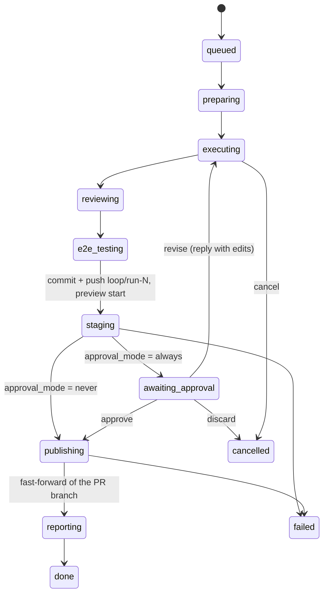
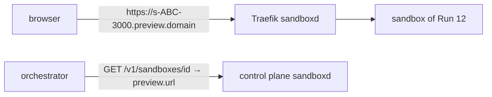

# Loop Engineering — phase 4a: control plane and control from Telegram

Date: 2026-08-03
Status: in review

## What we are building

A human in the loop: before publishing, a Run pauses and pushes into its own
Telegram thread a message with the agent's summary, the e2e video and a working
preview link to the server brought up inside the sandbox. From the chat these
actions are available: **approve** (publication into the PR branch),
**discard**, **revise** (text edits by reply — the agent reworks in the same
sandbox), **cancel** for an active Run, **restart** for a failed one, **merge**
of the PR into the base branch after publication.

Phase 4 as a whole consists of three independent sub-phases; this document covers
only 4a:

- **4a (this document):** an action layer over Runs + the approve pause + Telegram buttons.
- 4b: automatic repository onboarding (a GitHub App instead of `scripts/connect_repo.py`).
- 4c: a web dashboard (reusing the action layer from 4a).

## Locked Decisions

| Decision | What is locked | Why |
|---|---|---|
| The pause in the pipeline | New states `staging` (commit + push into the temporary branch + preview start) and `awaiting_approval` (persistent, the worker slot is released); a new terminal `cancelled` | The pipeline is cut along the boundary of two-phase publication: the code is safe on GitHub before a human ever sees it; the pause survives a restart for free |
| When to pause | Always by default; `.loop.yml`: `approval: always\|never` (snapshotted into `Run.approval_mode` on preparing) | Manual acceptance is the norm; quiet repos turn it off per repo |
| Waiting timeout | We wait forever; the sandbox and the preview are torn down after `LOOP_PREVIEW_TTL_MINUTES` (default 120), the Run stays paused | The code is already in the temporary branch — nothing leaks, and no automaton substitutes itself for the human decision |
| Action layer | The `actions.py` module is the single entry point for approve/discard/revise/cancel/restart/merge; Telegram today and the dashboard (4c) call only it | Two frontends over one semantics; the "state × action" validation is atomic — a double click does not produce two effects |
| Click transport | The Telegram webhook `POST /webhooks/telegram` on the same FastAPI; `setWebhook` with a `secret_token`, verified via `X-Telegram-Bot-Api-Secret-Token` | Public HTTPS already exists for GitHub; no polling and no second lifecycle |
| Authorisation | `LOOP_TELEGRAM_ADMIN_IDS` (CSV of user_id); a stranger's click → `answerCallbackQuery("not authorized")` | Merge changes main — access must be explicit, simple, and survive a restart |
| `callback_data` | Compact `"<action>:<run_id>"` (`ap:12`, `dc:12`, `cn:12`, `rs:12`, `mg:12`, `md:12`) | The 64-byte limit; self-contained — the buttons still work weeks later and after restarts |
| Merge | Squash into the PR's base branch, the heading is the PR title; after the merge the PR branch and the temporary `loop/run-*` are deleted; no settings in `.loop.yml` | A clean main history without the noise of agent commits; YAGNI on merge methods |
| Merge & Deploy | Like Merge, but before merging the `LOOP_PROMOTE_LABEL` label (default `promote:staging`) is attached to the PR — the repository's promote workflow reads it on the merged-PR event. If the label could not be attached, the merge is not performed; if GitHub rejects the merge, the label is removed again | The label must exist on the PR at the moment of the merge event; an orphaned label would turn a later ordinary Merge into a silent deploy |
| Merge readiness | Before merging — `GET pulls/{n}` (short polling over the `mergeable: null` window). `mergeable_state: behind` (a protected base requires up-to-date) → `PUT update-branch`, answer "press again once the checks are green". `mergeable: false` → a background resolver agent: a fresh app+sandbox on the PR branch, the temporary secret `GIT_SYNC_TOKEN` (= the orchestrator's token, write-only, dies with the app), `git fetch`+merge+resolve, publication of the merge commit by the usual route (push into a new `loop/run-<id>-sync`, fast-forward of the PR branch — the merge commit inherits the current head), then an automatic retry of the original merge. After that comes the gate on the check runs of the head sha: red (`failure`/`timed_out`/`cancelled`/`action_required`) → refusal with the names of the failed checks; still running → "press again once they finish"; a repo without checks merges as before. An error reading the PR → fall back to a direct merge | Long-lived loop branches conflict with a moving base; working repos without branch protection merged a red PR silently (precedent: PR#13 — a broken uv.lock landed in main) (append-hotspot files); a PR that GitHub considers clean merges without delays and without extra check runs. Resolution runs outside the action lock and has no Run state of its own (Locked Decision); a repeated click during resolution is rejected |
| Cancel | Kill the task → best-effort commit+push into `loop/run-<id>` → delete the sandbox → `cancelled`; the PR branch is untouched | The same principle as `_publish_partial`: the agent's work is not lost |
| Revise | An admin's text reply to the approval message → `awaiting_approval → executing`, a task into the same sandbox with `continue: true`; then the usual route up to a new pause | Edits without recreating the sandbox and losing the agent's session context |
| Preview | Native sandboxd preview (verified against the sources): `GET /v1/sandboxes/{id}` returns a `preview.url` of the form `https://s-<id>-<port>.preview.<domain>`; the Traefik router and forward-auth already exist, the sandbox visibility is `public` (the id is unguessable); we do not write our own proxy in the orchestrator | Less code and less risk: routing, TLS and auth are sandboxd's business |
| Run/DB schema | New columns `approval_mode`, `staging_branch`, `preview_url`, `sandbox_expires_at`, `merged_at`; an `ALTER TABLE` migration following phases 2–3 | The pause, the TTL and the merge must survive a restart |
| Control-plane errors | Any button/proxy error is answered in the thread / via `answerCallbackQuery` + a warning; a Run breaks only on errors of the pipeline itself | The principle of phases 2–3: delivering the code matters more than reporting |
| Language | All texts — English | Project convention |

## States and flow

The pipeline is cut along today's `publishing` stage (commit → push into the
temporary branch → fast-forward of the PR branch): the first two steps move into
`staging` before the pause, the fast-forward stays in `publishing` after approve.

- `reviewing`/`e2e_testing` are still skipped by config — `staging` comes right
  after the last enabled verification stage.
- `awaiting_approval` is an ordinary persistent state: the Run holds no worker
  slot, approve puts the `run_id` back into the queue, and `process()` continues
  from `publishing`. Recovery after a restart leaves it alone.
- `merge` is not a Run state but an action over a finished (`done`) Run:
  otherwise the Run would have to be kept "active" just for the button.
- `cancelled` is a terminal state next to `done`/`failed`: a deliberate stop,
  not a breakage.
- `cancel` is allowed in any active state up to `staging`; the diagram shows the
  transition from `executing` as the main case.

## Action layer (`actions.py`)

Reuses: the `Worker` queue (approve is an ordinary `enqueue`),
`state_machine.transition()` + `run_events`, the `_publish_partial` mechanics
(cancel), `GitHubClient` (which gains `merge_pr`), the Run creation path from
`webhook.py` (restart).

| Action | Allowed from | Effect |
|---|---|---|
| `approve(run_id, actor)` | `awaiting_approval` | → the queue; the pipeline continues from `publishing` |
| `discard(run_id, actor)` | `awaiting_approval` | → `cancelled`; the sandbox is deleted; the temporary branch stays |
| `revise(run_id, actor, feedback)` | `awaiting_approval` | → `executing`; a continue task into the same sandbox with the feedback; then reviewing → e2e → staging → a new pause |
| `cancel(run_id, actor)` | active states up to `staging` | kill the task; best-effort commit+push into `loop/run-<id>`; the sandbox is deleted; → `cancelled` |
| `restart(run_id, actor)` | `failed`, `cancelled` | a new Run for the same PR — the same route as the `loop:run` label (with active-Run deduplication) |
| `merge(run_id, actor)` | `done` | squash-merge the PR into base; delete the PR branch and `loop/run-*`; `merged_at` |

Every action: an atomic "state × action" check (a lock modelled on the webhook's
dedup lock — concurrent clicks do not produce two effects) → a `run_events` record
with the `actor` (tg user_id) → the effect. An effect error in pipeline actions is
an ordinary `fail()` of the Run; in post-actions (merge) it is an answer in the
thread, and the Run state does not change.

## The Telegram inbound side

Reuses: signature verification modelled on the GitHub webhook, `TelegramNotifier`,
topics (`tg_thread_id` in the DB — it is how the Run for a reply is found), the
`tg_card.py` card.

`POST /webhooks/telegram`: verify `X-Telegram-Bot-Api-Secret-Token`, always
`200 OK` (otherwise Telegram retries delivery), two kinds of updates:

1. **`callback_query`** — buttons. Authorisation via `LOOP_TELEGRAM_ADMIN_IDS`;
   `answerCallbackQuery` immediately (to drop the spinner), the action through
   `actions.py`, the result being an edit of the original message (the buttons
   disappear or change — a repeat click is impossible at the UI level too).
2. **`message` with a reply** — revise. An admin's text reply to the approval
   message → `actions.revise(run_id, actor, text)`. A reply that is not to an
   approval message, or not from an admin, is ignored silently.

Button layout:

| Message | Buttons |
|---|---|
| The approval message (pushed on entering `awaiting_approval`): the agent's summary, 🎬 the e2e video, 🔗 the preview link, the hint "reply to revise" | `✅ Approve` `❌ Discard` |
| The active Run's card | `⛔ Cancel` |
| The `done` final (after publication) | `🔀 Merge PR` `🚀 Merge & Deploy` |
| The `failed` / `cancelled` final | `🔁 Restart` |

The e2e video moves into the approval message; it is not duplicated on the `done`
final. For `approval_mode = never` the message flow is the same as in phase 3
(summary and video on the final).

After a merge the Run's topic is finalised a second time: renamed to `🔀 <title>`
and `closeForumTopic` (in a private threaded chat close is not supported by the
API — fail-safe, only the rename remains). Errors of this cleanup, like errors of
deleting branches after the merge, are not reported as a merge error — the PR is
already merged.

The card gains rows for the `staging` and `awaiting approval` stages; in
`awaiting_approval` the card shows the preview deadline (`sandbox_expires_at`,
timezone `LOOP_TZ`).

Revise restarts the verification cycle — and the card: a **new** fix-loop card is
posted into the thread (the old one stays as the history of the previous round),
stage times are counted from the last `executing` event, and the header carries
`revision N` (the number of revise rounds). Approve redraws the current card
immediately (`⏳ publishing`), without waiting for the next pipeline transition.

## The preview link

Reuses: sandboxd's native preview (verified against the sources in
`control-plane/internal/api`): the Traefik router `s-<sandbox>-<port>.preview.<domain>`
is created for every sandbox automatically, `GET /v1/sandboxes/{id}` returns a
ready `preview.url`; `run_cmd` from `.loop.yml` (the same command e2e uses).

- **Starting the server** happens on `staging` if `.loop.yml` has a `run:`: a
  light task into the same sandbox, "start `<run_cmd>` in the background, confirm it
  responds" (sandboxd has no exec endpoint — verified). If the repository carries
  a `sandbox.yaml` with `web.command`, runtimed brings the server up itself — the
  micro-task then boils down to a confirmation. No `run:` → a pause without a link.
- **The port in the hostname** is resolved by sandboxd when the sandbox is
  created: the repository's `sandbox.yaml` → preset → 3000. A repository with a
  non-standard port only has to commit a `sandbox.yaml` (`web: {port: N}`); the
  recommendation goes into deploy.md.
- **Access:** the sandbox visibility is `public` by default — the link works
  without a cookie; secrecy comes from the unguessable sandbox id in the hostname.
- **Lifecycle:** the link lives from `awaiting_approval` until
  approve/discard/TTL. The TTL supervisor is a periodic task inside the existing
  `Worker` (once a minute): it tears down the sandboxes of expired pauses (the
  app is deleted, `preview_url` is cleared), the Run stays in
  `awaiting_approval`, the card is updated; approve/discard/merge work even after
  the sandbox has died — the code is already in the temporary branch.

## Configuration

New `Settings` entries: `telegram_admin_ids` (CSV), `telegram_webhook_secret`,
`preview_ttl_minutes` (default 120), `public_url` (the orchestrator's external
URL — needed for `setWebhook`). A new `.loop.yml` field: `approval: always|never`
(default `always`).

`setWebhook` is called on application startup (lifespan) with the
`secret_token` — idempotent, no manual step in the deploy.

## Error handling

| Class | Reaction |
|---|---|
| A click on a stale button (the state has moved on) | `answerCallbackQuery` "run is already …"; no effect |
| An unauthorised click | `answerCallbackQuery("not authorized")` + a warning in the log |
| GitHub rejected the merge (checks, the branch moved on) | An answer in the thread with the reason from the API; the Run stays `done`, the button lives on — it can be pressed after manual untangling |
| A conflict with base on merge | Automatically: the background resolver agent + an automatic merge retry; if resolution fails → an honest report in the thread, the manual route as before. Merge & Deploy attaches the label only for a real merge — the label is never orphaned before or after resolution |
| The fast-forward failed on approve (the PR branch moved on during the pause) | As today: `failed` with a reason, the temporary branch is kept, the Restart button |
| An error starting the preview server | A pause without a link, a "preview unavailable" note in the approval message; approve/discard still work |
| An orchestrator restart | `awaiting_approval` is persistent, the buttons work off `callback_data`; the TTL supervisor catches up with expired sandboxes |
| The orchestrator was unreachable | Telegram retries the webhook delivery itself; updates older than the threshold are dropped |
| The revise task failed | Like an `executing` failure: best-effort push, `failed`, the Restart button |

## Testing

- **Unit:** the "state × action" table in `actions.py` (allowed/refused),
  atomicity under concurrent calls; `callback_data` parsing; authorisation;
  parsing the port out of `run_cmd`; the HMAC token; `approval:` in loopconfig;
  the DB migration.
- **Integration (respx + ASGI):** the full cycle
  `staging → awaiting_approval → approve → done → merge`; discard; a revise round
  (pause → executing → a new pause); cancel on `executing` with a best-effort
  push; the TTL tears the sandbox down — the Run stays paused; `approval: never` —
  the behaviour of phases 1–3 does not change.
- **Smoke test on the VPS:** a PR in loop-smoke-test with `approval: always` — a
  push with summary+video+link; the link opens in a browser; a revise reply really
  changes the code; approve publishes; merge closes the PR with a squash.

**Acceptance criterion for 4a:** the full cycle "label → pause with a working
preview link → revise by text → approve → publication → merge by button" goes
through from Telegram without SSH and without the GitHub UI.

## Open Questions

1. **The age threshold for stale Telegram updates** after orchestrator downtime.
   A `callback_query` has no timestamp of its own — the real protection against
   stale clicks is the atomic "state × action" check in `actions.py`.
   *Default: there is no separate age check.*
2. **Whether a Restart button on `done` is needed** (to re-run a successful Run).
   *Default: no — re-adding the `loop:run` label covers that rare case.*
3. **Private sandboxes with a JWT cookie for the preview** instead of `public`.
   *Default: `public` — the sandbox id in the hostname is unguessable; privacy
   can be added later without changing the architecture.*
