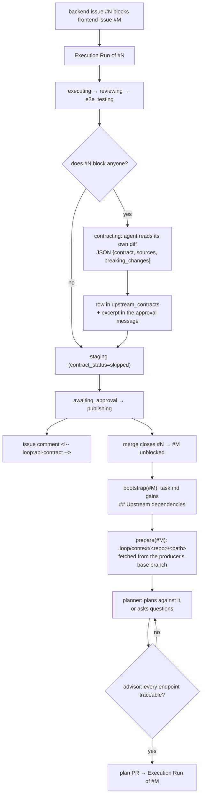

# Loop Engineering — upstream API contract handoff

Date: 2026-08-08
Status: in review

## What we are building

A dependency between two backlog issues currently carries one bit: *wait*. When the
blocker closes, the dependent task starts — and its planning agent knows nothing
about what the blocker actually built. In a two-repository feature that is fatal:
the backend task ships a real API, the frontend task is planned against an
imagined one, and the mismatch is discovered only when the frontend code runs.

This design gives the dependency a payload. A Run whose issue blocks other issues
ends by describing the interface it just built; the orchestrator stores that
description, publishes it into the issue for human eyes, and hands it — together
with the authoritative source files — to the planning agent of every dependent
task. The planner is then forbidden to invent an interface it cannot trace to a
source, and the Implementor Advisor checks that it did not.

Scope is the handoff itself: producing the contract, storing it, delivering it,
and gating on it. Contract *testing* (verifying at runtime that the consumer and
the producer still agree) is out of scope — that belongs to the target
repositories' own test suites, not to the orchestrator.

## Locked Decisions

| Decision | What is locked | Why |
|---|---|---|
| Source of truth | Two layers: an agent-written markdown digest (readable, correctable by a human) **plus** the authoritative source files themselves (`.loop/context/`), which win on any disagreement | A digest alone is a retelling and can drift; files alone are unreadable at planning altitude and give the human nothing to check |
| Producer | A new `contracting` stage of the Execution Run, inside the **same sandbox**, after `e2e_testing` and before `staging` | The sandbox is alive and holds the code the agent just wrote; a separate Run would need a fresh sandbox, which is what the resolver already costs us |
| Trigger | The stage runs only when the Run's issue blocks at least one other issue (`GET /repos/{repo}/issues/{n}/dependencies/blocking`); otherwise `contract_status = "skipped"` | Zero cost for standalone tasks; a dependency added after the fact degrades softly — the consumer still gets the blocker's PR link and stops at the questions gate |
| Contract shape | JSON verdict in the final message: `outcome` (`contract` \| `none`), `contract` (markdown), `sources` (≤10 repo-relative paths), `breaking_changes` | Same protocol as the reviewer, e2e, planner and advisor; parsed through `jsonextract.find_json_object` |
| `outcome: "none"` is a result | A branch that exposes no external interface still writes a row with an empty contract | "The blocker shipped nothing consumable" is information; a missing row is indistinguishable from a stage that never ran |
| Storage | New table `upstream_contracts`, keyed `(repo, issue_number)`, latest write wins; no history | The consumer always needs the current contract; a re-run after `revise` must overwrite, not accumulate |
| Dependency memory | New `issue_tasks.depends_on` column holding **all** dependencies as `{repo, number}`, including closed ones; `blocked_by` keeps its current "open blockers only" meaning | `blocked_by` is the gate `_launch_ready` runs on and must not change semantics; without a second column the link is erased at the exact moment it becomes useful — when the blocker closes |
| Human correction wins | The digest is published as an issue comment marked `<!-- loop:api-contract -->`; the consumer's bootstrap prefers that comment's body over the stored row, falling back to the row when no comment exists | Otherwise "a human can fix it" is an empty promise — the agent would silently outvote the correction |
| Files are fetched from the base branch | `sources` are read from the producer repository's **base branch** while the consumer's Run is being prepared, not from a pinned sha | The consumer must be planned against what is in the trunk when it starts, not against a snapshot that later commits have moved on from |
| Delivery | Rendered `## Upstream dependencies` section in `.loop/task.md` (committed to the issue branch) + files uploaded into the sandbox as `.loop/context/<repo>/<path>` via the existing `put_file` path | Reuses the mechanism that already places `.loop/secrets.env`; `.loop/.gitignore` (`*`) already sits next to it, so upstream files cannot leak into the consumer's commits |
| The section is unconditional | Whenever `depends_on` is non-empty the section is rendered, with whatever exists — contract, or just the blocker's issue and merged PR link | Silence is what produced invented endpoints in the first place; it is indistinguishable from "there was no upstream" |
| Planner gate | The planner may only plan against code in its own repository, `.loop/context/`, or the upstream section; anything else means `outcome: "questions"` — never a plausible guess | Reuses the existing needs_info dialogue; no new state, no new failure path |
| Advisor gate | Every endpoint, field and error code in the spec and plan must be traceable to one of those three sources, else `revise` | The advisor reads the finished documents in a fresh session and is not infected by the planner's confidence |
| Failure never blocks publication | Any contracting failure sets `contract_status = "failed"`, records the reason and proceeds to `staging` | The backend work is already done and reviewed; the consumer's questions gate catches the missing contract anyway |
| No new `.loop.yml` knob | The behaviour is derived from GitHub dependencies alone | A contract is not something a repository owner should have to switch on to get |
| Language | Stage prompt, JSON schema, issue comment, `task.md` section and `.loop/context/README.md` — English | Project convention |

## Flow



## The `contracting` stage

**State machine.** `CONTRACTING = "contracting"` joins `ACTIVE_STATES` and
`CANCELABLE` (nothing is staged yet, so cancelling is safe). It becomes a legal
target of `EXECUTING`, `REVIEWING` and `E2E_TESTING` — each of those can already
jump straight to `STAGING` when the stages between them are disabled — and leads
only to `STAGING`, `FAILED`, `CANCELLED`.

Standing before the approval pause is deliberate: the `awaiting_approval →
executing` revise path replays the chain, so a contract is automatically
re-derived from the amended code. A stage placed after `publishing` could not do
that.

**Trigger.** Three conditions, all required, else the stage is skipped:
`run.kind == "pr"`, `run.issue_number is not None`, and the blocking list is
non-empty. A 404/410 from the dependencies endpoint is read as "blocks nobody",
matching the existing fail-safe on `issue_blocked_by`.

**Execution.** One agent task in the live sandbox with a fresh session
(`continue_session=False`) — the describing agent must read the code, not inherit
the confidence of the agent that wrote it. Model `LOOP_CONTRACT_MODEL`, default
`claude-sonnet-5`.

The prompt lives in a new module `contracts.py`, beside `review.py` and `e2e.py`:

```
You have just changed this branch. Tasks in other repositories will be planned
against whatever you describe here — the consumer's planning agent will never
see your code.

Read the diff against the base branch and the code it touches, then describe the
externally consumable interface this branch adds or changes: HTTP endpoints
(method, path, authentication, request schema, response schema, status and error
codes), events, and shared types. Verify every item against the source — anything
the code does not implement must not appear in the description. List separately
any breaking change to an interface that already had consumers.

List the authoritative source files a reader should open to check you: at most 10
repo-relative paths, the ones that define the interface rather than the ones that
merely use it.

Do not modify, commit or push anything — you only describe.

Your FINAL message must be a single JSON object and nothing else, matching
exactly this schema:
{CONTRACT_OUTPUT_SCHEMA}
```

```json
{
  "outcome": "contract | none",
  "contract": "markdown: endpoints, events and shared types this branch exposes",
  "sources": ["repo-relative paths of the files that define the interface"],
  "breaking_changes": ["what existing consumers must change"]
}
```

**Outputs.** A row in `upstream_contracts`; `run.contract_status` (`produced` |
`none` | `skipped` | `failed`) as its own line in the Telegram card next to review
and e2e; the contract text itself in the approval message, in an expandable
blockquote beside the summary, so a wrong contract can be rejected *before*
approve rather than after a consumer has been planned from it; and, at
`publishing`, the marked issue comment carrying the full text, the producing PR
number and the head sha. A re-run edits that comment by its marker instead of
appending a second one.

The approval message is the only place the contract can be judged while judging
is still cheap — the issue comment is written after approve, when the code is
final. That is why the text travels in the message rather than a pointer to it.

**Limits.** At most 10 source paths and 256 KiB in total. Anything beyond is
dropped and named in `.loop/context/README.md` — a producer that lists its whole
`src/` would otherwise eat the consumer planner's context exactly where it is
needed for planning.

## Storage

`upstream_contracts` — one row per producing issue, `(repo, issue_number)` unique:

| column | meaning |
|---|---|
| `repo`, `issue_number` | the producing task; the coordinates a consumer resolves through `depends_on` |
| `run_id`, `pr_number` | provenance — where it came from, where to look with human eyes |
| `head_sha` | branch sha at the time of capture, quoted in the comment |
| `contract_md` | the digest |
| `sources_json` | authoritative paths |
| `breaking_json` | breaking changes |
| `created_at` | |

`runs` gains `contract_status` (`produced` | `none` | `skipped` | `failed`, NULL
until the stage is reached) and `contract_json` (the captured verdict). The
second one duplicates the row's text on purpose, exactly as `review_json` and
`e2e_json` already do: Telegram renders from the Run it holds, and the approval
message must show the contract at a moment when the issue comment does not yet
exist.

`issue_tasks` gains `depends_on`: a JSON list of `{"repo": ..., "number": ...}`
covering every dependency the API returns, open or closed. `GitHubClient.issue_blocked_by`
starts returning full records (`repo`, `number`, `state`) instead of bare numbers;
the scheduler filters open ones into `blocked_by` for the gate and writes the whole
list into `depends_on`.

## Delivery to the consumer

`bootstrap()` builds `.loop/task.md` and commits it to the issue branch before the
sandbox exists. It gains the upstream material and `build_task_file` renders:

```markdown
## Upstream dependencies

### <backend-repo>#12 — "YouTube connector: ingest API" (PR #45, merged)

**Upstream API contract — authoritative, do not invent endpoints.**

<contract_md>

Authoritative sources, fetched into `.loop/context/<backend-repo>/`:
- src/api/routes/youtube.py
- src/api/schemas/youtube.py
```

For each entry the material is resolved in order: the marked issue comment, then
the stored row, then — when neither exists — the blocker's issue title plus the
PR number of its latest `kind="pr"` Run (`latest_run_for_issue`), with an explicit
note that no digest was captured.

`_prepare_planning()` uploads the files. It already places `.loop/secrets.env`
through `put_file`; the same call writes `.loop/context/<repo>/<path>` and a
`README.md` naming the producer, the base branch read and anything dropped by the
limits. `_prepare` does the same for `kind="pr"` Runs that carry an
`issue_number`: the spec and plan already carry the contract in prose, but giving
the executor the files costs one API call and does not rely on the planner having
transcribed every schema field without loss.

## Gates

`build_planner_prompt` gains: work against an external API may be planned only
from code in this repository, from `.loop/context/`, or from the Upstream
dependencies section; when the needed endpoint is in none of the three, return
`outcome: "questions"` with a concrete question rather than a plausible path. This
reuses the existing exit — the issue moves to `needs_info`, the author answers in
a comment, the scheduler picks it up.

`build_advisor_prompt` gains a matching check: every endpoint, field and error code
in the spec and the plan must be traceable to a file in `.loop/context/`, to code
in the repository, or to the upstream section; anything untraceable is a `revise`
naming the specific endpoint.

## Failure modes

| Failure | Behaviour |
|---|---|
| Stage fails (timeout, malformed JSON, dead sandbox) | `contract_status = "failed"`, reason in `run_events`, proceed to `staging`; the consumer gets the section without a digest |
| `/dependencies/blocking` answers 404/410 | Read as "blocks nobody", stage skipped |
| Blocker lives in a repository outside loop's control | Section with a link to the issue, no digest, no files |
| A `sources` path is missing on the base branch (renamed after the merge) | A placeholder file with the reason takes its place — a promised source must not vanish silently |
| Limits exceeded | Surplus dropped, listed in `.loop/context/README.md` |
| Worker restarts while in `contracting` | Normal recovery replays the stage; it is idempotent — the row is overwritten by key |

**Accepted residual risk:** the planner ignores both the contract and the
prohibition, and the advisor fails to catch it. There is no automated detector for
that. Two independent gates in separate sessions are the right price; a third
would cost more than one wasted Run does.

## Testing

Unit: the verdict parser (valid, `outcome: none`, JSON after prose — the
`jsonextract` regression — and garbage); `build_task_file` with a contract, with a
dependency but no contract, and with no dependencies; the source limits; the new
transitions including the paths that bypass disabled review/e2e stages.

Through respx: `issue_blocking` at 200/404/410; `blocked_by` returning closed
entries → only open ones in `blocked_by`, all of them in `depends_on`; source
fetching when the file exists, is missing, and exceeds the limit.

Pipeline: the stage runs when the blocking list is non-empty; is skipped for an
empty list, for `kind="planning"` and for `issue_number=None`; a stage failure
still reaches `staging`; an edited issue comment takes precedence over the stored
row.

Live: replay the two-repository scenario on the smoke pair
(`<org>/loop-smoke-test` + `<org>/loop-frontend-smoke`), where the backend →
frontend chain has already passed end to end. Success means the frontend planner
plans from `.loop/context/` instead of cloning the backend on its own initiative.

## Out of scope

- Runtime contract testing between producer and consumer.
- Machine-readable contract formats (OpenAPI generation, schema diffing). The
  digest is markdown; if a repository already publishes an OpenAPI document, the
  agent lists it under `sources` and it is delivered as a file like any other.
- Propagating a contract to tasks that are already planned. A dependency added
  after the consumer's plan exists does not retroactively rewrite that plan; the
  consumer is restarted by a human if it matters.

## Open Questions

| Question | Recommended default |
|---|---|
| Is the reverse dependency endpoint really `GET /repos/{repo}/issues/{n}/dependencies/blocking`? | Probe it before implementing. If it does not exist, fall back to scanning `blocked_by` of the open issues of repositories in `LOOP_BACKLOG_REPOS` — a few more requests, guaranteed to work |
| Source limits: 10 files / 256 KiB | Keep; revisit only if a real producer is truncated |
| `LOOP_CONTRACT_MODEL` default | `claude-sonnet-5` — decided, not open |
| Should the contract also be attached to the plan PR description of the consumer? | No for now. It is in `task.md`, which is committed to the branch and visible in the PR diff already |
| Does a `breaking_changes` entry deserve its own Telegram push? | No for now — it rides in the approval message. Revisit if a breaking change ever slips past approve unnoticed |
