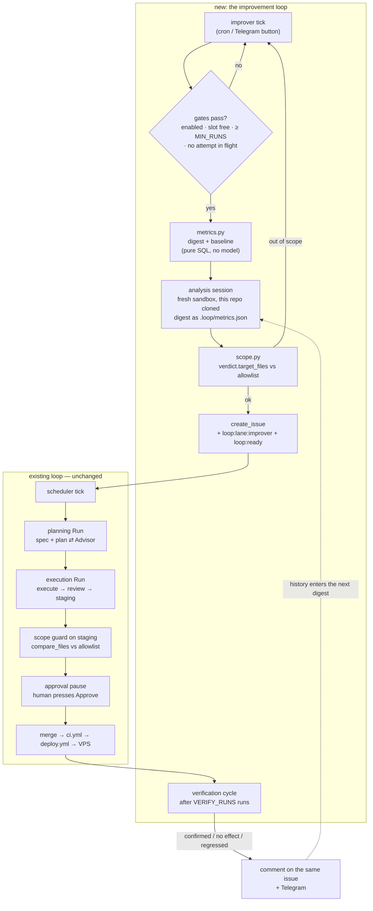

# Recursive self-improvement loop — design

> The orchestrator observes what its own Runs cost, proposes one change at a time to the knobs that
> steer its agents, ships that change through its own pipeline, and then measures whether the change
> paid off. The measurement feeds the next proposal, which is what makes the loop recursive rather
> than merely automatic.

- **Status:** design, not yet planned
- **Related:** [`docs/wiki/concepts/agent-steering.md`](../../wiki/concepts/agent-steering.md) ·
  [`docs/wiki/components/tracing.md`](../../wiki/components/tracing.md) ·
  [`docs/wiki/components/worker-and-scheduler.md`](../../wiki/components/worker-and-scheduler.md) ·
  [tracing spec](2026-08-06-agent-tracing-otel.md)

## 1. Problem

Runs work, but they are slow and expensive. The 2026-08-06 cost analysis found 61% of a Run's bill in
cache writes and led to one session per stage — a large win found by hand, once, from a throwaway
parser. Nothing repeats that analysis. `run_traces` and `run_stage_costs` now hold the data
permanently, and nobody reads them.

Meanwhile the levers that decide the bill are all text and config the orchestrator owns: the stage
prompts, the model per stage, the skills baked into the sandbox image, the platform defaults. Changing
them is exactly the kind of work the loop already does for other repositories.

**Goal.** A cycle that turns the trace data into one falsifiable hypothesis per day, files it as an
issue in this repository, lets the existing loop implement it, and then confirms or refutes the
expected saving against a recorded baseline — with the human approving the result, as with any other
Run.

**Non-goal.** Making the agent smarter at tasks it currently gets wrong. This design targets cost and
duration at an unchanged outcome. A cheaper Run that gets rejected more often is a regression, and
§5 makes that measurable rather than assumed.

## 2. Scope of the first cut

**In:**

- `improve/metrics.py` — the fitness function: deterministic aggregation over SQLite, no model call.
- `improve/improver.py` — the periodic observer: gates, digest, analysis session, issue, report,
  and the verification cycle that closes the loop.
- `improve/prompt.py`, `improve/scope.py` — the analysis prompt with its verdict schema, and the
  allowlist that bounds what a proposal may touch.
- Three tables: `improve_cycles`, `metric_baselines`, `improvement_attempts`.
- `GitHubClient.create_issue` and `GitHubClient.compare_files`.
- One new column, `run_stage_costs.opening_context_tokens`.
- A Telegram report per cycle with an "Analyse now" button.
- Self-hosting prerequisites (§10): this repository's own `.loop.yml`, labels, webhook, ruleset,
  backlog entry.

**Deferred, deliberately:**

- A golden-set eval (fixed tasks re-run before and after a change). Honest A/B, but every run competes
  for the host's three Run slots. Revisit once the cheap signals stop producing hypotheses.
- Automatic revert on regression. The first cut alerts; a human reverts.
- Improving the *target* repositories' steering surface (their `CLAUDE.md`, their skills).
- The "built the wrong thing" symptom — mining the corpus of revise replies and discards.
- More than one hypothesis per cycle.

## 3. Locked Decisions

| # | Decision | Why |
|---|---|---|
| 1 | **Fitness is computed by deterministic code from SQLite, never by a model.** | A metric a model can restate is a metric that drifts. The numbers must be reproducible across cycles, or "it got better" is unfalsifiable. |
| 2 | **The analysis session is not a Run.** It lives in `improve_cycles` and submits one sandboxd task directly. | Run states are a Locked Decision of the MVP spec. A one-shot read-only analysis does not earn a new state, and adding one would touch `state_machine.py` — a file the loop is forbidden to change (gate 1, §7). |
| 3 | **Improvements ship only through the normal path**: issue → planning Run → PR → execution Run → approval pause → merge. No direct commit, no self-merge. | The pause is the human gate, and reusing the path means self-improvement is exercised by the same code every other task exercises. |
| 4 | **One attempt in flight**, enforced by the `loop:lane:improver` lane and by a gate in the observer. | Two concurrent prompt edits make the baseline unable to attribute an effect to either. Attribution is the whole point. |
| 5 | **The proposal's reach is an allowlist checked by code**, both before the issue is filed (on the verdict's `target_files`) and again on `staging` (on the actual diff). The diff check is authoritative. | A prompt asking the agent to stay in scope is a request. A diff check is a boundary. |
| 6 | **The measurement surface is off-limits to the loop**: `improve/metrics.py` and `tracing/**` are permanently denied. | Otherwise the cheapest available "saving" is to stop counting. |
| 7 | **An attempt's public id is its GitHub issue number.** SQLite holds the numbers; the issue holds the narrative, the hypothesis and the verdict comment. | The journal has to be readable by a human without a SQLite client, and the loop already treats a marked issue comment as a durable record ([`upsert_marked_comment`](../../../src/loop_orchestrator/clients/github.py)). |
| 8 | **`LOOP_IMPROVE_ENABLED` defaults to `false`.** | Merging this feature must not switch it on. The host opts in through `~/loop/.env`. |
| 9 | **A verdict names the metric it expects to move and by how much**, before the change is written. | An experiment whose success criterion is chosen afterwards always succeeds. |

## 4. Architecture

Everything below the dashed line already exists and is reused unchanged.



### Units

| Unit | Purpose | Reuses | Adds |
|---|---|---|---|
| `improve/metrics.py` | Aggregate the fitness metrics of §5 over a window of finished Runs; capture and compare baselines. | `run_traces`, `run_stage_costs`, `run_events`, `runs` | Pure functions over an `aiosqlite` connection; no I/O beyond the database. |
| `improve/improver.py` | The periodic loop: gates → digest → analysis task → verdict → issue → report; and the verification pass over merged attempts. | `scheduler._poll_loop` shape, lifespan wiring in `main.py`, `SandboxdClient` (app + sandbox + one task), `jsonextract.find_json_object`, `TelegramClient` | `Improver` class with `tick()` (idempotent, like `Scheduler.tick`) and `verify_pending()`. |
| `improve/prompt.py` | `build_analysis_prompt(digest_path)` and `ANALYSIS_SCHEMA`. | The stage-prompt convention (English, strict JSON verdict in the final message) | The one prompt whose subject is the orchestrator itself. |
| `improve/scope.py` | `check(files)` — returns the first violating path, or `None` when every path is allowed. DENY beats ALLOW. | — | The allowlist tables of §7. |
| `pipeline/core.py` (edit) | Before `staging → awaiting_approval`, run the scope guard when `run.lane == improve_lane and run.repo == improve_repo`. | The existing transition point | ~10 lines calling `improve/scope.py`. |
| `clients/github.py` (edit) | `create_issue(repo, title, body, labels)`, `compare_files(repo, base, head)`. | `_req`, `with_retries`; `compare_files` hits the same `/compare/{base}...{head}` endpoint `behind_by` already uses | Two methods. |
| `tracing/collector.py` (edit) | Persist `session.opening_context_tokens` — already computed by `session_parser` — into the new column. | `session_parser`, the existing upsert | One field through an existing path. |

**Where the analysis session runs.** In a fresh sandbox over a clone of this repository, like every
other agent task: the platform offers no other way to reach a model, and the agent needs the code in
front of it to connect a prompt's wording to its token cost. The digest arrives as
`.loop/metrics.json` through `PUT /v1/sandboxes/{id}/files`, the same channel that carries
`.loop/secrets.env` and `.loop/context/`, with the existing `.loop/.gitignore` keeping it out of any
commit. The session is read-only by instruction: it proposes, it does not edit.

## 5. Fitness

One window, three blocks. Cost is the target; outcome is the guard that stops the loop from buying
cheapness with rejection.

| Block | Metric | Source |
|---|---|---|
| Cost | `cost_usd` per stage (median) | `run_stage_costs` |
| Cost | `tokens_cache_write`, `tokens_cache_read`, `tokens_input`, `tokens_output` per stage | `run_stage_costs` |
| Cost | `api_calls`, `tool_calls` per stage | `run_stage_costs` |
| Cost | `opening_context_tokens` per stage — what a stage costs before the agent acts | `run_stage_costs` (new column) |
| Cost | share of `fresh` sessions per stage | `run_stage_costs.fresh` |
| Duration | wall-clock per stage | consecutive `run_events.created_at` |
| Duration | `review_iteration`, `e2e_iteration` (median, and share > 0) | `runs` |
| Outcome | share of Runs reaching `done` without a revise (`awaiting_approval → executing` in `run_events`) | `run_events` |
| Outcome | share of `failed` Runs, and the stage they failed on | `runs`, `run_events` |
| Outcome | share of Runs escalated by the reviewer or e2e (`review_status` / `e2e_status`) | `runs` |

**Window:** the last `BASELINE_RUNS` (20) finished Runs of the repositories under the loop, with at
least `MIN_RUNS` (10) carrying trace rows. Below the floor the tick logs and returns — no model call.

**Baselines are snapshots, not moving averages.** When an attempt is filed, the current window is
written to `metric_baselines` keyed by that attempt. Verification compares the post-merge window
against that frozen row, so the question is always "did this change help", never "is the average
drifting".

**Regression outranks new work.** If any outcome metric drops or any cost metric rises by more than
`REGRESS_PCT` (20%) against the last merged attempt's baseline, the tick files a revert/repair issue
instead of hunting for a new saving, and says so in Telegram.

## 6. The cycle, step by step

1. **Trigger** — the poller every `INTERVAL_HOURS` (24), or the "Analyse now" button.
2. **Gates** — `LOOP_IMPROVE_ENABLED`; no attempt in flight (§7 gate 3); window floor met; and fewer
   than `LOOP_MAX_CONCURRENT_RUNS` Runs in an active state (counted from `runs` over `ACTIVE_STATES`).
   The analysis session is not a Run and takes no worker slot, but it does take a sandbox — and one
   Run already costs a whole core and ~3.5 GB, so a busy host must not be handed another sandbox.
   Any failed gate ends the tick quietly (the button answers in the toast).
3. **Digest** — `metrics.py` builds `digest.json`: the metric table above, per stage; the stage
   ranking by total cost; and the **history of past attempts** with their verdicts, so the session
   does not re-propose a refuted idea.
4. **Analysis** — a fresh app + sandbox over this repository, digest uploaded, one task, model
   `LOOP_IMPROVE_MODEL`. The final message must be a JSON object matching `ANALYSIS_SCHEMA`:

   ```json
   {
     "action": "propose",
     "title": "Trim the reviewer's opening context",
     "body": "<issue body in Markdown: evidence, proposed change, how to verify>",
     "target_files": ["src/loop_orchestrator/review.py"],
     "hypothesis": "The reviewer prompt restates the diff-reading rules the skill already carries.",
     "metric": "stage.review.cost_usd",
     "expected_saving_pct": 12,
     "risk": "A shorter prompt may drop the narrow-reading instruction."
   }
   ```

   `action` is one of `propose` · `none` · `revert`. `none` is a legitimate, expected answer: a cycle
   that finds nothing costs one short session and writes `status='none'`.
5. **Early scope check** — `scope.py` over `target_files`. A violation is recorded and reported, and
   no issue is filed. This is a courtesy check; the diff check on `staging` is the real boundary.
6. **File the issue** — `create_issue` in `LOOP_IMPROVE_REPO` with a `<!-- loop-improver -->` marker,
   labels `loop:lane:improver` and `loop:ready`. From here the existing scheduler owns the work.
7. **Record** — `improve_cycles` row (`status='filed'`), an `improvement_attempts` row
   (`outcome='pending'`), and the frozen `metric_baselines` snapshot.
8. **Report** — Telegram: the top cost stages with numbers, the hypothesis, the expected saving, and
   the issue link.
9. **Verification** — once the attempt's PR is merged and `VERIFY_RUNS` (10) further Runs have
   finished, recompute the named `metric`, compare against the frozen baseline, set `outcome` to
   `confirmed` / `no_effect` / `regressed`, comment the numbers on the issue via
   `upsert_marked_comment`, and send them to Telegram. This verdict is what the next digest reads.

## 7. Safety gates

The merge path is already automatic: `master` → `ci.yml` → tar over ssh → `docker compose up -d
--build` → `/healthz`. A change that passes tests but breaks at runtime leaves **no orchestrator
running to fix itself** — recovery is always a human `git revert` plus push, because `~/loop` on the
VPS is not a git checkout. Hence seven gates, five of which already exist.

| # | Gate | Mechanism | New? |
|---|---|---|---|
| 1 | Scope allowlist on the actual diff | `pipeline/core.py` before `staging → awaiting_approval`: `compare_files(base, staging_branch)` → `scope.check`. A violation fails the Run with an explicit "out of scope" report instead of publishing. Applies only when `run.lane == improve_lane and run.repo == improve_repo`. | new |
| 2 | The measurement surface is denied | `improve/metrics.py`, `tracing/**` in DENY. | new |
| 3 | One attempt in flight | The `improver` lane (existing lane mechanics) plus a gate: no new issue while an `improvement_attempts` row is `pending`. | new |
| 4 | Human approval always | `approval: always` in this repository's `.loop.yml`; the pause is unconditional. | exists |
| 5 | CI before merge | `_merge_readiness` already reads required checks — but it reads them from the base branch's ruleset. **This repository has no ruleset**, so the list comes back empty and the button would merge a red PR. A ruleset requiring `ci` is a prerequisite, not a nicety. | prerequisite |
| 6 | External liveness watch | A GitHub Actions cron every 15 minutes hitting `/healthz` and opening an issue on failure. A process cannot report its own death, and `deploy.yml` only checks health during a deploy. | new (ops) |
| 7 | Documented emergency path | Revert in `master` → the deploy restores. Written into the ops wiki, because the VPS offers no local rollback. | new (docs) |

**The allowlist.** DENY wins over ALLOW; anything matching neither is denied.

```
ALLOW
  src/loop_orchestrator/review.py            # stage prompts
  src/loop_orchestrator/e2e.py
  src/loop_orchestrator/planning.py
  src/loop_orchestrator/contracts.py
  src/loop_orchestrator/pipeline/prepare.py  # build_prompt lives here
  src/loop_orchestrator/pipeline/gitsync.py  # build_sync_prompt
  src/loop_orchestrator/config.py            # platform defaults
  deploy/sandbox-image/skills/**
  docs/**
  tests/**                                   # a change must bring its tests

DENY  (wins)
  src/loop_orchestrator/improve/metrics.py   # gate 2 — the ruler
  src/loop_orchestrator/tracing/**           # gate 2 — the ruler
  src/loop_orchestrator/worker.py
  src/loop_orchestrator/main.py
  src/loop_orchestrator/db.py
  src/loop_orchestrator/state_machine.py
  src/loop_orchestrator/clients/**
  .github/workflows/**
  Dockerfile
  docker-compose.yml
  Caddyfile
  deploy/**                                  # except deploy/sandbox-image/skills/**
```

`config.py` is on the ALLOW side for its **default values**, which is what a model-per-stage or
iteration-cap experiment needs. Restructuring `Settings` is not that, and the reviewer plus the human
pause are the checks on the difference.

**Cost of the loop.** One short analysis session (the digest is small) plus one ordinary planning and
execution Run per accepted hypothesis — about one task per day, and none on a cycle that answers
`none`.

## 8. Data model

```sql
-- One row per tick that got past the gates.
CREATE TABLE IF NOT EXISTS improve_cycles (
  id INTEGER PRIMARY KEY AUTOINCREMENT,
  trigger TEXT NOT NULL,               -- cron | manual
  runs_analyzed INTEGER NOT NULL DEFAULT 0,
  digest_json TEXT NOT NULL DEFAULT '{}',
  verdict_json TEXT NOT NULL DEFAULT '{}',
  issue_number INTEGER,
  status TEXT NOT NULL DEFAULT 'analyzing',  -- analyzing|filed|none|out_of_scope|failed
  error TEXT,
  started_at TEXT NOT NULL DEFAULT (datetime('now')),
  finished_at TEXT
);

-- One row per filed hypothesis. The issue number is its public id.
CREATE TABLE IF NOT EXISTS improvement_attempts (
  id INTEGER PRIMARY KEY AUTOINCREMENT,
  cycle_id INTEGER NOT NULL REFERENCES improve_cycles(id),
  repo TEXT NOT NULL,
  issue_number INTEGER NOT NULL,
  pr_number INTEGER,
  hypothesis TEXT NOT NULL DEFAULT '',
  metric TEXT NOT NULL DEFAULT '',            -- e.g. stage.review.cost_usd
  expected_saving_pct REAL NOT NULL DEFAULT 0,
  merged_sha TEXT,
  merged_at TEXT,
  verify_after_runs INTEGER NOT NULL DEFAULT 10,
  outcome TEXT NOT NULL DEFAULT 'pending',    -- pending|confirmed|no_effect|regressed|reverted|abandoned
  outcome_json TEXT NOT NULL DEFAULT '{}',
  created_at TEXT NOT NULL DEFAULT (datetime('now')),
  UNIQUE(repo, issue_number)
);

-- The frozen "before" window of an attempt. Never updated.
CREATE TABLE IF NOT EXISTS metric_baselines (
  attempt_id INTEGER NOT NULL REFERENCES improvement_attempts(id),
  stage TEXT NOT NULL,
  metric TEXT NOT NULL,
  value REAL NOT NULL,
  n INTEGER NOT NULL,
  captured_at TEXT NOT NULL DEFAULT (datetime('now')),
  PRIMARY KEY (attempt_id, stage, metric)
);
```

Plus one column on an existing table, added through the declarative migration list already in
`db.py`:

```sql
ALTER TABLE run_stage_costs ADD COLUMN opening_context_tokens INTEGER NOT NULL DEFAULT 0;
```

## 9. Configuration

All through `Settings` (prefix `LOOP_`), per project convention.

| Setting | Default | Meaning |
|---|---|---|
| `improve_enabled` | `false` | Master switch. Off by default (Locked Decision 8). |
| `improve_repo` | `""` | `owner/repo` of the orchestrator's own repository. |
| `improve_lane` | `improver` | Lane label suffix; one attempt in flight. |
| `improve_interval_hours` | `24` | Poller period. |
| `improve_min_runs` | `10` | Trace-carrying Runs required before a cycle may run. |
| `improve_baseline_runs` | `20` | Window size for the digest and baselines. |
| `improve_verify_runs` | `10` | Runs to wait after a merge before judging. |
| `improve_regress_pct` | `20` | Regression threshold, percent. |
| `improve_model` | `claude-opus-5` | Model for the analysis session. |
| `improve_timeout_minutes` | `30` | Deadline for the analysis task. |

## 10. Self-hosting prerequisites

The loop has never run against its own repository. Before the first cycle:

1. **`.loop.yml` in the root** — absent today:

   ```yaml
   specs_dir: docs/superpowers/specs
   setup: pip install -e ".[dev]"
   test: python -m pytest tests -q
   approval: always
   review:
     enabled: true
   planning:
     enabled: true
   ```

   No `run:` and no `e2e:` — the orchestrator has no UI to drive, and e2e stays off.
2. **Labels** `loop:ready`, `loop:run`, `loop:lane:improver` in this repository.
3. **Webhook** on `pull_request` + `issues` + `issue_comment`, pointing at the orchestrator.
4. **Ruleset** on `master` requiring the `ci` check (gate 5). Bypass list empty.
5. **`LOOP_BACKLOG_REPOS`** += this repository.
6. **Repository in the fine-grained PAT's list**, otherwise every call answers 404.

## 11. Prerequisite cleanup

`src/loop_orchestrator/pipeline.py` — 1749 lines — is dead: the `pipeline/` package at the same import
path shadows it entirely (a directory wins over a same-named module), and `pipeline/__init__.py`
re-exports the whole surface callers use. Delete it before the first cycle. An agent hunting for
context waste will read that file in good faith and build its first hypothesis on code that never
executes.

Note that `deploy.yml` never deletes on the remote side, so the file will linger in `~/loop` on the
VPS after it leaves the repository. Harmless — nothing imports it — but worth knowing when reading the
server's tree.

## 12. Failure modes

| Failure | Behaviour |
|---|---|
| Analysis session dies or returns unparseable JSON | `improve_cycles.status='failed'` with the error; Telegram note; the next tick tries again. Never affects a real Run. |
| Verdict names a metric that does not exist | Rejected at verdict validation, treated as `failed`. `ANALYSIS_SCHEMA` enumerates the legal metric names from `metrics.py`. |
| Proposal touches a denied file | Early check: no issue, reported. Diff check on `staging`: the Run fails with "out of scope" and nothing is published. |
| Attempt's PR abandoned or closed unmerged | Verification finds no `merged_at`; the attempt goes `abandoned` after the issue closes, releasing the lane. |
| Orchestrator restarts mid-cycle | `improve_cycles` rows in `analyzing` older than the timeout are marked `failed` at startup. No recovery attempt — a cycle is cheap to redo, unlike a Run. |
| Tracing disabled (`LOOP_OTLP_ENDPOINT` empty) | `run_stage_costs` stays empty, the window floor is never met, every tick returns quietly. The improver requires tracing; it does not enable it. |
| Deployed change breaks the orchestrator | The external cron (gate 6) opens an issue; recovery is a human revert (gate 7). |

**Testing.** `metrics.py` gets fixture-driven unit tests over a seeded database, including the window
floor, a stage with no rows, and a division by a zero baseline. `scope.py` gets a table test per
ALLOW/DENY entry plus DENY-beats-ALLOW. `improver.tick` is tested with a stubbed sandboxd and GitHub
(respx), covering: gates blocking, `action:"none"`, a scope violation, a successful filing, and a
regression taking priority. The staging guard gets a pipeline test asserting the Run fails and nothing
is published. All async, `asyncio_mode = "auto"`.

## 13. Open Questions

| Question | Recommended default |
|---|---|
| Automatic revert when verification says `regressed`? | **No.** Alert and file a revert issue; the human presses merge. An automatic revert is a second unattended write path into `master`, and the loop's whole safety story is that there is only one. |
| Model for the analysis session? | **`claude-opus-5`.** The digest is small, so the session is cheap regardless; and Fable 5 costs twice Opus 5 per token. |
| Should a cycle be allowed to propose changes to `docs/wiki/**`? | **Yes**, it is inside `docs/**`. Wiki upkeep is the one place where the agent's own summary of a Run is the authoritative record. |
| Window unit — Runs or days? | **Runs** (20). A day-based window is empty in a quiet week and the floor would block anyway. |
| One digest across all repositories, or per repository? | **All repositories together**, split per stage. Stage cost is a property of our prompts, not of the target repo; per-repo splitting would quarter the sample. |
| Does the improver need its own Telegram topic? | **Yes**, one long-lived topic for cycle reports, distinct from per-Run topics. The Runs it files get their topics as usual. |
